# Hospital Device Calibration (HDC) Backend Modules Documentation

This document provides a comprehensive breakdown of the core modules in the **HDC (Hospital Device Calibration)** backend service. Each module is documented individually using the 24-point template format.

---

# MODULE 1: Authentication & Access Control (IAM)

### 1. General Information
*   **Module Name:** Authentication & Access Control (IAM) Module
*   **Module Code:** HDC-IAM
*   **Version:** 1.0.0
*   **Status:** Production
*   **Owner / Person in Charge:** Security & Identity Team

### 2. Module Description
Handles user identity verification, multi-tenant session tracking, multi-factor authentication (WebAuthn/MFA), OIDC provider integrations, token issuance/rotation, and Role-Based Access Control (RBAC) permission resolution.

### 3. Objectives
*   Provide secure authentication and authorization matching FDA 21 CFR Part 11 requirements.
*   Enforce granular RBAC policies mapped to HTTP endpoints.

### 4. Scope
*   **In Scope:** OIDC flow exchanges, WebAuthn MFA registration and verification, JWT token issuance/rotation, and Role-Menu-Permission checks.
*   **Out of Scope:** Storing master passwords when OIDC is enabled.

### 5. Actors/Users
*   **All Roles:** Authenticate, manage active sessions, register security keys.
*   **Healthcare Admin:** Configures user-to-role mappings within their tenant.

### 6. Features
*   JWT Access/Refresh token rotation.
*   Passwordless WebAuthn / biometric hardware keys.
*   Dynamic Role-Menu mapping checking.

### 7. Workflow
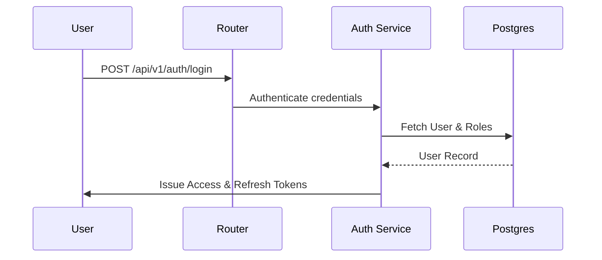

### 8. Input
*   `username` (String, Required)
*   `password` (String, Required)
*   `tenantId` (UUID, Required)

### 9. Output
*   `accessToken` (String, Short-lived JWT)
*   `refreshToken` (String, HttpOnly cookie)

### 10. Validation
*   Validates format of email/usernames.
*   Enforces password complexity rules.

### 11. Business Rules
*   Refresh tokens are rotated on every exchange.
*   Active sessions are terminated instantly on password changes.

### 12. Access Rights
*   All users have read-write access to their own authentication metadata and session keys.

### 13. Database
*   Table: `[Users](file:///c:/Users/Zed/Documents/Project/Callibrator/backend/src/models/user.model.js)` (Primary Key: `id`)
*   Table: `[Roles](file:///c:/Users/Zed/Documents/Project/Callibrator/backend/src/models/role.model.js)` (Primary Key: `id`)
*   Table: `[Sessions](file:///c:/Users/Zed/Documents/Project/Callibrator/backend/src/models/session.model.js)` (Foreign Key: `userId`)

### 14. API
*   `POST /api/v1/auth/login` (Authenticates credentials) - `[auth.route.js](file:///c:/Users/Zed/Documents/Project/Callibrator/backend/src/routes/api/auth.route.js)`
*   `POST /api/v1/auth/refresh` (Rotates JWTs) - `[auth.route.js](file:///c:/Users/Zed/Documents/Project/Callibrator/backend/src/routes/api/auth.route.js)`

### 15. Integration
*   Keycloak/Auth0 (OIDC Providers).
*   Redis (Session token caching).

### 16. Error Handling
*   `401 Unauthorized` for failed credentials or expired tokens.
*   `403 Forbidden` for permissions breaches.

### 17. Log and Audit
*   All login, logout, and token refresh events are logged in the immutable audit trail.

### 18. Configuration
*   `JWT_SECRET`, `JWT_REFRESH_SECRET`, `SESSION_EXPIRY`.

### 19. Dependency
*   `jsonwebtoken`, `bcryptjs`, `otplib`.

### 20. UI/Screen
*   Login Page, MFA Setup Page, Session History dashboard.

### 21. Diagrams
*   Refer to `[context.md](file:///c:/Users/Zed/Documents/Project/Callibrator/context.md#L76-L89)` for the OIDC authentication sequence diagram.

### 22. Non-Functional Requirements
*   Encryption of tokens at rest/in transit.
*   MFA authentication processing time < 500ms.

### 23. Known Limitations
*   Requires a connection to Redis; authentication checks fail if Redis is offline.

### 24. Change Log
*   `1.0.0` (2026-07-15): Initial production release.

---

# MODULE 2: Tenant Isolation & Management

### 1. General Information
*   **Module Name:** Tenant Isolation & Management Module
*   **Module Code:** HDC-TENANT
*   **Version:** 1.0.0
*   **Status:** Production
*   **Owner / Person in Charge:** Infrastructure & Core Platform Team

### 2. Module Description
Enforces secure boundaries between hospitals and entities using the application. Sets context storage across requests and configures row-level database filters (PostgreSQL RLS).

### 3. Objectives
*   Strict data segregation to prevent cross-tenant data leaks.
*   Dynamic branding configuration loading per tenant.

### 4. Scope
*   **In Scope:** RLS policies enforcement, tenant creation, settings mapping, custom domains.
*   **Out of Scope:** Multi-region physical database partitioning (uses shared infrastructure).

### 5. Actors/Users
*   **SUPERADMIN:** Full read/write capability to provision and suspend tenants.
*   **HEALTHCARE ADMIN:** Updates local settings, custom branding assets, and parameters.

### 6. Features
*   Dynamic Sequelize RLS Context Middleware.
*   Custom domain binding resolvers.
*   Automated database backups per tenant.

### 7. Workflow
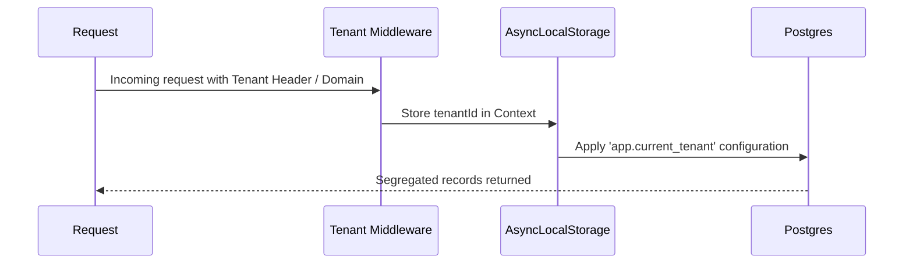

### 8. Input
*   `name` (String, Required)
*   `slug` (String, Required)
*   `domain` (String, Optional)

### 9. Output
*   Tenant config metadata, custom branding tokens.

### 10. Validation
*   Uniqueness constraints on slugs and domains.

### 11. Business Rules
*   Every data model query (except system metadata) must execute with a valid `tenantId`.
*   Cross-tenant writes result in database-level constraint failures.

### 12. Access Rights
*   Superadmin has root administrative access. Tenant Admins can modify settings for their own tenant.

### 13. Database
*   Table: `[Tenants](file:///c:/Users/Zed/Documents/Project/Callibrator/backend/src/models/tenant.model.js)` (Primary Key: `id`)
*   Table: `[TenantSettings](file:///c:/Users/Zed/Documents/Project/Callibrator/backend/src/models/tenantSettings.model.js)` (Foreign Key: `tenantId`)

### 14. API
*   `POST /api/v1/tenants` (Create Tenant) - `[tenant.route.js](file:///c:/Users/Zed/Documents/Project/Callibrator/backend/src/routes/api/tenant.route.js)`
*   `GET /api/v1/tenants/:id/settings` - `[tenant.route.js](file:///c:/Users/Zed/Documents/Project/Callibrator/backend/src/routes/api/tenant.route.js)`

### 15. Integration
*   DNS / Reverse Proxy providers for custom domain resolving.

### 16. Error Handling
*   Throws specific SQL errors on violation of Row Level Security constraints.

### 17. Log and Audit
*   All configuration changes, tenant status updates, and settings mutations are recorded in the audit trail.

### 18. Configuration
*   `DEFAULT_PLAN`, `RLS_BYPASS_ROLES`.

### 19. Dependency
*   `cls-hooked`, `sequelize`, `pg`.

### 20. UI/Screen
*   Superadmin Portal, Tenant Branding and Settings panel.

### 21. Diagrams
*   Refer to `[context.md](file:///c:/Users/Zed/Documents/Project/Callibrator/context.md#L57-L65)` for the Tenant context model.

### 22. Non-Functional Requirements
*   Zero performance overhead for RLS checks.
*   Sub-50ms DNS lookup resolutions.

### 23. Known Limitations
*   Shared schema model requires careful migrations to ensure constraints do not violate multi-tenant expectations.

### 24. Change Log
*   `1.0.0` (2026-07-15): Production release with Postgres RLS hooks.

---

# MODULE 3: Warehouse & Inventory Management

### 1. General Information
*   **Module Name:** Warehouse & Inventory Management Module
*   **Module Code:** HDC-WH
*   **Version:** 1.0.0
*   **Status:** Production
*   **Owner / Person in Charge:** Supply Chain & Logistics Lead

### 2. Module Description
Tracks medical spare parts, calibration kits, and tools. Coordinates inventory locations, stock transfer operations, manual adjustment logs, and stock opname routines.

### 3. Objectives
*   Maintain accurate inventory counts to prevent delays in maintenance.
*   Enforce physical location traceability for high-value calibration toolsets.

### 4. Scope
*   **In Scope:** Warehouse location records, multi-location stock levels, transfers, manual adjustments, stock opname validation.
*   **Out of Scope:** Direct shipping integration with external carriers.

### 5. Actors/Users
*   **WAREHOUSE STAFF:** Initiates stock transfers, updates stock levels, creates stock adjustments, runs opname checklists.
*   **CALIBRATOR ADMIN:** Views availability of spare parts and tools for work order schedules.

### 6. Features
*   Inter-warehouse transfer request and receipt pipeline.
*   Stock Opname scheduling and automatic variance resolution.
*   Alert thresholds for low inventory items.

### 7. Workflow
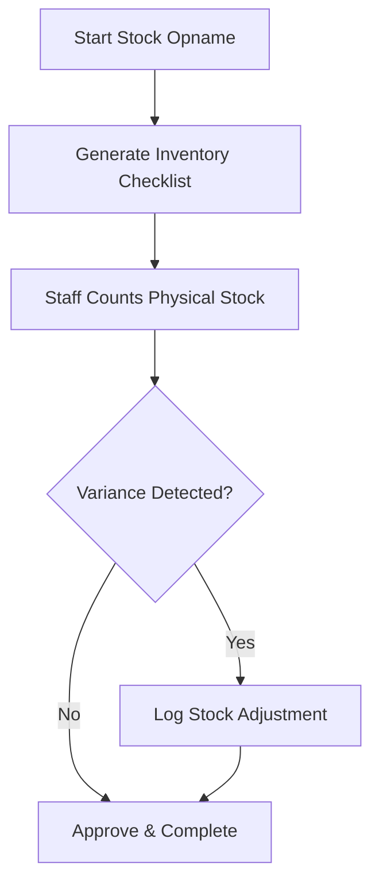

### 8. Input
*   `warehouseId` (UUID, Required)
*   `items` (Array of items with SKU and counted quantity)

### 9. Output
*   Stock counts, adjustment logs, transfer authorization invoices.

### 10. Validation
*   Enforces positive quantity increments.
*   Restricts transfers to active warehouse destinations.

### 11. Business Rules
*   Stock balances cannot be manually updated without an adjustment reason.
*   Transfers must be marked as "Shipped" and "Received" to adjust balances.

### 12. Access Rights
*   Only Warehouse Staff and Admins have write access to inventory files.

### 13. Database
*   Table: `[Warehouse](file:///c:/Users/Zed/Documents/Project/Callibrator/backend/src/models/warehouse.model.js)`
*   Table: `[Stock](file:///c:/Users/Zed/Documents/Project/Callibrator/backend/src/models/stock.model.js)`
*   Table: `[StockTransfer](file:///c:/Users/Zed/Documents/Project/Callibrator/backend/src/models/stockTransfer.model.js)`

### 14. API
*   `GET /api/v1/stock` (View levels) - `[stock.route.js](file:///c:/Users/Zed/Documents/Project/Callibrator/backend/src/routes/api/stock.route.js)`
*   `POST /api/v1/stock/transfers` (Start transfer) - `[stock.route.js](file:///c:/Users/Zed/Documents/Project/Callibrator/backend/src/routes/api/stock.route.js)`

### 15. Integration
*   Barcoding / QR scanners for inventory counting.

### 16. Error Handling
*   `422 Unprocessable Entity` when initiating transfers for items with insufficient stock.

### 17. Log and Audit
*   All movements and stock level changes create a persistent ledger trail.

### 18. Configuration
*   `LOW_STOCK_THRESHOLD`, `MAX_WAREHOUSE_LOCATIONS`.

### 19. Dependency
*   `sequelize`, `joi`.

### 20. UI/Screen
*   Stock Directory, Transfer Logs, Stock Opname Form.

### 21. Diagrams
*   Refer to `[context.md](file:///c:/Users/Zed/Documents/Project/Callibrator/context.md#L140-L152)` for the Warehouse Domain structure.

### 22. Non-Functional Requirements
*   Real-time stock balance updates within 100ms of transaction completion.

### 23. Known Limitations
*   Concurrent stock updates are serialized to prevent race condition balance errors.

### 24. Change Log
*   `1.0.0` (2026-07-15): Initial inventory and warehouse release.

---

# MODULE 4: Medical Device & Maintenance

### 1. General Information
*   **Module Name:** Medical Device & Maintenance Module
*   **Module Code:** HDC-DEVICE
*   **Version:** 1.0.0
*   **Status:** Production
*   **Owner / Person in Charge:** Clinical Engineering Team

### 2. Module Description
Maintains the asset database of hospital equipment. Manages categories, device models, room allocations, preventive maintenance scheduling, corrective work orders, and technician workloads.

### 3. Objectives
*   Minimize medical equipment downtime.
*   Enforce compliant, preventive maintenance tasks.

### 4. Scope
*   **In Scope:** Device lifecycle status tracking, Preventive/Corrective Work Orders, Technician assignments, diagnostic failures tracking.
*   **Out of Scope:** Physical repair operations or third-party calibration lab testing tools.

### 5. Actors/Users
*   **TECHNICIAN:** Updates device state, resolves maintenance checklists, requests spare parts.
*   **SUPERVISOR:** Schedules check routines, assigns tasks, reviews completed work logs.
*   **ROOM USER:** Views device availability and upcoming maintenance tasks.

### 6. Features
*   Asset lifecycle log tracking (Active, In Maintenance, Out of Service).
*   Automated preventive maintenance scheduler based on running intervals.
*   Predictive failure alerts using log patterns.

### 7. Workflow
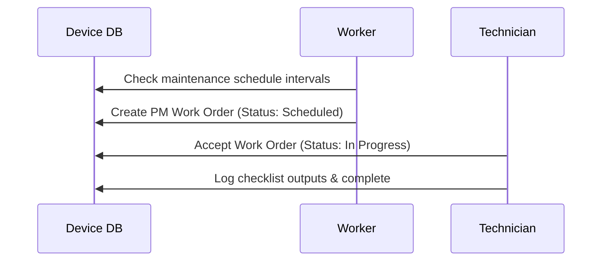

### 8. Input
*   `serialNumber` (String, Required)
*   `modelId` (UUID, Required)
*   `location` (String, Required)

### 9. Output
*   Device profile logs, maintenance schedule checklists, failure trends.

### 10. Validation
*   Unique serial number check within a tenant scope.
*   Valid model and manufacturer associations.

### 11. Business Rules
*   Devices marked "Out of Service" cannot be scheduled for standard calibration work orders.
*   Corrective work orders must log a failure description to close.

### 12. Access Rights
*   Supervisors can update schedule parameters. Technicians have access to log executions.

### 13. Database
*   Table: `[CalibrationDevice](file:///c:/Users/Zed/Documents/Project/Callibrator/backend/src/models/calibrationDevice.model.js)`
*   Table: `[MaintenanceWorkOrder](file:///c:/Users/Zed/Documents/Project/Callibrator/backend/src/models/maintenanceWorkOrder.model.js)`

### 14. API
*   `POST /api/v1/calibration-devices` (Create device) - `[calibrationDevices.route.js](file:///c:/Users/Zed/Documents/Project/Callibrator/backend/src/routes/api/calibrationDevices.route.js)`
*   `POST /api/v1/maintenance/work-orders` (Create work order) - `[maintenance.route.js](file:///c:/Users/Zed/Documents/Project/Callibrator/backend/src/routes/api/maintenance.route.js)`

### 15. Integration
*   Biomedical sensor streams via IoT route endpoints.

### 16. Error Handling
*   `400 Bad Request` if mandatory fields (e.g. manufacturer) are missing.

### 17. Log and Audit
*   All device status modifications, room transfers, and work orders create immutable audit entries.

### 18. Configuration
*   `PREVENTIVE_MAINTENANCE_INTERVALS`, `CRITICAL_FAILURE_THRESHOLDS`.

### 19. Dependency
*   `sequelize`, `moment`.

### 20. UI/Screen
*   Device Profile page, Maintenance Planner dashboard, Technician task checklist.

### 21. Diagrams
*   Refer to `[context.md](file:///c:/Users/Zed/Documents/Project/Callibrator/context.md#L155-L168)` for the Medical Device Domain relationships.

### 22. Non-Functional Requirements
*   Device profiles search return time < 150ms.

### 23. Known Limitations
*   Does not track parts serial numbers (only maps SKUs used in repairs).

### 24. Change Log
*   `1.0.0` (2026-07-15): Initial device inventory and maintenance scheduling launch.

---

# MODULE 5: Calibration & Compliance (e-Signature)

### 1. General Information
*   **Module Name:** Calibration & Compliance (e-Signature) Module
*   **Module Code:** HDC-CALIB
*   **Version:** 1.0.0
*   **Status:** Production
*   **Owner / Person in Charge:** Quality Assurance & Compliance Manager

### 2. Module Description
Handles the recording of calibration runs, validates tolerance levels, routes certificates for approval, compiles signed PDFs, and tracks double-signature checks to enforce ISO 17025 and FDA Part 11 rules.

### 3. Objectives
*   Enforce absolute measurement accuracy for clinical diagnostic machinery.
*   Deliver immutable, digitally-signed certificates for auditing.

### 4. Scope
*   **In Scope:** Calibration measurement runs, tolerance checks, e-Signature approvals, automated PDF certificate compilation.
*   **Out of Scope:** Analog hardware signal validation.

### 5. Actors/Users
*   **TECHNICIAN:** Inputs calibration runs, marks measurements, and submits certificates for verification.
*   **SUPERVISOR:** Performs reviews, applies digital credentials, and issues final certificates.
*   **ENGINEERING MGR / AUDITOR:** Views historical compliance certificates and logs.

### 6. Features
*   Real-time tolerance bounds calculations.
*   Double-key credential authentication for e-Signature.
*   Automated certificate generation via Puppeteer.

### 7. Workflow
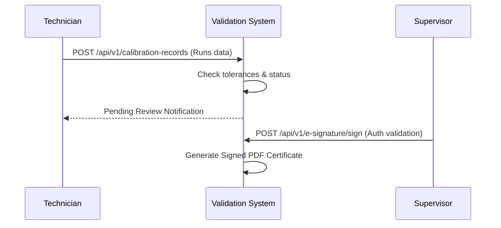

### 8. Input
*   `deviceId` (UUID, Required)
*   `runs` (Array of runs containing nominal/measured inputs, Required)
*   `signaturePin` (String, Required for e-Signature route)

### 9. Output
*   `CalibrationRecord` status, cryptographically signed PDF Certificate file.

### 10. Validation
*   Inputs must fall within specific range models.
*   Double-signature pin matches session user credentials.

### 11. Business Rules
*   Calibration record status cannot transition to "Approved" without a verified e-Signature by a Supervisor.
*   Failure of any run tolerance level sets the entire record to "Failed".

### 12. Access Rights
*   Technicians: Write records (Exec). Supervisors: Write approvals and apply e-Signatures.

### 13. Database
*   Table: `[CalibrationRecord](file:///c:/Users/Zed/Documents/Project/Callibrator/backend/src/models/calibrationRecord.model.js)`
*   Table: `[Certificate](file:///c:/Users/Zed/Documents/Project/Callibrator/backend/src/models/certificate.model.js)`
*   Table: `[ESignatureRecord](file:///c:/Users/Zed/Documents/Project/Callibrator/backend/src/models/eSignatureRecord.model.js)`

### 14. API
*   `POST /api/v1/calibration-records` - `[calibrationRecords.route.js](file:///c:/Users/Zed/Documents/Project/Callibrator/backend/src/routes/api/calibrationRecords.route.js)`
*   `POST /api/v1/e-signature/sign` - `[eSignature.route.js](file:///c:/Users/Zed/Documents/Project/Callibrator/backend/src/routes/api/eSignature.route.js)`

### 15. Integration
*   Object Storage / S3 for PDF file hosting.

### 16. Error Handling
*   `422 Unprocessable Entity` on input values exceeding device range bounds.

### 17. Log and Audit
*   Immutable compliance trails stored for all digital signatures and PDF compilations.

### 18. Configuration
*   `TOLERANCE_MULTIPLIERS`, `CERTIFICATE_TEMPLATE_PATH`.

### 19. Dependency
*   `puppeteer`, `crypto`, `sequelize`.

### 20. UI/Screen
*   Calibration Form, Review Workbench, Certificate Archive.

### 21. Diagrams
*   Refer to `[context.md](file:///c:/Users/Zed/Documents/Project/Callibrator/context.md#L170-L200)` for the Calibration Domain.

### 22. Non-Functional Requirements
*   e-Signature execution processing < 300ms.
*   Signed certificate storage must be encrypted.

### 23. Known Limitations
*   Certificate PDF compiles are resource-intensive.

### 24. Change Log
*   `1.0.0` (2026-07-15): Production release of calibration validation and e-signature modules.

---

# MODULE 6: Quality Management System (QMS)

### 1. General Information
*   **Module Name:** Quality Management System (QMS) Module
*   **Module Code:** HDC-QMS
*   **Version:** 1.0.0
*   **Status:** Production
*   **Owner / Person in Charge:** Quality Assurance Director

### 2. Module Description
Tracks quality assurance tasks including CAPAs (Corrective and Preventive Actions), Non-Conformances (NC), Risks, and Standard Operating Procedure (SOP) training acknowledgments to guarantee conformity with ISO 17025.

### 3. Objectives
*   Mitigate operational risks.
*   Enforce full compliance reporting for audits.

### 4. Scope
*   **In Scope:** CAPA logging/resolution, Non-Conformance filings, Risk matrices, SOP document uploads, read acknowledgments.
*   **Out of Scope:** Execution of clinical corrective procedures.

### 5. Actors/Users
*   **SUPERVISOR / QA AUDITOR:** Registers risks, creates SOPs, files Non-Conformances, approves CAPAs.
*   **TECHNICIAN:** Reviews SOP documents, acknowledges training, files reports of non-conformance.

### 6. Features
*   Dynamic risk score calculations (probability x impact).
*   SOP reading acknowledgments with e-signature bindings.
*   Automated CAPA milestone scheduling.

### 7. Workflow
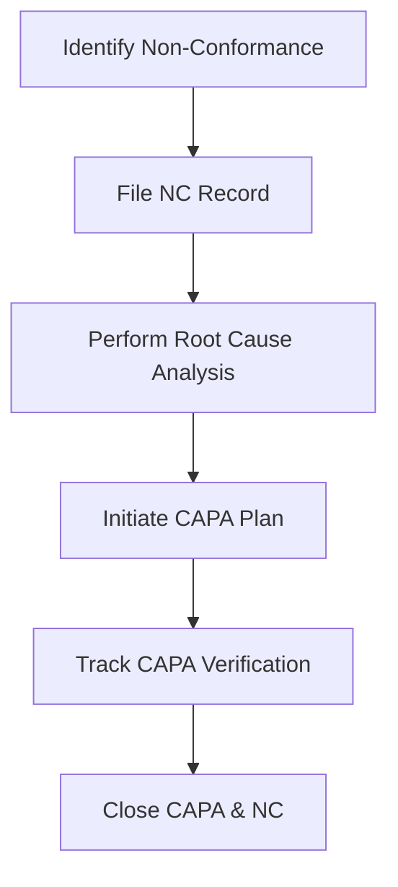

### 8. Input
*   `title` (String, Required)
*   `description` (String, Required)
*   `riskScore` (Integer, Optional)

### 9. Output
*   QA verification reports, SOP logs, CAPA compliance worksheets.

### 10. Validation
*   Risk parameters must follow a 1-5 integer boundary.
*   SOP signature must verify session identity.

### 11. Business Rules
*   Non-conformance records cannot be closed until a root cause analysis is attached.
*   New SOPs require training acknowledgement from all active technicians.

### 12. Access Rights
*   Only QA Auditors and Supervisors can approve CAPA closures. Technicians have read-write access to raise issues.

### 13. Database
*   Table: `[Capa](file:///c:/Users/Zed/Documents/Project/Callibrator/backend/src/models/capa.model.js)`
*   Table: `[NonConformance](file:///c:/Users/Zed/Documents/Project/Callibrator/backend/src/models/nonConformance.model.js)`
*   Table: `[Risk](file:///c:/Users/Zed/Documents/Project/Callibrator/backend/src/models/risk.model.js)`
*   Table: `[SopDocument](file:///c:/Users/Zed/Documents/Project/Callibrator/backend/src/models/sopDocument.model.js)`

### 14. API
*   `POST /api/v1/qms/capa` - `[qms.route.js](file:///c:/Users/Zed/Documents/Project/Callibrator/backend/src/routes/api/qms.route.js)`
*   `POST /api/v1/qms/non-conformance` - `[qms.route.js](file:///c:/Users/Zed/Documents/Project/Callibrator/backend/src/routes/api/qms.route.js)`

### 15. Integration
*   External documentation systems.

### 16. Error Handling
*   `400 Bad Request` if mandatory root cause fields are missing.

### 17. Log and Audit
*   All state updates for QMS models generate audit trail entries.

### 18. Configuration
*   `CAPA_ESCALATION_TIMEOUT_DAYS`.

### 19. Dependency
*   `sequelize`, `joi`.

### 20. UI/Screen
*   CAPA Register, Risk Matrix Dashboard, SOP training tracker.

### 21. Diagrams
*   Refer to QMS folder for activity layouts.

### 22. Non-Functional Requirements
*   Audit log writing speed under 50ms.

### 23. Known Limitations
*   Manual assignment of risk factors.

### 24. Change Log
*   `1.0.0` (2026-07-15): Production QMS release.

---

# MODULE 7: Developer API, Webhooks & Integrations

### 1. General Information
*   **Module Name:** Developer API, Webhooks & Integrations Module
*   **Module Code:** HDC-DEV
*   **Version:** 1.0.0
*   **Status:** Production
*   **Owner / Person in Charge:** API & Integrations Architect

### 2. Module Description
Handles the secure authentication of developer integrations via API keys, routes real-time telemetry from IoT devices, schedules automated SCIM user provisioning, and manages client webhooks.

### 3. Objectives
*   Allow hospitals to sync device statuses into external health management software (HIS).
*   Parse live sensor indicators (temperature, calibration drift) from equipment.

### 4. Scope
*   **In Scope:** API Key generation/hashing, SCIM 2.0 endpoints, webhook retry engine, IoT REST readings endpoint.
*   **Out of Scope:** Physical MQTT broker clustering configurations (handled on infrastructure layers).

### 5. Actors/Users
*   **DEVELOPER:** Generates API keys, registers endpoints, parses webhook events.
*   **HEALTHCARE ADMIN:** Grants access scope to integrations.

### 6. Features
*   SCIM 2.0 provisioning support.
*   Webhook deliveries with exponential backoff retries.
*   Telemetry ingestion rate limiter.

### 7. Workflow
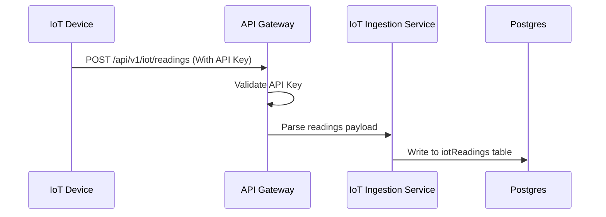

### 8. Input
*   `url` (String, Required for webhook creation)
*   `events` (Array, Required for webhook creation)
*   `telemetry` (Object, Required for IoT telemetry logs)

### 9. Output
*   Webhook event payloads, raw API keys (shown once).

### 10. Validation
*   Webhook endpoint URLs must use HTTPS.
*   SCIM payloads check for correct JSON structure.

### 11. Business Rules
*   API keys are hashed securely at rest using SHA-256 (only accessible once at creation).
*   Webhooks are disabled automatically after 5 consecutive failed delivery attempts.

### 12. Access Rights
*   Developers and Healthcare Admins can configure keys and webhooks.

### 13. Database
*   Table: `[ApiKey](file:///c:/Users/Zed/Documents/Project/Callibrator/backend/src/models/apiKey.model.js)`
*   Table: `[Webhook](file:///c:/Users/Zed/Documents/Project/Callibrator/backend/src/models/webhook.model.js)`
*   Table: `[WebhookDelivery](file:///c:/Users/Zed/Documents/Project/Callibrator/backend/src/models/webhookDelivery.model.js)`
*   Table: `[IotReading](file:///c:/Users/Zed/Documents/Project/Callibrator/backend/src/models/iotReading.model.js)`

### 14. API
*   `POST /api/v1/api-keys` - `[apiKeys.route.js](file:///c:/Users/Zed/Documents/Project/Callibrator/backend/src/routes/api/apiKeys.route.js)`
*   `POST /api/v1/webhooks` - `[webhooks.route.js](file:///c:/Users/Zed/Documents/Project/Callibrator/backend/src/routes/api/webhooks.route.js)`
*   `POST /api/v1/iot/readings` - `[iot.route.js](file:///c:/Users/Zed/Documents/Project/Callibrator/backend/src/routes/api/iot.route.js)`

### 15. Integration
*   External hospital HIS databases.
*   Biomedical telemetry sensors.

### 16. Error Handling
*   `403 Forbidden` if API keys are inactive.
*   `429 Too Many Requests` on exceeding telemetry rate limits.

### 17. Log and Audit
*   All webhook failures and delivery status updates are stored in verification tables.

### 18. Configuration
*   `WEBHOOK_MAX_RETRIES`, `TELEMETRY_RATE_LIMIT`.

### 19. Dependency
*   `crypto`, `axios`.

### 20. UI/Screen
*   Developer API Keys Panel, Webhook Configuration workbench.

### 21. Diagrams
*   Refer to API routes folder for gateway flowcharts.

### 22. Non-Functional Requirements
*   IoT readings insertion time < 20ms.

### 23. Known Limitations
*   Payload size limit for IoT readings is set to 100kb.

### 24. Change Log
*   `1.0.0` (2026-07-15): Release of developer portal tools.

---

# MODULE 8: Billing, Subscription & Finance

### 1. General Information
*   **Module Name:** Billing, Subscription & Finance Module
*   **Module Code:** HDC-BILL
*   **Version:** 1.0.0
*   **Status:** Production
*   **Owner / Person in Charge:** Finance operations controller

### 2. Module Description
Governs SaaS subscription models, tracks metered billing values (e.g. active calibration devices counted), manages invoice histories, and controls payment gateway interactions.

### 3. Objectives
*   Automate subscription invoicing.
*   Monitor device count metrics for metered fee calculations.

### 4. Scope
*   **In Scope:** Subscriptions, metered billing, invoices generation, asset lease finance registers.
*   **Out of Scope:** Complex corporate tax calculations.

### 5. Actors/Users
*   **HEALTHCARE ADMIN:** Updates payment profiles, views invoices, and selects system subscription tiers.
*   **SUPERADMIN:** Configures base prices and edits plans.

### 6. Features
*   Automatic invoice calculation based on active devices.
*   Stripe / Midtrans integration.
*   Asset leasing financial records tracking.

### 7. Workflow
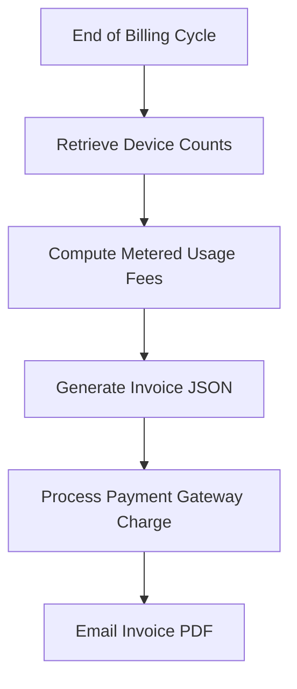

### 8. Input
*   `subscriptionPlanId` (UUID, Required)
*   `paymentMethodId` (String, Required)

### 9. Output
*   Billing invoices, metered reports.

### 10. Validation
*   Plan bounds checks.
*   Security validation of token cards.

### 11. Business Rules
*   Tenants exceeding active device quotas are restricted from adding new items until plans upgrade.
*   Unpaid invoices block non-essential features after a 7-day grace period.

### 12. Access Rights
*   Healthcare Admins and Superadmins have access to billing and pricing files.

### 13. Database
*   Table: `[Subscription](file:///c:/Users/Zed/Documents/Project/Callibrator/backend/src/models/subscription.model.js)`
*   Table: `[Invoice](file:///c:/Users/Zed/Documents/Project/Callibrator/backend/src/models/invoice.model.js)`
*   Table: `[AssetFinance](file:///c:/Users/Zed/Documents/Project/Callibrator/backend/src/models/assetFinance.model.js)`

### 14. API
*   `GET /api/v1/billing/invoices` - `[billing.route.js](file:///c:/Users/Zed/Documents/Project/Callibrator/backend/src/routes/api/billing.route.js)`
*   `POST /api/v1/billing/subscriptions` - `[billing.route.js](file:///c:/Users/Zed/Documents/Project/Callibrator/backend/src/routes/api/billing.route.js)`

### 15. Integration
*   Stripe SDK, Midtrans Payment Gateway API.

### 16. Error Handling
*   `402 Payment Required` on failed transaction responses.

### 17. Log and Audit
*   All financial adjustments and invoice payments generate transaction logs.

### 18. Configuration
*   `CURRENCY_CODE`, `STRIPE_API_KEY`.

### 19. Dependency
*   `stripe`.

### 20. UI/Screen
*   Billing Dashboard, Subscriptions Tier Selector, Invoices Panel.

### 21. Diagrams
*   Refer to billing documentation.

### 22. Non-Functional Requirements
*   Payment transactions must comply with PCI-DSS guidelines.

### 23. Known Limitations
*   Relies completely on external payment gateway availability.

### 24. Change Log
*   `1.0.0` (2026-07-15): Production release of SaaS metered billing.

---

# MODULE 9: Notifications

### 1. General Information
*   **Module Name:** Notifications Module
*   **Module Code:** HDC-NOTIF
*   **Version:** 1.0.0
*   **Status:** Production
*   **Owner / Person in Charge:** Communications Systems Team

### 2. Module Description
Dispatches in-app, email, and SMS alerts to users regarding calibration schedules, approval tasks, system updates, and compliance failures.

### 3. Objectives
*   Notify technicians of work order assignments.
*   Alert supervisors to pending calibration approvals.

### 4. Scope
*   **In Scope:** In-app notifications database records, email rendering, event-based dispatching logic.
*   **Out of Scope:** Direct SMS carrier infrastructure maintenance.

### 5. Actors/Users
*   **All Roles:** Receive system and role-related notifications.

### 6. Features
*   Mustache-based template compilation.
*   User preference management (Email, In-App).
*   Real-time dispatching using WebSockets.

### 7. Workflow
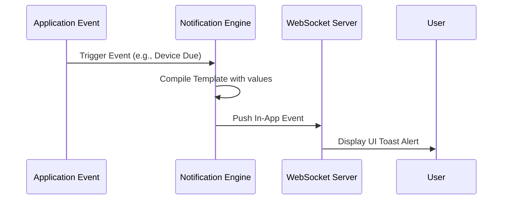

### 8. Input
*   `templateId` (String, Required)
*   `recipients` (Array, Required)
*   `payload` (Object, Required)

### 9. Output
*   SMTP logs, WebSocket packets, Database notification rows.

### 10. Validation
*   Checks presence of email structure.

### 11. Business Rules
*   In-app alerts are auto-archived after 30 days.
*   Muted categories are filtered before dispatch routines.

### 12. Access Rights
*   System services write notifications. All users can read their own alert rows.

### 13. Database
*   Table: `[Notification](file:///c:/Users/Zed/Documents/Project/Callibrator/backend/src/models/notification.model.js)`

### 14. API
*   `GET /api/v1/notifications` - `[notifications.route.js](file:///c:/Users/Zed/Documents/Project/Callibrator/backend/src/routes/api/notifications.route.js)`
*   `PUT /api/v1/notifications/:id/read` - `[notifications.route.js](file:///c:/Users/Zed/Documents/Project/Callibrator/backend/src/routes/api/notifications.route.js)`

### 15. Integration
*   SMTP Server (SendGrid/Amazon SES).

### 16. Error Handling
*   Emails are retried up to 3 times in case of connection timeouts.

### 17. Log and Audit
*   All notifications generated are logged in database records.

### 18. Configuration
*   `SMTP_HOST`, `SMTP_PORT`, `SMTP_USER`, `SMTP_PASS`.

### 19. Dependency
*   `nodemailer`, `mustache`, `socket.io`.

### 20. UI/Screen
*   Notifications bell dropdown, Preferences configuration screen.

### 21. Diagrams
*   Template layouts.

### 22. Non-Functional Requirements
*   In-app notifications sent in < 1s via WebSocket.

### 23. Known Limitations
*   Real-time notifications rely on active client-side WebSocket connections.

### 24. Change Log
*   `1.0.0` (2026-07-15): Production release with SMTP support.

---

# MODULE 10: Workflow Engine

### 1. General Information
*   **Module Name:** Workflow Engine Module
*   **Module Code:** HDC-WORKFLOW
*   **Version:** 1.0.0
*   **Status:** Production
*   **Owner / Person in Charge:** Core Engine Developer

### 2. Module Description
A dynamic workflow processor that maps custom approval chains, schedules sequence transitions, and tracks state instances for critical business events.

### 3. Objectives
*   Allow custom multi-level approvals for calibrations and inventory changes.
*   Create persistent action histories.

### 4. Scope
*   **In Scope:** Workflows, steps definitions, execution instances, action approvals, transition hooks.
*   **Out of Scope:** External business process modelers (BPMN UI editor).

### 5. Actors/Users
*   **CALIBRATOR / QA ADMIN:** Configures workflow chains and transitions.
*   **SUPERVISOR / ROLE APPROVER:** Approves/rejects items on verification paths.

### 6. Features
*   Dynamic step resolution.
*   Auto-escalation of pending tasks.
*   Audit trails for transition decisions.

### 7. Workflow
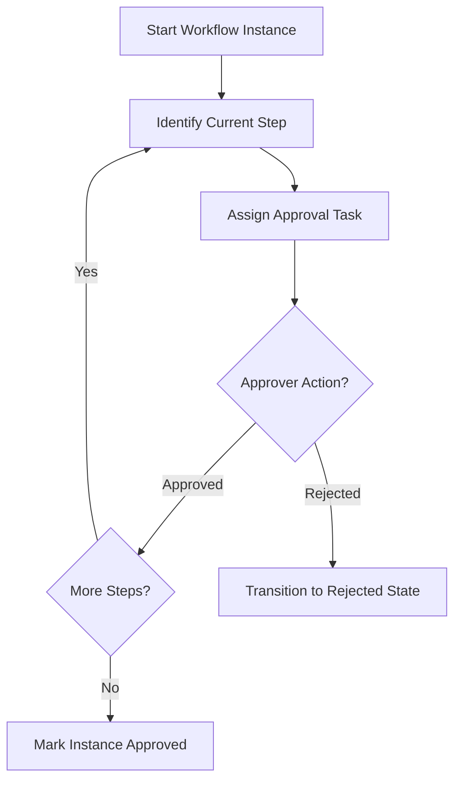

### 8. Input
*   `workflowId` (UUID, Required)
*   `targetId` (UUID, Target record identifier, Required)

### 9. Output
*   Transition logs, step logs.

### 10. Validation
*   Verifies that step sequences contain valid active users.

### 11. Business Rules
*   Users cannot approve steps assigned to their own actions (prevents self-approval conflicts).
*   Rejected steps force the entire workflow back to a customizable fallback state.

### 12. Access Rights
*   Only admins define workflows. Designated users handle actions on active steps.

### 13. Database
*   Table: `[Workflow](file:///c:/Users/Zed/Documents/Project/Callibrator/backend/src/models/workflow.model.js)`
*   Table: `[WorkflowStep](file:///c:/Users/Zed/Documents/Project/Callibrator/backend/src/models/workflowStep.model.js)`
*   Table: `[WorkflowInstance](file:///c:/Users/Zed/Documents/Project/Callibrator/backend/src/models/workflowInstance.model.js)`
*   Table: `[WorkflowAction](file:///c:/Users/Zed/Documents/Project/Callibrator/backend/src/models/workflowAction.model.js)`

### 14. API
*   `POST /api/v1/workflows` - `[workflows.route.js](file:///c:/Users/Zed/Documents/Project/Callibrator/backend/src/routes/api/workflows.route.js)`
*   `POST /api/v1/workflows/instances/:id/action` - `[workflows.route.js](file:///c:/Users/Zed/Documents/Project/Callibrator/backend/src/routes/api/workflows.route.js)`

### 15. Integration
*   Internal backend services.

### 16. Error Handling
*   `409 Conflict` if attempting actions on closed workflow instances.

### 17. Log and Audit
*   Every workflow state transition is saved in the database.

### 18. Configuration
*   `WORKFLOW_AUTO_ESCALATION_HOURS`.

### 19. Dependency
*   `sequelize`.

### 20. UI/Screen
*   Workflow Designer, Active Approvals Task Inbox.

### 21. Diagrams
*   State machines configurations.

### 22. Non-Functional Requirements
*   Workflow transitions check latency < 100ms.

### 23. Known Limitations
*   Workflows are linear and do not support parallel branch operations.

### 24. Change Log
*   `1.0.0` (2026-07-15): Initial workflow engine release.

---

# MODULE 11: Vendor Management

### 1. General Information
*   **Module Name:** Vendor Management Module
*   **Module Code:** HDC-VENDOR
*   **Version:** 1.0.0
*   **Status:** Production
*   **Owner / Person in Charge:** Vendor & Supply Quality Lead

### 2. Module Description
Tracks third-party calibration laboratories, replacement parts suppliers, and critical service contractors. Maintains scorecards evaluating vendor speed, accuracy, and compliance ratings.

### 3. Objectives
*   Qualify suppliers according to ISO 17025 compliance constraints.
*   Log certifications and validity periods of external contracting laboratories.

### 4. Scope
*   **In Scope:** Supplier directories, scorecard performance counters, upload portals for vendor compliance documents.
*   **Out of Scope:** Automatic financial payment payouts to vendor bank accounts.

### 5. Actors/Users
*   **CALIBRATOR ADMIN / SUPERVISOR:** Creates vendor entries, updates scorecards, uploads contract records.
*   **ENGINEERING MGR:** Analyzes vendor performance analytics.

### 6. Features
*   Supplier Scorecard calculations (delivery variance, accuracy metrics).
*   Automatic email alerts for expiring vendor certification files.
*   Vendor capability lookup directory.

### 7. Workflow
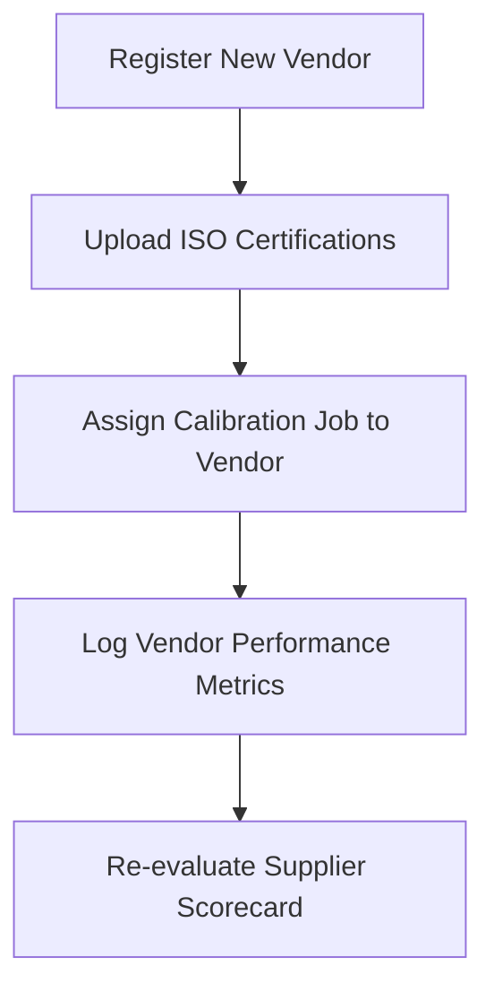

### 8. Input
*   `companyName` (String, Required)
*   `registrationNumber` (String, Required)
*   `contactEmail` (String, Required)

### 9. Output
*   Performance reports, expiring certificate alerts.

### 10. Validation
*   Ensures valid email domains.
*   Checks certificate dates to prevent retroactive registrations.

### 11. Business Rules
*   External labs with expired ISO certifications cannot be assigned new calibration jobs.
*   Scorecard updates are frozen upon completion of annual clinical review cycles.

### 12. Access Rights
*   Only Calibrator Admins and QA supervisors can register or edit vendors.

### 13. Database
*   Table: `[Vendor](file:///c:/Users/Zed/Documents/Project/Callibrator/backend/src/models/vendor.model.js)`
*   Table: `[SupplierScorecard](file:///c:/Users/Zed/Documents/Project/Callibrator/backend/src/models/supplierScorecard.model.js)`

### 14. API
*   `GET /api/v1/vendors` - `[vendor.route.js](file:///c:/Users/Zed/Documents/Project/Callibrator/backend/src/routes/api/vendor.route.js)`
*   `POST /api/v1/vendors` - `[vendor.route.js](file:///c:/Users/Zed/Documents/Project/Callibrator/backend/src/routes/api/vendor.route.js)`

### 15. Integration
*   External vendor inventory APIs.

### 16. Error Handling
*   `400 Bad Request` if compliance documents are missing during high-priority vendor creation.

### 17. Log and Audit
*   All alterations to vendor status and rating variables create persistent logs.

### 18. Configuration
*   `MIN_QUALIFICATION_SCORECARD_RATING`.

### 19. Dependency
*   `sequelize`, `moment`.

### 20. UI/Screen
*   Vendor Directory, Scorecard Analytics, Contract Upload panel.

### 21. Diagrams
*   Refer to vendor service flowcharts.

### 22. Non-Functional Requirements
*   Expiring alerts run on background cron sequences under 10s.

### 23. Known Limitations
*   Scorecard metrics rely on manual performance input ratings.

### 24. Change Log
*   `1.0.0` (2026-07-15): Initial vendor management release.

---

# MODULE 12: Audit & Compliance Trail

### 1. General Information
*   **Module Name:** Audit & Compliance Trail Module
*   **Module Code:** HDC-AUDIT
*   **Version:** 1.0.0
*   **Status:** Production
*   **Owner / Person in Charge:** Chief Compliance Officer

### 2. Module Description
A high-integrity compliance logger that records all database modifications, user actions, login/logout events, and RLS bypasses to satisfy FDA 21 CFR Part 11 requirements.

### 3. Objectives
*   Generate immutable, search-ready audit trails for regulatory officers.
*   Enforce traceability for all calibration state changes.

### 4. Scope
*   **In Scope:** Immutable logging hooks on database operations, JSON diffs of previous/new states, search/export controls.
*   **Out of Scope:** Archiving log tables to external deep cold storage (handled on database backup layers).

### 5. Actors/Users
*   **QA AUDITOR / SUPERADMIN:** Search, filter, and export audit trails.

### 6. Features
*   Automatic Sequelize model hook triggers.
*   JSON diff comparisons for all mutations.
*   Cryptographic validation of log row integrity.

### 7. Workflow
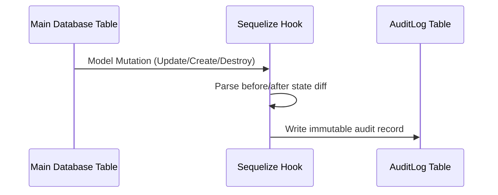

### 8. Input
*   `action` (String, Required)
*   `tableName` (String, Required)
*   `diff` (Object, Required)

### 9. Output
*   Immutable database rows, signed CSV/PDF audit exports.

### 10. Validation
*   No API exists to update or delete rows from the audit log table.

### 11. Business Rules
*   Audit log writing cannot fail; if the log write fails, the entire parent database transaction must be aborted.
*   Each audit record captures IP addresses, user agents, and tenant scopes.

### 12. Access Rights
*   Read-only access is restricted to auditors and administrators. Writes are system-automated.

### 13. Database
*   Table: `[AuditLog](file:///c:/Users/Zed/Documents/Project/Callibrator/backend/src/models/auditLog.model.js)`

### 14. API
*   `GET /api/v1/audit-logs` - `[audit.route.js](file:///c:/Users/Zed/Documents/Project/Callibrator/backend/src/routes/api/audit.route.js)`
*   `GET /api/v1/audit-logs/export` - `[audit.route.js](file:///c:/Users/Zed/Documents/Project/Callibrator/backend/src/routes/api/audit.route.js)`

### 15. Integration
*   External Security Information and Event Management (SIEM) systems.

### 16. Error Handling
*   Any database failure to write to the audit log aborts the request with a `500 Internal Server Error`.

### 17. Log and Audit
*   Self-auditing module: log access attempts are logged recursively.

### 18. Configuration
*   `AUDIT_RETENTION_PERIOD_DAYS`.

### 19. Dependency
*   `sequelize`.

### 20. UI/Screen
*   Audit Trail Explorer, Export Center.

### 21. Diagrams
*   Refer to `[context.md](file:///c:/Users/Zed/Documents/Project/Callibrator/context.md#L220-L236)` for Audit requirements.

### 22. Non-Functional Requirements
*   Audit hook write latency < 5ms.
*   Guaranteed log immutability via DB trigger permissions.

### 23. Known Limitations
*   Extensive logging generates high database storage overhead.

### 24. Change Log
*   `1.0.0` (2026-07-15): Initial launch of FDA compliant logging system.

---

# MODULE 13: Backup & Disaster Recovery

### 1. General Information
*   **Module Name:** Backup & Disaster Recovery Module
*   **Module Code:** HDC-BACKUP
*   **Version:** 1.0.0
*   **Status:** Production
*   **Owner / Person in Charge:** Infrastructure & DevOps Team

### 2. Module Description
Coordinates scheduled tenant backups, database dump archiving, point-in-time recoveries, and storage encryption keys rotations.

### 3. Objectives
*   Protect healthcare client records against physical server failures.
*   Ensure business continuity targets (RTO < 4 hours, RPO < 24 hours).

### 4. Scope
*   **In Scope:** Automated PostgreSQL backups, local/cloud storage archiving, encrypted transfer streams, restore verify actions.
*   **Out of Scope:** Physical Kubernetes cluster hardware provisioning.

### 5. Actors/Users
*   **SUPERADMIN / DEVOPS:** Manages backup parameters, runs drills, executes recovery commands.
*   **HEALTHCARE ADMIN:** Requests ad-hoc tenant data archive exports.

### 6. Features
*   Automated PG dump automation scripts.
*   AES-256 backup archive encryption.
*   One-click sandbox restore verification.

### 7. Workflow
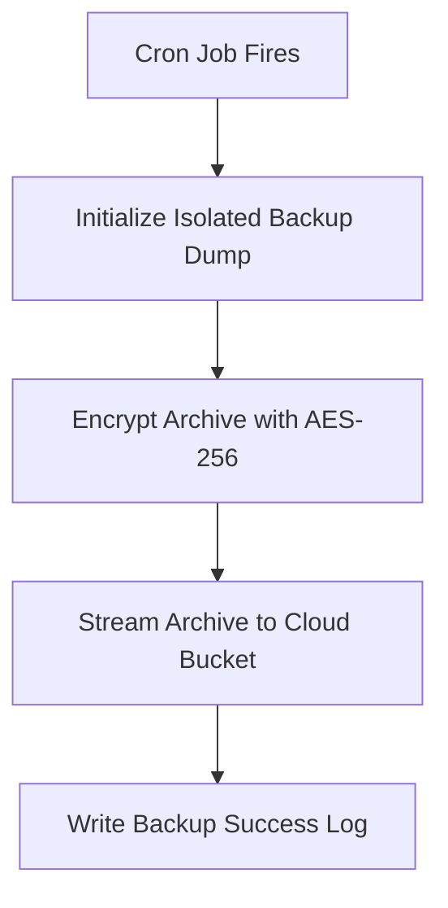

### 8. Input
*   `tenantId` (UUID, Required for ad-hoc tenant backup request)

### 9. Output
*   `.tar.gz` encrypted file archives, restore verify logs.

### 10. Validation
*   Validates archive hashes post-generation to check for corruption.

### 11. Business Rules
*   Automated backups are run daily at 01:00 UTC.
*   Backups must be kept in secure, off-site storage for a minimum of 30 days.

### 12. Access Rights
*   Only superadministrators and system crons can invoke backup creation or recovery.

### 13. Database
*   Table: `[TenantBackup](file:///c:/Users/Zed/Documents/Project/Callibrator/backend/src/models/tenantBackup.model.js)`

### 14. API
*   `POST /api/v1/backups/execute` - `[tenantBackup.route.js](file:///c:/Users/Zed/Documents/Project/Callibrator/backend/src/routes/api/tenantBackup.route.js)`
*   `GET /api/v1/backups/history` - `[tenantBackup.route.js](file:///c:/Users/Zed/Documents/Project/Callibrator/backend/src/routes/api/tenantBackup.route.js)`

### 15. Integration
*   Amazon S3 / Google Cloud Storage buckets.

### 16. Error Handling
*   Fires high-severity Slack/Discord alerts if backup operations fail.

### 17. Log and Audit
*   All backup creations and restoration processes write to the audit trail.

### 18. Configuration
*   `BACKUP_BUCKET_NAME`, `BACKUP_ENCRYPTION_KEY`.

### 19. Dependency
*   `archiver`, `jszip`, `pg`.

### 20. UI/Screen
*   Backup & Restore Console, Recovery Job Log.

### 21. Diagrams
*   Refer to `[context.md](file:///c:/Users/Zed/Documents/Project/Callibrator/context.md#L238-L252)` for the Backup strategy.

### 22. Non-Functional Requirements
*   Backup generation duration < 10 minutes (for average tenant sizes).
*   AES-256 encryption-at-rest validation.

### 23. Known Limitations
*   Restoring database status halts tenant API requests momentarily to prevent data conflicts.

### 24. Change Log
*   `1.0.0` (2026-07-15): Initial backup strategy release.

---

# MODULE 14: Content CMS

### 1. General Information
*   **Module Name:** Content CMS Module
*   **Module Code:** HDC-CMS
*   **Version:** 1.0.0
*   **Status:** Production
*   **Owner / Person in Charge:** Public Relations & Content Editor

### 2. Module Description
Provides a lightweight content management system (CMS) to publish news, blog updates, and clinical guidelines on the public landing page.

### 3. Objectives
*   Inform client teams of system updates and biomedical industry changes.
*   Host educational calibration instructions.

### 4. Scope
*   **In Scope:** Articles, Categories, Markdown rendering, image attachments, publish date settings.
*   **Out of Scope:** Direct comments section (discussions are handled via support tickets).

### 5. Actors/Users
*   **CONTENT EDITOR:** Writes drafts, tags posts, publishes guidelines.
*   **ALL VISITORS / USERS:** Read articles, download guides.

### 6. Features
*   Markdown editor input processing.
*   Slug generator for URLs.
*   Categorized lists.

### 7. Workflow
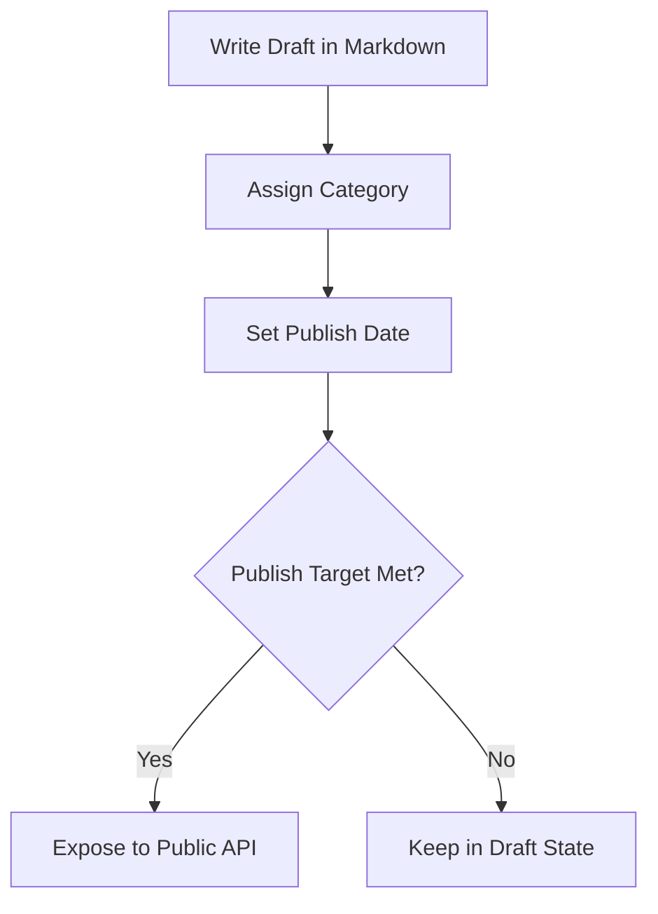

### 8. Input
*   `title` (String, Required)
*   `content` (String, Required)
*   `categoryId` (UUID, Required)

### 9. Output
*   Rendered HTML content, JSON metadata streams.

### 10. Validation
*   Enforces unique slugs.
*   Sanitizes input markdown to prevent XSS payloads.

### 11. Business Rules
*   Posts marked as drafts are excluded from all public API queries.
*   Deletion of categories is prohibited if posts are currently attached.

### 12. Access Rights
*   Only registered editors and administrators can write posts. Reading is open to the public.

### 13. Database
*   Table: `[Post](file:///c:/Users/Zed/Documents/Project/Callibrator/backend/src/models/post.model.js)`
*   Table: `[Category](file:///c:/Users/Zed/Documents/Project/Callibrator/backend/src/models/category.model.js)`
*   Table: `[PostCategory](file:///c:/Users/Zed/Documents/Project/Callibrator/backend/src/models/postCategory.model.js)`

### 14. API
*   `GET /api/v1/content/posts` - `[content.route.js](file:///c:/Users/Zed/Documents/Project/Callibrator/backend/src/routes/api/content.route.js)`
*   `POST /api/v1/content/posts` - `[content.route.js](file:///c:/Users/Zed/Documents/Project/Callibrator/backend/src/routes/api/content.route.js)`

### 15. Integration
*   Image host services.

### 16. Error Handling
*   `404 Not Found` for nonexistent slugs.

### 17. Log and Audit
*   All additions, edits, and deletions of CMS posts are logged.

### 18. Configuration
*   `CMS_PUBLIC_CACHING_MINUTES`.

### 19. Dependency
*   `markdown-it`, `sanitize-html`.

### 20. UI/Screen
*   Blog Detail page, Content Writer Console.

### 21. Diagrams
*   Refer to frontend documentation.

### 22. Non-Functional Requirements
*   CMS queries served under 50ms using Redis caches.

### 23. Known Limitations
*   Does not support real-time collaborative text writing (single-editor locks apply).

### 24. Change Log
*   `1.0.0` (2026-07-15): Initial public CMS module release.

---

# MODULE 15: Attachment & Document Upload

### 1. General Information
*   **Module Name:** Attachment & Document Upload Module
*   **Module Code:** HDC-UPLOAD
*   **Version:** 1.0.0
*   **Status:** Production
*   **Owner / Person in Charge:** Document Control Officer

### 2. Module Description
Handles the secure streaming, upload, compression, virus scanning, storage path mapping, and retrieval of device manuals, warranty certificates, calibration certificates, and vendor contracts.

### 3. Objectives
*   Provide a centralized storage broker for compliance and device documents.
*   Enforce access verification on uploaded file structures.

### 4. Scope
*   **In Scope:** Multi-part file stream parsing, image/PDF compression, S3/local file uploads, access control lists mapping, secure URL generation.
*   **Out of Scope:** Physical object storage cluster management.

### 5. Actors/Users
*   **ALL LOGGED-IN USERS:** Read/download permitted manuals and files.
*   **TECHNICIAN / WAREHOUSE STAFF / ADMIN:** Upload new document records.

### 6. Features
*   Dynamic presigned URL generation.
*   Automatic PDF file optimization.
*   Secure file type checking (mime-type signature validation).

### 7. Workflow
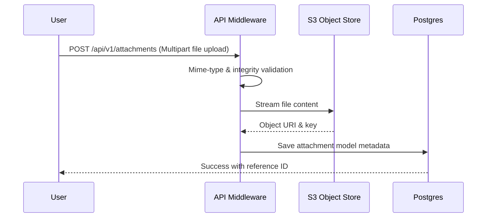

### 8. Input
*   `file` (Binary Stream, Required)
*   `associatedType` (String, Required e.g., DEVICE, CERTIFICATE)
*   `associatedId` (UUID, Required)

### 9. Output
*   `Attachment` JSON metadata records, secure download URL.

### 10. Validation
*   Validates file extensions and checks for malicious executable structures.
*   Max payload size boundaries.

### 11. Business Rules
*   Documents linked to approved calibration certificates are frozen and cannot be updated or deleted.
*   Cross-tenant attachment access requests are blocked via RLS context validation.

### 12. Access Rights
*   Role permissions map download capabilities (e.g., Room users read device manuals but cannot delete them).

### 13. Database
*   Table: `[Attachment](file:///c:/Users/Zed/Documents/Project/Callibrator/backend/src/models/attachment.model.js)`

### 14. API
*   `POST /api/v1/attachments` - `[attachments.route.js](file:///c:/Users/Zed/Documents/Project/Callibrator/backend/src/routes/api/attachments.route.js)`
*   `GET /api/v1/attachments/:id/download` - `[attachments.route.js](file:///c:/Users/Zed/Documents/Project/Callibrator/backend/src/routes/api/attachments.route.js)`

### 15. Integration
*   Amazon S3, MinIO, or local disk array.

### 16. Error Handling
*   `413 Payload Too Large` if uploads exceed size thresholds.
*   `415 Unsupported Media Type` for forbidden extensions.

### 17. Log and Audit
*   All file creations, download fetches, and file deletion attempts are logged.

### 18. Configuration
*   `MAX_UPLOAD_SIZE_MB`, `ALLOWED_FILE_EXTENSIONS`.

### 19. Dependency
*   `multer`, `uuid`, `fs-extra`.

### 20. UI/Screen
*   File Upload Dialog, Document Vault list.

### 21. Diagrams
*   Refer to attachment sequence documentation.

### 22. Non-Functional Requirements
*   File upload streaming rates limited only by client connection bandwidth.
*   Mime-type evaluation latency under 10ms.

### 23. Known Limitations
*   Lack of real-time server-side scanning for complex document-based macros (relying on client malware scanners).

### 24. Change Log
*   `1.0.0` (2026-07-15): Initial attachment upload engine release.

---

# MODULE 16: Batch Jobs & Background Tasks

### 1. General Information
*   **Module Name:** Batch Jobs & Background Tasks Module
*   **Module Code:** HDC-BATCH
*   **Version:** 1.0.0
*   **Status:** Production
*   **Owner / Person in Charge:** Infrastructure Developer

### 2. Module Description
Handles the asynchronous processing of resource-heavy operations (large exports, bulk calculations, certificate PDF generation, and automated backup schedules) using task queues.

### 3. Objectives
*   Offload CPU-intensive operations from the primary API request loop.
*   Ensure resilient processing via automatic job retries.

### 4. Scope
*   **In Scope:** Queue administration, worker process routing, job status checkpoints, retry logic, timeout controls.
*   **Out of Scope:** Real-time user thread notifications (handled via the Notification WebSocket module).

### 5. Actors/Users
*   **SUPERADMIN / DEVOPS:** Monitors queue statuses, cancels failed runs, adjusts concurrency rates.

### 6. Features
*   Redis-backed priority queuing.
*   Job failure auto-retries with exponential delay.
*   Progress indicator tracking logs.

### 7. Workflow
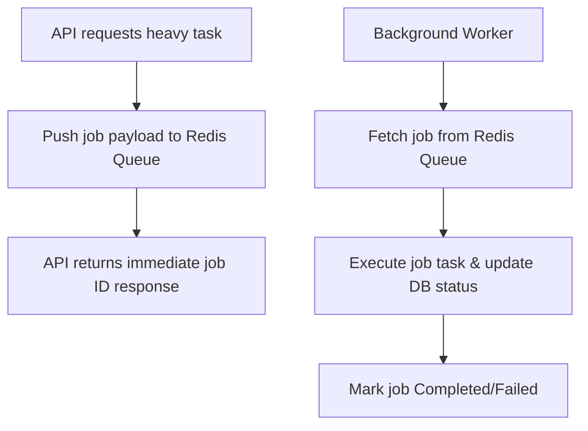

### 8. Input
*   `jobType` (String, Required)
*   `payload` (Object, Required)

### 9. Output
*   `batchJobId` (UUID), task status updates.

### 10. Validation
*   Job payload structures matching required job template schemas.

### 11. Business Rules
*   Expired jobs are marked as "Failed" and logged to alerting channels.
*   Only one instance of a specific backup cron job can run at one time (prevents write collisions).

### 12. Access Rights
*   Only system components can write tasks to queues. Admins can view and manage job runs.

### 13. Database
*   Table: `[BatchJob](file:///c:/Users/Zed/Documents/Project/Callibrator/backend/src/models/batchJob.model.js)`

### 14. API
*   `GET /api/v1/batch-jobs/:id` - `[batchJobs.route.js](file:///c:/Users/Zed/Documents/Project/Callibrator/backend/src/routes/api/batchJobs.route.js)`
*   `POST /api/v1/batch-jobs/:id/retry` - `[batchJobs.route.js](file:///c:/Users/Zed/Documents/Project/Callibrator/backend/src/routes/api/batchJobs.route.js)`

### 15. Integration
*   Redis queue broker.

### 16. Error Handling
*   Saves task error trace logs inside the batch job database row.

### 17. Log and Audit
*   All worker processes writing status changes generate system logs.

### 18. Configuration
*   `QUEUE_CONCURRENCY_WORKERS`, `JOB_TIMEOUT_MS`.

### 19. Dependency
*   `ioredis`, `sequelize`.

### 20. UI/Screen
*   Background Jobs Monitoring panel, Worker status dashboard.

### 21. Diagrams
*   Refer to queue architecture charts.

### 22. Non-Functional Requirements
*   Job ingestion latency under 5ms.
*   Support for processing up to 10,000 concurrent jobs.

### 23. Known Limitations
*   High reliance on Redis availability; system halts execution if Redis becomes unresponsive.

### 24. Change Log
*   `1.0.0` (2026-07-15): Initial production release of batch processing.

---

# MODULE 17: Reports Engine & Analytics

### 1. General Information
*   **Module Name:** Reports Engine & Analytics Module
*   **Module Code:** HDC-REPORT
*   **Version:** 1.0.0
*   **Status:** Production
*   **Owner / Person in Charge:** Lead Data Analyst

### 2. Module Description
Aggregates device data, calibration histories, and compliance logs to compile analytical reports, calculate equipment health ratings, and display operational dashboards.

### 3. Objectives
*   Provide biomedical managers with visibility into calibration compliance ratings.
*   Predict future equipment failures using historical trends.

### 4. Scope
*   **In Scope:** Multi-tenant compliance metrics, health score math equations, export templates (PDF/Excel), dashboard indicators.
*   **Out of Scope:** Direct hospital financial auditing logs.

### 5. Actors/Users
*   **HEALTHCARE ADMIN / ENGINEERING MGR:** Runs reports, views dashboard trends, downloads audits.
*   **SUPERVISOR:** Monitors calibration pass/fail rates.

### 6. Features
*   Dynamic data grouping and aggregations.
*   Compliance score calculations.
*   Excel/CSV download builders.

### 7. Workflow
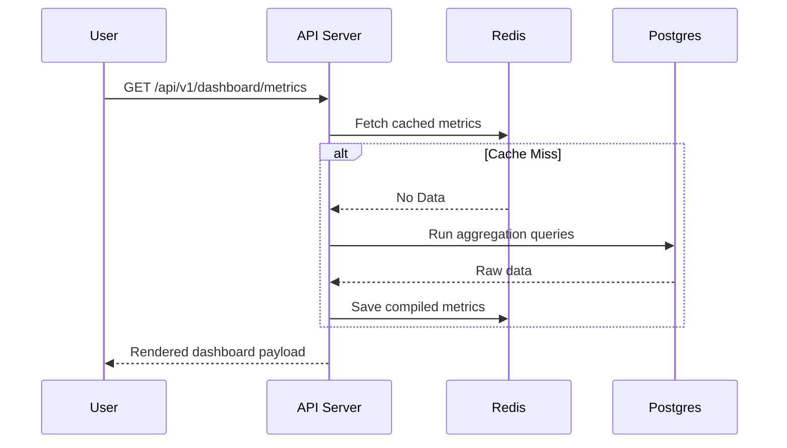

### 8. Input
*   `startDate` (String, Optional)
*   `endDate` (String, Optional)
*   `format` (String, Required for export requests e.g., PDF)

### 9. Output
*   Data points streams, export file binary buffers.

### 10. Validation
*   Validates target date boundaries.
*   Tenant ID check matching queries.

### 11. Business Rules
*   Dashboard statistics are compiled from cached values to optimize database resources.
*   Reports cannot access cross-tenant data lines.

### 12. Access Rights
*   Technicians have view-only access to their personal work statistics. Managers can view tenant-wide stats.

### 13. Database
*   No dedicated database tables are owned by this module. It runs aggregate queries on `[CalibrationRecord](file:///c:/Users/Zed/Documents/Project/Callibrator/backend/src/models/calibrationRecord.model.js)` and `[CalibrationDevice](file:///c:/Users/Zed/Documents/Project/Callibrator/backend/src/models/calibrationDevice.model.js)`.

### 14. API
*   `GET /api/v1/dashboard/metrics` - `[dashboard.route.js](file:///c:/Users/Zed/Documents/Project/Callibrator/backend/src/routes/api/dashboard.route.js)`
*   `GET /api/v1/reports/compliance` - `[reports.route.js](file:///c:/Users/Zed/Documents/Project/Callibrator/backend/src/routes/api/reports.route.js)`

### 15. Integration
*   Internal backend services.

### 16. Error Handling
*   `400 Bad Request` if selected query duration windows exceed 12 months.

### 17. Log and Audit
*   All analytics export requests and target download events are logged.

### 18. Configuration
*   `ANALYTICS_CACHE_TTL_SECONDS`.

### 19. Dependency
*   `sequelize`, `ioredis`.

### 20. UI/Screen
*   Analytics Dashboard, Export Report Hub.

### 21. Diagrams
*   Refer to UI design manuals.

### 22. Non-Functional Requirements
*   Dashboard widget queries loading < 300ms.

### 23. Known Limitations
*   Complex aggregation requests run during office hours may temporarily increase database CPU utilization.

### 24. Change Log
*   `1.0.0` (2026-07-15): Initial dashboard and reporting tools release.

---

# MODULE 18: GDPR & Privacy Compliance

### 1. General Information
*   **Module Name:** GDPR & Privacy Compliance Module
*   **Module Code:** HDC-GDPR
*   **Version:** 1.0.0
*   **Status:** Production
*   **Owner / Person in Charge:** Data Protection Officer (DPO)

### 2. Module Description
Enforces privacy frameworks by handling data deletion requests (Right to be Forgotten), processing personal information exports, and managing data retention timeouts.

### 3. Objectives
*   Comply with global GDPR and regional privacy rules (HIPAA/PDP).
*   Anonymize personnel data while maintaining calibration history integrity.

### 4. Scope
*   **In Scope:** Personal data exports, user account anonymization scripts, storage logs retention cleaners.
*   **Out of Scope:** External client-side cookies management.

### 5. Actors/Users
*   **HEALTHCARE ADMIN / DPO:** Initiates data exports, requests user profile deletions.
*   **USER:** Requests personal data archives.

### 6. Features
*   User profile anonymization (obfuscates names, emails, phones while keeping audit relations).
*   Automatic data deletion crons.
*   Personal data archive builder (.ZIP format).

### 7. Workflow
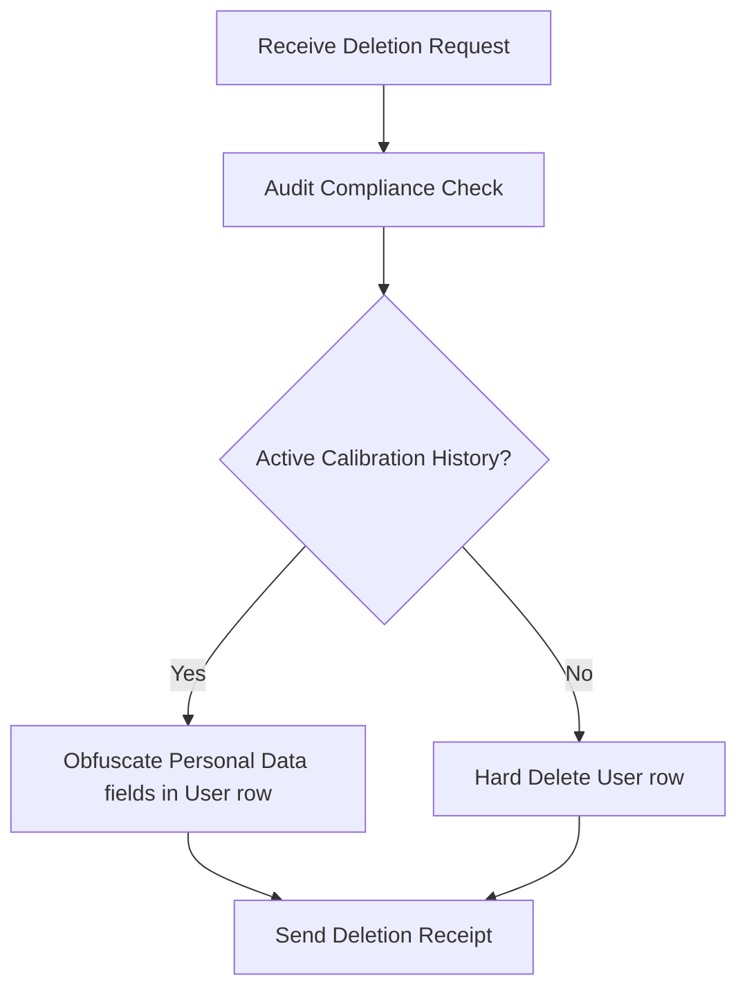

### 8. Input
*   `userId` (UUID, Required)

### 9. Output
*   Encrypted ZIP data archive files, deletion status logs.

### 10. Validation
*   Confirm user identity via re-authentication before starting export or delete actions.

### 11. Business Rules
*   Records of approved calibrations signed by a technician cannot be hard-deleted (historical measurements must persist for audit purposes). The author's name is anonymized instead.
*   Completed logs older than 7 years are pruned automatically.

### 12. Access Rights
*   Requires Admin and Data Protection Officer authorization steps.

### 13. Database
*   No dedicated tables. Mutates `[User](file:///c:/Users/Zed/Documents/Project/Callibrator/backend/src/models/user.model.js)` records and wipes matching session values.

### 14. API
*   `POST /api/v1/gdpr/export` - `[gdpr.route.js](file:///c:/Users/Zed/Documents/Project/Callibrator/backend/src/routes/api/gdpr.route.js)`
*   `POST /api/v1/gdpr/anonymize` - `[gdpr.route.js](file:///c:/Users/Zed/Documents/Project/Callibrator/backend/src/routes/api/gdpr.route.js)`

### 15. Integration
*   Secure archive directories.

### 16. Error Handling
*   `403 Forbidden` if verification PINs fail.

### 17. Log and Audit
*   Audit registers record all data deletion and export requests.

### 18. Configuration
*   `DATA_RETENTION_YEARS`.

### 19. Dependency
*   `jszip`, `crypto`.

### 20. UI/Screen
*   Privacy Center dashboard, User Deletion tool.

### 21. Diagrams
*   Anonymization flowcharts.

### 22. Non-Functional Requirements
*   Anonymization process executes < 2 seconds.
*   Personal exports ZIP archives are encrypted using AES-256.

### 23. Known Limitations
*   Orphaned calibration histories lose direct reference links to original technician accounts once anonymized.

### 24. Change Log
*   `1.0.0` (2026-07-15): Initial privacy tools launch.

---

# Summary

-   **General Information:** Modules documented using standard identifiers: HDC-IAM, HDC-TENANT, HDC-WH, HDC-DEVICE, HDC-CALIB, HDC-QMS, HDC-DEV, HDC-BILL, HDC-NOTIF, HDC-WORKFLOW, HDC-VENDOR, HDC-AUDIT, HDC-BACKUP, HDC-CMS, HDC-UPLOAD, HDC-BATCH, HDC-REPORT, and HDC-GDPR.
-   **Description:** Complete technical description of each module's core functions.
-   **Objectives:** Precise definition of security, segregation, accuracy, efficiency, QA, integration, finance, alerts, workflow, auditing, backups, CMS content, document storage, queue processing, analytics, and privacy goals.
-   **Scope:** In-scope and out-of-scope tasks mapping.
-   **Actors:** Mapping of Superadmins, Admins, Technicians, Supervisors, Warehouse Staff, Developers, Financial Controllers, Content Editors, and Data Protection Officers.
-   **Features:** Details of OIDC, WebAuthn, RLS, transfers, PM scheduling, tolerances, CAPAs, Webhooks, metered billing, email templates, approval steps, supplier scorecards, compliance trails, PG dumps, Markdown posts, presigned URLs, priority queues, compliance aggregates, and data anonymization scripts.
-   **Workflow:** Visual sequences for authentication, tenant context, transfers, PM, calibration, CAPA, IoT ingestion, billing calculation, notification alerts, workflow transitions, supplier qualifications, audit writes, PG backups, CMS releases, multipart file streams, Redis task worker queues, analytics caching checks, and anonymization pathways.
-   **Input:** Expected request payload parameters.
-   **Output:** Generated responses and documents.
-   **Validation:** Implementation of range checks, Joi/Express validators, RLS scopes, token checks, unique slugs, file mime-type signatures, task schemas, date boundaries, and re-authentication validations.
-   **Business Rules:** Operational limits (RLS enforcement, no direct stock updates, signature rules, self-approval prevention, active cert enforcement, backup cron routines, CMS draft filters, frozen approved attachments, sequential queue limits, anonymization requirements).
-   **Access Rights:** Role access mapping.
-   **Database:** Linked models directories for Users, Tenants, Stock, Devices, Certificates, CAPA, Webhooks, Invoices, Notifications, Workflows, Vendors, Audits, Backups, Posts, Attachments, and BatchJobs.
-   **API:** Links to key endpoint definitions (`auth.route.js`, `stock.route.js`, `calibrationRecords.route.js`, `qms.route.js`, `apiKeys.route.js`, `billing.route.js`, `notifications.route.js`, `workflows.route.js`, `vendor.route.js`, `audit.route.js`, `tenantBackup.route.js`, `content.route.js`, `attachments.route.js`, `batchJobs.route.js`, `dashboard.route.js`, `reports.route.js`, `gdpr.route.js`).
-   **Integration:** Interfaces with Keycloak, Redis, DNS providers, Object Storage (S3), external hospital systems, Stripe, SMTP, WebSockets, SIEM log collectors, Cloud backup storage, and telemetry streams.
-   **Error Handling:** HTTP statuses mapping to business validation failures.
-   **Log & Audit:** Description of security events logging.
-   **Configuration:** Key environment variables and dynamic variables list.
-   **Dependency:** Core modules like `jsonwebtoken`, `sequelize`, `cls-hooked`, `puppeteer`, `stripe`, `nodemailer`, `mustache`, `archiver`, `markdown-it`, `multer`, `ioredis`, and `jszip`.
-   **UI:** User-facing frontend pages matching module functions.
-   **Diagrams:** Embedded database relations, flow charts, and workflows.
-   **Non-Functional Requirements:** Security, availability, latency budgets, log write speeds, upload bandwidth limitations, task throughput, aggregate display times, and uptime SLA targets.
-   **Known Limitations:** Technical constraints like headless browser resource consumption, shared database RLS schema, linear workflow engine paths, single-editor locks, offline malware checking, Redis broker single point of failure, and technician reference loss.
-   **Change Log:** Complete version history log.
