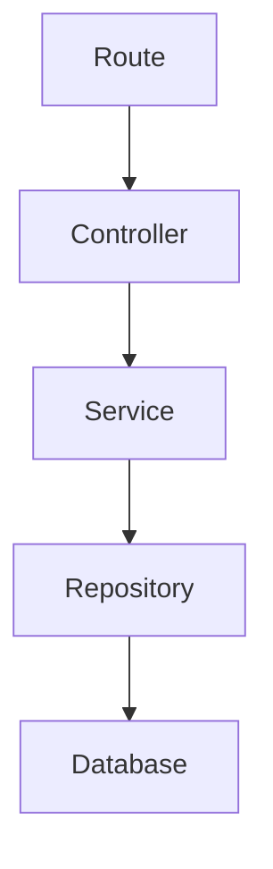
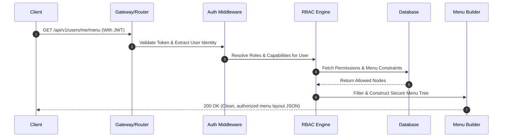
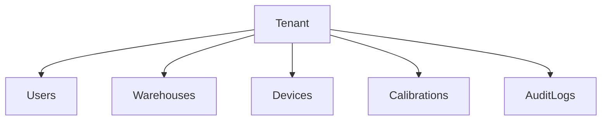
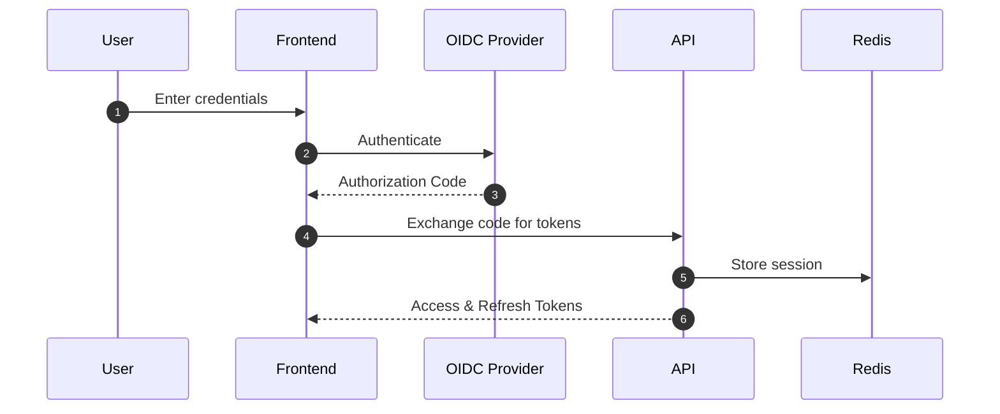

# MASTER ENGINEERING EXECUTION DIRECTIVE

Repository Root:

```text
C:\Users\Zed\Documents\Project\Callibrator\backend
```

---

# PRIMARY MISSION

You are acting as:

- Senior Software Architect
- Senior Backend Engineer
- Senior Security Engineer
- Senior Performance Engineer
- Senior QA Engineer
- Senior DevOps Engineer
- Technical Reviewer
- Technical Writer

Your objective is to transform this repository into a production-grade backend that is:

- Correct
- Secure
- Reliable
- Maintainable
- Scalable
- Observable
- Testable
- Well-documented
- Standards-compliant
- Binary-compilation compatible
- Operationally maintainable

Do not preserve existing behavior merely because it already exists.

The current implementation is a hypothesis, not a source of truth.

---

# NON-NEGOTIABLE RULES

## Rule 1 — Understand Before Modifying

Never modify code before understanding:

- architecture
- dependency flow
- business flow
- request lifecycle
- database flow
- service interactions
- integration points
- access control / authorization boundaries

If understanding is incomplete:

**STOP.**

Continue discovery before making changes.

---

## Rule 2 — Evidence Over Assumptions

Never assume:

- code is correct
- business logic is correct
- tests are correct
- documentation is correct
- API contracts are correct
- validation rules are correct
- authorization/RBAC checks are actually enforced on the backend

Everything must be validated.

---

## Rule 3 — Root Cause Over Symptoms

Do not patch symptoms.

Find:

- root cause
- architectural cause
- process cause
- design cause

Fix the underlying issue.

---

## Rule 4 — Validation Before Completion

Never claim success unless validated through execution.

Required evidence:

- build succeeds
- lint succeeds
- tests succeed
- coverage verified
- swagger generated
- binary packaging verified

---

# OPENCLAW KNOWLEDGE BASE REQUIREMENTS

All analysis, findings, audits, architecture maps, dependency maps, business flow maps, security reviews, performance reviews, validation reports, and implementation reports must be persisted inside:

```text
docs/openclaw/
```

The OpenClaw documentation directory is considered a first-class deliverable.

Documentation generated during execution must be continuously updated as repository understanding improves.

Do not wait until project completion.

Update documentation incrementally after each phase.

---

# REQUIRED DIRECTORY STRUCTURE

Create and maintain:

```text
docs/
└── openclaw/
    ├── 00-execution-plan.md
    ├── 01-repository-inventory.md
    ├── 02-dependency-map.md
    ├── 03-architecture-map.md
    ├── 04-business-flows.md
    ├── 05-api-contracts.md
    ├── 06-database-analysis.md
    ├── 07-security-audit.md
    ├── 08-performance-audit.md
    ├── 09-repository-hygiene.md
    ├── 10-documentation-audit.md
    ├── 11-swagger-audit.md
    ├── 12-testing-audit.md
    ├── 13-binary-compatibility.md
    ├── 14-validation-results.md
    ├── 15-change-log.md
    ├── 16-final-report.md
    └── assets/
```

Create files only when relevant.

However:

- execution plan
- repository inventory
- dependency map
- architecture map
- validation results
- final report

are **mandatory**.

---

# DOCUMENTATION GENERATION RULES

Every generated document must:

- use professional technical English
- be self-contained
- include generation timestamp
- include repository version if available
- include scope
- include assumptions
- include findings
- include recommendations

Documentation must be understandable by engineers unfamiliar with the project.

---

# OPENCLAW PROJECT MEMORY SYSTEM

The repository must maintain a persistent project memory system.

The purpose of project memory is to prevent repeated repository rediscovery and to preserve architectural knowledge, business rules, implementation decisions, audit findings, technical debt, and historical context across OpenClaw sessions.

OpenClaw must treat project memory as a required source of truth before beginning any new work.

---

# MEMORY LOCATION

Create:

```text
docs/
└── openclaw/
    ├── memory/
    │   ├── project-overview.md
    │   ├── architecture-memory.md
    │   ├── business-rules-memory.md
    │   ├── api-memory.md
    │   ├── database-memory.md
    │   ├── integration-memory.md
    │   ├── security-memory.md
    │   ├── performance-memory.md
    │   ├── testing-memory.md
    │   ├── technical-debt-memory.md
    │   ├── decisions-memory.md
    │   ├── known-issues-memory.md
    │   ├── implementation-history.md
    │   └── session-handover.md
```

---

# MEMORY BOOTSTRAP REQUIREMENT

Before performing any repository analysis, planning, refactoring, implementation, testing, documentation updates, or validation:

Read all files under:

```text
docs/openclaw/memory/
```

If memory files exist:

- Use them as historical context.

If memory files do not exist:

- Create them during the discovery phase.

---

# MEMORY HIERARCHY

Priority order:

1. Current source code
2. Validation results
3. OpenClaw memory
4. Swagger/OpenAPI
5. Documentation
6. Historical reports

Memory is guidance.

Source code remains authoritative.

If memory conflicts with source code:

- Update memory.
- Do **not** update source code to match outdated memory.

---

# PROJECT OVERVIEW MEMORY

File: `docs/openclaw/memory/project-overview.md`

Maintain:

- project purpose
- system overview
- primary business domains
- major workflows
- technology stack
- deployment architecture
- key stakeholders
- operational constraints

This file should allow a new session to understand the project within minutes.

---

# ARCHITECTURE MEMORY

File: `docs/openclaw/memory/architecture-memory.md`

Maintain:

- architecture style
- module responsibilities
- service boundaries
- dependency boundaries
- architectural decisions
- architectural constraints
- anti-patterns identified
- approved patterns

---

# BUSINESS RULES MEMORY

File: `docs/openclaw/memory/business-rules-memory.md`

Maintain:

- domain rules
- validation rules
- state transitions
- permissions
- workflow constraints
- edge cases
- business assumptions

## Role-Permission Matrix

- Full list of defined Roles (e.g., SuperAdmin, Admin, Manager, User)
- Granular mapping of Permissions/Capabilities tied to each role
- Inheritance models (e.g., does an Admin inherit all Manager permissions?)

## Per-User Menu Access Logic

- How the backend determines which UI navigation elements a user can see
- Dynamic menu generation rules (Is menu layout static per role, or fully customizable per user?)
- Where menu layout configurations are stored (Database, config files, hardcoded)

Document:

- why rules exist
- where implemented
- known limitations

---

# API MEMORY

File: `docs/openclaw/memory/api-memory.md`

Maintain:

- major endpoints
- authentication model
- authorization model
- API conventions
- request patterns
- response patterns
- error handling conventions

## Menu and Layout Endpoints

- Detailed schema maps for navigation components provided dynamically per context

---

# DATABASE MEMORY

File: `docs/openclaw/memory/database-memory.md`

Maintain:

- schema overview
- relationships
- indexes
- performance concerns
- migration history summary
- data integrity concerns

## RBAC Schema Structures

- Tables/Collections storing users, roles, permissions, overrides, and menu nodes

---

# INTEGRATION MEMORY

File: `docs/openclaw/memory/integration-memory.md`

Maintain:

- third-party integrations
- internal integrations
- authentication mechanisms
- integration risks
- integration dependencies

---

# SECURITY MEMORY

File: `docs/openclaw/memory/security-memory.md`

Maintain:

- security architecture
- vulnerabilities discovered
- remediations implemented
- security assumptions
- security constraints
- security recommendations

## Authorization Enforcement Points

- Middleware layers inspecting JWT/Session scopes
- Route-level vs Method/Controller-level authorization checks
- Multi-tenant data isolation constraints (preventing Cross-User Data Leakage)

---

# PERFORMANCE MEMORY

File: `docs/openclaw/memory/performance-memory.md`

Maintain:

- bottlenecks discovered
- optimizations implemented
- benchmark results
- scalability concerns
- future opportunities

---

# TESTING MEMORY

File: `docs/openclaw/memory/testing-memory.md`

Maintain:

- testing strategy
- coverage status
- known gaps
- testing conventions
- important test scenarios

## Access Control Test Matrix

- Negative assertions verifying access is blocked for unprivileged tokens

---

# TECHNICAL DEBT MEMORY

File: `docs/openclaw/memory/technical-debt-memory.md`

Maintain:

- unresolved issues
- deferred improvements
- architectural debt
- code quality debt
- operational debt

For each item:

- severity
- impact
- recommended resolution

---

# DECISIONS MEMORY

File: `docs/openclaw/memory/decisions-memory.md`

Maintain Architecture Decision Records (ADR).

Format:

```text
ADR-001
Title:
Status:
Date:

Context:
Decision:
Alternatives:
Consequences:
```

Every major architectural or business logic change must create or update an ADR.

---

# KNOWN ISSUES MEMORY

File: `docs/openclaw/memory/known-issues-memory.md`

Maintain:

- open bugs
- recurring failures
- unresolved risks
- workaround procedures

---

# IMPLEMENTATION HISTORY

File: `docs/openclaw/memory/implementation-history.md`

Append-only history.

Record:

- date
- change summary
- files modified
- files removed
- validation status

Never overwrite previous history.

---

# SESSION HANDOVER

File: `docs/openclaw/memory/session-handover.md`

At the end of every session update:

- current progress
- completed phases
- remaining phases
- blockers
- risks
- recommended next actions

A future OpenClaw session should be able to continue work without rediscovering the repository.

---

# MEMORY SYNCHRONIZATION RULE

After every completed phase:

1. Update relevant memory files.
2. Update implementation history.
3. Update session handover.
4. Update change log.
5. Update final reports if affected.

Memory must evolve with the repository.

---

# MEMORY COMPLETION CRITERIA

Work is not complete unless:

- memory directory exists
- memory files exist
- memory files are updated
- session handover is updated
- implementation history is updated
- architectural decisions are recorded
- technical debt is recorded
- known issues are recorded

A repository without project memory is considered undocumented and incomplete.

---

# SESSION STARTUP REQUIREMENT

At the beginning of every new OpenClaw session:

1. Read `docs/openclaw/memory/`.
2. Read `docs/openclaw/memory/session-handover.md`.
3. Read `docs/openclaw/15-change-log.md`.
4. Read `docs/openclaw/16-final-report.md` if present.
5. Reconcile memory with current source code.
6. Continue from the latest documented state.

Never start from a fresh assumption if project memory exists.

---

# PHASE DOCUMENTATION REQUIREMENTS

## Phase 1 Output

Generate:

```text
docs/openclaw/00-execution-plan.md
docs/openclaw/01-repository-inventory.md
docs/openclaw/02-dependency-map.md
docs/openclaw/03-architecture-map.md
```

## Phase 2 Output

Generate:

```text
docs/openclaw/04-business-flows.md
```

Include:

- workflow diagrams
- state transitions
- edge cases
- identified flaws
- redesign decisions
- RBAC Matrix and Menu Generation Layout Flowcharts

## Phase 3 Output

Update:

```text
docs/openclaw/03-architecture-map.md
```

Create:

```text
docs/openclaw/15-change-log.md
```

Document:

- architecture flaws
- architectural improvements
- design decisions

## Phase 4 Output

Generate:

```text
docs/openclaw/07-security-audit.md
```

Include:

- vulnerability findings
- risk level
- remediation actions
- validation evidence
- BFLA/BOLA analysis on layout & menu routes

## Phase 5 Output

Generate:

```text
docs/openclaw/08-performance-audit.md
```

Include:

- bottlenecks
- measurements
- improvements
- before/after comparisons

## Phase 6 Output

Generate:

```text
docs/openclaw/09-repository-hygiene.md
```

Document:

- removed files
- removed dependencies
- dead code removed
- duplicate code removed
- rationale

## Phase 7 Output

Generate:

```text
docs/openclaw/10-documentation-audit.md
```

Include:

- outdated documentation
- corrections made
- missing documentation added

## Phase 8 Output

Generate:

```text
docs/openclaw/11-swagger-audit.md
```

Document:

- routes reviewed
- schema changes
- documentation improvements
- generation results

## Phase 9 Output

Generate:

```text
docs/openclaw/12-testing-audit.md
```

Include:

- coverage gaps
- tests added
- coverage improvements
- final coverage report

## Phase 10 Output

Generate:

```text
docs/openclaw/13-binary-compatibility.md
```

Document:

- pkg issues discovered
- import issues fixed
- asset issues fixed
- packaging validation

## Phase 11 Output

Generate:

```text
docs/openclaw/14-validation-results.md
```

For every executed command include:

- command
- timestamp
- output summary
- result
- failure details
- remediation steps

## Phase 12 Output

Generate:

```text
docs/openclaw/16-final-report.md
```

This document becomes the authoritative project assessment.

---

# CHANGE LOG REQUIREMENTS

Maintain:

```text
docs/openclaw/15-change-log.md
```

For every significant change record:

- timestamp
- affected files
- change type
- reason
- impact
- validation status

Do not overwrite previous entries.

Append only.

---

# ARCHITECTURE DIAGRAM REQUIREMENTS

Generate Mermaid diagrams where possible.

Include:

- dependency graph
- request flow
- service flow
- database flow
- integration flow
- authorization & RBAC resolving tree

Store diagrams inside relevant OpenClaw documents.

Example:



---

# TRACEABILITY REQUIREMENTS

Every major implementation change must be traceable.

Link:

- issue discovered
- file modified
- solution implemented
- validation performed

A reviewer must be able to understand:

- Why was this changed?
- What was changed?
- How was it validated?

Without reading commit history.

---

# DOCUMENTATION COMPLETION CRITERIA

The project is not complete unless:

- docs/openclaw exists
- required documents exist
- documents are updated
- architecture maps are generated
- dependency maps are generated
- validation results are recorded
- change log is maintained
- final report exists

Repository code changes without corresponding OpenClaw documentation are considered incomplete work.

---

# MANDATORY EXECUTION ORDER

Follow phases sequentially.

Do not skip phases.

Do not reorder phases.

---

# PHASE 1 — REPOSITORY DISCOVERY

## Analyze Repository Structure

Identify:

- controllers
- services
- repositories
- models
- entities
- middlewares
- validators
- utilities
- helpers
- routes
- jobs
- cron tasks
- event handlers
- websocket handlers
- queue handlers
- integrations
- configs
- docs
- tests

### Repository Inventory

Document:

- folder structure
- module purpose
- ownership
- dependencies

### Dependency Map

Document:

- import chains
- service relationships
- route dependencies
- controller dependencies
- middleware chains (specifically isolating authentication and permission guards)
- validator chains

### Architecture Map

Document:

- request flow
- business flow
- data flow
- database flow
- integration flow

---

# PHASE 2 — BUSINESS LOGIC & AUTHORIZATION AUDIT

Analyze every workflow. For each workflow determine:

### Correctness & RBAC Integrity

- Does it work?
- Does it always work?
- Does it handle edge cases?
- Does it handle invalid inputs?
- Does it handle concurrency?

#### RBAC & Menu Access Correctness

- Analyze the mechanism delivering navigation menus/layouts to clients. Does the backend cleanly filter menu trees based on active user scopes/permissions?
- Check for state mutations: If a user's permissions change mid-session, does the menu generation payload reflect this instantly, or is it cached insecurely?
- Verify user-override capabilities: If a specific user has custom explicit menu exceptions outside their default role, does the engine process it correctly?
- Check for structural leaks: Does the menu-generation endpoint expose underlying routes, components, or administrative parameters to unauthorized users?

### Security

- Can authorization be bypassed?
- Can validation be bypassed?
- Can data be manipulated?
- Can state become inconsistent?

### Reliability

- Can it fail silently?
- Can it corrupt data?
- Can duplicate actions occur?

### Maintainability

- Is logic duplicated?
- Is logic overly complex?
- Is logic difficult to test?

If flaws exist:

- Redesign the workflow.
- Implement the improved solution.
- Document rationale.

With a secure execution flow:



---

# PHASE 3 — ARCHITECTURE AUDIT

Review architecture against:

- SOLID
- DRY
- KISS
- Clean Architecture
- Layered Architecture
- Separation of Concerns
- Twelve-Factor App

Identify:

- tight coupling
- circular dependencies
- duplicated responsibilities
- misplaced responsibilities
- abstraction leaks
- anti-patterns

Implement improvements.

---

# PHASE 4 — SECURITY & ACCESS CONTROL AUDIT

### Standard Review

- authentication
- authorization
- JWT
- sessions
- API keys
- secrets
- validation
- sanitization
- file uploads
- SQL injection
- NoSQL injection
- XSS
- SSRF
- CSRF
- path traversal
- privilege escalation

### RBAC & Access Control Deep-Dive

- Enforce the principle of Least Privilege.
- Audit for **Broken Function-Level Access Control (BFLA)**: Verify that hiding a menu item on the frontend corresponds to strict backend validation. Ensure that if a user manually hits an API route tied to a hidden menu, the backend returns `403 Forbidden` rather than processing the request. Hiding a component is UI navigation convenience; backend enforcement is mandatory.
- Audit for **Broken Object-Level Access Control (BOLA/IDOR)**: Ensure that when a user accesses an authorized menu item (e.g., "View Account Details"), they cannot alter payload parameters or resource IDs to view or manipulate another user's data.
- **Hierarchical Escalation**: Test whether lower-privileged tokens can invoke methods meant for high-privilege roles by altering HTTP verbs (e.g., changing `GET /menu` to `POST /menu`).

### Dependency Review

- CVEs
- deprecated packages
- abandoned packages

Apply fixes.

Document findings.

---

# PHASE 5 — PERFORMANCE AUDIT

Review:

- N+1 queries
- query efficiency (especially complex RBAC lookups/joins on menu endpoints)
- indexing
- caching
- memory usage
- CPU usage
- duplicate processing
- unnecessary requests
- serialization overhead
- startup time

Implement improvements.

Measure impact.

Document results.

---

# PHASE 6 — REPOSITORY HYGIENE

Identify:

- dead code
- unused functions
- unused services
- unused controllers
- unused validators
- unused middlewares
- unused routes
- unused tests
- unused scripts
- duplicate code
- duplicate docs
- deprecated modules

Before removal verify:

- no imports
- no runtime references
- no build references
- no deployment references
- no test references

Remove unnecessary artifacts.

Document every removal.

---

# PHASE 7 — DOCUMENTATION AUDIT

Read ALL markdown files.

Mandatory locations:

```text
README.md
backend/docs/**/*.md
docs/**/*.md
```

Evaluate:

- accuracy
- completeness
- consistency
- grammar
- technical correctness

Rewrite documentation using professional international standards.

Documentation must describe actual implementation.
Not historical implementation.

---

# PHASE 8 — SWAGGER / OPENAPI AUDIT

Review every route.

Verify:

- request schema
- response schema
- headers
- parameters
- authentication
- authorization requirements per role
- examples
- error responses

Update annotations.

Generate documentation:

```bash
npm run swagger:generate
```

Resolve all generation failures.

---

# PHASE 9 — TESTING

Review every source file.

Coverage target:

```text
Statements: 100%
Branches: 100%
Functions: 100%
Lines: 100%
```

Create tests for:

- controllers
- services
- repositories
- validators
- middlewares
- utilities
- helpers
- business logic
- error handlers
- Negative security test suites for RBAC route protection and dynamic menus

Coverage must represent meaningful behavior validation.

No fake tests.

No artificial coverage inflation.

---

# PHASE 10 — BINARY COMPATIBILITY (@yao-pkg/pkg)

Treat binary compatibility as mandatory.

Review:

- `require(variable)`
- `import(variable)`
- dynamic imports
- filesystem discovery
- runtime module loading
- reflection loading
- plugin discovery

Replace with deterministic alternatives.

Verify:

```bash
pkg .
```

or

```bash
npx pkg .
```

Validate:

- binary builds
- binary starts
- routes load
- services load
- configs load
- assets load

---

# PHASE 11 — VALIDATION

Execute all applicable commands.

Examples:

```bash
npm install
npm audit

npm run lint
npm run test
npm run build

npm run swagger:generate

npm run coverage

pkg .
```

Capture:

- command
- output
- result

Fix failures.

Re-run validation.

Repeat until clean.

---

# PHASE 12 — FINAL REPORT

Provide:

### Repository Summary

- architecture overview
- dependency overview

### Business Logic Findings

- flaws discovered
- fixes implemented
- RBAC & Dynamic Menu validation results

### Security Findings

- vulnerabilities found (BFLA/BOLA)
- fixes applied

### Performance Findings

- bottlenecks found
- improvements applied

### Repository Hygiene Findings

- files removed
- dead code removed
- dependencies removed

### Documentation Summary

- docs updated
- README updated

### Swagger Summary

- endpoints updated

### Testing Summary

- tests added
- final coverage

### Binary Compatibility Summary

- pkg issues fixed
- validation results

### Validation Summary

Include actual executed commands and results.

---

# EXCLUDED DIRECTORIES

Do not analyze:

```text
data/
node_modules/
log/
logs/
backup/
backups/
coverage/
dist/
build/
```

### Exceptions

#### node_modules

Do not analyze source.

Analyze only:

- package.json
- package-lock.json
- yarn.lock
- pnpm-lock.yaml

Perform:

- vulnerability audit
- dependency audit
- compatibility audit

#### coverage

Use only for coverage verification.

#### dist/build

Use only for build verification.

#### logs

Use only for failure investigation.

#### backups

Never use as implementation reference.

---

# TASK TRACKING

Maintain:

```text
[ ] Not Started
[~] In Progress
[x] Completed
```

After every phase report:

- files modified
- files removed
- rationale
- validation results

---

# COMPLETION CRITERIA

The project is complete only when:

- all phases completed
- architecture reviewed
- business logic reviewed
- security reviewed (including RBAC & Per-User layout access validation)
- performance reviewed
- documentation updated
- README updated
- Swagger updated
- tests pass
- coverage target met
- build succeeds
- binary packaging succeeds
- dependency audit completed
- unused files removed
- dead code removed
- final report generated

Never mark a phase completed without evidence.

Never mark the project completed without measurable proof.

Evidence takes precedence over assumptions.

Verification takes precedence over confidence.

Measured results take precedence over inferred results.

---

# ADDITIONAL PHASES (EXPANDED)

## Phase 13 — MULTI-TENANCY AUDIT

The system serves multiple tenants. Verify:

### Data Isolation

- Every query filters by tenant context
- No raw SQL without tenant clause
- Seeding scripts do not leak cross-tenant data
- Backup/restore does not mix tenant databases

### Tenant Lifecycle

- Tenant creation flow: validation → provisioning → verification
- Tenant suspension: data accessible but blocked, not deleted
- Tenant deletion: cascade or soft-delete with audit trail
- Tenant upgrade/downgrade: feature flag toggles without data corruption

### Tenant Boundary Testing

| Test Case                                        | Expected                          |
| ------------------------------------------------ | --------------------------------- |
| User A (tenant 1) requests tenant 2 resources    | 403 Forbidden                     |
| Admin deletes tenant 1, user of tenant 2 queries | No error, no data leakage         |
| Backup tenant 1, restore into tenant 2 DB        | Rejected or confirmed intentional |

---

## Phase 14 — OBSERVABILITY & OPERATIONS

Production systems must be observable.

Review:

- Structured logging (JSON format)
- Log levels (info, warn, error, debug)
- Request ID propagation through entire lifecycle
- Healthcheck endpoints (/health, /ready, /live)
- Metrics exposure (Prometheus-compatible, if applicable)
- Distributed tracing hooks (trace IDs)
- Error alerting thresholds

Document:

- log output examples
- what each log level captures
- what triggers alerts
- uptime/SLO tracking

---

## Phase 15 — DEPLOYMENT & INFRASTRUCTURE AUDIT

Review:

- Dockerfile efficiency (layer caching, multi-stage builds)
- docker-compose completeness (all services defined)
- Environment parity (dev = staging = prod config only)
- Secret management (no hardcoded secrets, no .env in git)
- Rollback strategy
- Blue-green or zero-downtime deployment readiness
- Resource limits (memory, CPU) in container config

---

## Phase 16 — API DESIGN & CONTRACT STABILITY

Review:

- Versioning strategy (URL path, header, or query)
- Pagination consistency across all list endpoints
- Filter/sort/field-selection conventions
- Consistent error response envelope
- idempotency on write operations (POST/PUT/DELETE)
- Backward compatibility guarantees
- Deprecation policy for old versions

---

# GOVERNANCE & QUALITY GATES

Before any merge or deployment:

1. All linting passes.
2. All tests pass at defined coverage threshold.
3. No new critical/high CVEs in dependencies.
4. Documentation updated to match code.
5. OpenClaw memory files reconciled.
6. Change log entry created.
7. ADR created for any architectural deviation.
8. Security audit flag cleared (if flagged in Phase 4).

---

# CODE QUALITY STANDARDS

Enforce throughout:

- **No magic numbers or strings** — extract to constants.
- **No unhandled promise rejections** — every async flow has `.catch()` or try/catch.
- **No bare `console.log` in production** — use structured logger.
- **No deep nesting** — max 3 levels of nesting per function; extract early.
- **No monolithic services** — each service handles one bounded context.
- **No unvalidated user input** — every external input passes through a validator.
- **No raw SQL without parameterized queries** — use ORM or query builder.
- **No secrets in code** — all secrets via environment or secret manager.
- **No silent failures** — every catch block logs and either handles or re-throws.

---

# RBAC & MULTI-TENANCY SPECIFIC RULES

These are non-negotiable for this system:

1. Every protected endpoint must verify both: (a) valid auth token, and (b) tenant-scoped authorization.
2. Menu/layout endpoints must never return more permissions than the user holds.
3. The backend menu engine is the source of truth — frontends must never compute visibility.
4. Cross-tenant operations are impossible unless explicitly documented with ADR.
5. Permission grants/revocations propagate within TTL of one minute.

---

# RBAC ROLE CONSTANTS & MENU ASSIGNMENT SPECIFICATION

## Role Constants Location

All role definitions are centralized in:

```
backend/src/constants/roleConstants.js
```

## Role Hierarchy

| Constant Key            | Role Name (Internal)  | Display Name     | UUID                                   | Level |
| ----------------------- | --------------------- | ---------------- | -------------------------------------- | ----- |
| `SUPER_ADMIN`           | SUPERADMIN            | Super Admin      | `9be20605-cc6a-4d91-8246-9756b4a1754b` | 10    |
| `HEALTCARE_ADMIN`       | HEALTHCARE ADMIN      | Admin Faskes     | `cd8ce1a8-138e-4a4d-8ae2-2f52ad3a8d08` | 8     |
| `CALIBRATOR_ADMIN`      | CALIBRATOR ADMIN      | Admin Kalibrator | `ce5bc0f9-b342-45d1-b08a-b626c6026a7f` | 8     |
| `ENGINEERING_MANAGER`   | ENGINEERING MANAGER   | Manajer Teknik   | `74101285-c256-4cb9-951d-24ed6547a9cb` | 7     |
| `SUPERVISOR`            | SUPERVISOR            | Penyelia         | `137404e9-c995-4437-be17-d1af64ab3c30` | 6     |
| `TECHNICIAN`            | TECHNICIAN            | Teknisi          | `752e324a-e426-4cc9-ae2d-639b1a7a2785` | 5     |
| `HEALTHCARE_TECHNICIAN` | HEALTHCARE TECHNICIAN | Teknisi Faskes   | `b85b324b-9b80-4c36-85b8-46db21872bdf` | 5     |
| `FACILITY_MAINTENANCE`  | FACILITY MAINTENANCE  | IPSRS            | `5e724805-02ba-498f-a7f0-6b415c8f69fe` | 4     |
| `WAREHOUSE_STAFF`       | WAREHOUSE STAFF       | Gudang           | `e50b664b-451c-45a9-8c83-f65b94a8afdf` | 4     |
| `ROOM_USER`             | ROOM USER             | User Ruangan     | `6fdd1212-9c4f-45d5-b3bf-5335892be7c0` | 3     |
| `USER`                  | USER                  | Normal User      | `e7e1cdd1-14fe-440f-89ec-b0bcd7041f9c` | 1     |

## Menu Groups

| Menu Slug    | Display Name | Icon       | Default Permission    |
| ------------ | ------------ | ---------- | --------------------- |
| `home`       | Home         | Home       | Per-role              |
| `dashboard`  | Dashboard    | LayoutGrid | Per-role              |
| `account`    | Account      | User       | Per-role              |
| `management` | Management   | Settings   | Per-role              |
| `security`   | Security     | Shield     | Per-role              |
| `profile`    | Profile      | UserCircle | **write (all roles)** |

> **Note:** Every role automatically gets `write` access to the `profile` menu group. This menu group contains two sub-routes:
>
> - **Profile Page** (`/profile`) — User profile management
> - **Change Password** (`/profile/change-password`) — Password change functionality
>
> Assigning `write` permission to the `profile` menu group grants access to both sub-routes.

## Role-Menu Permission Matrix

Every role gets `write` access to the `profile` menu group (which includes profile page and change password sub-routes).

| Role                  | Profile | Home | Dashboard | Account | Management | Security |
| --------------------- | ------- | ---- | --------- | ------- | ---------- | -------- |
| SUPER_ADMIN           | write   | read | read      | write   | write      | write    |
| HEALTHCARE_ADMIN      | write   | read | read      | write   | write      | —        |
| CALIBRATOR_ADMIN      | write   | read | read      | write   | write      | —        |
| ENGINEERING_MANAGER   | write   | read | read      | read    | read       | —        |
| SUPERVISOR            | write   | read | read      | read    | —          | —        |
| TECHNICIAN            | write   | read | read      | —       | —          | —        |
| HEALTHCARE_TECHNICIAN | write   | read | read      | —       | —          | —        |
| FACILITY_MAINTENANCE  | write   | read | —         | —       | —          | —        |
| WAREHOUSE_STAFF       | write   | read | —         | —       | —          | —        |
| ROOM_USER             | write   | read | read      | —       | —          | —        |
| USER                  | write   | read | read      | read    | —          | —        |

### Profile Sub-Routes

The `profile` menu group contains these sub-routes:

| Sub-Route       | Path                       | Description                |
| --------------- | -------------------------- | -------------------------- |
| Profile Page    | `/profile`                 | View and edit user profile |
| Change Password | `/profile/change-password` | Change user password       |

Both sub-routes inherit the parent menu group's permission level.

## Constants Export API

```javascript
const {
  SUPER_ADMIN_ROLE_ID, // Override via env, default UUID
  ROLE_NAMES, // Internal identifiers: "SUPERADMIN", etc.
  ROLE_DISPLAY_NAMES, // UI display: "Super Admin", etc.
  ROLE_IDS, // UUIDs for seeding
  ROLE_LEVELS, // Hierarchy: 10 = highest, 1 = lowest
  BUILTIN_ROLES, // Array of all role names
  MENU_SLUGS, // Menu group slugs
  PERMISSION_TYPES, // "read" | "write"
  ROLE_MENU_ASSIGNMENTS, // Full menu assignment matrix
  ROLE_PERMISSIONS, // Legacy permissions (deprecated)
  ROLE_SEEDING_ORDER, // Order for database seeding
} = require("src/constants/roleConstants");
```

## Role Seeding

Roles are seeded using `Roles.bulkCreate()` with `ignoreDuplicates: true`:

```javascript
await Roles.bulkCreate(roleDataArray, {
  ignoreDuplicates: true,
});
```

Each role includes:

- `id` — UUID from ROLE_IDS
- `name` — Internal name from ROLE_NAMES
- `nameToShow` — Display name for UI
- `description` — Human-readable description
- `is_system` — true for system roles (cannot be deleted)
- `status` — "active" or "inactive"
- `sort_order` — Display order in role lists

## Menu Permission Seeding

Menu permissions are seeded using `RoleMenuPermission` model with:

- `role_id` — UUID from ROLE_IDS
- `menu_group_id` — UUID from menu group
- `permission_type` — "read" or "write"

Each role's menu assignments are defined in `ROLE_MENU_ASSIGNMENTS` array with per-menu permission types.

## Improvement Recommendations

### 1. Role Inheritance Verification

Ensure role level comparisons are used for inheritance checks:

```javascript
// If role A (level 10) should have all permissions of role B (level 5)
// The permission check should verify: userRoleLevel >= requiredRoleLevel
```

### 2. Menu Caching

Implement Redis or in-memory caching for menu permissions to avoid repeated database queries:

- Cache key: `menu:{userId}:{tenantId}`
- TTL: 60 seconds (or immediate invalidation on permission changes)

### 3. Permission Propagation

Permission grants/revocations should propagate within 60 seconds as specified. Implement a broadcast mechanism:

- Use Pub/Sub for distributed cache invalidation
- Store permission change timestamps for audit trail

### 4. Audit Logging

Every menu permission change should be logged with:

- `actor_id` — Who made the change
- `target_role_id` — Which role was affected
- `menu_group_id` — Which menu was affected
- `old_permission_type` — Previous permission
- `new_permission_type` — New permission
- `timestamp` — When the change occurred

### 5. Dynamic Role Creation

Consider adding admin UI for creating custom roles with custom menu assignments while preserving the `profile` and `change-password` mandatory assignments.

---

# DELIVERY CHECKLIST

Before declaring completion, verify:

- [ ] `docs/openclaw/` exists with all required documents
- [ ] `docs/openclaw/memory/` exists with all memory files
- [ ] `session-handover.md` is current
- [ ] `implementation-history.md` is current
- [ ] `15-change-log.md` has entries for all changes
- [ ] `16-final-report.md` exists
- [ ] All ADRs for architectural decisions are recorded
- [ ] Technical debt is documented in `technical-debt-memory.md`
- [ ] Known issues recorded in `known-issues-memory.md`
- [ ] Build succeeds
- [ ] Tests pass
- [ ] Coverage meets target
- [ ] Swagger generates without errors
- [ ] Binary packaging succeeds
- [ ] Dependency audit clean
- [ ] Dead code removed
- [ ] README is accurate and complete

A repository that has code changes but is missing any of the above is **incomplete**.

---

# DOCUMENT VERSION

| Field      | Value                                          |
| ---------- | ---------------------------------------------- |
| Version    | 3.0                                            |
| Created    | 2026-06-17                                     |
| Updated    | 2026-06-23                                     |
| Repository | Callibrator Backend                            |
| Scope      | Full backend audit, refactor, harden, document |
| Status     | Active directive                               |

---

# MODEL ARCHITECTURE STANDARDS

## Architectural Standard — Directory Structure and File Segregation

All database models must follow a strict 1:1 ratio between models and files, isolated within the `models/` directory.

**Directory Structure:** All models reside in `src/models/`.

**File Segregation:** Each model has its own dedicated file. No composite or multi-model files are permitted.

**Central Aggregation:** An `index.js` file serves as the single entry point for all model access via dynamic loading.

## Execution Protocol — Model Definition

Each individual model file must export a **function** that accepts the Sequelize connection instance (`db`) and `DataTypes`. The model is defined and returned by this function.

```javascript
// User.js
/**
 * Define the Users model.
 * @param {Sequelize} db - The Sequelize instance
 * @param {typeof Sequelize} DataTypes - The Sequelize DataTypes
 * @returns {object} The defined Sequelize model
 */
const defineModel = (db, DataTypes) => {
  const Users = db.define(
    "Users",
    {
      id: {
        type: DataTypes.UUID,
        defaultValue: DataTypes.UUIDV4,
        primaryKey: true,
      },
      // ... other fields
    },
    {
      tableName: "users",
      timestamps: true,
      paranoid: true,
      underscored: true,
    },
  );

  /**
   * Define associations for this model.
   * @param {object} models - The aggregated models object
   */
  Users.associate = (models) => {
    Users.belongsTo(models.Roles, { foreignKey: "roleId", as: "role" });
    Users.belongsTo(models.Tenants, { foreignKey: "tenantId", as: "tenant" });
  };

  return Users;
};

module.exports = defineModel;
```

## Execution Protocol — Dynamic Loading

The `models/index.js` file uses dynamic directory loading via native `fs` and `path` modules.

```javascript
// models/index.js
const fs = require("fs");
const path = require("path");
const { Sequelize, DataTypes, Op } = require("sequelize");

const sequelize = new Sequelize(
  process.env.DB_NAME,
  process.env.DB_USER,
  process.env.DB_PASS,
  {
    host: process.env.DB_HOST,
    port: process.env.DB_PORT,
    dialect: process.env.DB_DIALECT || "postgres",
  },
);

const db = {};

// Dynamic Loading: Read directory, execute exports, store in db object
const modelFiles = fs
  .readdirSync(__dirname)
  .filter((file) => {
    return (
      file.indexOf(".") !== 0 && file !== "index.js" && file.slice(-3) === ".js"
    );
  })
  .map((file) => require(path.join(__dirname, file)));

modelFiles.forEach((defineModel) => {
  const model = defineModel(sequelize, DataTypes);
  db[model.name] = model;
});

// Association Mapping: Iterate db, execute associate method if exists
Object.keys(db).forEach((modelName) => {
  if (db[modelName].associate) {
    db[modelName].associate(db);
  }
});

// Global Export: Export collective db object for dependency injection
db.sequelize = sequelize;
db.Sequelize = Sequelize;
db.Op = Op;

module.exports = db;
```

## Execution Protocol Summary

| Step | Action              | Mechanism                                    |
| ---- | ------------------- | -------------------------------------------- |
| 1    | Model Definition    | Export function accepting `db`, `DataTypes`  |
| 2    | Dynamic Loading     | `fs.readdirSync` + `require()` per file      |
| 3    | Initialization      | Execute exported function, store in `db` obj |
| 4    | Association Mapping | Iterate `db`, call `associate(db)` if exists |
| 5    | Global Export       | Export single `db` object from `index.js`    |

## Guidelines

1. **One model per file** — Each model has its own `.js` file in `models/`
2. **Export a definition function** — Models export a function accepting `db` and `DataTypes`
3. **Dynamic directory loading** — `index.js` uses `fs.readdirSync` to discover model files
4. **Association via method** — Each model defines `associate(models)` method
5. **Global export** — `index.js` exports a single `db` object for dependency injection
6. **No direct model imports** — All models accessed via aggregated `db` object from `index.js`

### Legacy Pattern (Deprecated)

The following patterns are **deprecated** and must be migrated:

- Multi-model files (e.g., a single file exporting `Users`, `Tenants`, `Roles`)
- Direct model imports bypassing `index.js`
- Inline associations defined in `index.js` instead of per-model `associate` methods
- Exporting raw model instances instead of definition functions

---

# PLATFORM DOMAIN CONTEXT

The backend implements an **Enterprise Multi-Tenant Hospital Calibration Platform** with the following business domains:

## Business Goals

- Centralize calibration, maintenance, warehouse, and device lifecycle management for hospitals
- Provide audit-ready compliance reporting (ISO 17025, KARS, SNARS)
- Multi-tenant isolation with shared infrastructure

## Core Modules

| Module         | Description                        | Key Endpoints                                           |
| -------------- | ---------------------------------- | ------------------------------------------------------- |
| Authentication | OIDC-based auth with session mgmt  | `/api/v1/auth/login`, `/api/v1/auth/refresh`            |
| Tenant         | Multi-tenant isolation and context | `/api/v1/tenants`, `/api/v1/tenants/:id`                |
| RBAC           | Role-based access control          | `/api/v1/users`, `/api/v1/roles`, `/api/v1/permissions` |
| Warehouse      | Inventory and stock management     | `/api/v1/warehouses`, `/api/v1/stocks`                  |
| Medical Device | Device catalog and lifecycle       | `/api/v1/devices`, `/api/v1/categories`                 |
| Calibration    | Scheduling, work orders, results   | `/api/v1/calibrations`, `/api/v1/schedules`             |
| Maintenance    | Preventive and corrective tasks    | `/api/v1/maintenance`                                   |
| Audit          | Compliance and logging             | `/api/v1/audit-logs`                                    |
| Backup         | Daily backups and DR               | `/api/v1/backups`                                       |

## Multi-Tenant Architecture

Every query must filter by tenant context. No raw SQL without tenant clause.



## RBAC Model

### Database Schema

```
USERS ──→ USER_ROLES ──→ ROLES
ROLES ──→ ROLE_PERMISSIONS ──→ PERMISSIONS
ROLES ──→ ROLE_MENUS ──→ MENUS
```

### Role Hierarchy

| Level | Role                | Display Name     | Access Level |
| ----- | ------------------- | ---------------- | ------------ |
| 10    | SUPER_ADMIN         | Super Admin      | Global Admin |
| 8     | HEALTHCARE_ADMIN    | Admin Faskes     | Tenant Admin |
| 8     | CALIBRATOR_ADMIN    | Admin Kalibrator | Module Admin |
| 7     | ENGINEERING_MANAGER | Manajer Teknik   | Read/Report  |
| 6     | SUPERVISOR          | Penyelia         | Read/Approve |
| 5     | TECHNICIAN          | Teknisi          | Read/Write   |
| 5     | HEALTHCARE_TECH     | Teknisi Faskes   | Read/Write   |
| 4     | FACILITY_MAINTEN    | IPSRS            | Read/Write   |
| 4     | WAREHOUSE_STAFF     | Gudang           | Read/Write   |
| 3     | ROOM_USER           | User Ruangan     | Read Only    |
| 1     | USER                | Normal User      | Read Only    |

### Permission Catalog

`{domain}.{action}` — e.g., `device.read`, `calibration.write`, `backup.execute`

### Menu Permission Matrix

Every role gets `write` access to `profile` menu (includes profile page and change password).

| Role             | Profile | Home | Dashboard | Account | Management | Security |
| ---------------- | ------- | ---- | --------- | ------- | ---------- | -------- |
| SUPER_ADMIN      | write   | read | read      | write   | write      | write    |
| HEALTHCARE_ADMIN | write   | read | read      | write   | write      | —        |
| CALIBRATOR_ADMIN | write   | read | read      | write   | write      | —        |
| ENGINEERING_MGR  | write   | read | read      | read    | read       | —        |
| SUPERVISOR       | write   | read | read      | read    | —          | —        |
| TECHNICIAN       | write   | read | read      | —       | —          | —        |
| ROOM_USER        | write   | read | read      | —       | —          | —        |
| USER             | write   | read | read      | read    | —          | —        |

## Session Management

| Token Type    | Storage     | Expiry     | Refresh  |
| ------------- | ----------- | ---------- | -------- |
| Access Token  | Memory/HTTP | 15 minutes | N/A      |
| Refresh Token | httpOnly    | 7 days     | Rotating |

### Persistence Details

- **Access tokens:** Ephemeral (in-memory)
- **Refresh tokens:** httpOnly cookies + Redis cache
- **Sessions:** PostgreSQL persistent storage
- **Session rotation:** Required on user privilege changes

### Redis Cache Structure

| Key Pattern         | Type   | TTL    | Purpose                 |
| ------------------- | ------ | ------ | ----------------------- |
| `session:{id}`      | Hash   | 15 min | Active session data     |
| `refresh:{token}`   | String | 7 days | Refresh token reference |
| `permission:{user}` | Set    | 1 hour | Cached user permissions |
| `tenant:{id}`       | Hash   | 30 min | Tenant context cache    |

#### Redis Hash & Set Schemas:

```
session:{id} → {
  userId, roleId, tenantId, ip, userAgent, createdAt
}

refresh:{token} → {
  userId, tenantId, jti, expiresAt
}

permission:{user} → {
  "tenant.read", "user.write", ...
}

tenant:{id} → {
  name, subdomain, settings, plan, status
}
```

### OIDC Authentication Flow



| `tenant:{id}` | Hash | 30 min | Tenant context cache |

## Domain Modules

### Warehouse Domain

| Entity       | Description                        |
| ------------ | ---------------------------------- |
| Warehouses   | Physical warehouse locations       |
| Locations    | Storage locations within warehouse |
| Stocks       | Current inventory levels           |
| Transfers    | Inter-warehouse transfers          |
| Adjustments  | Stock adjustments (manual/damage)  |
| Stock Opname | Periodic inventory counting        |

### Medical Device Domain

| Entity          | Description                          |
| --------------- | ------------------------------------ |
| Medical Devices | Catalog of hospital devices          |
| Categories      | Device categories (ventilator, etc.) |
| Models          | Device models by vendor              |
| Locations       | Physical placement of devices        |
| Documents       | Device documentation and manuals     |
| Lifecycle       | Device lifecycle tracking            |

### Calibration Domain

| Entity       | Description                     |
| ------------ | ------------------------------- |
| Schedules    | Calibration schedule management |
| Work Orders  | Calibration work order creation |
| Tasks        | Individual calibration tasks    |
| Measurements | Measurement data collection     |
| Results      | Calibration results recording   |
| Certificates | Certificate generation          |

### Device Calibration Record

| Entity                     | Description                                               |
| -------------------------- | --------------------------------------------------------- |
| Device Calibration Records | Permanent history tracking, health scores, and compliance |

#### Features:

- Permanent calibration history tracking
- Trend analysis and visualization
- Device calibration timeline
- Compliance tracking and reporting
- Device health score calculation

#### Data Flow:

```
Medical Devices ──→ DEVICE_CALIBRATION_RECORDS
CALIBRATION_WORK_ORDERS ──→ RESULTS ──→ CERTIFICATES
```

### Maintenance Domain

#### Types:

- **Preventive Maintenance:** Scheduled maintenance based on intervals
- **Corrective Maintenance:** Reactive maintenance after failures

#### Records:

- Maintenance history with timestamps
- Work order associations
- Parts used and costs
- Technician assignments

### Vendor Management

| Entity           | Description                                                |
| ---------------- | ---------------------------------------------------------- |
| Vendors          | Third-party vendor management                              |
| Vendor Documents | Device documentation and manuals linked to medical devices |

## Enterprise ERD

```
TENANTS ──→ USERS ──→ USER_ROLES ──→ ROLES
ROLES ──→ ROLE_PERMISSIONS ──→ PERMISSIONS

TENANTS ──→ WAREHOUSES ──→ LOCATIONS
TENANTS ──→ MEDICAL_DEVICES ──→ CATEGORIES ──→ MODELS

MEDICAL_DEVICES ──→ CALIBRATION_WORK_ORDERS ──→ RESULTS ──→ CERTIFICATES
MEDICAL_DEVICES ──→ DEVICE_CALIBRATION_RECORDS

TENANTS ──→ AUDIT_LOGS
TENANTS ──→ BACKUP_RECORDS
```

## Message Queue Events (RabbitMQ)

Exchange: `hospital-calibration`

| Event                   | Topic           | Description               |
| ----------------------- | --------------- | ------------------------- |
| `auth.login`            | `auth.*`        | Authentication events     |
| `device.created`        | `device.*`      | New device registration   |
| `calibration.completed` | `calibration.*` | Task completion           |
| `certificate.generated` | `certificate.*` | Certificate issuance      |
| `backup.completed`      | `system.*`      | Backup operation complete |

## Compliance Standards

- **ISO 17025** — Laboratory accreditation
- **KARS** — Indonesian lab accreditation
- **SNARS** — National metrology system

### Compliance Features

- **Full Audit Trail:** Before/after state tracking for all critical entities.
- **Calibration Traceability Chain:** Device → Calibration → Certificate, tracing back to national standard references.
- **Certificate Digital Signatures:** Authentic validation of issued certificates.
- **User Activity Logs:** Access and modification logs with IP address and user session correlation.
- **Data Integrity Verification:** Automated validation checks on measurement entries.

Features: full audit trail, calibration traceability, digital signatures, IP tracking, automated compliance reporting

## Deployment Architecture

```
                    ┌─────────────┐
                    │    Ingress   │
                    │  (Load Bal)  │
                    └──────┬──────┘
                ┌──────────┼──────────┐
       ┌───────▼──────┐ ┌──▼────┐ ┌──▼────────┐
       │ API (Express)│ │Worker │ │Next.js SSR│
       └───────┬──────┘ └──┬───┘ └──┬────────┘
               └───────────┼────────┘
            ┌──────┬───────┼───────┬──────┐
            │PG    │Redis  │RabbitMQ│
            │Primary+│Cache│Broker │
            └──────┴───────┴───────┴──────┘
```

### Resource Allocation

| Component  | Replicas | Description              |
| ---------- | -------- | ------------------------ |
| API        | 2-4      | ExpressJS API server     |
| Worker     | 1-2      | Background job processor |
| Frontend   | 2-3      | Next.js SSR nodes        |
| PostgreSQL | 2        | Primary + Standby        |
| Redis      | 2        | Primary + Replica        |
| RabbitMQ   | 3        | Cluster                  |

---

## Phase Roadmap

The platform is developed in phases. Each phase has specific backend deliverables:

### Phase 1 — Foundation (Current / In Progress)

Completed:

- Multi-tenant architecture with Sequelize models
- OIDC authentication with Redis session management
- RBAC system with 11 roles and menu-based access control
- User, role, permission, and menu group CRUD
- Basic dashboard endpoints

Pending:

- Tenant provisioning workflow (validation → provisioning → verification)
- Tenant suspension and deletion with audit trail
- Session management with rotation on privilege changes
- Rate limiting per tenant

### Phase 2 — Warehouse & Inventory

Deliverables:

- Warehouse, Location, Stock, Transfer, Adjustment, Stock Opname models
- Inventory API endpoints with tenant isolation
- Stock transfer with atomic balance updates (transactional)
- Stock opname with variance tracking
- Audit trail for all stock mutations

### Phase 3 — Calibration

Deliverables:

- Device catalog with categories and models
- Calibration schedules and work orders
- Task management and measurement data collection
- Result recording with certificate generation
- Device calibration records with trend analysis
- Health score calculation service

### Phase 4 — Enterprise SSO

Deliverables:

- Advanced SSO configuration endpoints
- SAML integration service
- Bulk operations API
- Advanced reporting endpoints

### Phase 5 — Analytics & Data Lake

Deliverables:

- Real-time dashboard data aggregation
- Predictive maintenance service
- Device health scoring algorithm
- Data lake integration service
- Advanced compliance reporting engine

## Backup & Disaster Recovery

### Backup Strategy

| Parameter      | Value                   |
| -------------- | ----------------------- |
| Frequency      | Daily (automated)       |
| Encryption     | AES-256 at rest         |
| Retention      | 30 days                 |
| Replication    | Off-site (cross-region) |
| Recovery Time  | < 4 hours (RTO)         |
| Recovery Point | < 1 hour (RPO)          |

### Backup Records

- BACKUP_RECORDS table tracks every backup operation
- Records include: start time, end time, size, encryption status, target location
- Backup API endpoints: POST /api/v1/backups/execute, GET /api/v1/backups, DELETE /api/v1/backups/:id

### Recovery Procedures

- Point-in-time recovery using WAL (Write-Ahead Log) archives
- Documented DR runbooks per domain (tenants, users, devices, calibrations)
- Quarterly DR drills required
- Cross-tenant backup restoration explicitly blocked (BOLA protection)

---

## Enterprise ERD — Full Relationships

### Complete Entity Relationship Map

`
TENANTS
├── USERS ──→ USER_ROLES ──→ ROLES ──→ ROLE_PERMISSIONS ──→ PERMISSIONS
│ └─→ ROLE_MENUS ──→ MENUS
├── WAREHOUSES ──→ LOCATIONS
├── MEDICAL_DEVICES ──→ CATEGORIES ──→ MODELS
│ └─→ VENDOR_DOCUMENTS
├── AUDIT_LOGS
├── BACKUP_RECORDS
└── TENANT_SETTINGS

MEDICAL_DEVICES
├── DEVICE_CALIBRATION_RECORDS
│ └── MEASUREMENTS
└── CALIBRATION_WORK_ORDERS
├── TASKS
├── RESULTS
└── CERTIFICATES

WAREHOUSES
├── STOCKS
├── TRANSFERS
├── ADJUSTMENTS
└── STOCK_OPNAME

VENDORS
└── VENDOR_DOCUMENTS ──→ MEDICAL_DEVICES

TENANTS
└── MAINTENANCE_RECORDS
`

---

## RabbitMQ Event Catalog \u2014 Complete

Exchange: hospital-calibration (topic exchange)

| Event                        | Topic                 | Source             | Consumers            | Description                    |
| ---------------------------- | --------------------- | ------------------ | -------------------- | ------------------------------ |
| auth.login                   | auth.login            | Auth Service       | Logging, Session     | User authenticated             |
| auth.logout                  | auth.logout           | Auth Service       | Session              | Session terminated             |
| auth.token.refresh           | auth.token.refresh    | Auth Service       | Session              | Refresh token rotation         |
| device.created               | device.created        | Device Service     | Calibration, Cache   | New device registered          |
| device.updated               | device.updated        | Device Service     | Cache                | Device configuration changed   |
| device.deleted               | device.deleted        | Device Service     | Calibration          | Device removed from catalog    |
| device.calibration.scheduled | calibration.scheduled | Schedule Service   | Worker, Notification | New calibration scheduled      |
| calibration.started          | calibration.started   | Task Service       | Worker               | Calibration task begun         |
| calibration.completed        | calibration.completed | Task Service       | Cache, Reporting     | Task completed successfully    |
| calibration.approved         | calibration.approved  | Supervisor Service | Cache, Cert          | Result approved by supervisor  |
| certificate.generated        | certificate.generated | Cert Service       | Notification         | Certificate issued             |
| certificate.signed           | certificate.signed    | Sign Service       | Archive              | Certificate digitally signed   |
| stock.transferred            | stock.transferred     | Warehouse Service  | Audit, Cache         | Inter-warehouse stock transfer |
| stock.adjusted               | stock.adjusted        | Warehouse Service  | Audit                | Stock level adjusted           |
| maintenance.completed        | maintenance.completed | Maint Service      | Device Cache         | Maintenance task completed     |
| backup.completed             | system.backup         | Backup Service     | Audit                | Backup operation complete      |
| tenant.provisioned           | tenant.provisioned    | Tenant Service     | All                  | New tenant created and ready   |
| tenant.suspended             | tenant.suspended      | Tenant Service     | All                  | Tenant access blocked          |
| tenant.restored              | tenant.restored       | Tenant Service     | All                  | Tenant access restored         |

### Consumer Groups

| Consumer Group       | Description                         |
| -------------------- | ----------------------------------- |
| log-consumers        | Audit logging, compliance reporting |
| cache-invalidation   | Redis cache refresh                 |
| notification-service | Alert dispatch                      |
| reporting-aggregator | Data aggregation for analytics      |
| device-health        | Health score calculation            |

---

## ISO 17025 Compliance \u2014 Backend Requirements

### Standard Requirements and Implementation

| Requirement             | Implementation                        | Endpoint / Service          |
| ----------------------- | ------------------------------------- | --------------------------- |
| 7.11 Control of data    | Audit trail with before/after state   | AUDIT_LOGS table            |
| 7.2 Internal audits     | Scheduled audit log export            | /api/v1/audit-logs/export   |
| 7.3 Corrective actions  | Issue tracking in maintenance domain  | MAINTENANCE_RECORDS         |
| 7.13 Control of records | Calibration records with digital sign | CERTIFICATES table          |
| 5.4.12 Data control     | Full traceability chain               | Device → Calibration → Cert |

### Traceability Chain

Every calibration certificate must trace back through:

1. Certificate → Result → Work Order → Schedule
2. Device → Category → Model → Vendor
3. Technician → Role → Tenant
4. Calibration Standard (reference instrument used)

---

## Compliance: KARS & SNARS

### KARS (Indonesian Lab Accreditation)

- Requires traceability to national measurement standards
- Backend must track calibration standard references
- Calibration intervals must be justified and documented
- Uncertainty calculation must be recorded with each measurement

### SNARS (National Metrology System)

- Integration with national measurement reference database
- Calibration certificates must reference SNARS traceability chain
- Backend must support national standard hierarchy lookup

---

## Kubernetes HPA — Detailed Configuration

| Metric              | Min | Max | Target Threshold | Scale-Up Cooldown | Scale-Down Cooldown |
| ------------------- | --- | --- | ---------------- | ----------------- | ------------------- |
| CPU Usage           | 2   | 10  | 70%              | 30 seconds        | 300 seconds         |
| Memory Usage        | 2   | 10  | 80%              | 60 seconds        | 300 seconds         |
| Requests per Second | 2   | 20  | 1000 rps         | 15 seconds        | 180 seconds         |

### Resource Limits per Pod

| Component  | CPU Request | CPU Limit | Memory Request | Memory Limit |
| ---------- | ----------- | --------- | -------------- | ------------ |
| API        | 250m        | 1000m     | 256Mi          | 1Gi          |
| Worker     | 100m        | 500m      | 128Mi          | 512Mi        |
| Frontend   | 100m        | 500m      | 128Mi          | 512Mi        |
| PostgreSQL | 500m        | 2000m     | 512Mi          | 2Gi          |
| Redis      | 100m        | 500m      | 64Mi           | 256Mi        |
| RabbitMQ   | 200m        | 500m      | 256Mi          | 1Gi          |

---

## Device Calibration Record — Backend Implementation

### Calibration Record Model

| Field              | Type     | Description                          |
| ------------------ | -------- | ------------------------------------ |
| device_id          | FK       | Reference to MEDICAL_DEVICES         |
| calibration_date   | DateTime | Date of calibration                  |
| technician_id      | FK       | Who performed the calibration        |
| standard_reference | String   | National/international standard used |
| measurements       | JSON     | Array of measurement data points     |
| result             | Enum     | PASS, FAIL, CONDITIONAL              |
| certificate_id     | FK       | Associated certificate               |
| uncertainty        | Decimal  | Measurement uncertainty value        |
| next_due_date      | Date     | Scheduled next calibration           |
| health_score       | Decimal  | Computed device health (0-100)       |

### Health Score Algorithm

| Factor                    | Weight | Description                          |
| ------------------------- | ------ | ------------------------------------ |
| Time since last cal       | 30%    | How overdue the device is            |
| Calibration pass rate     | 25%    | % of calibrations that passed        |
| Mean time between failure | 20%    | Average days between failures        |
| Drift trend               | 15%    | Measurement drift over time          |
| Maintenance compliance    | 10%    | % of scheduled maintenance completed |

### Trend Analysis Service

- Monthly aggregation of calibration results per device
- Linear regression on measurement drift
- Alert threshold configuration (warning at 80%, critical at 95%)
- Export to PDF/CSV for compliance reporting

# ACCESS-CONTROL HARDENING RULES (ADDENDUM)

> Added 2026-07-11 after a security audit of the live codebase. Each rule
> encodes a concrete defect that was found and fixed. Treat these as
> non-negotiable and verify them on every review.

## 1. Internal / destructive endpoints must never ship unguarded

Migration, seeding, backup-restore, and any other destructive or
data-mutating "internal" route MUST carry, in order: `auth` → super-admin
guard → an explicit environment gate for irreversible operations. A guard
that is **commented out** is a shipped vulnerability — a public
`GET /api/v1/migration/down` dropped the entire database. Bootstrap-only
operations (first-boot seeding) may use an explicit `ALLOW_SEEDING=true` flag
that is fail-closed by default and disabled in production; destructive
operations additionally require `ALLOW_DESTRUCTIVE_MIGRATION=true` and must
be impossible in `NODE_ENV=production`.

## 2. Tenant scope comes from the token, never the client

Derive `tenantId` for every non-super-admin from `req.user` (the verified
token/session), NEVER from client-supplied `req.query` / `req.body` / headers.
Authorization guards that enforce tenant isolation MUST inspect **all** input
locations — including `req.query` — not just `req.params`/`req.body`; a
guard that ignores query parameters allowed cross-tenant user deletion and
enumeration (BOLA). Guard against `req.body` being `undefined` on GET
requests (Express 5) — use optional chaining.

## 3. Authorization middleware must fail closed

A guard that unconditionally reaches `next()` with `allowed: true` enforces
nothing. Every authorization middleware must deny (`403`) when the required
capability is absent. (The `abac()` middleware previously fell through to
`next()` for all non-super-admins — it enforced only a partial tenant check.)

## 4. Permission vocabulary must match the stored matrix

The role-permission matrix stores only `read` / `write` keyed by seeded menu
**name/slug**. Routes that request a verb outside that vocabulary
(`create`, `update`, `delete`, `generate`, `approve`, `sign`, …) or a menu
key that is not a real seeded name/slug will silently deny every
non-super-admin. Normalize action verbs to `read`/`write` (any mutating verb
→ `write`; `write` implies `read`) in one central place, and assert that
every `dynamicAccess(menuKey, …)` uses a real seeded menu key.

## 5. Role-assignment guardrails

A non-super-admin must NEVER be able to grant, create, or delete the
`SUPER_ADMIN` role. Enforce this in the service layer (compare the target
role against `SUPER_ADMIN_ROLE_ID` / role name) using an actor context passed
from the controller — do not trust the request body.

## 6. Static upload hardening

Never accept inline `image/svg+xml` in a default upload allowlist (SVG can
carry executable JavaScript and is served inline → stored XSS). Serve
`/uploads` with `X-Content-Type-Options: nosniff` and
`Content-Disposition: inline`. Keep a real Content-Security-Policy enabled
(default-src 'self', object-src 'none', frame-ancestors 'none') — disabling
Helmet's CSP removes a key XSS mitigation.

## 7. Express 5 migration gotchas

`req.query` is a read-only getter in Express 5 — reassigning it throws.
Mutate its properties in place (e.g. in the global sanitizer). Audit for
other v5 breaking changes (removed `res.json(obj, status)` signature,
path-matching changes, etc.).

## 8. Secret management runbook

JWT access and refresh secrets must be strong, random, and **distinct** — no
placeholder values (`generateRandomSecretKey`) and never the same string for
both. Document a rotation procedure; rotating invalidates active tokens by
design. Real credentials must live only in a secrets manager / untracked
`.env`, and be rotated if they ever touch the working tree.

## 9. Dynamic model loader hygiene

The `fs.readdirSync` model loader registers by `model.name`; two files that
define the same model name shadow each other by load order. Detect and remove
duplicate model files so the intended (richer) definition always wins.

---

# CHANGELOG (DIRECTIVE ITSELF)

| Version | Date       | Changes                                                                                                                                                                                                                              |
| ------- | ---------- | ------------------------------------------------------------------------------------------------------------------------------------------------------------------------------------------------------------------------------------ |
| 3.1     | 2026-07-11 | Added: Access-Control Hardening Rules addendum (migration guarding, token-derived tenant scope, fail-closed authz, permission-verb normalization, SUPER_ADMIN assignment guard, upload/CSP hardening, Express 5 req.query, secret runbook, duplicate-model hygiene) |
| 3.0     | 2026-06-18 | Added: Platform domain context (warehouse, devices, calibration, maintenance), RBAC role hierarchy, permission catalog, Redis structures, RabbitMQ event catalog, compliance standards, deployment blueprint                         |
| 2.0     | 2026-06-17 | Added: RBAC & multi-tenancy deep-dive, BFLA/BOLA analysis, observability phase, deployment audit, API contract stability, code quality standards, delivery checklist, menu-generation sequence diagram, memory hierarchy enforcement |
| 1.0     | —          | Initial directive — general engineering standards                                                                                                                                                                                    |
