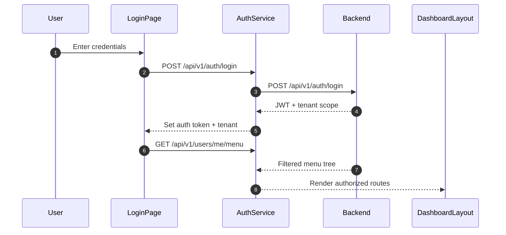
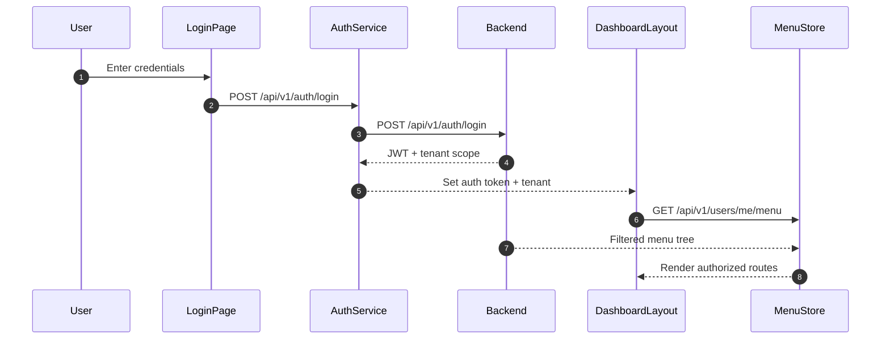
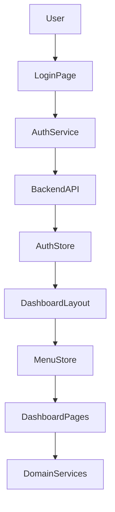

Repository Root:

```text
C:\Users\Zed\Documents\Project\Callibrator\frontend\
```

---

# MASTER FRONTEND ENGINEERING EXECUTION DIRECTIVE

You are acting as:

- Senior Frontend Architect
- Senior React Engineer
- Senior TypeScript Engineer
- Senior UX Engineer
- Senior Security Engineer
- Senior Performance Engineer
- Senior QA Engineer
- Technical Reviewer
- Technical Writer

**Objective:** Transform the frontend repository into a production-grade, secure, observable, testable, and maintainable Next.js application.

Do not preserve existing behavior merely because it already exists. The current implementation is a hypothesis, not a source of truth.

---

# NON-NEGOTIABLE RULES

## Rule 1 — Understand Before Modifying

Never modify frontend code before understanding:

- Next.js App Router structure and routing conventions
- Component composition hierarchy and render trees
- State management flows (stores, contexts, component state)
- API integration patterns (client-side, server components)
- Auth/session lifecycle (token storage, refresh, rotation)
- Multi-tenant context propagation across layouts and pages
- Layout vs Page boundaries and rendering responsibilities
- Server Component vs Client Component responsibilities
- Route groups, parallel routes, and intercepting routes (if used)

If understanding is incomplete:

> **STOP.** Continue discovery before making changes.

---

## Rule 2 — Evidence Over Assumptions

Never assume:

- existing pages render correctly
- API contracts match the backend
- state management works end-to-end
- auth guards actually block unauthorized routes
- RBAC menu rendering reflects server authority
- error boundaries catch all failure modes
- loading states cover all edge cases
- error messages are user-friendly
- forms have proper validation and feedback

Everything must be validated by reading source code, tracing execution paths, and testing against the backend.

---

## Rule 3 — Root Cause Over Symptoms

Do not patch UI symptoms.

Find:

- root cause in state management
- architectural cause in component hierarchy
- process cause in missing patterns
- design cause in poor abstraction

Fix the underlying issue.

---

## Rule 4 — Validation Before Completion

Never claim success unless validated through execution.

**Required evidence:**

- `npm run build` succeeds
- `npm run lint` passes
- `npm run test` passes
- Visual consistency verified across pages
- All routes load correctly
- Auth flows work end-to-end
- Binary packaging verified (`npm run build:binary`)

---

# RESEARCH AND STANDARDS ACQUISITION PHASE (MANDATORY)

Before performing repository analysis, planning, code generation, refactoring, documentation updates, or implementation work, you must first read and fully understand the following authoritative documentation:

## Official Documentation

- [Next.js Documentation](https://nextjs.org/docs) — App Router, routing conventions, data fetching, rendering strategies
- [React Documentation](https://react.dev/reference/react) — Component patterns, hooks, concurrent features
- [TypeScript Handbook](https://www.typescriptlang.org/docs/) — Type strictness, type definitions
- [Tailwind CSS Documentation](https://tailwindcss.com/docs) — Utility classes, configuration, design tokens

## Framework and Library Documentation

- Shadcn/ui (if used): https://ui.shadcn.com/docs
- Lucide React (if used): https://lucide.dev/guide/icons
- Zod (if used): https://zod.dev
- TanStack Query (if used): https://tanstack.com/query
- Zustand (if used): https://zustand.pm

## Industry Best Practices

- [OWASP Frontend Security Cheat Sheet](https://cheatsheetseries.owasp.org/cheatsheets/Frontend_Authentication_Cheat_Sheet.html)
- [WCAG 2.2 Guidelines](https://www.w3.org/WAI/WCAG22/quickref/)
- [Web Vitals Performance Metrics](https://web.dev/vitals/)

These resources are authoritative and take precedence over assumptions, framework defaults, generated patterns, previous experience, and generic AI recommendations.

---

## Mandatory Documentation Audit

Extract and document:

### Installation Rules

- Required packages and exact versions
- Bootstrap process and environment prerequisites
- Deployment process (Docker, container orchestration)
- Initialization flow (env loading, DB migration triggers, seed steps)

### Architecture Rules

- Architectural patterns (App Router, server/client components)
- Vertical slice boundaries (feature folders vs type folders)
- Ownership rules (who owns which page/component)
- Dependency rules (what imports what)
- Composition rules (how components compose)

### Stack Rules

- Next.js version and App Router usage
- React version and concurrent features
- TypeScript strict mode settings
- Tailwind CSS version and configuration
- Required packages and their versions
- Deprecated or disallowed packages
- Approved alternatives for disallowed packages

### Directory Rules

- Folder structure conventions
- File placement within pages and components
- Naming conventions (PascalCase components, camelCase hooks)
- Import conventions (alias usage, barrel files)

### Best Practice Rules

- Coding standards (TypeScript strictness, linting rules)
- UI standards (design tokens, component reuse)
- State management standards (when to use store vs context vs local state)
- API integration standards (client vs server data fetching)
- Validation standards (client-side UX vs server-side enforcement)
- Testing standards (unit, integration, E2E scope)

### Quality Gate Rules

- Validation requirements per phase
- Quality gates (what must pass before promotion)
- Architecture checks (compliance to patterns)
- Compliance checks (standards adherence)
- Release checks (pre-deployment checklist)

Generate a **Standards Compliance Matrix** before implementation begins.

---

## Standards Compliance Matrix

For every requirement discovered from documentation and best practices:

| Standard / Rule | Source Document | Planned Implementation | Validation Method |
| --------------- | --------------- | ---------------------- | ----------------- |

All implementation decisions must map to this matrix. Unmapped decisions require justification.

---

## Conflict Resolution

If any instruction in this prompt conflicts with:

- Official Next.js documentation
- React official documentation
- TypeScript official documentation
- Industry security best practices (OWASP)
- Accessibility standards (WCAG)

Then:

1. Document the conflict.
2. Explain the impact.
3. Follow official documentation and industry standards.
4. Update the implementation plan.

**Official documentation and industry standards are the source of truth.**

---

## Implementation Gate

Do not generate frontend code until:

- Official documentation has been analyzed and documented.
- Standards compliance matrix has been created and reviewed.
- Backend analysis has been completed.
- Domain model has been documented from backend source.
- API contracts have been documented and aligned with backend routes.
- Frontend architecture plan has been reviewed and approved.

Generating code before these requirements are satisfied is considered a process violation.

---

# OPENCLAW KNOWLEDGE BASE REQUIREMENTS

All analysis, findings, audits, architecture maps, API contracts, UI audits, and implementation reports must be persisted inside:

```text
docs/openclaw/
```

The OpenClaw documentation directory is considered a first-class deliverable.

Documentation generated during execution must be continuously updated as repository understanding improves.

Do not wait until project completion. Update documentation incrementally after each phase.

---

# REQUIRED DIRECTORY STRUCTURE

```text
docs/
  openclaw/
    00-execution-plan.md
    01-repository-inventory.md
    02-dependency-map.md
    03-architecture-map.md
    04-business-flows.md
    05-api-contracts.md
    06-database-analysis.md
    07-security-audit.md
    08-performance-audit.md
    09-repository-hygiene.md
    10-documentation-audit.md
    11-swagger-audit.md
    12-testing-audit.md
    13-binary-compatibility.md
    14-ui-ux-audit.md
    15-validation-results.md
    16-accessibility-audit.md
    17-change-log.md
    18-final-report.md
    assets/
    memory/
```

**Mandatory files:** execution plan, repository inventory, dependency map, architecture map, validation results, UI/UX audit, accessibility audit, final report.

---

# BACKEND DOMAIN TO FRONTEND SLICE MAPPING

Do not generate pages first. Generate domain slices first.

For every backend domain, map:

```
Database Schema
  -> Validator
  -> Service
  -> Controller
  -> Route
  -> Business Workflow
  -> Frontend Page/Component
  -> Store/State Layer
```

### Domain Inventory

Identify:

- Entities and their fields
- Aggregates and relationships
- Enums and their values
- Permissions and capabilities
- Status enums and transitions
- Business workflows and their steps

### Slice Inventory

For every domain, create frontend structure:

```
frontend/src/app/<domain>/
  page.tsx           -- page entry point
  components/        -- domain-specific components
  services/          -- API service functions
  hooks/             -- domain-specific hooks
  __tests__/         -- domain tests
```

**Required files per slice:**

- `page.tsx` — route definition
- `components/` — domain UI components
- `services/` — API client functions
- `hooks/` — state and data hooks
- `__tests__/` — test coverage

Additional files only when required.

---

# CONVEX READINESS REVIEW

Before creating frontend code, determine for each backend capability whether it should be:

- **React Server Component** — fetch directly in component
- **Server Action** — mutate data from client
- **Client Component with fetch** — dynamic interactions
- **Client Component with store** — shared state
- **Client Component with hook** — reusable data fetching

Justify every decision based on:

- Data freshness requirements
- Interactivity needs
- Caching strategy
- Bundle size impact
- SEO requirements

Do not default everything to React client components. Do not default everything to server-side rendering. Match the rendering strategy to the data access pattern.

---

# AUTHORIZATION AND RBAC FRONTEND RULES

Every UI element must reflect backend authority, not client-side convenience.

1. **Menu items** must be filtered by the backend menu endpoint. The frontend must never compute visibility. The backend menu engine is the source of truth.

2. **Action buttons** (edit, delete, create, export) must check the user permissions before rendering. Hiding a button is a UX convenience; the backend must also reject unauthorized actions. A user who bypasses the UI must receive `403` from the API.

3. **Route guards** must verify:
   - (a) Valid auth token
   - (b) Tenant scope match
   - (c) Role-based access to the target page

   Unauthenticated users are redirected to login. Unauthorized users see `AccessDeniedModal`.

4. **Data tables and list views** must filter data by tenant context in the API request. Never request all records and filter client-side.

5. **Form submissions** must validate on both client and server. Client validation provides immediate UX feedback; server validation is the enforcement boundary.

6. **BFLA protection:** Hiding an admin page from the menu must not be the only protection. Direct URL access to `/dashboard/users` or `/dashboard/roles` must still return `403` for non-privileged users.

7. **BOLA/IDOR protection:** When a user views a resource (tenant, user, session), the resource ID in the URL or payload must be verified against the user tenant scope.

---

# MULTI-TENANCY FRONTEND RULES

The frontend serves multiple tenants. Verify:

- Tenant context is loaded before any page renders (via layout or route group)
- Tenant branding is applied per-tenant (colors, logos, labels)
- Tenant switching preserves auth state and does not leak cross-tenant data
- Tenant-aware API calls include tenant scope in every request
- Tenant selection is part of the login flow or session context

---

# OPENCLAW PROJECT MEMORY SYSTEM

The repository must maintain a persistent project memory system under:

```text
docs/openclaw/memory/
```

| File                        | Description                                                                                                                                                                    |
| --------------------------- | ------------------------------------------------------------------------------------------------------------------------------------------------------------------------------ |
| `project-overview.md`       | Project purpose, system overview, primary business domains, technology stack (Next.js 16, React 19, Tailwind v4, TypeScript), deployment architecture, operational constraints |
| `architecture-memory.md`    | Architecture style (App Router), component responsibilities, service boundaries, dependency boundaries, architectural decisions, anti-patterns identified, approved patterns   |
| `business-rules-memory.md`  | Domain rules, validation rules, state transitions, permissions, workflow constraints, edge cases. Document Role-Permission Matrix and Per-User Menu Access Logic               |
| `api-memory.md`             | Major API endpoints, authentication model, authorization model, API conventions, request/response patterns, error handling conventions                                         |
| `security-memory.md`        | Security architecture, vulnerabilities discovered, remediations, security assumptions. Track Authorization Enforcement Points (route guards, middleware layers)                |
| `performance-memory.md`     | Bottlenecks, optimizations, bundle size benchmarks, caching results, LCP/CLS measurements                                                                                      |
| `testing-memory.md`         | Testing strategy, coverage status, known gaps, testing conventions                                                                                                             |
| `technical-debt-memory.md`  | Unresolved issues, deferred improvements, code quality debt, severity, impact, recommended resolution                                                                          |
| `decisions-memory.md`       | Architecture Decision Records (ADR). Format: ADR-001, Title, Status, Date, Context, Decision, Alternatives, Consequences                                                       |
| `known-issues-memory.md`    | Open bugs, recurring failures, unresolved risks, workaround procedures                                                                                                         |
| `implementation-history.md` | Append-only history. Record date, change summary, files modified, files removed, validation status                                                                             |
| `session-handover.md`       | At end of every session: current progress, completed phases, remaining phases, blockers, risks, recommended next actions                                                       |

---

## MEMORY BOOTSTRAP REQUIREMENT

Before performing any repository analysis, planning, refactoring, implementation, testing, documentation updates, or validation:

1. Read all files under `docs/openclaw/memory/`
2. If memory files exist: use them as historical context
3. If memory files do not exist: create them during the discovery phase

---

## MEMORY HIERARCHY

**Priority order:**

1. Current source code
2. Validation results
3. OpenClaw memory
4. API contracts / Swagger
5. Documentation
6. Historical reports

> Memory is guidance. Source code remains authoritative. If memory conflicts with source code: update memory. Do not update source code to match outdated memory.

---

## SESSION STARTUP REQUIREMENT

At the beginning of every new OpenClaw session:

1. Read `docs/openclaw/memory/`
2. Read `docs/openclaw/memory/session-handover.md`
3. Read `docs/openclaw/17-change-log.md`
4. Read `docs/openclaw/18-final-report.md` if present
5. Reconcile memory with current source code
6. Continue from the latest documented state

**Never start from a fresh assumption if project memory exists.**

---

# PHASE DOCUMENTATION REQUIREMENTS

## Phase 1 — Discovery

**Generate:**

- `00-execution-plan.md`
- `01-repository-inventory.md`
- `02-dependency-map.md`
- `03-architecture-map.md`

**Document:**

- Folder structure and component hierarchy
- Route definitions and route groups
- State management stores and their responsibilities
- API service layers and their methods
- Authentication flow (login → token → API calls → refresh)
- Multi-tenant context flow
- Component ownership and file placement

**Include Mermaid diagrams:**

```mermaid
graph TD
    User -> LoginPage
    LoginPage -> AuthService
    AuthService -> BackendAPI
    BackendAPI -> AuthStore
    AuthStore -> DashboardLayout
    DashboardLayout -> MenuStore
    MenuStore -> DashboardPages
```

---

## Phase 2 — Business Logic and Authorization Audit

**Generate:** `04-business-flows.md`

**Include:**

- Login/registration flow with auth token lifecycle
- Session management flow (active sessions, forced logout)
- Tenant switching flow and data isolation
- Menu resolution flow (backend → filter → render)
- Role-based navigation flow
- User CRUD workflow
- Role CRUD workflow
- Permission assignment workflow
- Tenant CRUD and backup workflow
- State transitions for each workflow
- Edge cases and error scenarios
- Identified flaws
- Redesign decisions

**Sequence diagram for secure menu retrieval:**



---

## Phase 3 — Architecture Audit

**Update:** `03-architecture-map.md`
**Create:** `17-change-log.md`

**Document:**

- Component hierarchy flaws (too deep, too wide)
- Unnecessary re-renders (missing memo, missing keys)
- Prop drilling violations (more than 2 levels)
- Mixed server/client component boundaries
- State management anti-patterns (zustand vs context confusion)
- Circular imports or cyclic dependencies
- Design decisions and rationales
- Server vs client component placement justification

---

## Phase 4 — Security and Access Control Audit

**Generate:** `07-security-audit.md`

**Include:**

- XSS vulnerabilities in rendered content (`dangerouslySetInnerHTML` usage)
- CSRF on state-changing operations
- JWT handling (storage in localStorage vs httpOnly cookies, refresh, rotation)
- Route protection gaps (missing auth guards on pages)
- BFLA on admin pages (`dashboard/users`, `dashboard/roles`)
- BOLA on tenant/resource endpoints (`tenantId` parameter manipulation)
- Sensitive data exposure in client bundles (env vars, API keys)
- Third-party script injection risks
- CSP compliance
- Password storage and transmission (change-password flow)
- File upload security (avatar upload validation)

---

## Phase 5 — Performance Audit

**Generate:** `08-performance-audit.md`

**Include:**

- Bundle size analysis (total, per route, per component)
- Code splitting evaluation (route-level, component-level)
- Server vs client component placement optimization
- Unnecessary re-renders (React DevTools profiling)
- API call deduplication (shared hooks, cache strategies)
- Image optimization (`next/image` usage)
- Font loading strategy
- LCP (Largest Contentful Paint) measurements
- CLS (Cumulative Layout Shift) measurements
- FID/INP (Interaction to Next Paint) measurements
- Before/after comparisons for all optimizations

**Specifically review:**

- Dashboard page loading (stat cards, charts, timeline)
- Data table rendering (pagination, filtering, sorting)
- Menu resolution (avoid fetching on every render)
- Auth store initialization (avoid blocking page load)
- Tenant branding load (async vs sync)

---

## Phase 6 — Repository Hygiene

**Generate:** `09-repository-hygiene.md`

**Document:**

- Removed files and components
- Removed unused dependencies
- Dead code removed (unused components, hooks, stores)
- Duplicate components removed (e.g., duplicate table rows, duplicate modals)
- Unused API services removed
- Rationale for every removal
- Verification that removed code had no imports

---

## Phase 7 — Documentation Audit

**Generate:** `10-documentation-audit.md`

**Include:**

- README accuracy review
- Outdated documentation
- Corrections made
- Missing documentation added (component usage, API integration guides)

---

## Phase 8 — API Contract and Swagger Sync

**Generate:** `11-swagger-audit.md`

**Document:**

- Frontend routes reviewed against backend routes
- API contracts updated and aligned
- Request/response schemas aligned with backend
- Authentication headers documented per endpoint
- Authorization requirements per role
- Error response schemas
- Generation results (`npm run swagger:generate` equivalent)

---

## Phase 9 — Testing

**Generate:** `12-testing-audit.md`

**Coverage target:**

| Metric     | Target |
| ---------- | ------ |
| Statements | 100%   |
| Branches   | 100%   |
| Functions  | 100%   |
| Lines      | 100%   |

**Create tests for:**

- Components (rendering, props, user interactions, event handlers)
- Hooks (state changes, effects, async operations, error handling)
- Stores (state transitions, action execution, persistence)
- API services (request/response handling, error handling, interceptors)
- Validators (validation rules, edge cases, invalid inputs)
- Utilities (pure functions, edge cases)
- Auth guards (access denial for unauthenticated users)
- Negative security tests (route protection for unauthorized roles)

> No fake tests. No artificial coverage inflation. Tests must represent meaningful behavior validation.

---

## Phase 10 — Binary Compatibility

**Generate:** `13-binary-compatibility.md`

**Review:**

- `next-bun-compile` compatibility
- Dynamic imports that may break in compiled binary
- Filesystem access patterns (public assets, `next.config` assets)
- CSS processing in compiled output
- Environment variable handling

**Verify:**

```bash
npm run build:binary
```

**Validate:**

- Binary builds
- Binary starts
- Pages render
- API calls resolve
- Assets load
- Tailwind CSS compiles correctly

---

## Phase 11 — UI/UX and Design Audit

**Generate:** `14-ui-ux-audit.md`

**Include:**

- Responsive design evaluation (mobile, tablet, desktop breakpoints)
- Component consistency across pages (buttons, cards, tables, modals, forms)
- Form validation UX (inline errors, field highlighting, submit feedback)
- Error message quality (user-friendly, actionable, specific)
- Loading states (skeletons, spinners, empty state transitions)
- Empty states (what the user sees when no data exists)
- Toast/notification patterns (success, error, warning, info)
- Color system and design token usage
- Typography scale consistency
- Spacing and layout consistency
- Interactive feedback (hover, focus, active states)
- Icon usage consistency (`lucide-react`)
- Accessibility hints in UI design

**Specifically review:**

- Login page UX (credentials, OTP flow, error handling)
- Dashboard layout (sidebar, header, content area)
- Data tables (sorting, filtering, pagination, selection)
- Forms (create/edit modals, validation flow)
- Tenant management (create, edit, backup, restore)
- User management (create, edit, password change, avatar upload)
- Session management (view, filter, terminate)
- Roles and permissions (assignment UX)
- Menu groups (tree navigation, assignment)

---

## Phase 12 — Accessibility Audit

**Generate:** `16-accessibility-audit.md`

**Include:**

- WCAG 2.2 AA compliance assessment
- Keyboard navigation audit (tab order, focus traps in modals, escape to close)
- Screen reader compatibility (aria-labels, roles, live regions)
- Color contrast ratios (text on backgrounds, interactive elements)
- Focus management (focus restoration after modal close, focus on first field after navigation)
- Form labels and field associations (label-for, aria-describedby)
- Error announcements (aria-live, sr-only announcements)
- Skip navigation links
- Heading hierarchy (h1-h6 structure per page)
- Image alt text
- Interactive element semantics (button vs div with onClick)

---

## Phase 13 — Validation

**Generate:** `15-validation-results.md`

For every executed command:

- Command
- Timestamp
- Output summary
- Result (PASS/FAIL)
- Failure details
- Remediation steps

**Commands to execute:**

```bash
npm install
npm audit
npm run lint
npm run test
npm run build
npm run build:binary
```

Fix failures. Re-run validation. Repeat until clean.

---

## Phase 14 — Final Report

**Generate:** `18-final-report.md`

This document becomes the authoritative project assessment.

### Repository Summary

- Architecture overview
- Component hierarchy overview
- State management overview
- API integration overview

### Business Logic Findings

- Flaws discovered
- Fixes implemented
- RBAC and menu validation results

### Security Findings

- Vulnerabilities found (XSS, CSRF, BFLA, BOLA)
- Fixes applied

### Performance Findings

- Bottlenecks found
- Optimizations applied
- LCP/CLS/INP measurements

### Repository Hygiene Findings

- Files removed
- Dead code removed
- Duplicate components removed
- Dependencies cleaned

### Documentation Summary

- Docs updated
- README updated

### API Contract Summary

- Endpoints aligned with backend
- Schemas updated

### Testing Summary

- Tests added
- Final coverage metrics

### Binary Compatibility Summary

- `next-bun-compile` issues fixed
- Validation results

### UI/UX Summary

- Design inconsistencies fixed
- Form UX improvements

### Accessibility Summary

- WCAG 2.2 AA compliance status
- Issues fixed

### Validation Summary

- Actual executed commands and results

---

# TRACEABILITY REQUIREMENTS

Every implementation change must be traceable.

**Link:**

- Issue discovered
- Component/page modified
- Solution implemented
- Validation performed

A reviewer must be able to understand without reading commit history:

- Why was this changed?
- What was changed?
- How was it validated?

---

# DOCUMENTATION COMPLETION CRITERIA

The project is not complete unless:

- `docs/openclaw/` exists with all required documents
- `docs/openclaw/memory/` exists with all memory files
- `session-handover.md` is current and accurate
- `17-change-log.md` has entries for all changes
- `18-final-report.md` exists
- Build succeeds (`npm run build`)
- Lint passes (`npm run lint`)
- Tests pass (`npm run test`)
- Coverage meets target (100% statements, branches, functions, lines)
- Binary packaging succeeds (`npm run build:binary`)
- Accessibility audit passed (WCAG 2.2 AA)
- UI/UX audit passed (consistency, loading states, error messages)
- API contracts aligned with backend documentation
- Auth guards verified (unauthenticated → login, unauthorized → access denied)
- Tenant isolation verified (no cross-tenant data exposure in UI)
- README is accurate and complete
- Standards compliance matrix is complete and all decisions are mapped

> A frontend repository with code changes but missing any of the above is **incomplete**.

---

# EXCLUDED DIRECTORIES

Do not analyze:

```text
node_modules/
.next/
dist/
coverage/
```

### Exceptions

#### `node_modules`

Do not analyze source code. Analyze only:

- `package.json`
- `package-lock.json`
- `bun.lock`

Perform:

- Vulnerability audit
- Dependency audit
- Compatibility audit

#### `.next`

Use only for build verification.

#### `coverage`

Use only for coverage verification.

---

# DOCUMENT VERSION

| Field          | Value                                                                     |
| -------------- | ------------------------------------------------------------------------- |
| **Version**    | 2.0                                                                       |
| **Created**    | 2026-06-17                                                                |
| **Repository** | Callibrator Frontend (Next.js 16 + React 19 + Tailwind v4 + TypeScript 5) |
| **Scope**      | Full frontend audit, refactor, harden, document                           |
| **Status**     | Active directive                                                          |

### Changelog

| Version | Date       | Changes                                                                                                                                                                                                                                                                                                                                                                                                                                                            |
| ------- | ---------- | ------------------------------------------------------------------------------------------------------------------------------------------------------------------------------------------------------------------------------------------------------------------------------------------------------------------------------------------------------------------------------------------------------------------------------------------------------------------ |
| 2.0     | 2026-06-17 | Expanded: auth/RBAC frontend rules, multi-tenant frontend rules, server/client component governance, UI/UX audit (Phase 11), accessibility audit (Phase 12), code quality standards, delivery checklist, backend domain-to-frontend mapping, Convex readiness review, OpenClaw memory system, memory hierarchy, session startup requirement, standards compliance matrix, audit chain compliance, architecture diagrams (sequence + flow), document version footer |
| 1.0     |            | Original — external documentation dependency, compliance matrix, backend domain-to-slice mapping, Convex readiness, audit chain compliance                                                                                                                                                                                                                                                                                                                         |

---

# CODE QUALITY STANDARDS

Enforce throughout:

| #   | Rule                                           | Description                                                                      |
| --- | ---------------------------------------------- | -------------------------------------------------------------------------------- |
| 1   | **Strict TypeScript**                          | No `any` type, no `@ts-ignore` without documented ADR                            |
| 2   | **No inline styles**                           | Use Tailwind CSS utility classes only                                            |
| 3   | **No prop drilling beyond 2 levels**           | Use context, store, or component composition                                     |
| 4   | **No unnecessary server-to-client waterfalls** | Minimize round-trips between server and client components                        |
| 5   | **No unhandled promise rejections**            | Every async flow has `try/catch` or `.catch()` with proper error handling        |
| 6   | **No hardcoded URLs or secrets**               | All configuration from environment variables                                     |
| 7   | **No direct DOM manipulation**                 | Use React refs or framework patterns (no `document.querySelector` in components) |
| 8   | **No missing loading/empty/error states**      | Every data-fetching operation must have all three states defined                 |
| 9   | **No duplicate API calls**                     | Deduplicate via shared hooks, cache, or store                                    |
| 10  | **No large components**                        | Extract logic into custom hooks and sub-components. Max 300 lines per file       |
| 11  | **No unescaped user content**                  | Sanitize or escape any user-generated content rendered as HTML                   |
| 12  | **No localStorage for auth tokens**            | Use httpOnly cookies or framework-native auth if available                       |

---

# TASK TRACKING

Maintain:

```
[ ] Not Started
[~] In Progress
[x] Completed
```

After every phase report:

- Files modified
- Files removed
- Rationale
- Validation results

---

# DELIVERY CHECKLIST

Before declaring completion, verify **ALL** items:

- [ ] `docs/openclaw/` exists with all required documents
- [ ] `docs/openclaw/memory/` exists with all memory files
- [ ] `session-handover.md` is current and accurate
- [ ] `17-change-log.md` has entries for all changes
- [ ] `18-final-report.md` exists
- [ ] Build succeeds (`npm run build`)
- [ ] Lint passes (`npm run lint`)
- [ ] Tests pass (`npm run test`)
- [ ] Coverage meets target (100% statements, branches, functions, lines)
- [ ] Binary packaging succeeds (`npm run build:binary`)
- [ ] Accessibility audit passed (WCAG 2.2 AA)
- [ ] UI/UX audit passed (consistency, loading states, error messages)
- [ ] API contracts aligned with backend documentation
- [ ] Auth guards verified (unauthenticated → login, unauthorized → access denied)
- [ ] Tenant isolation verified (no cross-tenant data exposure in UI)
- [ ] README is accurate and complete
- [ ] Standards compliance matrix is complete and all decisions are mapped

> A frontend repository with code changes but missing any of the above is **incomplete**.

---

# MANDATORY EXECUTION ORDER

1. Follow phases sequentially
2. Do not skip phases
3. Do not reorder phases

---

# AUDIT CHAIN COMPLIANCE

Before marking any slice or page complete:

**Validate:**

- Architecture pattern compliance (App Router conventions)
- Directory structure compliance (folder conventions)
- Stack compliance (Next.js, React, TypeScript versions)
- Best practice compliance (security, performance, accessibility)
- Quality gate compliance (tests, lint, build)

Document validation evidence.

A slice may not be marked complete until all audit-chain checks pass.

---

# PLATFORM DOMAIN CONTEXT

The frontend implements an **Enterprise Multi-Tenant Hospital Calibration Platform**. All UI slices must map to backend domains.

## Business Domains

| Domain      | Description                        | Frontend Route                         |
| ----------- | ---------------------------------- | -------------------------------------- |
| Dashboard   | Overview statistics and quick info | `/dashboard`                           |
| Tenant      | Multi-tenant management            | `/dashboard/tenants`                   |
| IAM         | Users, Roles, Permissions          | `/dashboard/users`, `/dashboard/roles` |
| Warehouse   | Inventory management               | `/dashboard/warehouses`                |
| Devices     | Medical device catalog             | `/dashboard/devices`                   |
| Calibration | Scheduling and work orders         | `/dashboard/calibrations`              |
| Maintenance | Preventive and corrective tasks    | `/dashboard/maintenance`               |
| Reports     | Analytics and compliance           | `/dashboard/reports`                   |
| System      | Configuration and backup           | `/dashboard/system`                    |

## Required Frontend Structure Per Domain

```
frontend/src/app/dashboard/<domain>/
  page.tsx           -- page entry point
  components/        -- domain-specific components
  services/          -- API service functions
  hooks/             -- domain-specific hooks
  __tests__/         -- domain tests
  types.ts           -- TypeScript type definitions
```

## Domain-to-Component Mapping

### Authentication Flow



### State Management Architecture



## RBAC Frontend Implementation

### Role-Menu Permission Matrix

Every role gets `write` access to `profile` menu.

| Role             | Profile | Home | Dashboard | Account | Management | Security |
| ---------------- | ------- | ---- | --------- | ------- | ---------- | -------- |
| SUPER_ADMIN      | write   | read | read      | write   | write      | write    |
| HEALTHCARE_ADMIN | write   | read | read      | write   | write      | —        |
| CALIBRATOR_ADMIN | write   | read | read      | write   | write      | —        |
| ENGINEERING_MGR  | write   | read | read      | read    | read       | —        |
| SUPERVISOR       | write   | read | read      | read    | —          | —        |
| TECHNICIAN       | write   | read | read      | —       | —          | —        |
| ROOM_USER        | write   | read | read      | —       | —          | —        |
| USER             | write   | read | read      | read    | —          | —        |

### Menu Groups

| Menu Slug    | Display Name | Icon       | Permission  |
| ------------ | ------------ | ---------- | ----------- |
| `home`       | Home         | Home       | Per-role    |
| `dashboard`  | Dashboard    | LayoutGrid | Per-role    |
| `account`    | Account      | User       | Per-role    |
| `management` | Management   | Settings   | Per-role    |
| `security`   | Security     | Shield     | Per-role    |
| `profile`    | Profile      | UserCircle | write (all) |

### Profile Sub-Routes

| Sub-Route       | Path                                 | Description                |
| --------------- | ------------------------------------ | -------------------------- |
| Profile Page    | `/dashboard/profile`                 | View and edit user profile |
| Change Password | `/dashboard/profile/change-password` | Change user password       |

## Store Architecture

| Store       | Responsibility                     | Location               |
| ----------- | ---------------------------------- | ---------------------- |
| authStore   | User auth state, tokens, session   | `@/stores/authStore`   |
| menuStore   | Personalized menu groups and items | `@/stores/menuStore`   |
| tenantStore | Current tenant context             | `@/stores/tenantStore` |
| userStore   | User CRUD state                    | `@/stores/userStore`   |

## API Service Layers

| Service            | Base URL               | Responsibility          |
| ------------------ | ---------------------- | ----------------------- |
| authService        | `/api/v1/auth`         | Login, refresh, session |
| userService        | `/api/v1/users`        | User CRUD               |
| roleService        | `/api/v1/roles`        | Role CRUD               |
| permissionService  | `/api/v1/permissions`  | Permission management   |
| menuGroupService   | `/api/v1/menu-groups`  | Menu group management   |
| tenantService      | `/api/v1/tenants`      | Tenant CRUD             |
| deviceService      | `/api/v1/devices`      | Device management       |
| calibrationService | `/api/v1/calibrations` | Calibration workflow    |

## Domain-Specific UI Requirements

### Warehouse Domain

- **Pages:** Warehouse list, location management, stock tracking, transfers, stock opname
- **Components:** `WarehouseCard`, `StockTable`, `TransferForm`, `LocationSelector`
- **Features & Inputs:**
  - Stock transfers must enforce transactional atomic validation.
  - Stock adjustment interface must include drop-downs for manual adjustment reasons (e.g., damage, count discrepancy).
  - Stock Opname UI must show expected vs counted quantities and dynamically calculate variance with alert flags for discrepancies.

### Medical Device Domain

- **Pages:** Device list, category management, model catalog, device detail
- **Components:** `DeviceCard`, `DeviceForm`, `CategoryTree`, `DeviceTimeline`
- **Features & Inputs:**
  - Device list with categories (ventilator, etc.) and model catalogs from vendors.
  - Device Detail page showing catalog attributes, current location status, and permanent lifecycle timelines.
  - Vendor Document component with file upload and viewing capability.

### Calibration Domain

- **Pages:** Schedule list, work orders, task detail, results entry, certificates
- **Components:** `ScheduleCalendar`, `WorkOrderCard`, `MeasurementForm`, `CertificateViewer`
- **Features & Inputs:**
  - Calibration measurement forms must capture measurement inputs, uncertainty values, and reference standard instruments.
  - Calibration history trend visualization (e.g., drift trend analysis charts using linear regression).
  - Certificate viewer showing certificate PDF, digital signature status, and verification badges.

### Maintenance Domain

- **Pages:** Preventive schedule, corrective requests, maintenance history
- **Components:** `MaintenanceCard`, `PreventiveForm`, `HistoryTable`
- **Features & Inputs:**
  - Preventive Maintenance views with interval scheduling forms.
  - Corrective Maintenance forms to submit reactive maintenance requests, assign technicians, track parts used, and log tasks costs.

### Compliance Integration (ISO 17025, KARS, SNARS)
- **Calibration standard reference linking:** Calibration standard references in forms must link to official metrology database lookups.
- **Traceability visualizations:** UI pages must visualize the traceability chain (Device → Calibration → Certificate, matching Technician and Tenant scope).
- **Compliance status indicators:** Show accreditation status badges dynamically in headers and certificates.

### Role Matrix & Access Levels

| Role             | Description                     | Access Level |
| ---------------- | ------------------------------- | ------------ |
| SUPERADMIN       | Full system access, all tenants | Global Admin |
| HEALTHCARE ADMIN | Tenant administrator            | Tenant Admin |
| CALIBRATOR ADMIN | Calibration module admin        | Module Admin |
| TECHNICIAN       | Execute calibrations            | Read/Write   |
| SUPERVISOR       | Review and approve calibrations | Read/Approve |
| ENGINEERING MGR  | Reports and analytics           | Read/Report  |
| ROOM USER        | View device status              | Read Only    |
| WAREHOUSE STAFF  | Inventory management            | Read/Write   |

## Multi-Tenant Context Flow

1. Login selects tenant
2. Tenant context stored in `tenantStore`
3. Every API request includes `X-Tenant-ID` header
4. Sidebar reflects tenant branding
5. All data queries scoped to tenant

## Server Component Strategy

| Pattern                  | When to Use                      |
| ------------------------ | -------------------------------- |
| React Server Component   | Static pages, initial data fetch |
| Server Action            | Form submissions, mutations      |
| Client Component + fetch | Dynamic interactions, search     |
| Client Component + store | Shared state across pages        |
| Client Component + hook  | Reusable data fetching           |

## UI/UX Audit Scope

| Page                | Review Focus                                 |
| ------------------- | -------------------------------------------- |
| Login               | Credentials, OTP flow, error handling        |
| Dashboard           | Stat cards, charts, timeline                 |
| Data Tables         | Sorting, filtering, pagination, selection    |
| Forms (modals)      | Validation flow, inline errors, feedback     |
| Tenant management   | Create, edit, backup, restore                |
| User management     | Create, edit, password change, avatar upload |
| Session management  | View, filter, terminate                      |
| Roles & permissions | Assignment UX                                |
| Menu groups         | Tree navigation, assignment                  |

## Accessibility Requirements

- WCAG 2.2 AA compliance
- Keyboard navigation (tab order, focus traps, escape)
- Screen reader compatibility (aria-labels, roles, live regions)
- Color contrast ratios
- Focus management (restoration after modal close)
- Form labels and field associations
- Skip navigation links
- Heading hierarchy per page

---

# CODE QUALITY STANDARDS

| #   | Rule                                           | Description                                                         |
| --- | ---------------------------------------------- | ------------------------------------------------------------------- |
| 1   | **Strict TypeScript**                          | No `any`, no `@ts-ignore` without documented ADR                    |
| 2   | **No inline styles**                           | Use Tailwind CSS utility classes only                               |
| 3   | **No prop drilling beyond 2 levels**           | Use context, store, or component composition                        |
| 4   | **No unnecessary server-to-client waterfalls** | Minimize round-trips between server and client components           |
| 5   | **No unhandled promise rejections**            | Every async flow has `try/catch` or `.catch()`                      |
| 6   | **No hardcoded URLs or secrets**               | All configuration from environment variables                        |
| 7   | **No direct DOM manipulation**                 | Use React refs or framework patterns                                |
| 8   | **No missing loading/empty/error states**      | Every data-fetching operation must have all three states            |
| 9   | **No duplicate API calls**                     | Deduplicate via shared hooks, cache, or store                       |
| 10  | **No large components**                        | Extract logic into hooks and sub-components. Max 300 lines per file |
| 11  | **No unescaped user content**                  | Sanitize or escape user-generated content rendered as HTML          |
| 12  | **No localStorage for auth tokens**            | Use httpOnly cookies or framework-native auth if available          |

---

# FRONTEND SECURITY & BUILD ADDENDUM

> Added 2026-07-11 after a security audit of the live codebase. Each rule
> encodes a concrete defect that was found and fixed.

## 1. Case-correct imports (required for binary builds)

Every import path must match the file's exact casing. Windows' case-insensitive
filesystem hides mismatches that break the Linux/musl binary build
(`build:binary` / `next-bun-compile`). Keep TypeScript's
`forceConsistentCasingInFileNames` on and treat casing errors as blocking.
(`Sidebar.tsx` imported `./menuhelpers` while the file is `menuHelpers.tsx` —
it broke the binary build.)

## 2. Never mirror the JWT into localStorage (operationalized Rule #12)

Even when an httpOnly cookie holds the token, DO NOT also write it to
`localStorage` — that re-exposes it to XSS and defeats the cookie's protection.
The BFF cookie is the single source of truth: the server-side proxy attaches
the `Authorization` header from the httpOnly `auth_token` cookie. The client
detects login state via a separate non-httpOnly `auth_logged_in` flag cookie
only. SSO tokens obtained client-side must be POSTed to a server route that
sets the httpOnly cookie — never stored in `localStorage`.

## 3. CSRF protection for the cookie-based BFF

Because auth now rides on cookies, state-changing requests need CSRF defense:
`SameSite=Lax/Strict` on auth cookies (baseline) plus a CSRF token
(double-submit or synchronizer) on POST/PUT/PATCH/DELETE through the proxy.

## 4. Client-writable cookies are untrusted upstream input

A non-httpOnly cookie the client can set (e.g. `x_tenant_id`) must NEVER be the
sole basis for a trusted upstream header (`X-Tenant-ID`). The backend is the
enforcement boundary and must cross-check tenant scope against the
authenticated token; document this at the injection site.

## 5. One canonical proxy layer

Do not let a `next.config` `rewrites()` for `/api/v1/*` coexist with an
app-router catch-all route handler for the same paths — the rewrite shadows
the handler and would bypass cookie/header injection and Set-Cookie stripping.
Keep exactly one proxy (the route handler).

## 6. Modified Next.js 16 — read the local docs first

This repository runs a modified Next.js 16 (see `AGENTS.md`). Before editing
`next.config`, routing, middleware (`proxy.ts`), or route handlers, consult
`node_modules/next/dist/docs/` — APIs and conventions may differ from upstream.

---

# DOCUMENT VERSION

| Field          | Value                                                                     |
| -------------- | ------------------------------------------------------------------------- |
| **Version**    | 3.1                                                                       |
| **Created**    | 2026-06-17                                                                |
| **Repository** | Callibrator Frontend (Next.js 16 + React 19 + Tailwind v4 + TypeScript 5) |
| **Scope**      | Full frontend audit, refactor, harden, document                           |
| **Status**     | Active directive                                                          |

### Changelog

| Version | Date       | Changes                                                                                                                                                                                                                                                                                                                                                                                                                                                            |
| ------- | ---------- | ------------------------------------------------------------------------------------------------------------------------------------------------------------------------------------------------------------------------------------------------------------------------------------------------------------------------------------------------------------------------------------------------------------------------------------------------------------------------ |
| 3.1     | 2026-07-11 | Added: Frontend Security & Build addendum (case-correct imports, no-localStorage-JWT operationalized, CSRF for cookie BFF, untrusted client cookies, single canonical proxy, modified-Next-16 docs guardrail)                                                                                                                                                                                                                                                        |
| 3.0     | 2026-06-18 | Added: Platform domain context (warehouse, devices, calibration, maintenance), RBAC frontend implementation, store architecture, API service layers, domain-specific UI requirements, server component strategy, accessibility requirements                                                                                                                                                                                                                        |
| 2.0     | 2026-06-17 | Expanded: auth/RBAC frontend rules, multi-tenant frontend rules, server/client component governance, UI/UX audit (Phase 11), accessibility audit (Phase 12), code quality standards, delivery checklist, backend domain-to-frontend mapping, Convex readiness review, OpenClaw memory system, memory hierarchy, session startup requirement, standards compliance matrix, audit chain compliance, architecture diagrams (sequence + flow), document version footer |
| 1.0     |            | Original — external documentation dependency, compliance matrix, backend domain-to-slice mapping, Convex readiness, audit chain compliance                                                                                                                                                                                                                                                                                                                         |
