# Hospital Device Calibration (HDC) — Backend Module Documentation

> **Product:** Enterprise multi-tenant hospital medical-device calibration platform
> **Stack:** Express.js · Sequelize ORM · PostgreSQL **or** MySQL · Redis · RabbitMQ · Socket.IO
> **Compliance targets:** ISO 17025, FDA 21 CFR Part 11, ISO 13485, GDPR
> **API base:** `/api/v1/*` · **Docs:** Swagger UI (`/api-docs`), OpenAPI (`swagger.json`)
> **Generated:** 2026-07-15 — from direct static analysis of `backend/src`

This document breaks the backend down into **30 functional modules**. Each module is documented with the
24-point standard template. Every fact (endpoint, model column, validation rule, business rule, config key)
is grounded in the actual source under `backend/src/` — file references are clickable.

> ### ⏱ Current project state (updated 2026-07-24)
>
> Two things changed since this reference was generated; the per-module sections
> below still describe the *original* Node design, so read them together with
> these deltas:
>
> **Phase 0 (Node backend, done):**
> - **Row-Level Security removed** → tenant isolation is now enforced in the ORM
>   layer (Sequelize global hooks, **deny-by-default**), engine-agnostic. See
>   `backend/src/utils/tenantScope.util.js` + migration `0015`. **(kept)**
> - **Realtime stays on Socket.IO.** (A plain-WebSocket hub was trialed and then
>   reverted by decision — the backend and frontend both use Socket.IO /
>   socket.io-client.)
> - **Pluggable object storage** added (local | s3 | nfs, per-tenant + global,
>   KMS-encrypted creds) — MinIO live-verified. `backend/src/services/storage/`.

---

## Platform Architecture (Shared Context)

The backend is a **modular monolith**. A request flows through:

```
Client → helmet/CORS/HPP → rate limiter → body parser → requestId → accessLog/activityLog
       → globalSanitizer → Router → auth → tenantContext (RLS) → dynamicAccess/rbac/abac
       → validator → controller → service → Sequelize model → PostgreSQL
```

**Cross-cutting mechanisms every module inherits:**

| Concern | Implementation | Reference |
| --- | --- | --- |
| Authentication | JWT access token (Bearer) + rotating refresh token | [auth.middleware.js](backend/src/middlewares/auth.middleware.js) |
| Tenant isolation | `AsyncLocalStorage` tenant context + Sequelize `beforeFind/Create/...` hooks + native **Postgres RLS** (`app.current_tenant` session var) | [models/index.js](backend/src/models/index.js), [tenantContext.middleware.js](backend/src/middlewares/tenantContext.middleware.js) |
| Authorization | `dynamicAccess(resource, action)` (RBAC menu read/write + ABAC), `rbac([roles])` role-level gate | [dynamicAccess.middleware.js](backend/src/middlewares/dynamicAccess.middleware.js), [rbac.middleware.js](backend/src/middlewares/rbac.middleware.js) |
| Input safety | Global sanitizer + Joi/inline validators + `validateUuid` on path IDs | [globalSanitizer.middleware.js](backend/src/middlewares/globalSanitizer.middleware.js) |
| Error handling | Central `errorHandler` returning `{ success:false, status, message }`; thrown `AppError(status,message)` | [errorHandlers.middleware.js](backend/src/middlewares/errorHandlers.middleware.js), [appError.util.js](backend/src/utils/appError.util.js) |
| Response shape | `{ success, status, message, data, meta }` via `response.util` | [response.util.js](backend/src/utils/response.util.js) |
| Soft delete | `paranoid: true` / `isDeleted` flag on most models | [sequelize-softdelete-gotchas] |
| Audit trail | Append-only `AuditLog` + `activityLog`/`accessLog` middleware | [auditLog.middleware.js](backend/src/middlewares/auditLog.middleware.js) |
| Rate limiting | Global 500/15min; auth 20/15min; OTP 5/hour | [index.js](backend/index.js#L189-L223) |

**Role hierarchy** (from [roleConstants.js](backend/src/constants/roleConstants.js), higher = more privilege):

| Level | Role(s) | Scope |
| --- | --- | --- |
| 10 | `SUPERADMIN` | Global — all tenants, bypasses RLS |
| 8 | `HEALTHCARE ADMIN`, `CALIBRATOR ADMIN` (`TENANT_ADMIN` logical tier) | Tenant administrator |
| 7 | `ENGINEERING MANAGER` | Management / reporting |
| 6 | `SUPERVISOR` | Review / approve |
| 5 | `TECHNICIAN`, `HEALTHCARE TECHNICIAN` | Technical staff |
| 4 | `FACILITY MAINTENANCE`, `WAREHOUSE STAFF` | Operational staff |
| 3 | `ROOM USER` | Read-only device status |
| 1 | `USER` | Profile only |

Access is resolved at runtime via **menu-group permissions** (`read`/`write`) mapped per role, plus optional
per-user overrides (`UserMenuPermission`). `SUPERADMIN` short-circuits all checks.

---

## Module Index

| # | Module | Code | Base Path(s) |
| --- | --- | --- | --- |
| 1 | Authentication & Session Management | HDC-AUTH | `/auth`, `/sessions`, `/webauthn` |
| 2 | Identity Federation & Provisioning | HDC-FED | `/oidc`, `/scim/v2` |
| 3 | RBAC — Roles, Permissions & Menus | HDC-RBAC | `/roles`, `/user-permissions`, `/menu-groups` |
| 4 | User Management | HDC-USER | `/users` |
| 5 | Tenant Management | HDC-TENANT | `/tenants`, `/tenant-hierarchy`, `/custom-domains` |
| 6 | Tenant Lifecycle Management | HDC-TLC | `/tenants/*/lifecycle` |
| 7 | Tenant Backup & Disaster Recovery | HDC-BAK | `/tenants/*/backups` |
| 8 | Warehouse & Inventory Management | HDC-WH | `/warehouses`, `/stocks` |
| 9 | Calibration Device Management | HDC-CDEV | `/calibration-devices` |
| 10 | Calibration Records & Scheduling | HDC-CAL | `/calibration-records`, `/calibration-scheduler` |
| 11 | Certificate & e-Signature | HDC-CERT | `/certificates`, `/esignature` |
| 12 | Maintenance & Predictive Maintenance | HDC-MNT | `/maintenance`, `/predictive-maintenance` |
| 13 | Quality Management System (QMS) | HDC-QMS | `/qms`, `/sop`, `/risk` |
| 14 | Vendor & Supplier Scorecard | HDC-VEN | `/vendors`, `/supplier-scorecard` |
| 15 | Developer API, Webhooks & Integrations | HDC-DEV | `/api-keys`, `/webhooks` |
| 16 | Billing, Subscription & Finance | HDC-BILL | `/billing`, `/finance`, `/metered-billing`, `/quota` |
| 17 | Notifications | HDC-NOTIF | `/notifications` |
| 18 | Workflow Engine | HDC-WF | `/workflows` |
| 19 | Audit & Compliance Trail | HDC-AUDIT | `/audit` |
| 20 | Content Management (CMS) | HDC-CMS | `/content` |
| 21 | Attachment & Document Management | HDC-ATT | `/attachments` |
| 22 | Batch Jobs & Background Processing | HDC-JOB | `/jobs` |
| 23 | Reporting & Dashboard Analytics | HDC-RPT | `/reports`, `/dashboard` |
| 24 | GDPR & Data Retention | HDC-GDPR | `/gdpr`, `/tenants/*/data-retention` |
| 25 | IoT Telemetry | HDC-IOT | `/iot` |
| 26 | AI Assistant Services | HDC-AI | `/ai` |
| 27 | Feature Flags | HDC-FLAG | `/feature-flags` |
| 28 | Network Security | HDC-NETSEC | `/network-security` |
| 29 | Global Search | HDC-SEARCH | `/search` |
| 30 | Platform Administration & Database Migration | HDC-ADMIN | `/admin`, `/migration` |
| 31 | Kanban Project Tracker & Analytics | HDC-KANBAN | `/kanban` |
| 32 | Support Desk (Tickets) | HDC-TICKET | `/tickets` |
| 33 | Pluggable Object Storage | HDC-STORAGE | `/storage`, `/attachments` |

---
# MODULE 1: Authentication & Session Management

### 1. General Information
*   **Module Name:** Authentication & Session Management Module
*   **Module Code:** HDC-AUTH
*   **Version:** 1.0.0
*   **Status:** Production (with known gaps — see §23)
*   **Owner / Person in Charge:** Security & Identity Team

### 2. Module Description
Handles user identity verification and stateful session management for the multi-tenant platform: local password login, account registration/activation, OTP-based password reset, JWT access-token issuance with rotating opaque refresh tokens, TOTP multi-factor authentication, WebAuthn/FIDO passwordless registration, super-admin session administration, and user impersonation. Login attempts are protected by both database-level account lockout and a Redis-backed rate limiter.

### 3. Objectives
*   Provide secure, standards-aligned authentication compatible with FDA 21 CFR Part 11 identity requirements.
*   Issue short-lived access tokens with rotating refresh tokens to limit the blast radius of a leaked credential.
*   Give super-admins full visibility and control over active sessions across the platform.

### 4. Scope
*   **In Scope:** Registration/activation, password login, OTP password reset, in-house password change, JWT issuance/rotation, TOTP MFA, WebAuthn registration/login, socket.io token minting, session listing/revocation, impersonation.
*   **Out of Scope:** SSO/OIDC/SAML federation (delegated to Module 2 — Identity Federation; handlers under `sso.controller.js`), authorization/permission resolution (Module 3 — RBAC).

### 5. Actors/Users
*   **All authenticated users:** login/logout, change own password, register a security key, set up MFA.
*   **Guest / Public:** register, activate account, request/reset password OTP, complete MFA login step.
*   **SUPERADMIN:** list/inspect/revoke/delete any session, revoke all sessions for a user, impersonate any user.

### 6. Features
*   JWT access token (default 15 min) + rotating opaque refresh token (default 7 days, SHA-256 stored).
*   Account lockout after 5 failed attempts (15-minute lock) plus Redis rate limiting.
*   TOTP MFA (otplib) with QR provisioning; WebAuthn/FIDO passwordless keys.
*   Super-admin session console with statistics, filtering, and forced revocation.
*   Time-boxed (1 hour) impersonation with an `impersonatorId` claim for traceability.
*   Short-lived (300 s) socket.io authentication token.

### 7. Workflow
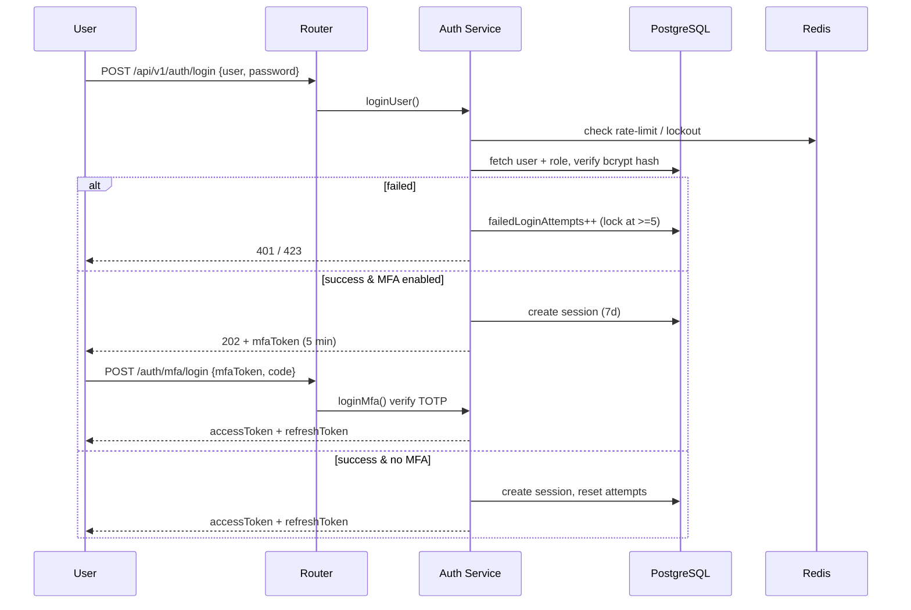
```mermaid
sequenceDiagram
    participant U as User
    participant R as Router
    participant S as Auth Service
    participant DB as PostgreSQL
    participant Rd as Redis
    U->>R: POST /api/v1/auth/login {user, password}
    R->>S: loginUser()
    S->>Rd: check rate-limit / lockout
    S->>DB: fetch user + role, verify bcrypt hash
    alt failed
        S->>DB: failedLoginAttempts++ (lock at >=5)
        S-->>U: 401 / 423
    else success & MFA enabled
        S->>DB: create session (7d)
        S-->>U: 202 + mfaToken (5 min)
        U->>R: POST /auth/mfa/login {mfaToken, code}
        R->>S: loginMfa() verify TOTP
        S-->>U: accessToken + refreshToken
    else success & no MFA
        S->>DB: create session, reset attempts
        S-->>U: accessToken + refreshToken
    end
```

### 8. Input
| Field | Type | Required | Notes |
| --- | --- | --- | --- |
| `firstName` / `lastName` | String (2–100) | firstName required | Registration |
| `username` | String, lowercase alphanumeric (3–30) | Yes (register) | Unique |
| `email` | String, email (6–255) | Yes | Unique per tenant |
| `password` | String (8–100) | Yes | Must contain upper + lower + digit |
| `otp` | String, 6 digits | Yes (reset) | SHA-256 stored, 5-min expiry |
| `mfaToken` / `code` | String / 6-digit TOTP | Yes (MFA login) | 5-min `mfaToken` |
| `Authorization` | Bearer JWT or `ApiKey <key>` | Yes (protected routes) | Header |

### 9. Output
*   `accessToken` (HS256/RS256/ES256 JWT, ~15 min) and `refreshToken` (opaque 32-byte hex, rotated).
*   Session records with device/IP/user-agent metadata; MFA setup returns TOTP secret + QR data URI.
*   Session admin endpoints return paginated session lists and aggregate statistics.

### 10. Validation
*   Joi schemas (`abortEarly:false`, `stripUnknown:true`): registration (name/username/email/password complexity), login (`.or(user, username, email)`), reset (email + 6-digit otp + complex password), change password (old + new + confirm-must-match).
*   `validateUuid` guards session path IDs; session revoke/revoke-all accept an optional `reason` (≤255, defaulted).

### 11. Business Rules
*   Passwords hashed with **bcryptjs, cost 12**; policy = min 8 with upper/lower/digit.
*   **Lockout:** 5 failed logins → `lockedUntil = now + 15 min` (HTTP 423); attempts/lock cleared on success.
*   **Refresh rotation:** each refresh issues a new opaque token and revokes the prior session (reason `TOKEN_ROTATION`); a session/token mismatch revokes *all* the user's sessions (reason `TOKEN_MISMATCH`).
*   **Password change/reset** sets `passwordChangedAt` and revokes all sessions (`PASSWORD_CHANGED` / `PASSWORD_RESET`).
*   **Registration** uses a Redis distributed lock + DB row-lock transaction; assigns the default `USER` role; activation token is a JWT of `{id}`; activation email queued asynchronously.
*   **OTP** is 6 digits, SHA-256 stored, 5-minute expiry; `sendOTP` returns a generic message to avoid user enumeration.
*   **MFA:** if enabled, login returns `202` + 5-minute `mfaToken`; `loginMfa` verifies the TOTP before issuing real tokens.
*   **Impersonation:** SUPERADMIN only, target must exist in tenant, no self-impersonation; 1-hour session, `impersonatorId` claim, user-agent annotated.
*   The `auth` middleware performs **RBAC-only** verification (no per-request DB session lookup); blocks banned/inactive users and suspended/deleted tenants; only SUPERADMIN may override tenant via `x-tenant-code`/`x-tenant-id`.

### 12. Access Rights
| Endpoint group | SUPERADMIN | Authenticated user | Public |
| --- | --- | --- | --- |
| register / activation / login / send-otp / reset / mfa-login / sso | ✓ | ✓ | ✓ |
| logout / logout-all / verify / change-password / mfa-setup / webauthn | ✓ | ✓ (self) | ✗ |
| impersonate / impersonate-exit | ✓ | ✗ | ✗ |
| `/sessions/*` (list, stats, revoke, delete) | ✓ (`rbac(["SUPERADMIN"])`) | ✗ | ✗ |

### 13. Database
*   **`users`** ([user.model.js](backend/src/models/user.model.js)) — PK `id` (UUID); unique `username`, `email`; `password`, `roleId`→`roles.id`, `tenantId`→`tenants.id`; security: `failedLoginAttempts`, `lockedUntil`, `status`, `isActive`; MFA: `mfaEnabled`, `mfaSecret`; OTP: `otpCode`, `otpExpiredAt`, `passwordChangedAt`; soft-delete `isDeleted` + `paranoid`.
*   **`sessions`** ([session.model.js](backend/src/models/session.model.js)) — PK `id`; `user_id`→`users.id`, `tenant_id`→`tenants.id`; unique `token_hash` (SHA-256/64); `ip_address`, `user_agent`, `device`, `expired_at`, `last_activity_at`, `is_revoked`, `is_active`, `revoked_reason`; manual soft-delete (`is_deleted`, `deleted_at`).

### 14. API
Base: `/api/v1/auth`, `/api/v1/sessions`, `/api/v1/webauthn` — see [auth.route.js](backend/src/routes/api/auth.route.js), [session.route.js](backend/src/routes/api/session.route.js), [webauthn.route.js](backend/src/routes/api/webauthn.route.js).

| Method | Endpoint | Function |
| --- | --- | --- |
| POST | `/auth/register` | Register account (rate-limited) |
| GET | `/auth/activation` | Activate via `?token` |
| POST | `/auth/login` | Password login (rate-limited) |
| POST | `/auth/send-otp` | Send reset OTP |
| POST | `/auth/reset-password` | Reset password via OTP |
| POST | `/auth/refresh` | Rotate access + refresh tokens |
| POST | `/auth/logout` · `/auth/logout-all` | Revoke current / all sessions |
| POST | `/auth/just-update-password` · `/auth/pass-is-valid` | Change / verify own password |
| POST | `/auth/socket-token` | Mint 300 s socket.io token |
| POST | `/auth/mfa/setup` · `/mfa/verify` · `/mfa/login` | TOTP MFA lifecycle |
| POST | `/auth/impersonate` · `/impersonate/exit` | Impersonation (SUPERADMIN) |
| GET | `/sessions` · `/sessions/stats` · `/sessions/:id` | List / stats / detail (SUPERADMIN) |
| POST | `/sessions/:id/revoke` · `/sessions/user/:userId/revoke-all` | Revoke session(s) |
| DELETE | `/sessions/:id` | Delete revoked/expired session |
| POST | `/webauthn/registration-options` · `/verify-registration` · `/login-options` · `/verify-login` · `/disable` | WebAuthn/FIDO |

### 15. Integration
*   **Redis** (`ioredis`) — rate limiter (with in-memory fallback), registration distributed lock, user-id cache.
*   **RabbitMQ email queue** — asynchronous activation and OTP emails (`emailQueue.service`).
*   **otplib + qrcode** — TOTP secret generation and QR provisioning.
*   **WebAuthn/FIDO** — custom implementation (RS256/ES256, platform authenticator, resident key).

### 16. Error Handling
*   `401 Invalid credentials`, `403 Account is suspended` / `Account banned`, `423 Account temporarily locked` / `too many failed attempts`.
*   `409 Email already registered` / `Username already used`; `429 Registration in progress`.
*   Reset: `404 Account not found`, `400 Invalid/expired OTP`. Refresh: `401 Invalid or expired refresh token`, `401 Session mismatch...`.
*   Sessions: `404 Session not found`, `400 Session is already revoked`, `400 Can only delete revoked or expired sessions`.

### 17. Log and Audit
*   Structured `logger` (activityLog middleware): registration, activation, impersonation (`SUPER_ADMIN <email> impersonated <email>`), rate-limit lockouts, WebAuthn failures.
*   Session revocation reasons persisted on the session row (`LOGOUT`, `TOKEN_ROTATION`, `PASSWORD_RESET`, `SESSION_EXPIRED`, `TOKEN_MISMATCH`).
*   ⚠️ No dedicated `AuditLog` writes or event emission from this module (see §23).

### 18. Configuration
| Variable | Default | Purpose |
| --- | --- | --- |
| `JWT_ACCESS_SECRET` / `JWT_REFRESH_SECRET` | — (required) | Token signing |
| `JWT_ALGORITHM` | `HS256` | Signing algorithm (HS/RS/ES) |
| `JWT_ACCESS_EXPIRED` / `JWT_REFRESH_EXPIRED` | `15m` / `7d` | Token lifetimes |
| `JWT_KEY_VERSION` / `JWT_ROTATION_INTERVAL` / `JWT_KEY_ID` | `1` / `720h` / `default` | Key rotation registry |
| `MAX_CONCURRENT_SESSIONS` | `5` | Concurrent session cap (sessionSecurity) |
| `SESSION_INACTIVITY_TIMEOUT` / `SESSION_ABSOLUTE_TIMEOUT` | `1800000` / `43200000` ms | Idle / absolute timeouts |
| `WEBAUTHN_RP_ID` | `localhost` | Relying-party ID |
| `REDIS_URL` | `redis://localhost:6379` | Rate limiter backend |
| `HOST_URL` | `""` | Avatar/absolute URL base |

### 19. Dependency
`jsonwebtoken`, `bcryptjs`, `joi`, `otplib`, `qrcode`, `ioredis`, `sequelize`, Node `crypto`; internal `redis.service`, `emailQueue.service`, `session.service`, `rateLimiter.redis.service`.

### 20. UI/Screen
*   Login, Registration, Account Activation, Forgot/Reset Password, Change Password.
*   MFA Setup (QR) & MFA Challenge, Security Keys (WebAuthn) management.
*   Admin → Session Management console (list, filter, revoke).

### 21. Diagrams
*   Sequence diagram in §7 (login + MFA). Refer to [context.md §6/§8](context.md) for the OIDC flow and Redis session structures.

### 22. Non-Functional Requirements
*   **Security:** bcrypt cost 12, rotating refresh tokens, lockout + rate limiting, httpOnly refresh cookie, HSTS in production.
*   **Performance:** authentication path p95 target < 200 ms; access-token verification is stateless (no DB hit).
*   **Availability:** rate limiter fails open on Redis errors to avoid lock-out storms.

### 23. Known Limitations
*   **Access-token revocation gap:** the `auth` middleware does not check session revocation, so a revoked session remains usable until the ~15-min access token expires.
*   **Broken single logout:** `logout` controller calls `logoutSession()` with no argument — non-functional as wired.
*   **Duplicate MFA controller definitions:** later `mfaService`-based overrides win; `/mfa/login` resolves to a handler that throws `501 MFA login flow not fully implemented`, contradicting the working `authService.loginMfa`.
*   **WebAuthn is effectively stubbed:** attestation verification stores a randomly generated key; challenge store is in-process (not multi-instance safe); several `webauthn*` columns referenced but not defined on the model.
*   **`mfa.service.js` references a non-existent `mfaSecretTemp` column;** `sessionSecurity.middleware.js` uses a wrong table/column casing and is not wired to any route.
*   Session is created *before* MFA completes, persisting a full 7-day session on a 202 response.

### 24. Change Log
| Version | Date | Description |
| --- | --- | --- |
| 1.0.0 | 2026-07-15 | Initial documentation from source analysis (auth, session, MFA, WebAuthn, impersonation). |

---
# MODULE 2: Identity Federation & Provisioning (OIDC / SSO / SCIM)

### 1. General Information
*   **Module Name:** Identity Federation & Provisioning Module
*   **Module Code:** HDC-FED
*   **Version:** 1.0.0
*   **Status:** Development (several federation paths are stubbed/insecure — see §23)
*   **Owner / Person in Charge:** Security & Identity Team

### 2. Module Description
Provides enterprise single sign-on and automated user provisioning: inbound SAML 2.0 and OpenID Connect (OIDC) federation with just-in-time (JIT) user provisioning, an outbound OIDC **provider** surface (discovery, JWKS, dynamic client registration), and SCIM 2.0 endpoints for Users/Groups so external identity providers (Okta, Azure AD/Entra ID) can provision and deprovision accounts.

### 3. Objectives
*   Allow hospital tenants to authenticate via their corporate IdP instead of local passwords.
*   Automate account lifecycle (create/update/deactivate) through SCIM to reduce manual admin.

### 4. Scope
*   **In Scope:** SAML AuthnRequest/ACS + metadata, OIDC authorize/callback (consumer), OIDC provider discovery/JWKS/client registration, SCIM v2 Users & Groups.
*   **Out of Scope:** Local password login/MFA (Module 1), full OIDC provider token issuance (advertised but not routed).

### 5. Actors/Users
*   **Tenant end users:** authenticate through their configured IdP.
*   **SUPERADMIN:** register/rotate/delete OIDC provider clients.
*   **External IdP / SCIM client:** provision users and groups via API key/bearer token.

### 6. Features
*   SAML 2.0 SP (HTTP-Redirect AuthnRequest, HTTP-POST ACS, SP metadata) with JIT provisioning.
*   OIDC consumer (authorize redirect + code callback) tailored for Entra ID.
*   OIDC provider: discovery document, JWKS, dynamic client registration with secret rotation.
*   SCIM 2.0 Users & Groups (Groups map to platform Roles).

### 7. Workflow
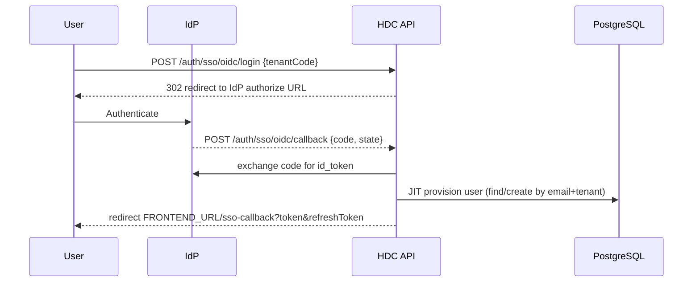
```mermaid
sequenceDiagram
    participant U as User
    participant IdP
    participant API as HDC API
    participant DB as PostgreSQL
    U->>API: POST /auth/sso/oidc/login {tenantCode}
    API-->>U: 302 redirect to IdP authorize URL
    U->>IdP: Authenticate
    IdP-->>API: POST /auth/sso/oidc/callback {code, state}
    API->>IdP: exchange code for id_token
    API->>DB: JIT provision user (find/create by email+tenant)
    API-->>U: redirect FRONTEND_URL/sso-callback?token&refreshToken
```

### 8. Input
*   **SSO:** `tenantCode` (String), SAMLResponse / OIDC `code` + `state`.
*   **OIDC client registration:** `name`, `redirectUris[]`, `scopes[]` (default openid/profile/email), `grantTypes[]`.
*   **SCIM User:** `userName` (email), `name.givenName/familyName`, `emails[]`, `active`, optional `roleId`. **SCIM Group:** `displayName`, `members[]`.

### 9. Output
*   Authenticated session (access + refresh token) after JIT provisioning; SP metadata XML; OIDC discovery JSON + JWKS; SCIM `ListResponse` / `User` / `Group` resources.

### 10. Validation
*   Joi schemas: `ssoLoginSchema` (tenantCode 2–100), `oidcClientSchema` (name + redirectUris required), `scimUserSchema` / `scimGroupSchema` / `scimPatchSchema` (op ∈ add/remove/replace).

### 11. Business Rules
*   **JIT provisioning:** find user by `{email, tenantId}`; if absent create with generated username `<emailPrefix>_<hex>`, random password, default `USER` role, `isEmailVerified=true`; non-ACTIVE accounts rejected (403).
*   **SAML:** validates assertion `Conditions` with 5-minute clock skew; signature verified with SHA-256 only **when** `sso_idp_cert` is configured (SHA-1 disabled per NIST SP 800-131A).
*   **SCIM Groups ⇔ Roles:** creating a group creates a Role; membership is expressed via the user's `roleId`; removing a member resets it to `USER`.
*   **OIDC provider clients** stored in `TenantSettings` (`oidc_client_<id>`); secret stored as SHA-256 hash, returned once on registration/rotation.
*   All federation/provider secrets in `TenantSettings` are KMS envelope-encrypted at rest.

### 12. Access Rights
| Endpoint group | SUPERADMIN | Tenant user | API key / SCIM client |
| --- | --- | --- | --- |
| `/auth/sso/*` (login, callback, metadata) | ✓ | ✓ | Public |
| `/oidc/.well-known/*`, `/oidc/clients` (GET) | ✓ | ✓ (auth) | — |
| `/oidc/clients` register/rotate/delete | ✓ (`superAdminOnly`) | ✗ | ✗ |
| `/scim/v2/*` | ✓ | ✗ | ✓ (`requireApiKeyOrAdmin`) |

### 13. Database
*   **`tenant_settings`** ([tenantSettings.model.js](backend/src/models/tenantSettings.model.js)) — holds all OIDC/SSO config keys (`sso_enabled`, `sso_idp_entry_point`, `sso_idp_cert`, `oidc_client_id/secret/authority/redirect_uri`, `oidc_client_<id>`); unique `(tenant_id, key)`; KMS-encrypted sensitive keys.
*   **`users`**, **`roles`** — JIT/SCIM provisioning targets (Groups↔Roles).
*   OIDC provider RSA keypair is generated in-memory (not persisted).

### 14. API
Base: `/api/v1/oidc`, `/api/v1/scim/v2`, plus `/api/v1/auth/sso/*` — see [oidc.route.js](backend/src/routes/api/oidc.route.js), [scim.route.js](backend/src/routes/api/scim.route.js), [auth.route.js](backend/src/routes/api/auth.route.js).

| Method | Endpoint | Function |
| --- | --- | --- |
| GET | `/oidc/.well-known/openid-configuration` · `/.well-known/jwks.json` | Discovery / JWKS |
| POST/GET/DELETE | `/oidc/clients` · `/clients/:id/rotate-secret` · `/clients/:id` | OIDC client management |
| GET/POST/PUT/PATCH/DELETE | `/scim/v2/Users` · `/Users/:id` | SCIM user provisioning |
| GET/POST/PUT/PATCH/DELETE | `/scim/v2/Groups` · `/Groups/:id` | SCIM group provisioning |
| POST | `/auth/sso/login` · `/sso/callback[/:tenantCode]` | SAML login / ACS |
| POST | `/auth/sso/oidc/login` · `/sso/oidc/callback[/:tenantCode]` | OIDC login / callback |
| GET | `/auth/sso/metadata[/:tenantCode]` | SP metadata XML |

### 15. Integration
*   **Microsoft Entra ID / Azure AD** (default OIDC authority), generic OIDC & SAML 2.0 IdPs, SCIM 2.0 clients (Okta/Azure AD).
*   External HTTP via **axios** (token exchange/JWKS); **KMS** for secret encryption; `session.service` for session issuance.

### 16. Error Handling
*   `400` SSO not enabled / not configured; `401` SAML condition expired / signature failure / OIDC auth failed; `403` suspended account / non-API-key SCIM caller; `404` tenant/user/group/client not found; `409` SCIM user/group exists.
*   SCIM error envelope (`urn:ietf:params:scim:api:messages:2.0:Error`) is only used on the 403 gate; other errors use the generic shape (see §23).

### 17. Log and Audit
*   `logger` records JIT provisioning, OIDC verification failures, SAML signature failures. No dedicated `AuditLog` rows for SCIM/OIDC operations.

### 18. Configuration
| Variable | Default | Purpose |
| --- | --- | --- |
| `OIDC_ISSUER` | `http://localhost:5000` | Provider issuer |
| `OIDC_JWKS_KID` | `callibrator-oidc-key-1` | JWKS key id |
| `FRONTEND_URL` | `http://localhost:3000` | SSO callback redirect |
| `HOST_URL` | `http://localhost:5000` | SP metadata/ACS base |
| (per-tenant, in `tenant_settings`) | — | `sso_*`, `oidc_*` config keys |

### 19. Dependency
`joi`, `jsonwebtoken`, `jwk-to-pem`, `axios`, `sequelize`, Node `crypto`/`zlib`/`https`; internal `kms.service`, `session.service`, `password.util`.

### 20. UI/Screen
*   Tenant admin → SSO/OIDC configuration, OIDC client management; login page "Sign in with SSO"; SCIM is headless (no UI).

### 21. Diagrams
*   OIDC login sequence in §7; refer to [context.md §6](context.md) for the reference OIDC flow.

### 22. Non-Functional Requirements
*   **Security:** federation secrets KMS-encrypted, SAML signature verification, algorithm allowlists (in the hardened JWKS module).
*   **Interoperability:** standards-based SAML 2.0, OIDC, SCIM 2.0.

### 23. Known Limitations
*   **Live OIDC callback does not verify the id_token signature** (`jwt.decode` only); the secure JWKS-verifying implementation (`oidcJwks.js`) exists but is never imported.
*   **OIDC provider RSA keypair is ephemeral** — regenerated each restart, so JWKS/`kid` are unstable across instances; `authorize`/`token`/`userinfo` are advertised in discovery but not routed.
*   **SCIM** `createUser` duplicate check is global (not tenant-scoped); `DELETE` hard-destroys rather than deactivating; auth relies on a fragile Bearer→ApiKey heuristic; error bodies are not consistently SCIM-formatted.
*   SAML parsing is regex-based (no XML canonicalization library); unsigned assertions are accepted when no IdP cert is configured.
*   Duplicate function definitions in `oidcProvider.service.js` (later ones win).

### 24. Change Log
| Version | Date | Description |
| --- | --- | --- |
| 1.0.0 | 2026-07-15 | Initial documentation (SAML, OIDC consumer/provider, SCIM). |

---
# MODULE 3: RBAC — Roles, Permissions & Menu Groups

### 1. General Information
*   **Module Name:** Role-Based Access Control (Roles, Permissions & Menus)
*   **Module Code:** HDC-RBAC
*   **Version:** 1.0.0
*   **Status:** Production
*   **Owner / Person in Charge:** Security & Identity Team

### 2. Module Description
Defines the authorization model: roles with hierarchy levels, navigation **menu groups** (hierarchical), read/write permissions mapping roles to menu groups (`RoleMenuPermission`), and optional per-user overrides (`UserMenuPermission`, including explicit `none` deny). Runtime enforcement is provided by the `rbac`, `abac`, and `dynamicAccess` middlewares, with a Redis-cached permission matrix.

### 3. Objectives
*   Provide fine-grained, cacheable, menu-level authorization mapped directly onto HTTP routes.
*   Support both role-level gating (`rbac`) and attribute/menu-level gating (`dynamicAccess`/`abac`).

### 4. Scope
*   **In Scope:** Role CRUD, menu-group CRUD, role↔menu permission assignment, per-user permission overrides, permission resolution + caching.
*   **Out of Scope:** Authentication (Module 1), tenant isolation enforcement (Module 5 / RLS).

### 5. Actors/Users
*   **SUPERADMIN:** full role/menu/permission administration (most endpoints gated by `rbac(["SUPERADMIN"])`).
*   **All authenticated users:** read their own effective menu set (`/menu-groups`, filter/get-assignments).

### 6. Features
*   Role hierarchy (levels 1–10) with built-in/system role protection.
*   Hierarchical menu groups (parent → child inheritance of grants).
*   Read/write permission model where `write` implies `read`.
*   Per-user overrides with explicit `none` deny; Redis-cached role/user matrices.

### 7. Workflow
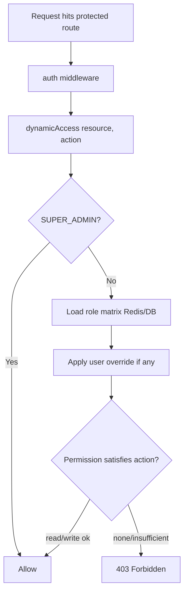
```mermaid
graph TD
    A[Request hits protected route] --> B[auth middleware]
    B --> C[dynamicAccess resource, action]
    C --> D{SUPER_ADMIN?}
    D -- Yes --> P[Allow]
    D -- No --> E[Load role matrix Redis/DB]
    E --> F[Apply user override if any]
    F --> G{Permission satisfies action?}
    G -- none/insufficient --> X[403 Forbidden]
    G -- read/write ok --> P
```

### 8. Input
*   **Role:** `name` (2–100, required), `description`, `status` (active/inactive/deleted).
*   **Menu group:** `name`, `slug`, `icon`, `parentId`, `sortOrder`, `isActive`.
*   **Assignment:** `roleId`, `menuGroupId`, `permissionType` (read/write); per-user: `userId`, `menuGroupId`, `permissionType` (read/write/none), `notes`.

### 9. Output
*   Role/menu records, nested role→menu permission structures, effective per-user permission matrices, personalized menu trees.

### 10. Validation
*   Joi: `createRoleSchema`/`updateRoleSchema` (name, description, status enum); menu-group schemas (name/slug/parentId/sortOrder/isActive); assignment schemas (uuid + permissionType enum). ⚠️ `createMenuSchema`/`updateMenuSchema` under `/roles/menus` are empty pass-through (`.unknown(true)`).

### 11. Business Rules
*   **`rbac([roles])`:** SUPERADMIN always bypasses; a user passes if their role name is listed OR their role level ≥ the lowest listed role's level (`allowHigher`, default true); empty list = any authenticated user.
*   **`dynamicAccess(resource, action)`:** normalizes to read/write (`write` satisfies `read`); resolves role matrix then applies the per-user override (`none` ⇒ deny); supports `checkSelf`/`checkTenant`; API-key principals authorize via scope check.
*   **`abac`:** SUPERADMIN bypass; `checkTenant` compares resource tenant to user tenant (403 mismatch); `checkSelf` allows owner.
*   **Role matrix** is keyed by menu name and slug, with **parent→child inheritance**, cached 3600 s; user overrides cached 300 s; mutations invalidate the relevant cache keys.
*   **System role protection:** system roles cannot be deleted (deactivated + permissions purged instead); assigning an inactive role is rejected.

### 12. Access Rights
| Capability | SUPERADMIN | Other roles |
| --- | --- | --- |
| Role CRUD, menu CRUD, assign/revoke permissions | ✓ (`rbac(["SUPERADMIN"])`) | ✗ |
| Per-user permission overrides | ✓ | ✗ |
| Read own menu set (`/menu-groups`, filter) | ✓ | ✓ (auth only) |

### 13. Database
*   **`roles`** ([role.model.js](backend/src/models/role.model.js)) — PK `id`; unique `name`; `roleLevel`, `isSystem`, `status`; dual soft-delete (`isDeleted` + paranoid).
*   **`menu_groups`** ([menuGroup.model.js](backend/src/models/menuGroup.model.js)) — PK `id`; unique `slug`; self-referential `parentId` (SET NULL); **not paranoid**.
*   **`role_menu_permissions`** ([roleMenuPermission.model.js](backend/src/models/roleMenuPermission.model.js)) — unique `(role_id, menu_group_id)`; `permissionType` read/write.
*   **`user_menu_permissions`** ([userMenuPermission.model.js](backend/src/models/userMenuPermission.model.js)) — unique `(user_id, menu_group_id)`; `permissionType` read/write/**none**; `grantedBy`.

### 14. API
Base: `/api/v1/roles`, `/api/v1/user-permissions`, `/api/v1/menu-groups` — see [roles.route.js](backend/src/routes/api/roles.route.js), [userPermissions.route.js](backend/src/routes/api/userPermissions.route.js), [menuGroups.route.js](backend/src/routes/api/menuGroups.route.js).

| Method | Endpoint | Function |
| --- | --- | --- |
| GET/POST/PATCH/DELETE | `/roles` · `/roles/:id` | Role CRUD |
| GET/POST/PATCH/DELETE | `/roles/menus` · `/roles/menus/:id` | Menu-group CRUD (via roles) |
| POST/DELETE | `/roles/:roleId/permissions[/:menuGroupId]` | Assign/remove role menu permission |
| POST/DELETE | `/roles/assign` · `/roles/assign/:userId` | Assign/clear user role |
| GET/POST/DELETE | `/user-permissions/:userId[/:menuGroupId]` | Per-user override CRUD |
| POST/GET | `/menu-groups/filter` · `/get-assignments` · `/menu-groups[/admin]` | Effective/personalized menus |
| POST | `/menu-groups/{create,update,delete,assign,revoke,bulk-assign,bulk-revoke}` | Menu-group administration |

### 15. Integration
*   **Redis** (`ioredis`) permission cache: `permissions:role:{roleId}` (3600 s), `permissions:user:{userId}` (300 s); graceful degradation when Redis is down.
*   **API-key scopes** (`apiKey.service.scopeAllows`) consulted by `dynamicAccess` for key principals.

### 16. Error Handling
*   `404` role/menu not found; `403` System roles cannot be deleted / insufficient permission / cross-tenant; `400` assign inactive role / invalid permissionType. `rbac` maps to 401/403.

### 17. Log and Audit
*   Redis errors and `dynamicAccess` denials are logged via `logger`. ⚠️ No dedicated audit trail for role/permission mutations.

### 18. Configuration
| Variable | Default | Purpose |
| --- | --- | --- |
| `SUPER_ADMIN_ROLE_ID` | `9be20605-…754b` | Super-admin role UUID |
| `REDIS_URL` / `REDIS_HOST` / `REDIS_PORT` | `redis://localhost:6379` | Permission cache |

### 19. Dependency
`sequelize`, `ioredis`, `joi`, `express`; constants in [roleConstants.js](backend/src/constants/roleConstants.js) (role names, levels, default menu assignments).

### 20. UI/Screen
*   Admin → Roles, Menu Groups, Role-Permission matrix, User Permission overrides; dynamic sidebar rendered from the effective menu set.

### 21. Diagrams
*   Authorization flow in §7; refer to [context.md §7/§17/§18](context.md) for the RBAC schema and menu/permission catalogs.

### 22. Non-Functional Requirements
*   **Performance:** permission checks served from Redis cache to avoid per-request DB joins.
*   **Security:** fail-closed permission resolution; explicit per-user deny (`none`).

### 23. Known Limitations
*   `createMenuSchema`/`updateMenuSchema` (via `/roles/menus`) are empty pass-through validators — effectively unvalidated.
*   **camelCase/snake_case mismatch** in `roles.service` create/update (`is_system`, `parent_id`, `sort_order`) may silently no-op those fields.
*   Dual soft-delete on Role (paranoid `deletedAt` + `isDeleted`) can drift depending on the delete path used.
*   Several defined validators (`assignRoleSchema`, `assignPermissionSchema`, `filterMenuGroupSchema`) are not wired to routes; `menuGroup` delete expects `menuGroupId` while Swagger documents `id`.
*   `TENANT_ADMIN` is a logical level only (not a seeded role) and must be kept in sync with seed data manually.

### 24. Change Log
| Version | Date | Description |
| --- | --- | --- |
| 1.0.0 | 2026-07-15 | Initial documentation (roles, menus, permissions, overrides, caching). |

---
# MODULE 4: User Management

### 1. General Information
*   **Module Name:** User Management Module
*   **Module Code:** HDC-USER
*   **Version:** 1.0.0
*   **Status:** Production
*   **Owner / Person in Charge:** Tenant Administration Team

### 2. Module Description
Manages user accounts within a tenant: listing (with status counts), creation, editing, role assignment, deletion, avatar upload/removal, and username-availability checks. All operations are tenant-scoped with privilege-escalation guards and a protected seeded system account.

### 3. Objectives
*   Give tenant admins safe, isolated control over their own users without exposing cross-tenant data.
*   Prevent privilege escalation (no non-super-admin can create/assign/delete a super-admin).

### 4. Scope
*   **In Scope:** User CRUD, role assignment, avatar management, username checks, status/seat counting.
*   **Out of Scope:** Authentication & password lifecycle (Module 1), permission resolution (Module 3).

### 5. Actors/Users
*   **SUPERADMIN:** manage users across all tenants.
*   **HEALTHCARE/CALIBRATOR ADMIN (tenant admins):** manage users within their tenant (`dynamicAccess("users", …)`).
*   **All users:** edit their own profile / avatar (`checkSelf`).

### 6. Features
*   Tenant-scoped, paginated user directory with ACTIVE/INACTIVE/LOCKED/SUSPENDED counts.
*   Seat-quota-enforced user creation; avatar upload (≤2 MB, image types) with storage-quota enforcement.
*   Privilege-escalation and system-account protection.

### 7. Workflow
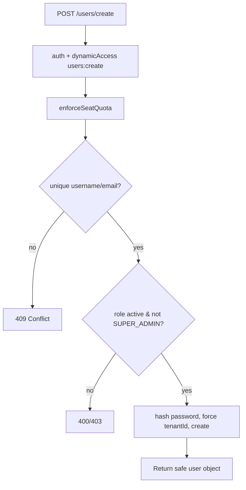
```mermaid
graph TD
    A[POST /users/create] --> B[auth + dynamicAccess users:create]
    B --> C[enforceSeatQuota]
    C --> D{unique username/email?}
    D -- no --> E[409 Conflict]
    D -- yes --> F{role active & not SUPER_ADMIN?}
    F -- no --> G[400/403]
    F -- yes --> H[hash password, force tenantId, create]
    H --> I[Return safe user object]
```

### 8. Input
| Field | Type | Required | Notes |
| --- | --- | --- | --- |
| `username` | String, alphanumeric (3–30) | Yes | Unique, lowercased |
| `firstName` / `lastName` | String (2–100) | Yes | |
| `email` | String, email | Yes | Unique, lowercased |
| `password` | String (min 8) | Yes (create) | bcrypt, cost 12 |
| `roleId` | UUID | Yes (create) | Must be an active role |
| `tenantId` | UUID | Optional | Forced to caller's tenant for non-super-admin |
| `status` | ACTIVE/INACTIVE/SUSPENDED | Optional | Default ACTIVE |
| avatar file | image (jpeg/png/gif/webp) | — | ≤2 MB |

### 9. Output
*   Safe user objects (password, OTP, lockout, role_id fields excluded), status count summary, avatar URLs, `{username, available}` for checks.

### 10. Validation
*   Joi (`stripUnknown`): `getAllUsersQuery`, `createUserSchema`, `updateUserSchema`, `updateRoleSchema`, `usernameCheckSchema`. Status uppercased, email/username lowercased via custom transforms. `validateUuid("userId")` on avatar routes.

### 11. Business Rules
*   **Trusted actor context:** `actorTenantId`/`actorIsSuperAdmin` derived from verified `req.user`, never from client input.
*   **Tenant scoping:** non-super-admins are forced to their own tenant on list/create/edit/delete; super-admin-role users are hidden from tenant listings.
*   **Privilege-escalation guards:** a non-super-admin cannot create, assign, or delete a SUPER_ADMIN account (403).
*   **System account** (`SYSTEM_ACCOUNT_USERNAME`, default `sys`) is always hidden and can **never** be deleted (403), even by super-admin.
*   Cannot delete your own account (400); role must be active to assign (400); duplicate username/email → 409.
*   Passwords hashed via bcryptjs (salt rounds 12); users created with `isEmailVerified=true`.

### 12. Access Rights
| Endpoint | Permission |
| --- | --- |
| `/users/all`, `/users/detail` | `dynamicAccess("users","read",{checkTenant})` |
| `/users/create` | `dynamicAccess("users","create")` + `enforceSeatQuota` |
| `/users/edit` | `dynamicAccess("users","update",{checkSelf,checkTenant})` |
| `/users/role-update` | `dynamicAccess("users","update",{checkTenant})` |
| `/users/delete` | `dynamicAccess("users","delete",{checkTenant})` |
| `/users/:id/avatar` (POST/DELETE) | update + `checkSelf` (+ `enforceStorageQuota` on upload) |
| `/users/username-check` | auth only |

### 13. Database
*   **`users`** ([user.model.js](backend/src/models/user.model.js)) — PK `id`; unique `username`, `email`; `roleId`→`roles.id` (SET NULL), `tenantId`→`tenants.id` (CASCADE); `status`, `isActive`, `avatarUrl` (default `default.svg`); dual soft-delete (`isDeleted` + paranoid). Getter `picture` builds `${HOST_URL}/uploads/profile/<avatarUrl>`. Associations to Role, Tenant, Session, and stock/calibration activity.

### 14. API
Base: `/api/v1/users` — see [user.route.js](backend/src/routes/api/user.route.js).

| Method | Endpoint | Function |
| --- | --- | --- |
| GET | `/users/all` | Paginated tenant-scoped list |
| POST | `/users/detail` | Get user by id |
| POST | `/users/username-check` | Username availability |
| POST | `/users/create` | Create user (seat quota) |
| PATCH | `/users/edit` | Edit user |
| POST | `/users/role-update` | Change user role |
| DELETE | `/users/delete` | Delete user (soft) |
| POST/DELETE | `/users/:userId/avatar` | Upload / remove avatar |

### 15. Integration
*   File uploads via `upload.util` (multer) under `uploads/profile`; `enforceSeatQuota`/`enforceStorageQuota` (Module 16); permission checks reach Redis indirectly via `dynamicAccess`.

### 16. Error Handling
*   `400` validation / already-has-role / own-account / inactive role; `403` cross-tenant / SUPER_ADMIN escalation / system-account protected; `404` user/role not found; `409` username/email already used; `400 No file uploaded` on avatar.

### 17. Log and Audit
*   `logger` records user created/updated/deleted/role-updated and avatar changes with actor id. No dedicated audit table (winston logs only).

### 18. Configuration
| Variable | Default | Purpose |
| --- | --- | --- |
| `SYSTEM_ACCOUNT_USERNAME` | `sys` | Protected system account |
| `SYSTEM_ACCOUNT_EMAIL` | `sys@mail.com` | Protected system account |
| `HOST_URL` | `""` | Avatar URL base |
| `SUPER_ADMIN_ROLE_ID` | seeded UUID | Escalation guard |
| (const) `PASSWORD_SALT_ROUNDS` / `PASSWORD_MIN_LENGTH` | 12 / 8 | Password hashing |

### 19. Dependency
`sequelize`, `joi`, `bcryptjs`, `multer` (avatar), `winston`; internal `password.util`, `upload.util`, `enforceQuota.middleware`, `dynamicAccess`.

### 20. UI/Screen
*   Admin → Users list, Create/Edit user, Assign role, Profile & Avatar management.

### 21. Diagrams
*   Create-user flow in §7. See [context.md §16](context.md) for the TENANTS→USERS→ROLES ERD.

### 22. Non-Functional Requirements
*   **Security:** BOLA/BFLA-safe (server-derived tenant scoping), privilege-escalation guards, sensitive fields stripped from responses.
*   **Performance:** paginated queries (default 50, max 200) with status counts computed in a single grouped query.

### 23. Known Limitations
*   **`removeUserAvatar` writes to `picture`** (a computed getter, not a column) instead of `avatar_url` — the reset likely does not persist.
*   Swagger for `/create` advertises stronger password rules than the Joi schema enforces (`min(8)` only).
*   Divergent `limit` defaults (query validator 50 vs service `DEFAULT_LIMIT` 25); `getAllUsersSimple` controller export has no route.
*   Dual soft-delete (paranoid + `isDeleted`).

### 24. Change Log
| Version | Date | Description |
| --- | --- | --- |
| 1.0.0 | 2026-07-15 | Initial documentation (user CRUD, roles, avatars, guards). |

---
# MODULE 5: Tenant Management

### 1. General Information
*   **Module Name:** Tenant Management Module
*   **Module Code:** HDC-TENANT
*   **Version:** 1.0.0
*   **Status:** Production (hierarchy & custom-domains are Development — see §23)
*   **Owner / Person in Charge:** Platform / Multi-Tenancy Team

### 2. Module Description
Manages tenant organizations: creation, update, deletion, branding (logo/color), key-value settings, public pre-login branding, tenant hierarchy (parent/child trees), and custom domain registration with DNS/TLS verification. Tenant isolation is enforced platform-wide via an AsyncLocalStorage context, Sequelize hooks, and native PostgreSQL Row-Level Security.

### 3. Objectives
*   Provide isolated, brandable workspaces on shared infrastructure.
*   Support organizational hierarchies and vanity/custom domains for enterprise tenants.

### 4. Scope
*   **In Scope:** Tenant CRUD, settings, branding, user-count, hierarchy tree/reparenting, custom domain add/verify/DNS.
*   **Out of Scope:** Tenant suspension/offboarding (Module 6), backups (Module 7), billing (Module 16).

### 5. Actors/Users
*   **SUPERADMIN:** manage all tenants and hierarchy.
*   **Tenant admins:** manage own tenant settings/branding (`dynamicAccess("Management", …)`).
*   **Public:** read pre-login branding via `X-Tenant-ID`.

### 6. Features
*   Tenant CRUD with unique subdomain/code, logo upload, primary-color branding.
*   Key-value settings synced into the tenant `settings` JSONB.
*   Hierarchy: tree, children/parent, descendants/ancestors, reparenting, depth limit.
*   Custom domains: add, DNS TXT verification, TLS provisioning, default domain.

### 7. Workflow
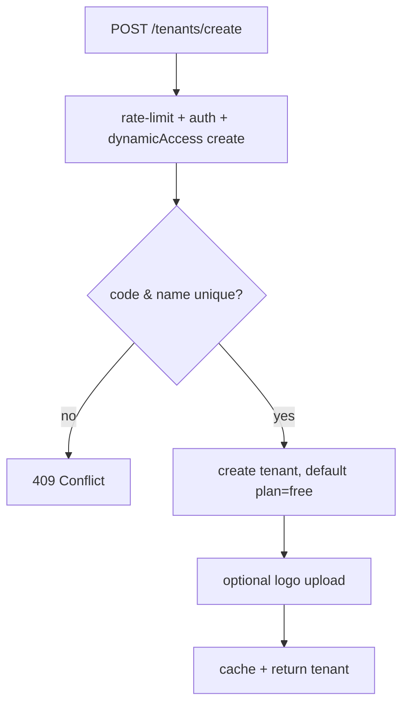
```mermaid
graph TD
    A[POST /tenants/create] --> B[rate-limit + auth + dynamicAccess create]
    B --> C{code & name unique?}
    C -- no --> D[409 Conflict]
    C -- yes --> E[create tenant, default plan=free]
    E --> F[optional logo upload]
    F --> G[cache + return tenant]
```

### 8. Input
*   **Tenant:** `name` (2–100), `code` (2–50), `email`, `primaryColor` (#RRGGBB), `status`, `maxUsers`, contact fields, logo file.
*   **Hierarchy:** `name` (child), optional `code`, `plan`. **Custom domain:** `domain` (hostname), `type` (subdomain/custom/vanity), `sslEnabled`.

### 9. Output
*   Tenant records, settings maps, branding payloads (id/name/code/primaryColor/logo), hierarchy trees, domain status + DNS instructions.

### 10. Validation
*   Joi: `createTenantSchema`/`updateTenantSchema` (name, code, primaryColor regex, status enum, contact fields), `addChild` (hierarchy), `addDomain` (`Joi.hostname()`). `validate()` throws `400 Validation failed`.

### 11. Business Rules
*   **Create:** unique `code` then `name` (409 on conflict), transactional, default `logo=default.svg`, plan `free`, `limitSeats=5`.
*   **Delete:** blocked (400) if the tenant still has active users; logo file removed; soft delete (paranoid).
*   **Settings:** upserted into `tenant_settings` and mirrored into `Tenant.settings` JSONB (skips `tenantId`/`settings` keys).
*   **Hierarchy** (gated by `HIERARCHY_ENABLED`): parent must exist and be active; child code auto-generated `PARENT_NNN`; `path`/`depth` computed; depth > `HIERARCHY_MAX_DEPTH` (default 5) rejected; child inherits parent plan; optional role cascade.
*   **Custom domains** (gated by `CUSTOM_DOMAINS_ENABLED`): duplicate active domain → 409; verification uses a crypto TXT token; DNS check and TLS provisioning are currently **simulated**.

### 12. Access Rights
| Capability | SUPERADMIN | Tenant admin | Public |
| --- | --- | --- | --- |
| Tenant CRUD, settings, logo | ✓ | ✓ (`dynamicAccess("Management")`, self) | ✗ |
| Public branding | ✓ | ✓ | ✓ (`X-Tenant-ID`) |
| Hierarchy & custom domains | ✓ | ✓ (auth) | ✗ |

### 13. Database
*   **`tenants`** ([tenant.model.js](backend/src/models/tenant.model.js)) — PK `id`; unique `subdomain`, `domain`, `code`; `plan` (free/professional/business/enterprise), `status` (active/suspended/deleted), `billingCycle`, `settings` JSONB, `limitSeats`, `limitStorageMb`; dual soft-delete.
*   **`tenant_settings`** ([tenantSettings.model.js](backend/src/models/tenantSettings.model.js)) — unique `(tenant_id, key)`; KMS-encrypted sensitive keys.
*   Hierarchy/custom-domain records referenced via `TenantHierarchy` / `CustomDomains` tables (raw SQL on Postgres).

### 14. API
Base: `/api/v1/tenants`, `/api/v1/tenant-hierarchy`, `/api/v1/custom-domains`.

| Method | Endpoint | Function |
| --- | --- | --- |
| GET/POST | `/tenants/all` · `/tenants/detail` | List / get tenant |
| GET | `/tenants/public` | Public branding (no auth) |
| POST/PATCH/DELETE | `/tenants/create` · `/edit` · `/delete` | Tenant CRUD |
| POST/PATCH | `/tenants/settings` | Get / update settings |
| POST/DELETE | `/tenants/:id/logo` | Logo upload / remove |
| GET | `/tenant-hierarchy/tree` · `/:id/{children,parent,descendants,ancestors}` | Hierarchy queries |
| POST/PUT/DELETE | `/tenant-hierarchy/:id/parent` · `/:parentId/children` | Reparent / add child |
| GET/POST/DELETE | `/custom-domains/domains[...]` | Domain add/verify/DNS/status |

### 15. Integration
*   **Redis** caching (`tenants:*`, branding, settings; TTL 300–900 s); local disk logo storage (multer); **KMS** for settings encryption; **Email queue** for domain-verification; DNS/TLS provisioning **simulated**; PostgreSQL RLS.

### 16. Error Handling
*   `400` validation / delete-with-users / feature disabled / invalid domain; `404` tenant/domain not found; `409` duplicate code/name/domain; `403` insufficient permission.

### 17. Log and Audit
*   `logger` records tenant create/update/delete, settings update, logo changes, hierarchy operations, domain add/remove. No dedicated audit table.

### 18. Configuration
| Variable | Default | Purpose |
| --- | --- | --- |
| `HOST_URL` | `http://localhost:5000` | Logo URL base |
| `MAX_FILE_SIZE` | 5 MB | Upload limit |
| `HIERARCHY_ENABLED` / `HIERARCHY_MAX_DEPTH` / `HIERARCHY_CASCADE_ROLES` | off / 5 / off | Hierarchy feature |
| `CUSTOM_DOMAINS_ENABLED` / `DEFAULT_SUBDOMAIN` / `DNS_CHECK_INTERVAL` / `TLS_AUTO_PROVISION` | off / `app` / 300 / off | Custom domains |

### 19. Dependency
`sequelize`, `joi`, Node `crypto`, `multer` (upload.util), Redis client; internal `kms.service`, `emailQueue.service`, `tenantContext`/`rlsEnforcement` middleware.

### 20. UI/Screen
*   Admin → Tenants list/detail, Tenant Settings, Branding, Hierarchy tree, Custom Domains; public branded login.

### 21. Diagrams
*   Create-tenant flow in §7; multi-tenant architecture in [context.md §5/§16](context.md).

### 22. Non-Functional Requirements
*   **Security:** three-layer tenant isolation (AsyncLocalStorage hooks + FORCE RLS policy); KMS-encrypted secrets.
*   **Scalability:** Redis-cached tenant lookups to reduce DB load on hot paths.

### 23. Known Limitations
*   **`customDomains.controller` and `tenantHierarchy.controller` destructure service objects that the services don't export** → several endpoints would be `undefined` at runtime; some domain methods (`getDomainStatus`, `setDefaultDomain`, `getDnsRecords`) are not implemented.
*   DNS TXT verification and TLS provisioning are simulated stubs; `resolveTenantByDomain` checks a function reference (always truthy) instead of calling it.
*   The Tenant model lacks several address/contact/`maxUsers` columns that the service reads/writes; `deleteTenant` constructs `AppError` with reversed args.

### 24. Change Log
| Version | Date | Description |
| --- | --- | --- |
| 1.0.0 | 2026-07-15 | Initial documentation (tenant CRUD, settings, hierarchy, custom domains). |

---
# MODULE 6: Tenant Lifecycle Management

### 1. General Information
*   **Module Name:** Tenant Lifecycle Management Module
*   **Module Code:** HDC-TLC
*   **Version:** 1.0.0
*   **Status:** Development (schema gaps — see §23)
*   **Owner / Person in Charge:** Platform / Multi-Tenancy Team

### 2. Module Description
Manages the operational lifecycle of a tenant beyond simple CRUD: suspension (dunning or administrative), resumption, grace periods, offboarding with a retention window, cancellation, and data export. A daily background processor automatically offboards tenants whose grace period has expired.

### 3. Objectives
*   Provide a controlled, auditable path for suspending and decommissioning tenants.
*   Preserve a data-export snapshot and retention window before permanent deletion.

### 4. Scope
*   **In Scope:** Lifecycle status, suspend/resume, grace period, offboard/cancel, tenant data export, scheduled grace-period expiry.
*   **Out of Scope:** Tenant creation/branding (Module 5), backups (Module 7), billing dunning triggers (Module 16).

### 5. Actors/Users
*   **SUPERADMIN:** all mutating lifecycle actions (`superAdminOnly`).
*   **Tenant admins:** read lifecycle status only.
*   **System scheduler:** processes expired grace periods daily.

### 6. Features
*   Lifecycle state machine: TRIAL → ACTIVE → SUSPENDED → (ACTIVE | OFFBOARDED).
*   Grace period with configurable duration; offboarding with retention window.
*   Full tenant data export (tenant + users + settings + subscriptions + invoices).

### 7. Workflow
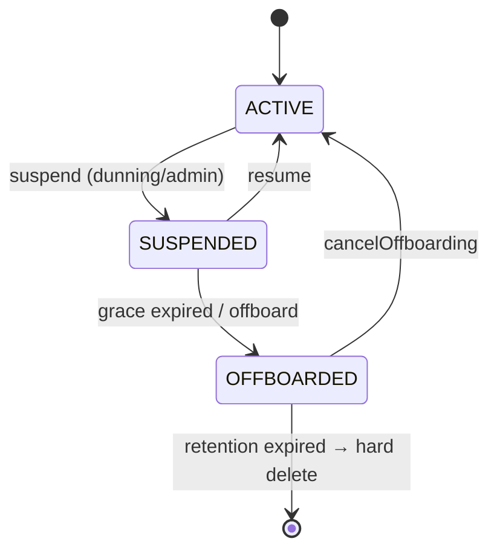
```mermaid
stateDiagram-v2
    [*] --> ACTIVE
    ACTIVE --> SUSPENDED: suspend (dunning/admin)
    SUSPENDED --> ACTIVE: resume
    SUSPENDED --> OFFBOARDED: grace expired / offboard
    OFFBOARDED --> ACTIVE: cancelOffboarding
    OFFBOARDED --> [*]: retention expired → hard delete
```

### 8. Input
*   `tenantId` (UUID), `reason` (String, required for suspend), `force` (offboard).

### 9. Output
*   Lifecycle status snapshot; export data JSON (`exportedAt` + tenant/users/settings/subscriptions/invoices); action results.

### 10. Validation
*   Joi: `tenantIdSchema` (params), `suspendTenantSchema` (`tenantId` + `reason`, from body). `validate()` throws `400 Validation failed`.

### 11. Business Rules
*   **suspend/resume** are idempotent; suspend records `suspensionReason/suspendedAt/suspendedBy` and mirrors `lifecycle_status` into `tenant_settings`.
*   **enterGracePeriod:** `gracePeriodExpiresAt = now + TENANT_GRACE_PERIOD_DAYS`.
*   **offboard:** runs `exportTenantData` first, sets `offboardedAt` and `offboardRetentionExpiresAt = now + TENANT_OFFBOARD_RETENTION_DAYS`; idempotent unless `force`.
*   **hardDeleteOffboardedTenant** (not routed): requires status OFFBOARDED and retention expired, then destroys Users, Subscription, Invoice, TenantSettings, and the Tenant.
*   **processExpiredGracePeriods** (daily): offboards suspended tenants whose grace period has expired.

### 12. Access Rights
| Capability | SUPERADMIN | Tenant admin |
| --- | --- | --- |
| Read status | ✓ | ✓ |
| suspend / resume / grace-period / offboard / cancel / export | ✓ (`superAdminOnly`) | ✗ |

### 13. Database
*   Uses the **`tenants`** table plus lifecycle fields (`suspensionReason`, `suspendedAt`, `gracePeriodExpiresAt`, `offboardedAt`, `offboardRetentionExpiresAt`) — ⚠️ these columns are referenced by the service but not defined in the current model (§23).
*   **`tenant_settings`** stores `lifecycle_status`. Reads `User`, `Subscription`, `Invoice` for export/hard-delete.

### 14. API
Base: `/api/v1/tenants` (tenantLifecycle routes) — see [tenantLifecycle.route.js](backend/src/routes/api/tenantLifecycle.route.js).

| Method | Endpoint | Function |
| --- | --- | --- |
| GET | `/tenants/:tenantId/status` | Lifecycle status |
| POST | `/tenants/:tenantId/suspend` · `/resume` | Suspend / resume |
| POST | `/tenants/:tenantId/grace-period` | Enter grace period |
| POST | `/tenants/:tenantId/offboard` · `/offboard/cancel` | Offboard / cancel |
| GET | `/tenants/:tenantId/export` | Export tenant data |

### 15. Integration
*   **Scheduled processor** via `setInterval` (daily) in [index.js](backend/index.js#L606-L619); PostgreSQL RLS; `featureFlag.service` imported (unused).

### 16. Error Handling
*   `404` Tenant not found; `400` Tenant is not offboarded / Retention period has not expired yet / validation. Via `AppError`.

### 17. Log and Audit
*   `logger.warn` on suspend/offboard/hard-delete; `logger.info` on resume/grace/cancel/processed. No dedicated audit table.

### 18. Configuration
| Variable | Default | Purpose |
| --- | --- | --- |
| `TENANT_GRACE_PERIOD_DAYS` | 7 | Grace window |
| `TENANT_OFFBOARD_RETENTION_DAYS` | 30 | Retention before hard delete |

### 19. Dependency
`sequelize`, `joi`; internal `tenantLifecycle.service`, models User/Subscription/Invoice/TenantSettings.

### 20. UI/Screen
*   Admin → Tenant lifecycle console (status, suspend/resume, offboard); export download.

### 21. Diagrams
*   State machine in §7.

### 22. Non-Functional Requirements
*   **Reliability:** offboarding always exports data first; retention window prevents accidental permanent loss.
*   **Auditability:** every transition is logged with actor and reason.

### 23. Known Limitations
*   **Lifecycle columns are not defined in the Tenant model** (`suspendedAt`, `gracePeriodExpiresAt`, etc.) — writes would fail on Postgres.
*   Service writes UPPERCASE statuses (`ACTIVE`/`SUSPENDED`/`OFFBOARDED`) but the Tenant `status` ENUM only permits lowercase `active`/`suspended`/`deleted` (no `OFFBOARDED`/`TRIAL`) — enum conflict.
*   Scheduler uses a plain `setInterval` (not cron); `featureFlag.service.isEnabled` imported but unused.

### 24. Change Log
| Version | Date | Description |
| --- | --- | --- |
| 1.0.0 | 2026-07-15 | Initial documentation (suspend/resume, grace period, offboarding, export). |

---
# MODULE 7: Tenant Backup & Disaster Recovery

### 1. General Information
*   **Module Name:** Tenant Backup & Disaster Recovery Module
*   **Module Code:** HDC-BAK
*   **Version:** 1.0.0
*   **Status:** Production (simplified scope — see §23)
*   **Owner / Person in Charge:** Platform / SRE Team

### 2. Module Description
Creates, lists, downloads, restores, and deletes per-tenant data backups as encrypted-at-rest ZIP archives on local storage, with checksums, retention windows, and restore (replace or merge) semantics. Backups currently cover tenant metadata and user records.

### 3. Objectives
*   Provide tenant-level point-in-time recovery and exportable archives.
*   Support both full-replace and merge restores with integrity verification.

### 4. Scope
*   **In Scope:** Backup create/list/stats/detail/download/restore/delete, checksum, retention/expiry.
*   **Out of Scope:** Platform-wide database backups, off-site replication, PITR (WAL) — infrastructure concerns.

### 5. Actors/Users
*   **SUPERADMIN & TENANT_ADMIN:** create/list/restore/delete backups for their tenant (`rbac` + `abac`).

### 6. Features
*   ZIP backup with `tenant_data_<type>.json` + `backup_metadata.json`, SHA-256 checksum.
*   Full or user-only backup types; retention-day expiry; restore with optional merge.
*   Backup statistics (totals, size, latest, validity).

### 7. Workflow
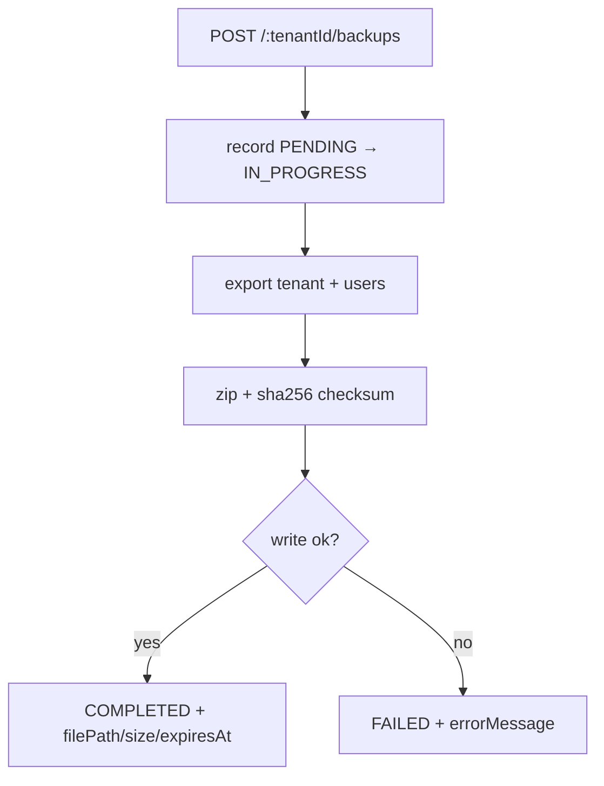
```mermaid
graph TD
    A[POST /:tenantId/backups] --> B[record PENDING → IN_PROGRESS]
    B --> C[export tenant + users]
    C --> D[zip + sha256 checksum]
    D --> E{write ok?}
    E -- yes --> F[COMPLETED + filePath/size/expiresAt]
    E -- no --> G[FAILED + errorMessage]
```

### 8. Input
*   `name` (2–100, required), `description`, `backupType` (FULL/PARTIAL/USER_ONLY), `retentionDays` (1–365, default 90), `tag`; restore: `mergeData` (boolean).

### 9. Output
*   Backup records (status, size, checksum, expiresAt), downloadable ZIP stream, restore result (recordsProcessed), statistics.

### 10. Validation
*   Joi via `validation.middleware`: `createBackupSchema`, `restoreBackupSchema`. `validateUuid` on `tenantId`/`backupId`.

### 11. Business Rules
*   **create:** 404 if tenant missing; PENDING → IN_PROGRESS → COMPLETED/FAILED; filename `tenant_<tenantId>_<backupId>_<timestamp>.zip`; `recordCount` = users length.
*   **download:** only when status COMPLETED and file present (else 400/404); streams `application/zip`.
*   **restore:** COMPLETED only; transactional; `mergeData` → findOrCreate users by username/email, else destroy all tenant users then bulkCreate from backup (password hashes preserved); status RESTORED (or FAILED + rollback).
*   **delete:** soft delete (paranoid) after unlinking the file; reverts to COMPLETED on failure.
*   **retention:** `cleanupExpiredBackups` (not routed) unlinks + soft-destroys COMPLETED backups past `expiresAt`.

### 12. Access Rights
| Capability | SUPERADMIN | TENANT_ADMIN | Others |
| --- | --- | --- | --- |
| create/restore/delete | ✓ | ✓ (`abac` UPDATE/DELETE, own tenant) | ✗ |
| list/stats/detail/download | ✓ | ✓ (`abac` READ) | ✗ |

### 13. Database
*   **`tenant_backups`** ([tenantBackup.model.js](backend/src/models/tenantBackup.model.js)) — PK `id`; `tenantId`→`tenants.id` (CASCADE); `status` (pending/in_progress/completed/failed/deleted), `backupType`, `tag`, `filePath`, `fileSize`, `recordCount`, `retentionDays` (default 30), `expiresAt`, `metadata` JSON, `createdBy`, `deletedBy`; paranoid; indexes on tenant_id/status/created_at.

### 14. API
Base: `/api/v1/tenants/:tenantId/backups` — see [tenantBackup.route.js](backend/src/routes/api/tenantBackup.route.js).

| Method | Endpoint | Function |
| --- | --- | --- |
| POST/GET | `/backups` | Create / list backups |
| GET | `/backups/stats` | Backup statistics |
| GET | `/backups/:backupId` · `/download` | Detail / download ZIP |
| POST | `/backups/:backupId/restore` | Restore (replace/merge) |
| DELETE | `/backups/:backupId` | Delete backup |

### 15. Integration
*   Local filesystem (`fs`), **jszip** (archive), Node `crypto` (SHA-256), **moment** (timestamps); recurring `cronBackup()` from [backup.middleware.js](backend/src/middlewares/backup.middleware.js) started at boot; storage path via `storagePath.util`.

### 16. Error Handling
*   `400` Backup name required / not ready for download|restore; `404` backup/file/tenant not found; `403` rbac/abac; failures wrapped as `InternalServerError`.

### 17. Log and Audit
*   `logger.info` on created/restored/deleted/expired cleanup; `logger.error` on failures. Metadata records `createdById`/`restoredById`.

### 18. Configuration
| Variable | Default | Purpose |
| --- | --- | --- |
| `npm_package_version` | `1.0.0` | Backup metadata app version |
| (path) `storagePath("backup","tenant-backups")` | — | Backup directory |

### 19. Dependency
`jszip`, `moment`, `sequelize`, Node `fs`/`path`/`crypto`.

### 20. UI/Screen
*   Admin → Backups list, Create backup, Restore dialog, Backup statistics.

### 21. Diagrams
*   Backup lifecycle in §7. See [context.md §15](context.md) for the DR strategy.

### 22. Non-Functional Requirements
*   **Integrity:** SHA-256 checksum per archive; restore validates metadata + tenant before applying.
*   **Safety:** restore runs in a transaction with rollback; delete is reversible on failure.

### 23. Known Limitations
*   Simplified scope — backups cover only tenant + users (TenantSettings/roles/permissions not included).
*   **backupType case mismatch** (validator uppercase `FULL`/`USER_ONLY` vs model constants lowercase) makes user export effectively dead; the model is missing `name`/`description` columns used by `createBackup`.
*   Status values `restoring`/`restored`/`deleting` used by the service are not in the DB ENUM; `retentionDays` default differs (90 validator vs 30 model). Local disk only (no S3/off-site).

### 24. Change Log
| Version | Date | Description |
| --- | --- | --- |
| 1.0.0 | 2026-07-15 | Initial documentation (backup create/restore/retention). |

---
# MODULE 8: Warehouse & Inventory Management

### 1. General Information
*   **Module Name:** Warehouse & Inventory Management Module
*   **Module Code:** HDC-WH
*   **Version:** 1.0.0
*   **Status:** Production
*   **Owner / Person in Charge:** Supply Chain & Logistics Lead

### 2. Module Description
Tracks warehouses, storage locations, and inventory (spare parts, calibration kits, tools). Supports stock CRUD, quantity adjustments with reasons, inter-warehouse transfers (with an approval workflow), and stock opname (physical count) sessions, plus an inventory summary report and CSV export.

### 3. Objectives
*   Maintain accurate, location-aware inventory to prevent maintenance/calibration delays.
*   Enforce an auditable ledger for every stock movement (adjustment/transfer).

### 4. Scope
*   **In Scope:** Warehouses, storage locations, stock items, adjustments, transfers, opname sessions, inventory report/export.
*   **Out of Scope:** Carrier/shipping integration, barcode hardware, per-item opname variance reconciliation.

### 5. Actors/Users
*   **WAREHOUSE STAFF:** create/adjust stock, initiate transfers, run opname (write).
*   **Admins / other roles:** read inventory and reports (all gated by `dynamicAccess("warehouse", …)`).

### 6. Features
*   Warehouse & storage-location CRUD with uniqueness checks.
*   Stock CRUD; add/subtract/write-off adjustments; inter-warehouse transfers with ship/receive balance movement.
*   Stock opname sessions; inventory summary with low-stock detection; CSV export.

### 7. Workflow
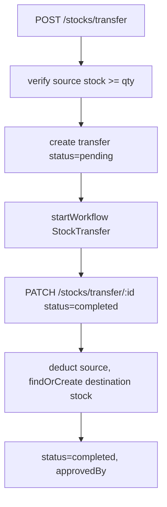
```mermaid
graph TD
    A[POST /stocks/transfer] --> B[verify source stock >= qty]
    B --> C[create transfer status=pending]
    C --> D[startWorkflow StockTransfer]
    D --> E[PATCH /stocks/transfer/:id status=completed]
    E --> F[deduct source, findOrCreate destination stock]
    F --> G[status=completed, approvedBy]
```

### 8. Input
*   **Warehouse:** `name`, `code`, address fields, `status`. **Location:** `warehouseId`, `name`, `code`, `isActive`.
*   **Stock:** `warehouseId`, `locationId`, `itemName`, `sku`, `serialNumber`, `quantity`, `minQuantity`.
*   **Adjustment:** `stockId`, `type` (addition/subtraction/write_off), `quantity`, `reason`. **Transfer:** `fromWarehouseId`, `toWarehouseId`, `itemName`, `quantity`. **Opname:** `warehouseId`, `scheduledAt`.

### 9. Output
*   Warehouse/location/stock records, adjustment & transfer ledgers, opname sessions, inventory summary metrics, CSV export.

### 10. Validation
*   Joi (`stripUnknown`): warehouse/location/stock/adjustment/transfer/opname schemas with quantity ≥ 0/≥ 1 rules and enum status fields; `validateUuid` on path IDs.

### 11. Business Rules
*   **Adjustment math:** `addition` increments; `subtraction`/`write_off` decrement with an insufficient-stock guard (400).
*   **Transfer:** source ≠ destination (400); stock not deducted at creation; on `completed`, source is deducted and destination stock is `findOrCreate`d/incremented; terminal transfers (completed/cancelled) cannot be updated.
*   **Opname:** created as `draft`; on `completed` sets `completedAt`; no per-item variance capture.
*   **Uniqueness:** warehouse code per tenant, location code per warehouse, stock SKU/serial per tenant+warehouse (409).
*   **Delete guards:** cannot delete a warehouse/location that still has stock. All mutations run inside a DB transaction (no row locking).

### 12. Access Rights
| Capability | Permission |
| --- | --- |
| Read warehouses/stock/reports | `dynamicAccess("warehouse","read")` |
| Create/update/delete warehouse, location, stock | `dynamicAccess("warehouse","write")` |
| Adjustments, transfers, opname | `dynamicAccess("warehouse","write")` |

### 13. Database
*   **`warehouses`** ([warehouse.model.js](backend/src/models/warehouse.model.js)) — PK `id`; `tenantId`; `code`; `status`; soft-delete (`isDeleted`).
*   **`storage_locations`** ([storageLocation.model.js](backend/src/models/storageLocation.model.js)) — belongsTo warehouse; **hard delete**.
*   **`stocks`** ([stock.model.js](backend/src/models/stock.model.js)) — `itemName`, `sku`, `serialNumber`, `quantity`, `minQuantity`; soft-delete.
*   **`stock_transfers`** — `from/toWarehouseId`, `status` (pending/in_transit/completed/cancelled), `requestedBy`/`approvedBy`.
*   **`stock_adjustments`** — `type`, `quantity`, `reason`, `adjustedBy`. **`stock_opnames`** — `status`, `scheduledAt`, `performedBy`.

### 14. API
Base: `/api/v1/warehouses`, `/api/v1/stocks` — see [warehouse.route.js](backend/src/routes/api/warehouse.route.js), [stock.route.js](backend/src/routes/api/stock.route.js).

| Method | Endpoint | Function |
| --- | --- | --- |
| GET/POST/PATCH/DELETE | `/warehouses[/:warehouseId]` | Warehouse CRUD |
| GET/POST/PATCH/DELETE | `/warehouses/:id/locations` · `/warehouses/locations[/:locationId]` | Location CRUD |
| GET/POST/PATCH/DELETE | `/stocks[/:stockId]` | Stock CRUD |
| POST/GET | `/stocks/adjustment[/history]` | Adjust / adjustment history |
| POST/PATCH/GET | `/stocks/transfer[/:transferId][/history]` | Transfers |
| POST/PATCH/GET | `/stocks/opname[/:opnameId][/history]` | Stock opname |
| GET | `/stocks/reports/summary` · `/reports/export` | Inventory report / CSV |

### 15. Integration
*   **Workflow engine** — `startWorkflow(tenantId, "StockTransfer", id)` on transfer creation; CSV export built in-code.

### 16. Error Handling
*   `400` insufficient stock / same source-destination / terminal transfer / delete-with-stock; `404` warehouse/location/stock/transfer/opname not found; `409` duplicate code/SKU/serial.

### 17. Log and Audit
*   `logger.info` on every mutation; the `stock_adjustments` and `stock_transfers` tables act as the movement ledger (with actor attribution).

### 18. Configuration
*   No module-specific env vars; low-stock derived from per-item `minQuantity` vs `quantity`. Pagination via `DEFAULT_LIMIT`.

### 19. Dependency
`sequelize`, `joi`, `express`; internal `workflow.service`, `dynamicAccess`, `validateUuid`.

### 20. UI/Screen
*   Warehouses, Storage Locations, Stock Directory, Adjustment & Transfer logs, Stock Opname form, Inventory Report.

### 21. Diagrams
*   Transfer flow in §7. See [context.md §9](context.md) for the warehouse domain.

### 22. Non-Functional Requirements
*   **Consistency:** all quantity changes are transactional.
*   **Traceability:** every movement is attributable to a user and reason.

### 23. Known Limitations
*   **Swagger drifts significantly from implementation** (adjustment types, transfer fields, opname `results`, stock fields all differ).
*   Transfers/adjustments match stock by `itemName` string (not FK), risking collisions; stock routes use the `"warehouse"` permission (no separate `stock` permission).
*   No row-level locking (race window on concurrent quantity updates); storage locations lack soft-delete/capacity; opname stores no line items or variance.

### 24. Change Log
| Version | Date | Description |
| --- | --- | --- |
| 1.0.0 | 2026-07-15 | Initial documentation (warehouses, stock, adjustments, transfers, opname). |

---
# MODULE 9: Calibration Device Management

### 1. General Information
*   **Module Name:** Calibration Device Management Module
*   **Module Code:** HDC-CDEV
*   **Version:** 1.0.0
*   **Status:** Production
*   **Owner / Person in Charge:** Calibration Engineering Team

### 2. Module Description
Maintains the catalog of medical/measurement devices subject to calibration: identity (serial, manufacturer, model, category), lifecycle status, calibration interval and next-due date, uncertainty budget, IoT enablement (token + tolerances), and algorithmic interval recommendations. Supports CRUD and CSV bulk import.

### 3. Objectives
*   Provide an authoritative, tenant-isolated device register driving calibration scheduling and records.
*   Enable bulk onboarding of device fleets via CSV.

### 4. Scope
*   **In Scope:** Device CRUD, list/search/filter, CSV bulk import, interval/next-due fields.
*   **Out of Scope:** Calibration execution/records (Module 10), certificates (Module 11), maintenance (Module 12).

### 5. Actors/Users
*   **CALIBRATOR ADMIN / TECHNICIAN:** create/update devices (write).
*   **All roles with equipment access:** view devices (read).

### 6. Features
*   Device register with unique serial number and lifecycle status.
*   Calibration interval + next-due tracking; uncertainty budget (JSONB); IoT token & reading tolerance.
*   CSV bulk import with per-row validation and de-duplication.

### 7. Workflow
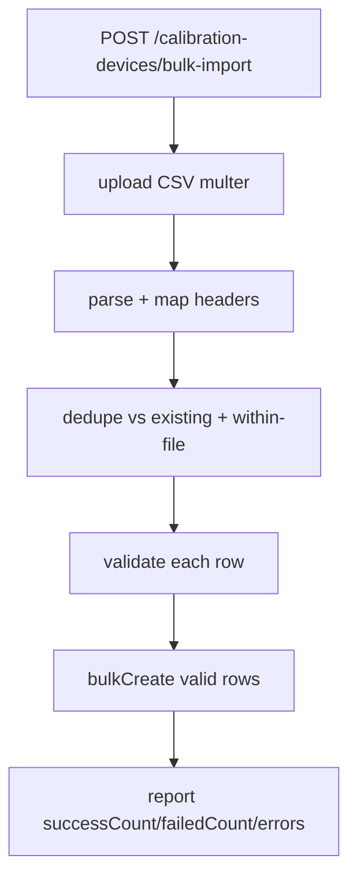
```mermaid
graph TD
    A[POST /calibration-devices/bulk-import] --> B[upload CSV multer]
    B --> C[parse + map headers]
    C --> D[dedupe vs existing + within-file]
    D --> E[validate each row]
    E --> F[bulkCreate valid rows]
    F --> G[report successCount/failedCount/errors]
```

### 8. Input
*   `name` (2–255, required), `serialNumber`, `manufacturer`, `model`, `category`, `status`, `locationId`, `installationDate`, `nextCalibrationDate`, `calibrationIntervalDays`, `remarks`; CSV file for bulk import.

### 9. Output
*   Device records (with warehouse + last 10 calibration records on detail), bulk-import report.

### 10. Validation
*   Joi (`stripUnknown`): `createCalibrationDeviceSchema`/`updateCalibrationDeviceSchema` (name, serial, status enum active/inactive/maintenance/retired, interval ≥ 1). Query filters for list. `validateUuid` on IDs.

### 11. Business Rules
*   **Create:** duplicate `serialNumber` per tenant → 409 (skipped when serial is null).
*   **Detail:** left-joins warehouse and the latest 10 calibration records (excluding `results`).
*   **Delete:** soft delete.
*   **Bulk import:** hand-rolled CSV parse; header aliasing; dedupe vs existing tenant serials and within-file; per-row schema validation; returns `{successCount, failedCount, totalCount, errors[]}`.

### 12. Access Rights
| Capability | Permission |
| --- | --- |
| List/detail | `dynamicAccess("calibration","read")` |
| Create/update/delete/bulk-import | `dynamicAccess("calibration","write")` |

### 13. Database
*   **`calibration_devices`** ([calibrationDevice.model.js](backend/src/models/calibrationDevice.model.js)) — PK `id`; `tenantId`→`tenants.id` (CASCADE); unique `serialNumber`; `status` (active/inactive/maintenance/retired); `locationId`→`warehouses.id` (SET NULL); `calibrationIntervalDays`, `nextCalibrationDate`, `uncertaintyBudget` (JSONB), `iotDeviceToken` (unique), `iotEnabled`, `readingTolerance` (JSONB), `recommendedCalibrationInterval`, `recommendationReason`; soft-delete (`isDeleted` + paranoid); indexes on tenant_id/serial_number/status/next_calibration_date. hasMany `CalibrationRecord`.

### 14. API
Base: `/api/v1/calibration-devices` — see [calibrationDevices.route.js](backend/src/routes/api/calibrationDevices.route.js).

| Method | Endpoint | Function |
| --- | --- | --- |
| GET/POST | `/` | List / create device |
| GET/PUT/DELETE | `/:calibrationDeviceId` | Detail / update / delete |
| POST | `/bulk-import` | CSV bulk import |

### 15. Integration
*   CSV upload via `upload.util` (multer); links to warehouses; feeds the scheduler and predictive-maintenance modules (IoT fields).

### 16. Error Handling
*   `400` validation / no CSV file / <2 lines; `409` duplicate serial; `404` device not found.

### 17. Log and Audit
*   `logger.error` on service failures; request-level activity logging. No dedicated audit table.

### 18. Configuration
*   No module-specific env vars; pagination via `DEFAULT_LIMIT`/query validator (default 20).

### 19. Dependency
`sequelize`, `joi`, `express`, `multer` (upload.util).

### 20. UI/Screen
*   Equipment → Device list/detail, Create/Edit device, Bulk import (CSV).

### 21. Diagrams
*   Bulk-import flow in §7. See [context.md §10](context.md) for the medical-device domain.

### 22. Non-Functional Requirements
*   **Data quality:** per-row validation on bulk import; unique serials.
*   **Performance:** indexed queries on tenant, serial, status, next-due date.

### 23. Known Limitations
*   Swagger lists a different `status` enum (`available/in_use/...`) than the model.
*   `serialNumber` is globally unique at the DB level while the app dedups per tenant (cross-tenant serial collision possible).
*   IoT/uncertainty/recommendation columns exist but are not writable via the create/update validators (`stripUnknown`).

### 24. Change Log
| Version | Date | Description |
| --- | --- | --- |
| 1.0.0 | 2026-07-15 | Initial documentation (device register, bulk import). |

---
# MODULE 10: Calibration Records & Scheduling

### 1. General Information
*   **Module Name:** Calibration Records & Scheduling Module
*   **Module Code:** HDC-CAL
*   **Version:** 1.0.0
*   **Status:** Production
*   **Owner / Person in Charge:** Calibration Engineering Team

### 2. Module Description
Records the calibration history of devices (measurements, pass/fail compliance, uncertainty, inline certificate references) and runs a scheduler that detects due/overdue devices and automatically raises preventive maintenance work orders, notifications, and webhook events.

### 3. Objectives
*   Maintain a permanent, ISO-17025-aligned calibration history per device.
*   Automate detection of upcoming and overdue calibrations to prevent lapses.

### 4. Scope
*   **In Scope:** Calibration record CRUD, next-due computation, scheduler preview (`/due`) and scan (`/run`), daily cron scan.
*   **Out of Scope:** Certificate PDF generation (Module 11), work-order execution (Module 12).

### 5. Actors/Users
*   **TECHNICIAN / CALIBRATOR ADMIN:** create/update records (write).
*   **SUPERVISOR / MANAGER:** review records and scheduler output (read).
*   **System cron:** daily due-scan across tenants.

### 6. Features
*   Calibration records with JSONB results, `isCompliant` flag, uncertainty, and certificate number/URL.
*   Next-due-date computation from device interval on record creation.
*   Scheduler: due/overdue detection with configurable lead time; idempotent work-order creation.

### 7. Workflow
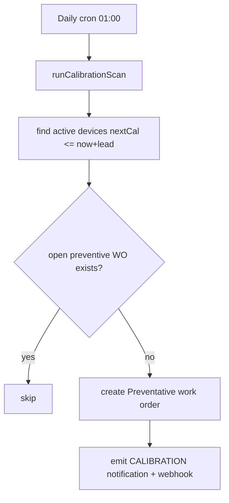
```mermaid
graph TD
    A[Daily cron 01:00] --> B[runCalibrationScan]
    B --> C[find active devices nextCal <= now+lead]
    C --> D{open preventive WO exists?}
    D -- yes --> S[skip]
    D -- no --> E[create Preventative work order]
    E --> F[emit CALIBRATION notification + webhook]
```

### 8. Input
*   **Record:** `deviceId` (required), `calibrationDate`, `dueDate`, `standard`, `results` (object), `isCompliant`, `certificateNumber`, `certificateFileUrl`, `notes`.
*   **Scheduler:** `leadDays`, `allTenants`/`tenantId` (super-admin scope).

### 9. Output
*   Calibration record objects (with device + performer), scheduler summary (`scanned`, `workOrdersCreated`, `notificationsCreated`, `overdue`, `errors`), due-device preview.

### 10. Validation
*   Joi (`stripUnknown`): `createCalibrationRecordSchema` (deviceId required, `certificateFileUrl` URI), query filters (`deviceId`, `isCompliant`, `from`/`to`). Scheduler has no Joi validator (inline parsing).

### 11. Business Rules
*   **Create:** device must belong to the tenant (404); `performedBy = req.user.id`; if `calibrationDate` + device `calibrationIntervalDays` present, sets device `nextCalibrationDate = calibrationDate + interval`.
*   **Pass/fail** is the nullable `isCompliant` boolean (null = untested).
*   **Scheduler:** due when `nextCalibrationDate <= now + lead`; overdue when `< now` (priority Critical vs High); **idempotent** — skips devices with an existing open preventive work order; per-device failures don't abort the run.
*   Certificate linkage is inline (`certificateNumber` + `certificateFileUrl`), not an FK.

### 12. Access Rights
| Capability | Permission |
| --- | --- |
| Record list/detail | `dynamicAccess("calibration","read")` |
| Record create/update/delete | `dynamicAccess("calibration","write")` |
| Scheduler `/due` (preview) | `dynamicAccess("Maintenance","read")` |
| Scheduler `/run` (scan) | `dynamicAccess("Maintenance","create")` |

### 13. Database
*   **`calibration_records`** ([calibrationRecord.model.js](backend/src/models/calibrationRecord.model.js)) — PK `id`; `tenantId`, `deviceId`→`calibration_devices.id`, `performedBy`→`users.id` (all CASCADE); `calibrationDate` (default NOW), `dueDate`, `standard`, `results` (JSONB), `measurementUncertainty`, `isCompliant`, `certificateNumber`, `certificateFileUrl`, `notes`; soft-delete; indexes on tenant/device/performer/date/isCompliant.
*   Scheduler reads `calibration_devices` and writes `maintenance_work_orders` (Preventative).

### 14. API
Base: `/api/v1/calibration-records`, `/api/v1/calibration-scheduler`.

| Method | Endpoint | Function |
| --- | --- | --- |
| GET/POST | `/calibration-records` | List / create record |
| GET/PUT/DELETE | `/calibration-records/:id` | Detail / update / delete |
| GET | `/calibration-scheduler/due` | Preview due/overdue devices |
| POST | `/calibration-scheduler/run` | Run scan → work orders + notifications |

### 15. Integration
*   **node-cron** daily scan; `maintenanceService.createWorkOrder`; `notificationService.emitNotification` (tenant-wide); `webhookService.emitEvent` (`device.calibration_due` / `device.overdue`).

### 16. Error Handling
*   `400` validation; `404` device not found / record not found; scheduler per-device errors counted and logged, endpoints return 200.

### 17. Log and Audit
*   `logger` records record failures and scheduler summaries; notifications + webhook events form the external audit trail.

### 18. Configuration
| Variable | Default | Purpose |
| --- | --- | --- |
| `CALIBRATION_REMINDER_LEAD_DAYS` | 0 | Due-scan lead window |
| `CALIBRATION_SCHEDULER` | `0 1 * * *` | Cron expression (`disabled`/`off` to stop) |

### 19. Dependency
`sequelize`, `joi`, `express`, `node-cron`; internal `maintenance.service`, `notification.service`, `webhook.service`.

### 20. UI/Screen
*   Device → Calibration history/timeline, Record entry form, Calibration schedule / due list.

### 21. Diagrams
*   Scheduler flow in §7. See [context.md §11/§12](context.md) for the calibration domain and record flow.

### 22. Non-Functional Requirements
*   **Compliance:** permanent calibration history with pass/fail and uncertainty.
*   **Reliability:** idempotent daily scan tolerant of per-device failures.

### 23. Known Limitations
*   Swagger for records advertises fields (`calibrator`, `status` enum, string `results`) that don't exist on the model — significant drift.
*   `measurementUncertainty` column isn't in the validators (can't be set via API); next-due is only advanced on record creation, not update; scheduler idempotency has no lock (concurrent-run race).

### 24. Change Log
| Version | Date | Description |
| --- | --- | --- |
| 1.0.0 | 2026-07-15 | Initial documentation (records + scheduler). |

---
# MODULE 11: Certificate & e-Signature

### 1. General Information
*   **Module Name:** Certificate & e-Signature Module
*   **Module Code:** HDC-CERT
*   **Version:** 1.0.0
*   **Status:** Production (certificates) / Development (standalone e-signature workflow — see §23)
*   **Owner / Person in Charge:** Quality & Compliance Team

### 2. Module Description
Issues calibration certificates with lifecycle states, generates branded PDFs (puppeteer) with an embedded verification QR code and integrity hash, exposes a public QR verification endpoint, and enforces FDA 21 CFR Part 11 electronic signatures with re-authentication and an immutable signature record on approve/sign/revoke.

### 3. Objectives
*   Produce tamper-evident, publicly verifiable calibration certificates.
*   Enforce Part 11 e-signatures (re-auth, signer meaning, immutable audit) on certificate actions.

### 4. Scope
*   **In Scope:** Certificate CRUD, approval/sign/revoke, PDF generation, QR public verify, certificate e-signature records; a parallel standalone e-signature workflow API.
*   **Out of Scope:** Calibration measurement capture (Module 10), KMS provider integration (mocked).

### 5. Actors/Users
*   **CALIBRATOR ADMIN:** create/generate certificates.
*   **SUPERVISOR / QUALITY:** approve, sign (with re-auth), revoke.
*   **Public:** verify a certificate via QR/number (no auth).

### 6. Features
*   Certificate lifecycle: draft → pending_approval → approved → signed / revoked.
*   PDF with QR verification, SHA-256 integrity hash, HMAC signature.
*   21 CFR Part 11 e-signature: password/MFA re-auth, signer meaning, immutable `ESignatureRecord`.
*   Standalone e-signature workflow (RSA key pairs, multi-signer routing).

### 7. Workflow
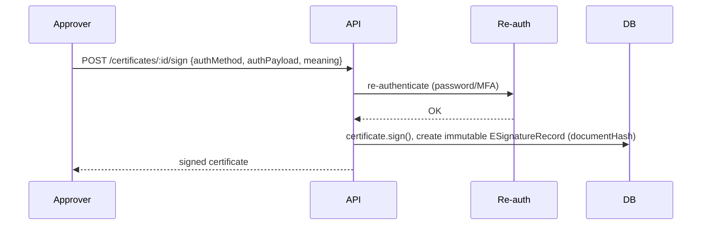
```mermaid
sequenceDiagram
    participant U as Approver
    participant API
    participant Auth as Re-auth
    participant DB
    U->>API: POST /certificates/:id/sign {authMethod, authPayload, meaning}
    API->>Auth: re-authenticate (password/MFA)
    Auth-->>API: OK
    API->>DB: certificate.sign(), create immutable ESignatureRecord (documentHash)
    API-->>U: signed certificate
```

### 8. Input
*   **Certificate:** `deviceId` (required), `calibrationRecordId`, `type`, `standard`, `summary`/`conditions`/`notes`, `validUntil`.
*   **Approve/sign/revoke:** `authMethod` (password/mfa), `authPayload`, `meaning`, plus `digitalSignature`/`reason`.

### 9. Output
*   Certificate records + status; PDF file (`uploads/certificates/*.pdf`); public verification payload (valid/signed/revoked/expired flags, integrity hash, verify URL); immutable signature records.

### 10. Validation
*   Joi: `createCertificateSchema`, `approve/sign/revokeCertificateSchema` (authMethod ∈ password/mfa, authPayload, meaning required). e-signature validators for key pairs/workflows/sign.

### 11. Business Rules
*   **Numbering:** `CERT-YYYYMMDD-<tenantCode>-<seq>` (sequence counts soft-deleted rows to respect the unique constraint).
*   **State machine:** `approve()` requires `pending_approval`; `sign()` requires `approved`; cannot update/delete a signed certificate (must revoke).
*   **e-signature (Part 11):** approve/sign/revoke require `authMethod`+`authPayload`+`meaning`; re-authenticates (password via `passIsValid`, MFA via `verifyLogin`); computes SHA-256 `documentHash`; writes an immutable `ESignatureRecord`.
*   **PDF:** computes SHA-256 integrity hash over a canonical payload + HMAC signature; embeds a QR to the public verify URL; watermarks non-signed/revoked certificates.
*   **Public verify:** `valid = signed && !revoked && !expired`.

### 12. Access Rights
| Capability | Permission |
| --- | --- |
| Read / stats | `dynamicAccess("certificate","read")` |
| Create / update / delete / revoke / generate PDF | `dynamicAccess("certificate","generate")` |
| Approve | `dynamicAccess("certificate","approve")` |
| Sign | `dynamicAccess("certificate","sign")` |
| Public verify | none (public) |
| e-signature API (`/esignature/*`) | `auth` only (⚠️ no permission gate) |

### 13. Database
*   **`certificates`** ([certificate.model.js](backend/src/models/certificate.model.js)) — PK `id`; unique `certificateNumber`; `type`, `status` (draft/pending_approval/approved/signed/revoked); `deviceId`, `calibrationRecordId`; `digitalSignature`, `signedAt`, `filePath`; paranoid; indexes on tenant/number/device/status.
*   **`e_signature_records`** ([eSignatureRecord.model.js](backend/src/models/eSignatureRecord.model.js)) — **immutable** (`timestamps:false`, no paranoid); polymorphic `entityType`/`entityId`; `action`, `meaning`, `authMethod`, `documentHash`, `ipAddress`, `userAgent`, `timestamp`.
*   Standalone workflow uses separate `TenantKey`/`SignatureWorkflow`/`SignatureRecord` tables.

### 14. API
Base: `/api/v1/certificates`, `/api/v1/esignature`.

| Method | Endpoint | Function |
| --- | --- | --- |
| GET | `/certificates/verify/:certificateNumber` | Public QR verification |
| GET/POST | `/certificates` · `/stats` | List / create / stats |
| GET/PUT/DELETE | `/certificates/:id` | Detail / update / delete |
| POST | `/certificates/:id/{approve,sign,revoke}` | Lifecycle transitions (re-auth) |
| GET/POST | `/certificates/:id/pdf` | Download / (re)generate PDF |
| GET/POST/DELETE | `/esignature/key-pairs[...]` | RSA key management |
| GET/POST/PUT/DELETE | `/esignature/workflows[...]` | Signature workflows |
| POST/GET | `/esignature/sign` · `/verify` · `/history` | Sign / verify / audit trail |

### 15. Integration
*   **puppeteer** (HTML→PDF), **qrcode** (verification QR), Node `crypto` (SHA-256, HMAC, RSA, AES); **KMS** (local AES-256-GCM mock); email queue for signature requests; PDFs served from `/uploads/certificates`.

### 16. Error Handling
*   `400` validation / state-machine violation / update-signed; `401` invalid re-auth password/MFA; `403` permission; `404` certificate/device not found; `500` key/encrypt failures / PDF errors.

### 17. Log and Audit
*   `ESignatureRecord` rows are the Part 11 e-signature trail (meaning, authMethod, documentHash, IP/UA); `logger` records create/approve/sign/revoke/PDF events; standalone workflow writes `AuditLog` (`DOCUMENT_SIGNED`).

### 18. Configuration
| Variable | Default | Purpose |
| --- | --- | --- |
| `PUPPETEER_EXECUTABLE_PATH` | — | Puppeteer browser binary (required in Bun packaging) |
| `CERT_SIGNING_SECRET` | `callibrator-dev-cert-secret` | PDF HMAC key |
| `CERT_VERIFY_BASE_URL` / `PUBLIC_BASE_URL` | — / `http://localhost:5000` | QR verify URL base |
| `KMS_MASTER_KEY` | derived mock | Envelope encryption |
| `ENCRYPT_KEY` | dev default | Private-key-at-rest (AES-256-CBC) |
| `ESIGN_ENABLED` / `SIGNATURE_ALGORITHM` / `SIGNATURE_KEY_SIZE` / `REQUIRE_REAUTHENTICATION` | on / RS256 / 2048 / on | e-signature |

### 19. Dependency
`puppeteer`, `qrcode`, `joi`, `sequelize`, `nodemailer`, `otplib`, Node `crypto`; internal `kms.service`, `auth.service`, `mfa.service`, `workflow.service`.

### 20. UI/Screen
*   Certificates list/detail, Approve/Sign dialog (re-auth), PDF preview/download, public verification page; e-signature key & workflow management.

### 21. Diagrams
*   Sign sequence in §7. See [context.md §23](context.md) for compliance (ISO 17025 / KARS / SNARS).

### 22. Non-Functional Requirements
*   **Security/Compliance:** re-authentication before signing, immutable signature records, tamper-evident PDF hash.
*   **Verifiability:** public QR verification without authentication.

### 23. Known Limitations
*   Two parallel, unreconciled e-signature systems (certificate `ESignatureRecord` vs standalone `SignatureWorkflow`).
*   Standalone e-signature has route/controller param mismatches, validator middleware misuse, and a `verifySignature` that can never match (hash includes `Date.now()`); no permission gate on `/esignature/*`.
*   Weak default secrets (`CERT_SIGNING_SECRET`, `ENCRYPT_KEY`, `KMS_MASTER_KEY`); KMS is a local mock (no AWS/Azure integration); several controller methods (`cancelWorkflow`, `revokeSignature`, `getStatus`) have no routes.

### 24. Change Log
| Version | Date | Description |
| --- | --- | --- |
| 1.0.0 | 2026-07-15 | Initial documentation (certificates, PDF/QR, Part 11 e-signature). |

---
# MODULE 12: Maintenance & Predictive Maintenance

### 1. General Information
*   **Module Name:** Maintenance & Predictive Maintenance Module
*   **Module Code:** HDC-MNT
*   **Version:** 1.0.0
*   **Status:** Production (maintenance) / Development (predictive — see §23)
*   **Owner / Person in Charge:** Biomedical Engineering / IPSRS

### 2. Module Description
Manages device maintenance work orders (preventive, breakdown, repair) with priority, status, vendor and technician assignment, and provides a statistics-based predictive maintenance engine that adjusts a device's calibration interval based on IoT anomaly rates.

### 3. Objectives
*   Track corrective and preventive maintenance activity per device.
*   Recommend calibration-interval adjustments from IoT telemetry anomalies.

### 4. Scope
*   **In Scope:** Work order CRUD, predictive analysis, recommendation approval.
*   **Out of Scope:** Parts/cost tracking, spare-parts inventory (Module 8), full ML forecasting.

### 5. Actors/Users
*   **TECHNICIAN / FACILITY MAINTENANCE:** create/update/close work orders.
*   **ENGINEERING MANAGER:** review and approve predictive recommendations.

### 6. Features
*   Work orders typed Preventative/Breakdown/Repair with priority and assignment.
*   Predictive analysis of IoT anomaly rate → interval shorten/extend recommendation.
*   Recommendation approval that updates the device interval.

### 7. Workflow
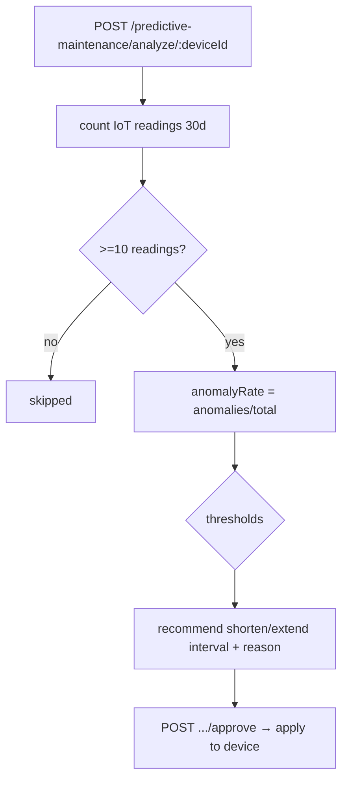
```mermaid
graph TD
    A[POST /predictive-maintenance/analyze/:deviceId] --> B[count IoT readings 30d]
    B --> C{>=10 readings?}
    C -- no --> S[skipped]
    C -- yes --> D[anomalyRate = anomalies/total]
    D --> E{thresholds}
    E --> F[recommend shorten/extend interval + reason]
    F --> G[POST .../approve → apply to device]
```

### 8. Input
*   **Work order:** `deviceId` (required), `title`, `type` (Preventative/Breakdown/Repair), `priority`, `status`, `vendorId`, `assigneeId`, `description`, dates.
*   **Predictive:** `deviceId` (path).

### 9. Output
*   Work order records; predictive result (`recommendedCalibrationInterval`, `recommendationReason`, status skipped/unchanged); recommendation list.

### 10. Validation
*   Joi: `createWorkOrder`/`updateWorkOrder` (type/priority/status enums, dates, costs). Predictive endpoints have no validator (`validateUuid` only).

### 11. Business Rules
*   **Work order:** status is a free enum (no enforced transitions or auto-timestamps); `assigneeId` maps to `assignedTo`.
*   **Predictive:** requires an `iotEnabled` device with a baseline interval and ≥10 readings in 30 days; `anomalyRate > 0.05` → interval ×0.5, `> 0.01` → ×0.8, `== 0 & >100 readings` → ×1.2, else unchanged; writes `recommendedCalibrationInterval` + `recommendationReason`.
*   **Approve:** copies recommendation into `calibrationIntervalDays` and clears the recommendation.
*   Predictive analysis creates a `MAINTENANCE` notification on a new recommendation.

### 12. Access Rights
| Capability | Permission |
| --- | --- |
| Work order read | `dynamicAccess("Maintenance","read")` |
| Work order create/update/delete | `dynamicAccess("Maintenance","create/update/delete")` |
| Predictive analyze/recommend/approve | `dynamicAccess("calibration","read/write")` |

### 13. Database
*   **`maintenance_work_orders`** ([maintenanceWorkOrder.model.js](backend/src/models/maintenanceWorkOrder.model.js)) — PK `id`; `tenantId`, `deviceId`→`calibration_devices.id`; `type` (Preventative/Breakdown/Repair), `status` (Open/InProgress/Completed/Cancelled), `priority` (Low/Medium/High/Critical); `vendorId` (SET NULL), `assignedTo`→`users.id` (SET NULL); paranoid.
*   Predictive has **no model** — reads `CalibrationDevice`, `IotReading`; writes `Notification`.

### 14. API
Base: `/api/v1/maintenance`, `/api/v1/predictive-maintenance`.

| Method | Endpoint | Function |
| --- | --- | --- |
| GET/POST | `/maintenance[/:orderId]` | List / create / detail work orders |
| PATCH/DELETE | `/maintenance/:orderId` | Update / delete work order |
| POST | `/predictive-maintenance/analyze/:deviceId` | Run IoT anomaly analysis |
| GET | `/predictive-maintenance/recommendations` | List pending recommendations |
| POST | `/predictive-maintenance/recommendations/:deviceId/approve` | Apply recommended interval |

### 15. Integration
*   **IoT readings** (anomaly counts), **Notifications** (recommendation alerts), **Vendors** (external maintenance providers), **Calibration scheduler** (raises preventive work orders).

### 16. Error Handling
*   `404` work order / IoT-enabled device / device not found; `400` no baseline interval / no pending recommendation.

### 17. Log and Audit
*   `logger.info` on generated recommendations; maintenance CRUD has no explicit audit logging.

### 18. Configuration
*   No module-specific env vars; pagination via `DEFAULT_LIMIT`/`MAX_LIMIT`.

### 19. Dependency
`sequelize`, `joi`, `express`; internal `notification` (via predictive), models `IotReading`/`CalibrationDevice`.

### 20. UI/Screen
*   Maintenance work order list/form; Predictive recommendations review/approve.

### 21. Diagrams
*   Predictive flow in §7. See [context.md §13](context.md) for the maintenance domain.

### 22. Non-Functional Requirements
*   **Data-driven:** interval adjustment from real telemetry.
*   **Traceability:** recommendations recorded with reason on the device.

### 23. Known Limitations
*   Validators accept `scheduledDate`, `completedDate`, `estimatedCost`, `actualCost`, `resolutionNotes` but the model has no such columns — these are silently dropped; no parts/cost tracking.
*   No work-order state machine; predictive routes guard on the `calibration` resource (not `predictiveMaintenance`); `getRecommendations` uses Mongo-style `$ne` (a latent Sequelize bug); predictive is anomaly-rate heuristic only (no MTBF/failure model) and manual/on-demand (no cron).

### 24. Change Log
| Version | Date | Description |
| --- | --- | --- |
| 1.0.0 | 2026-07-15 | Initial documentation (work orders + predictive). |

---
# MODULE 13: Quality Management System (QMS)

### 1. General Information
*   **Module Name:** Quality Management System Module (CAPA / NC / SOP / Risk)
*   **Module Code:** HDC-QMS
*   **Version:** 1.0.0
*   **Status:** Development (compliance gaps — see §23)
*   **Owner / Person in Charge:** Quality Assurance Team

### 2. Module Description
Provides core ISO 13485 / ISO 17025 quality processes: non-conformance (NC) reporting, corrective/preventive actions (CAPA), controlled SOP documents with tenant-wide training acknowledgment, and ISO 14971-style risk register with RPN scoring.

### 3. Objectives
*   Track quality events (NC/CAPA) and their resolution.
*   Manage controlled SOPs, training acknowledgment, and risk assessments.

### 4. Scope
*   **In Scope:** NC CRUD, CAPA CRUD, SOP create/publish/acknowledge, risk CRUD with RPN.
*   **Out of Scope:** e-signature on QMS records, enforced approval workflows, SOP file storage.

### 5. Actors/Users
*   **QUALITY / SUPERVISOR:** raise NCs, open/close CAPAs, publish SOPs, manage risks.
*   **All tenant users:** acknowledge assigned SOP training.

### 6. Features
*   NC lifecycle (open → investigation → CAPA-required → closed) with severity.
*   CAPA under an NC with action plan and status.
*   SOP documents with versioning field and tenant-wide training acknowledgment.
*   Risk register with virtual RPN (severity × likelihood).

### 7. Workflow
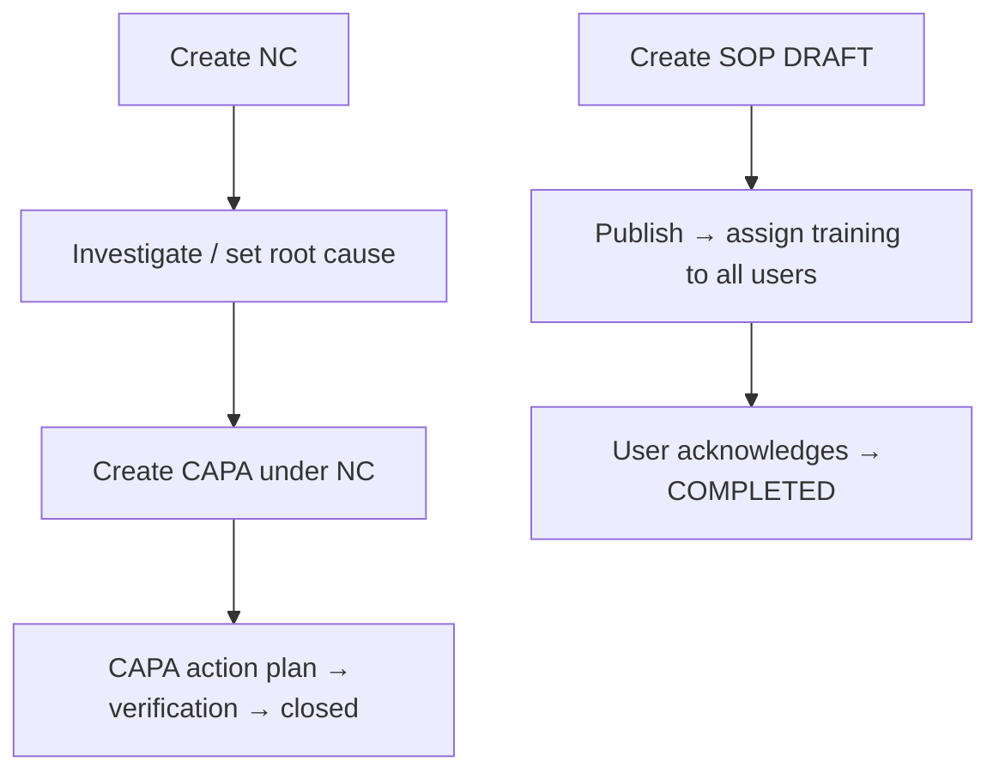
```mermaid
graph TD
    A[Create NC] --> B[Investigate / set root cause]
    B --> C[Create CAPA under NC]
    C --> D[CAPA action plan → verification → closed]
    E[Create SOP DRAFT] --> F[Publish → assign training to all users]
    F --> G[User acknowledges → COMPLETED]
```

### 8. Input
*   **NC:** `title`, `description`, `severity`, `deviceId`, `dateIdentified`, `rootCause`.
*   **CAPA:** `ncId`, `title`, `actionPlan`, `status`, `assignedTo`, `dueDate`.
*   **SOP:** `documentNumber`, `title`, `version`, `contentUrl`, `requiresTraining`.
*   **Risk:** `title`, `category`, `severity` (1–5), `likelihood` (1–5), `mitigationPlan`.

### 9. Output
*   NC/CAPA/SOP/Risk records, training acknowledgment status, computed RPN.

### 10. Validation
*   ⚠️ **No validators** on any QMS route (only `auth`). Services apply field whitelists on NC/CAPA updates; Risk create/update accept the raw body (mass-assignment).

### 11. Business Rules
*   **Numbering:** `NC-`/`CAPA-`/`SOP-` sequential from `count()+1` (not concurrency-safe).
*   **CAPA** requires a valid parent NC; created as DRAFT; status enums exist but **no enforced state machine** (any field, including `status`/`approvedBy`, is directly PATCHable).
*   **SOP publish** sets PUBLISHED + `publishedDate`; if `requiresTraining`, bulk-creates PENDING acknowledgments for **every tenant user**; acknowledge sets COMPLETED.
*   **Risk RPN** = severity × likelihood (virtual, not persisted); no matrix banding or auto-status.

### 12. Access Rights
| Capability | Roles |
| --- | --- |
| All QMS endpoints | any authenticated tenant user (⚠️ `auth` only, no RBAC) |

### 13. Database
*   **`non_conformances`** ([nonConformance.model.js](backend/src/models/nonConformance.model.js)) — `status`, `severity`, `reportedBy`, `deviceId`; paranoid.
*   **`capas`** ([capa.model.js](backend/src/models/capa.model.js)) — `capaNumber`, `ncId`, `actionPlan`, `status`, `assignedTo`, `approvedBy`; paranoid.
*   **`sop_documents`** ([sopDocument.model.js](backend/src/models/sopDocument.model.js)) — `documentNumber`, `version`, `status`, `authorId`, `requiresTraining`; paranoid.
*   **`sop_training_acknowledgments`** — `documentId`, `userId`, `status` (PENDING/COMPLETED); **not paranoid**.
*   **`risks`** ([risk.model.js](backend/src/models/risk.model.js)) — `severity`/`likelihood` INT, `rpn` VIRTUAL, `status`, `mitigationPlan`; paranoid.

### 14. API
Base: `/api/v1/qms`, `/api/v1/sop`, `/api/v1/risk`.

| Method | Endpoint | Function |
| --- | --- | --- |
| POST/GET/PATCH | `/qms/nc[/:id]` | Non-conformance CRUD |
| POST/GET/PATCH | `/qms/capa[/:id]` | CAPA CRUD |
| POST/GET | `/sop` | Create / list SOP |
| PATCH/POST | `/sop/:id/publish` · `/sop/:id/acknowledge` | Publish / acknowledge |
| POST/GET/PUT/DELETE | `/risk[/:id]` | Risk CRUD |

### 15. Integration
*   Cross-links NC → `CalibrationDevice`. No workflow engine, notifications, or attachments wired in.

### 16. Error Handling
*   `404` NC/CAPA/SOP/acknowledgment/risk not found (⚠️ NC/CAPA/SOP 404s return 500 due to an AppError import bug — §23).

### 17. Log and Audit
*   No audit/activity logging in QMS services; no e-signature or change history beyond timestamps.

### 18. Configuration
*   No module-specific env vars.

### 19. Dependency
`express`, `sequelize`; internal `controllerWrapper.util`, `appError.util`.

### 20. UI/Screen
*   NC register, CAPA board, SOP library + training tracker, Risk register/matrix.

### 21. Diagrams
*   NC/CAPA/SOP flow in §7.

### 22. Non-Functional Requirements
*   **Compliance intent:** ISO 13485/17025 quality processes (currently partial).

### 23. Known Limitations
*   **AppError import bug** in `qms.service`/`sop.service` → NC/CAPA/SOP "not found" paths return 500 instead of 404 (Risk is unaffected).
*   No validation anywhere (Risk create/update mass-assign raw body); non-concurrency-safe numbering with no unique index.
*   SOP publish assigns training to ALL tenant users (no role/department filter, no notifications, no re-publish guard → duplicate acknowledgments); no SOP versioning/supersede; `UNDER_REVIEW`/`ARCHIVED` states unused.
*   No enforced state machine, no approval gating, no e-signature, no audit trail — gaps vs. the stated compliance intent; no route-level RBAC.

### 24. Change Log
| Version | Date | Description |
| --- | --- | --- |
| 1.0.0 | 2026-07-15 | Initial documentation (NC, CAPA, SOP, Risk). |

---
# MODULE 14: Vendor & Supplier Scorecard

### 1. General Information
*   **Module Name:** Vendor & Supplier Scorecard Module
*   **Module Code:** HDC-VEN
*   **Version:** 1.0.0
*   **Status:** Production (vendor) / Development (scorecard — see §23)
*   **Owner / Person in Charge:** Procurement & Quality Team

### 2. Module Description
Manages third-party vendors (calibration labs, parts suppliers) including qualification status and audit dates, and records periodic supplier performance scorecards (quality/delivery/service scores with a computed overall).

### 3. Objectives
*   Maintain an approved-vendor register with qualification and audit tracking.
*   Evaluate supplier performance over time via scorecards.

### 4. Scope
*   **In Scope:** Vendor CRUD, qualification, supplier scorecard CRUD.
*   **Out of Scope:** Purchase orders, contracts, vendor document storage.

### 5. Actors/Users
*   **PROCUREMENT / QUALITY:** manage vendors and qualification.
*   **Any authenticated user:** create/read scorecards (⚠️ no permission gate).

### 6. Features
*   Vendor register with type, contact, rating, approval status, audit dates.
*   Vendor qualification endpoint (approval status + scorecard + audit dates).
*   Supplier scorecards with quality/delivery/service scores and virtual overall.

### 7. Workflow
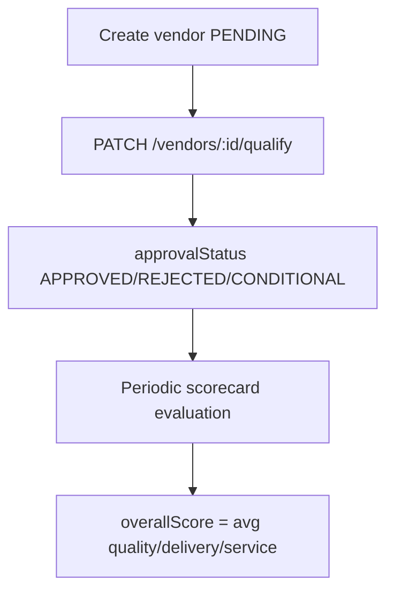
```mermaid
graph TD
    A[Create vendor PENDING] --> B[PATCH /vendors/:id/qualify]
    B --> C[approvalStatus APPROVED/REJECTED/CONDITIONAL]
    C --> D[Periodic scorecard evaluation]
    D --> E[overallScore = avg quality/delivery/service]
```

### 8. Input
*   **Vendor:** `name`, `type` (CalibrationLab/PartsSupplier/Other), `contactPerson`, `email`, `phone`, `address`, `status`; `rating` (update). Qualify: `approvalStatus`, `scorecard`, audit dates.
*   **Scorecard:** `vendorId`, `evaluationDate`, `qualityScore`, `deliveryScore`, `serviceScore`, `status`, `comments`.

### 9. Output
*   Vendor records, qualification result, scorecard records with `overallScore`.

### 10. Validation
*   Joi (`vendor.validator.js`): create/update vendor (name, type/status enums, email, rating 1–5 on update). ⚠️ Scorecard has **no validator**.

### 11. Business Rules
*   Vendor CRUD is tenant-scoped; `qualifyVendor` conditionally sets approval/scorecard/audit dates (no state machine).
*   Scorecard create requires the vendor to exist; `evaluatedBy = req.user.id`; `overallScore` = round(avg of the three scores); `status` is free-form text (no threshold logic).
*   Soft delete (paranoid) for both entities.

### 12. Access Rights
| Capability | Permission |
| --- | --- |
| Vendor read | `dynamicAccess("Vendors","read",{checkTenant})` |
| Vendor create/update/delete/qualify | `dynamicAccess("Vendors","create/update/delete")` |
| Supplier scorecard CRUD | ⚠️ `auth` only (no permission, no validation) |

### 13. Database
*   **`vendors`** ([vendor.model.js](backend/src/models/vendor.model.js)) — PK `id`; `type`, `approvalStatus` (APPROVED/PENDING/REJECTED/CONDITIONAL), `rating` (0–5), `scorecard`, `lastAuditDate`/`nextAuditDate`, `status` (Active/Inactive); paranoid.
*   **`supplier_scorecards`** ([supplierScorecard.model.js](backend/src/models/supplierScorecard.model.js)) — `vendorId`, `evaluationDate`, quality/delivery/service scores, `overallScore` (VIRTUAL avg), `status` (STRING), `evaluatedBy`; paranoid.

### 14. API
Base: `/api/v1/vendors`, `/api/v1/supplier-scorecard`.

| Method | Endpoint | Function |
| --- | --- | --- |
| GET/POST | `/vendors[/:vendorId]` | List / get / create vendor |
| PATCH/DELETE | `/vendors/:vendorId` | Update / delete vendor |
| PATCH | `/vendors/:vendorId/qualify` | Set qualification |
| POST/GET/PUT/DELETE | `/supplier-scorecard[/:id]` | Scorecard CRUD |

### 15. Integration
*   Referenced by maintenance work orders and asset finance (`vendorId`). No external integrations.

### 16. Error Handling
*   `404` Vendor / Scorecard not found; validation `400` on vendor create/update.

### 17. Log and Audit
*   No dedicated in-module logging/audit (relies on global middleware).

### 18. Configuration
*   No module-specific env vars; pagination via `DEFAULT_LIMIT`/`MAX_LIMIT`.

### 19. Dependency
`sequelize`, `joi`, `express`.

### 20. UI/Screen
*   Vendor list/detail, Qualification form, Supplier scorecard entry/history.

### 21. Diagrams
*   Vendor→scorecard flow in §7.

### 22. Non-Functional Requirements
*   **Traceability:** qualification and audit dates recorded per vendor.

### 23. Known Limitations
*   **Supplier-scorecard routes have no RBAC and no input validation** — any authenticated user can CRUD scorecards.
*   Vendor `notes` (validator) has no model column (dropped); rating range mismatch (validator 1–5 vs model 0–5); Swagger advertises `rating` on POST but the validator strips it; unused Redis imports in the vendor service; scorecard `status` is free STRING (not enum), scores not range-validated.

### 24. Change Log
| Version | Date | Description |
| --- | --- | --- |
| 1.0.0 | 2026-07-15 | Initial documentation (vendors + supplier scorecards). |

---
# MODULE 15: Developer API, Webhooks & Integrations

### 1. General Information
*   **Module Name:** Developer API, Webhooks & Integrations Module
*   **Module Code:** HDC-DEV
*   **Version:** 1.0.0
*   **Status:** Production
*   **Owner / Person in Charge:** Platform / Integrations Team

### 2. Module Description
Enables programmatic access via scoped API keys and outbound event delivery via HMAC-signed webhooks with retry and delivery logging. API keys and webhooks are plan-gated features.

### 3. Objectives
*   Let tenants integrate the platform through secure, scoped API keys.
*   Notify external systems of platform events reliably (signed, retried, logged).

### 4. Scope
*   **In Scope:** API key create/list/revoke, webhook subscription CRUD, event delivery + retry, delivery history, test delivery.
*   **Out of Scope:** Durable delivery queue/DLQ (in-process only), SSRF hardening.

### 5. Actors/Users
*   **Tenant admins / developers:** manage API keys (JWT only) and webhooks.
*   **External systems:** authenticate with `Authorization: ApiKey <key>`; receive webhook callbacks.

### 6. Features
*   Scoped API keys (`resource:action`, `*`), one-time secret display, SHA-256 storage, expiry/revocation.
*   Webhooks with event subscription (`*` = all), HMAC-SHA256 signatures, exponential-backoff retry, per-attempt delivery log.
*   Test-delivery endpoint.

### 7. Workflow
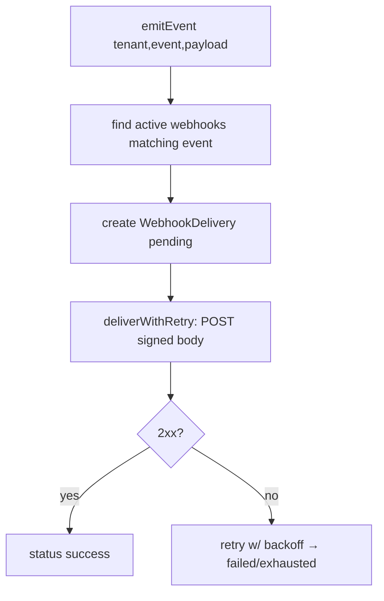
```mermaid
graph TD
    A[emitEvent tenant,event,payload] --> B[find active webhooks matching event]
    B --> C[create WebhookDelivery pending]
    C --> D[deliverWithRetry: POST signed body]
    D --> E{2xx?}
    E -- yes --> F[status success]
    E -- no --> G[retry w/ backoff → failed/exhausted]
```

### 8. Input
*   **API key:** `name`, optional `scopes[]`, `expiresAt`. **Webhook:** `url` (http/https), `events[]`, `description`, `isActive`.

### 9. Output
*   API key raw value (once) + prefix; webhook secret (once); delivery records (status/attempts/responseStatus/lastError).

### 10. Validation
*   Inline service validation (name/url/events required); `validateUuid` on `:id`. No dedicated Joi validators.

### 11. Business Rules
*   **API keys:** key = `cbk_<hex>`; stored as SHA-256 hash + 12-char prefix; verified by hash (active + not expired); `lastUsedAt` throttled to 60 s; revoke sets inactive + soft-delete. `denyApiKey` prevents a key from minting/revoking keys.
*   **Webhooks:** delivery matches `events @> [event]` or `["*"]`; body `{id,event,createdAt,data}` signed `X-Webhook-Signature: sha256=<hmac>`; up to `WEBHOOK_MAX_ATTEMPTS` (5) with backoff `min(2^attempt*500, 30000)` ms and per-request timeout (`WEBHOOK_TIMEOUT_MS`, 8000). `emitEvent` is fire-and-forget (never blocks the caller).
*   Create endpoints gated by `requireFeature("api_keys"/"webhooks")`.

### 12. Access Rights
| Capability | Access |
| --- | --- |
| API key create/list/get/revoke | `auth` + `denyApiKey` (JWT only); create needs `requireFeature("api_keys")` |
| Webhook create | `auth` + `requireFeature("webhooks")` |
| Webhook list/get/update/delete/deliveries/test | `auth` |

### 13. Database
*   **`api_keys`** ([apiKey.model.js](backend/src/models/apiKey.model.js)) — `keyPrefix`, unique `keyHash`, `scopes` (JSONB), `expiresAt`, `isActive`; dual soft-delete.
*   **`webhooks`** ([webhook.model.js](backend/src/models/webhook.model.js)) — `url`, `events` (JSONB), `secret`, `isActive`; dual soft-delete.
*   **`webhook_deliveries`** ([webhookDelivery.model.js](backend/src/models/webhookDelivery.model.js)) — `event`, `payload`, `status` (pending/success/failed/exhausted), `attempts`, `responseStatus`, `lastError`, `deliveredAt`; no soft-delete.

### 14. API
Base: `/api/v1/api-keys`, `/api/v1/webhooks`.

| Method | Endpoint | Function |
| --- | --- | --- |
| POST/GET/DELETE | `/api-keys[/:id]` | Create / list / get / revoke key |
| POST/GET/PATCH/DELETE | `/webhooks[/:id]` | Webhook CRUD |
| GET | `/webhooks/:id/deliveries` | Delivery attempts |
| POST | `/webhooks/:id/test` | Send test delivery |

### 15. Integration
*   Outbound HTTP via Node `fetch` + `AbortController`; HMAC-SHA256 (Node `crypto`); consumed by `dynamicAccess` (API-key scopes) and event producers (calibration scheduler `emitEvent`).

### 16. Error Handling
*   `400` name/url/events required; `402` feature not on plan; `404` key/webhook not found; delivery errors captured in `lastError` (timeout/HTTP status).

### 17. Log and Audit
*   `logger.warn`/`error` on delivery exhaustion/errors; `webhook_deliveries` is the delivery audit trail.

### 18. Configuration
| Variable | Default | Purpose |
| --- | --- | --- |
| `WEBHOOK_MAX_ATTEMPTS` | 5 | Retry attempts |
| `WEBHOOK_TIMEOUT_MS` | 8000 | Per-request timeout |
| (const) `KEY_PREFIX` / `LAST_USED_THROTTLE_MS` | `cbk_` / 60000 | Key format / usage throttle |

### 19. Dependency
`sequelize`, `express`, Node `crypto`/`fetch`; internal `apiKey.service` (scope checks), `enforceQuota.middleware` (`requireFeature`).

### 20. UI/Screen
*   Developer → API Keys (create/reveal-once/revoke), Webhooks (subscribe/test/delivery log).

### 21. Diagrams
*   Delivery flow in §7. See [context.md §21](context.md) for the event catalog.

### 22. Non-Functional Requirements
*   **Security:** hashed keys, HMAC-signed payloads, one-time secret reveal.
*   **Reliability:** retry with exponential backoff and delivery logging.

### 23. Known Limitations
*   **SSRF:** webhook URL only regex-validated (no internal/link-local blocking).
*   Delivery is in-process/fire-and-forget (no durable queue/DLQ; pending deliveries lost on restart); `events` JSONB has no GIN index; webhook non-create endpoints don't re-gate on `requireFeature` or `denyApiKey`; `webhook_deliveries` has no retention/cleanup.

### 24. Change Log
| Version | Date | Description |
| --- | --- | --- |
| 1.0.0 | 2026-07-15 | Initial documentation (API keys + webhooks). |

---
# MODULE 16: Billing, Subscription & Finance

### 1. General Information
*   **Module Name:** Billing, Subscription, Metered Billing, Quota & Finance Module
*   **Module Code:** HDC-BILL
*   **Version:** 1.0.0
*   **Status:** Production (billing/finance) / Development (metered billing — see §23)
*   **Owner / Person in Charge:** Finance & Platform Team

### 2. Module Description
Manages tenant subscriptions and Stripe-driven invoices, plan-based quota enforcement (seats, storage, features), usage metering with cost estimation, and asset-finance depreciation reporting for calibration devices.

### 3. Objectives
*   Reconcile subscription/billing state with Stripe and enforce plan limits.
*   Provide usage metering, quota guards, and asset depreciation reporting.

### 4. Scope
*   **In Scope:** Subscription read/update, invoices, Stripe webhook reconciliation, quota usage, metered usage/estimate/alerts, asset finance depreciation.
*   **Out of Scope:** Stripe Checkout/session creation, proration, leasing schedules.

### 5. Actors/Users
*   **Tenant admins:** view subscription/invoices/usage, manage asset finance.
*   **Stripe (system):** posts signed webhook events.

### 6. Features
*   Subscription lifecycle synced from Stripe (Active/PastDue/Canceled/Unpaid), dunning-based suspension.
*   Quota enforcement middleware (seats 403, storage 413, feature 402) with plan feature tiers.
*   Usage metering + cost estimate + alerts; straight-line/declining-balance depreciation reports.

### 7. Workflow
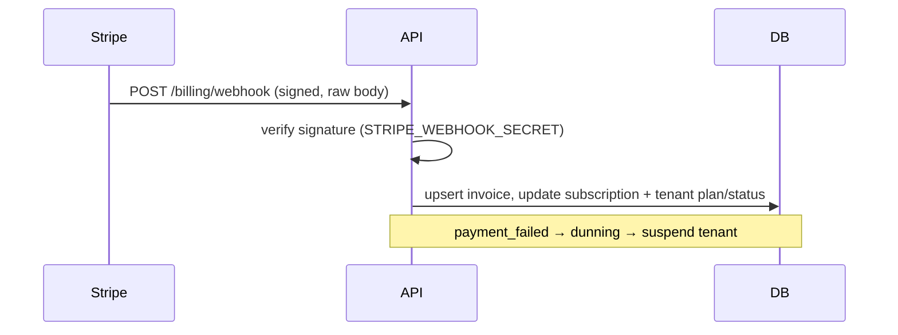
```mermaid
sequenceDiagram
    participant Stripe
    participant API
    participant DB
    Stripe->>API: POST /billing/webhook (signed, raw body)
    API->>API: verify signature (STRIPE_WEBHOOK_SECRET)
    API->>DB: upsert invoice, update subscription + tenant plan/status
    Note over API,DB: payment_failed → dunning → suspend tenant
```

### 8. Input
*   **Subscription update:** `planId`, `status`, `billingCycle`. **Asset finance:** `deviceId`, `purchasePrice`, `purchaseDate`, `salvageValue`, `usefulLifeYears`, `depreciationMethod`. **Metered:** usage metrics, alert thresholds. **Webhook:** raw Stripe event body.

### 9. Output
*   Subscription + invoices, quota usage vs limits + features, usage metrics/estimates, depreciation report (JSON/CSV).

### 10. Validation
*   Joi: `updateSubscription`, `createAssetFinance`/`updateAssetFinance`, metered `createUsageAlert`/`estimateCost`/`getAnalytics`/`getBillingHistory`.

### 11. Business Rules
*   **Subscription:** auto-created `basic/Active/Monthly` on first read; update whitelists plan/cycle/status only.
*   **Invoices:** created only from Stripe webhooks (de-dup by `stripeInvoiceId`); amounts /100.
*   **Stripe events:** `invoice.paid` → Active + un-suspend; `invoice.payment_failed` → PastDue + dunning suspend (≥3 attempts); `subscription.updated/deleted` → status/plan sync (deleted → plan `free`).
*   **Quota:** limits from `Tenant.limitSeats`/`limitStorageMb`/`plan`; feature tiers (free→enterprise); super-admins bypass.
*   **Asset finance:** straight-line / double-declining depreciation; one record per device (409); `fullyDepreciated` when age ≥ life or book ≤ salvage.

### 12. Access Rights
| Capability | Permission |
| --- | --- |
| Subscription/invoices | `dynamicAccess("Billing","read/update")` |
| Asset finance | `dynamicAccess(["Finance","Billing"], …)` |
| Metered billing / quota | `auth` (⚠️ intended `billingGuard` not applied) |
| Stripe webhook | none (signature-verified, raw body) |

### 13. Database
*   **`subscriptions`** ([subscription.model.js](backend/src/models/subscription.model.js)) — `planId`, `status`, `billingCycle`, period dates, `stripeCustomerId`/`stripeSubscriptionId`.
*   **`invoices`** ([invoice.model.js](backend/src/models/invoice.model.js)) — `amountDue`/`amountPaid`, `currency`, `status`, unique `stripeInvoiceId`.
*   **`asset_finances`** ([assetFinance.model.js](backend/src/models/assetFinance.model.js)) — unique `deviceId`, `purchasePrice`, `salvageValue`, `usefulLifeYears`, `depreciationMethod`; paranoid.
*   Metered/quota use `UsageMetric`/`PlanQuota` + `Tenant` fields.

### 14. API
Base: `/api/v1/billing`, `/api/v1/finance`, `/api/v1/metered-billing`, `/api/v1/quota`.

| Method | Endpoint | Function |
| --- | --- | --- |
| GET/PATCH | `/billing/subscription` | Get / update subscription |
| GET | `/billing/invoices` | Invoice history |
| POST | `/billing/webhook` | Stripe webhook (raw body) |
| GET/POST/PATCH/DELETE | `/finance[/:financeId]` · `/finance/reports/depreciation` | Asset finance + depreciation |
| GET/POST | `/metered-billing/{usage,history,estimate,plan,alerts,analytics}` | Metered billing |
| GET | `/quota` | Plan usage vs limits |

### 15. Integration
*   **Stripe** (`stripe` SDK) webhook verification + reconciliation; Redis intended but usage counters are in-memory; circuit breaker util.

### 16. Error Handling
*   `400` Stripe signature failure; `404` subscription/device/record not found; `409` duplicate device finance; quota `403`/`413`/`402`; `500` webhook processing (triggers Stripe retry).

### 17. Log and Audit
*   `logger` records webhook verification/processing, usage/quota events, overage suspensions. No dedicated audit table.

### 18. Configuration
| Variable | Default | Purpose |
| --- | --- | --- |
| `STRIPE_SECRET_KEY` | `sk_test_placeholder` | Stripe client |
| `STRIPE_WEBHOOK_SECRET` | — (required in prod) | Webhook signature |
| `USAGE_TTL_DAYS` / `USAGE_AGGREGATION_HOURS` / `USAGE_ENABLED` | 90 / 1 / on | Usage metering |

### 19. Dependency
`stripe`, `joi`, `sequelize`; internal `stripeWebhook.service`, `enforceQuota.middleware`, `circuitBreaker.util`.

### 20. UI/Screen
*   Billing → Subscription & plan, Invoices, Usage & metering, Quota; Finance → Asset finance / depreciation report.

### 21. Diagrams
*   Webhook reconciliation in §7.

### 22. Non-Functional Requirements
*   **Consistency:** Stripe as source of truth; idempotent invoice upsert.
*   **Enforcement:** plan limits gated at request time.

### 23. Known Limitations
*   **Metered-billing controller calls a `meteredBillingService` object the service doesn't export** → all 8 metered endpoints would throw at runtime; metered validator middleware is misused (Joi `.validate` used as Express middleware).
*   `billingGuard` RBAC defined but never applied; storage-quota enforcement is a no-op until the Attachment module ships; overage notification is a TODO; no proration/Checkout/leasing; `persistUsage` double-counts the first increment.

### 24. Change Log
| Version | Date | Description |
| --- | --- | --- |
| 1.0.0 | 2026-07-15 | Initial documentation (subscriptions, Stripe, quota, metering, finance). |

---
# MODULE 17: Notifications

### 1. General Information
*   **Module Name:** Notifications Module
*   **Module Code:** HDC-NOTIF
*   **Version:** 1.0.0
*   **Status:** Production (SMS channel broken — see §23)
*   **Owner / Person in Charge:** Platform / Messaging Team

### 2. Module Description
Delivers user- and tenant-scoped notifications through multiple channels: realtime (Socket.IO), email (RabbitMQ-queued SMTP), and SMS (multi-provider). Provides in-app notification listing, mark-as-read, and dismissal. Internal services emit notifications best-effort so they never block business operations.

### 3. Objectives
*   Provide timely operational alerts (calibration due, anomalies, system) across channels.
*   Keep notification emission non-blocking and channel-isolated.

### 4. Scope
*   **In Scope:** In-app notifications CRUD-lite, realtime push, email/SMS dispatch, unread counts.
*   **Out of Scope:** Notification templates management UI, digest scheduling.

### 5. Actors/Users
*   **All users:** view/read/dismiss their own + tenant-wide notifications.
*   **SUPERADMIN:** sees all tenants' notifications.
*   **Internal services:** emit notifications (calibration scheduler, predictive maintenance, IoT).

### 6. Features
*   Multi-channel dispatch (realtime default; email/SMS opt-in).
*   Socket.IO rooms: `user_<id>`, `tenant_<id>`, `super_admins`.
*   Unread count, mark-one/mark-all read, delete.

### 7. Workflow
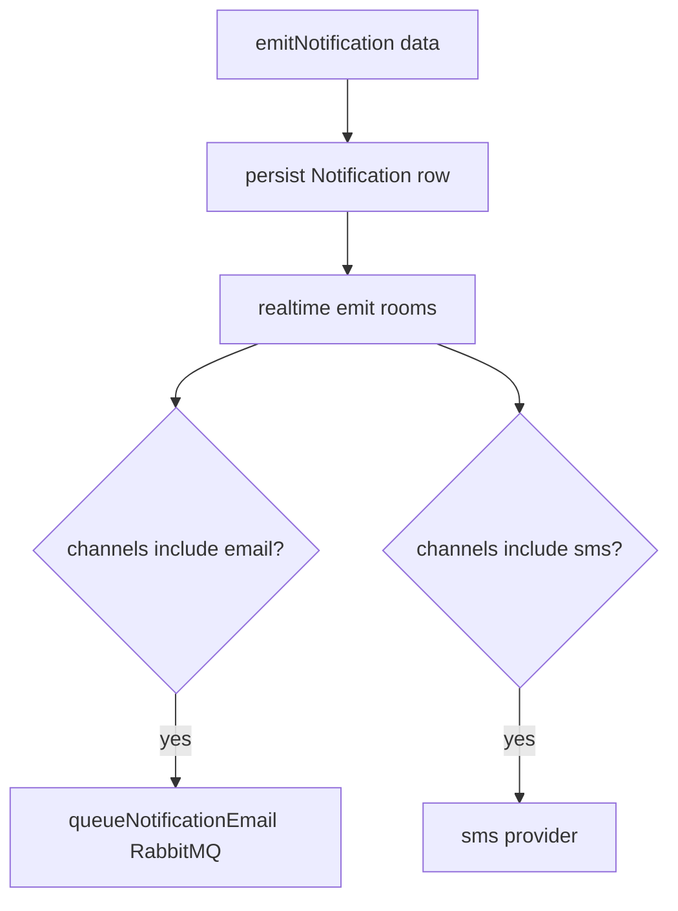
```mermaid
graph TD
    A[emitNotification data] --> B[persist Notification row]
    B --> C[realtime emit rooms]
    C --> D{channels include email?}
    D -- yes --> E[queueNotificationEmail RabbitMQ]
    C --> F{channels include sms?}
    F -- yes --> G[sms provider]
```

### 8. Input
*   Read/list filters (`isRead`, `type`, pagination); `POST /test` payload; internal `emitNotification({tenantId, userId, type, title, message, actionUrl, channels})`.

### 9. Output
*   Notification list + `meta.unread`, realtime `new_notification` events, delivery side-effects.

### 10. Validation
*   ⚠️ No payload validators (comment: notifications do not require validation). `validateUuid` on `:notificationId`.

### 11. Business Rules
*   `emitNotification` persists the row then fans out; failures are caught and never block the caller (returns null).
*   Realtime always targets `super_admins` plus `user_<id>` (if set) else `tenant_<id>`.
*   Default channel is `realtime`; email/SMS require explicit `channels`; missing recipient contact resolved from the target user.
*   Read scoping: non-super-admin = own + tenant-wide; super-admin = all tenants.

### 12. Access Rights
| Capability | Access |
| --- | --- |
| List / read / delete own notifications | `auth` |
| Cross-tenant visibility | SUPERADMIN (decided in controller) |

### 13. Database
*   **`notifications`** ([notification.model.js](backend/src/models/notification.model.js)) — PK `id`; `tenantId`; `userId` (null = broadcast); `type` (SYSTEM/CALIBRATION/INVENTORY/MAINTENANCE); `title`, `message`, `isRead`, `actionUrl`; **hard delete** (no paranoid).

### 14. API
Base: `/api/v1/notifications` — see [notifications.route.js](backend/src/routes/api/notifications.route.js).

| Method | Endpoint | Function |
| --- | --- | --- |
| GET | `/notifications` | List (paginated, unread count) |
| POST | `/notifications/test` | Send test realtime notification |
| PATCH | `/notifications/read-all` · `/:id/read` | Mark all / one read |
| DELETE | `/notifications/:id` | Dismiss (hard delete) |

### 15. Integration
*   **Socket.IO** realtime; **RabbitMQ** email queue (`amqplib`, durable `email_queue` + DLQ); **SMTP** (`nodemailer`); **SMS** (Twilio/AWS SNS/HTTP via circuit breaker).

### 16. Error Handling
*   `404` Notification not found; SMS: `400`/`429`/`500`; channel failures caught and logged, never thrown.

### 17. Log and Audit
*   `logger` records channel warnings/errors; no audit-table writes.

### 18. Configuration
| Variable | Default | Purpose |
| --- | --- | --- |
| `MAIL_HOST`/`MAIL_PORT`/`MAIL_USER`/`MAIL_PASSWORD`/`MAIL_FROM` | — | SMTP |
| `RABBITMQ_URL` (or HOST/PORT) | localhost:5672 | Email queue |
| `SMS_PROVIDER`/`SMS_ENABLED`/`TWILIO_*`/`AWS_*`/`SMS_HTTP_*` | twilio / off | SMS providers |

### 19. Dependency
`socket.io`, `amqplib`, `nodemailer`, `axios`, `sequelize`; lazy `twilio`/`@aws-sdk/client-sns` (⚠️ not in package.json).

### 20. UI/Screen
*   Notification bell/drawer, notification list, mark-read/dismiss.

### 21. Diagrams
*   Dispatch flow in §7. See [context.md §22](context.md) for Redis/session structures.

### 22. Non-Functional Requirements
*   **Resilience:** channel-isolated, non-blocking dispatch; email queue with DLQ + retry.
*   **Realtime:** Socket.IO delivery to targeted rooms.

### 23. Known Limitations
*   **SMS channel is broken** — dispatcher calls `sms.sendSms(...)`, which the SMS service does not export (throws, caught/logged).
*   OTP store and SMS rate limiter are in-memory (not multi-instance safe); notifications are hard-deleted; `POST /test` unvalidated; `twilio`/`@aws-sdk/client-sns` missing from dependencies.

### 24. Change Log
| Version | Date | Description |
| --- | --- | --- |
| 1.0.0 | 2026-07-15 | Initial documentation (multi-channel notifications). |

---
# MODULE 18: Workflow Engine

### 1. General Information
*   **Module Name:** Workflow Engine Module
*   **Module Code:** HDC-WF
*   **Version:** 1.0.0
*   **Status:** Production
*   **Owner / Person in Charge:** Platform / Process Automation Team

### 2. Module Description
A configurable, role-based approval engine. Tenants define workflows (ordered steps, each tied to a role and a required-approval count) for specific resource types; running instances track approvals/rejections and drive the target resource's status (certificate, stock transfer, maintenance work order).

### 3. Objectives
*   Provide dynamic, multi-step approval routing without hardcoding per-resource logic.
*   Record every approval decision for traceability.

### 4. Scope
*   **In Scope:** Workflow definition CRUD, instance creation (internal), pending-task listing, approve/reject actions, target-resource status updates.
*   **Out of Scope:** Parallel branches, escalation/SLA/timeouts, reminders.

### 5. Actors/Users
*   **Tenant admins:** define workflows (`dynamicAccess("workflow", …)`).
*   **Approvers:** act on instances routed to their role.

### 6. Features
*   Definition → instance → step → action model with per-step approval quorum.
*   Single active workflow per resource type; sequential step advancement.
*   Fail-soft instance start (business op proceeds if no workflow configured).

### 7. Workflow
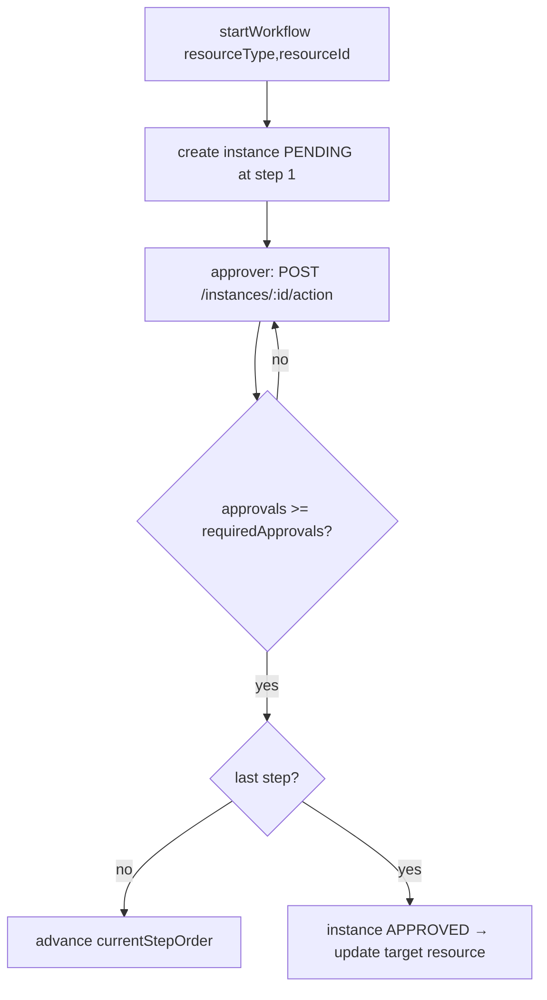
```mermaid
graph TD
    A[startWorkflow resourceType,resourceId] --> B[create instance PENDING at step 1]
    B --> C[approver: POST /instances/:id/action]
    C --> D{approvals >= requiredApprovals?}
    D -- no --> C
    D -- yes --> E{last step?}
    E -- no --> F[advance currentStepOrder]
    E -- yes --> G[instance APPROVED → update target resource]
```

### 8. Input
*   **Workflow:** `name`, `resourceType` (Certificate/StockTransfer/MaintenanceWorkOrder), `steps[]` (`stepOrder`, `roleId`, `requiredApprovals`).
*   **Action:** `action` (APPROVED/REJECTED), `comments`.

### 9. Output
*   Workflow definitions (+ steps), pending task list, instance status, action records; target-resource status side-effects.

### 10. Validation
*   Joi: `createWorkflowSchema` (steps min 1), `updateWorkflowSchema`, `submitActionSchema` (action enum). `validateUuid` on IDs.

### 11. Business Rules
*   **Single active per resourceType:** creating/activating a workflow deactivates other active ones for the same type (transactional).
*   **startWorkflow** (internal, called by certificate/stock services): fail-soft — returns null on error/missing config; creates instance PENDING at first step.
*   **submitAction:** instance must be PENDING; caller's role must match the current step; no double-acting; approvals counted against `requiredApprovals`; sequential advance or finalize.
*   **Finalize side-effects:** Certificate → approved (approvedById/At) / reject → DRAFT; StockTransfer → Approved/Rejected; MaintenanceWorkOrder → Completed on approve.

### 12. Access Rights
| Capability | Permission |
| --- | --- |
| Workflow read | `dynamicAccess("workflow","read")` |
| Workflow create/update/delete | `dynamicAccess("workflow","write")` |
| Pending tasks / submit action | `auth` (role match enforced in service) |

### 13. Database
*   **`workflows`** ([workflow.model.js](backend/src/models/workflow.model.js)) — `resourceType`, `isActive`; paranoid.
*   **`workflow_steps`** — `stepOrder`, `roleId` (RESTRICT), `requiredApprovals`.
*   **`workflow_instances`** — `resourceId` (polymorphic, no FK), `status` (PENDING/APPROVED/REJECTED/CANCELLED), `currentStepOrder`; paranoid.
*   **`workflow_actions`** — `action` (APPROVED/REJECTED), `userId` (SET NULL), `comments` — the durable approval record.

### 14. API
Base: `/api/v1/workflows` — see [workflows.route.js](backend/src/routes/api/workflows.route.js).

| Method | Endpoint | Function |
| --- | --- | --- |
| GET | `/workflows/instances/pending` | Tasks awaiting caller's role |
| POST | `/workflows/instances/:instanceId/action` | Approve / reject step |
| GET/POST | `/workflows[/:id]` | List / create / get workflow |
| PUT/DELETE | `/workflows/:id` | Update / delete workflow |

### 15. Integration
*   Invoked by `certificate.service` (Certificate) and `stock.service` (StockTransfer) via `startWorkflow`; updates those target resources on finalize.

### 16. Error Handling
*   `404` workflow/instance not found; `400` already-final / already-acted / invalid payload; `403` wrong role; `500` step config error. All paths roll back on error.

### 17. Log and Audit
*   Approval decisions captured in `workflow_actions`; `startWorkflow` logs warnings on lookup failure. ⚠️ Not written to the compliance `audit_logs`.

### 18. Configuration
*   No module-specific env vars.

### 19. Dependency
`sequelize`, `joi`; internal `dynamicAccess`, target-resource models.

### 20. UI/Screen
*   Workflow builder (steps/roles), Pending approvals inbox, Approve/Reject dialog.

### 21. Diagrams
*   Approval flow in §7.

### 22. Non-Functional Requirements
*   **Consistency:** transactional step advancement and target updates.
*   **Traceability:** every action persisted with actor and comments.

### 23. Known Limitations
*   Steps are strictly sequential — no parallel steps, escalation, timeout, or reminders.
*   `startWorkflow` is fail-soft (business op proceeds with no workflow on error); `resourceId` has no DB FK (integrity not enforced); MaintenanceWorkOrder has no reject branch and no caller starts its workflow; approval actions are not written to `audit_logs`.

### 24. Change Log
| Version | Date | Description |
| --- | --- | --- |
| 1.0.0 | 2026-07-15 | Initial documentation (approval workflow engine). |

---
# MODULE 19: Audit & Compliance Trail

### 1. General Information
*   **Module Name:** Audit & Compliance Trail Module
*   **Module Code:** HDC-AUDIT
*   **Version:** 1.0.0
*   **Status:** Development (trail not wired into production paths — see §23)
*   **Owner / Person in Charge:** Compliance & Security Team

### 2. Module Description
Provides an append-only audit-log data model and a read-only query API for compliance reporting (FDA 21 CFR Part 11), plus request/response activity logging middleware that writes to rotating log files. The audit record is designed to capture before/after state snapshots and user attribution.

### 3. Objectives
*   Provide an immutable, queryable audit trail for regulated operations.
*   Correlate every request with a user, tenant, IP, and request ID.

### 4. Scope
*   **In Scope:** Read-only audit-log query API, `AuditLog` model, activity/audit middleware (file logging).
*   **Out of Scope:** Populating the audit trail from business operations (currently not implemented).

### 5. Actors/Users
*   **Compliance / SUPERADMIN:** query the audit trail (`dynamicAccess(["AuditLogs", …], "read")`).

### 6. Features
*   Paginated, filterable audit-log query (by user/action/resource/date).
*   Immutable model design (`updatedAt:false`; `userId` retained on user deletion).
*   Rotating file-based activity/audit logging with request IDs.

### 7. Workflow
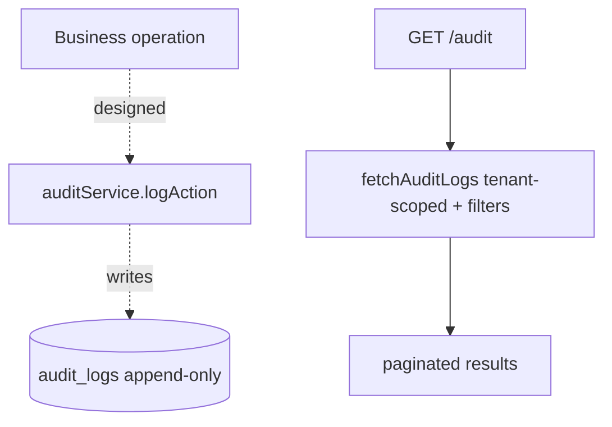
```mermaid
graph TD
    A[Business operation] -. designed .-> B[auditService.logAction]
    B -. writes .-> C[(audit_logs append-only)]
    D[GET /audit] --> E[fetchAuditLogs tenant-scoped + filters]
    E --> F[paginated results]
```

### 8. Input
*   Query filters: `page`, `limit`, `userId`, `action`, `resourceType`, `resourceId`, `startDate`, `endDate`.

### 9. Output
*   Paginated audit-log rows (with user, action, resource, changes, IP/UA) + meta.

### 10. Validation
*   ⚠️ No validators (read-only endpoint). Access gated by `dynamicAccess`.

### 11. Business Rules
*   **fetchAuditLogs:** tenant-scoped, filterable, `limit` capped at 200, sorted `createdAt DESC`; joins user with `required:false` so deleted-user logs remain.
*   **logAction (internal):** designed to insert an immutable row; on failure logs "CRITICAL" and returns null (does not block the transaction).
*   Model is append-only by design (`updatedAt:false`), `changes` JSONB intended for `{before, after}`.

### 12. Access Rights
| Capability | Permission |
| --- | --- |
| Query audit logs | `dynamicAccess(["AuditLogs","Audit Logs","audit"], "read", {checkTenant})` |

### 13. Database
*   **`audit_logs`** ([auditLog.model.js](backend/src/models/auditLog.model.js)) — PK `id`; `tenantId` (CASCADE); `userId` (SET NULL); `action` (CREATE/UPDATE/DELETE/LOGIN/APPROVE/EXPORT); `resourceType`, `resourceId`; `changes` (JSONB `{before, after}`); `ipAddress`, `userAgent`; only `createdAt` (immutable).

### 14. API
Base: `/api/v1/audit` — see [audit.route.js](backend/src/routes/api/audit.route.js).

| Method | Endpoint | Function |
| --- | --- | --- |
| GET | `/audit` | Query audit logs (read-only) |

### 15. Integration
*   PostgreSQL only. Activity/audit middleware writes to rotating files (`winston-daily-rotate-file`) under `log/activity`.

### 16. Error Handling
*   `fetchAuditLogs` throws `{status, message}` on failure; `logAction` swallows errors; access denial via `dynamicAccess` (403).

### 17. Log and Audit
*   `activityLogger` logs REQUEST/RESPONSE with request IDs (excludes health/docs routes); `auditLog` middleware logs `AUDIT: <action>` to files. ⚠️ These middlewares write to **files, not** the `audit_logs` table.

### 18. Configuration
*   No module-specific env vars; log level via `NODE_ENV`.

### 19. Dependency
`sequelize`, `winston`, `winston-daily-rotate-file`, Node `crypto` (request id).

### 20. UI/Screen
*   Compliance → Audit Log viewer (filter by user/action/resource/date).

### 21. Diagrams
*   Audit flow in §7. See [context.md §14/§23](context.md) for the audit/compliance model.

### 22. Non-Functional Requirements
*   **Compliance:** immutable, tenant-scoped audit trail (design goal).
*   **Observability:** rotating activity logs with request correlation.

### 23. Known Limitations
*   **The immutable audit trail is not wired up** — `auditService.logAction` has no production callers, so no business operation writes to `audit_logs` (a significant Part 11 gap).
*   `changes` (before/after) is never populated; there is **no hash chaining / tamper-evidence**; the two "audit" middlewares log to files only; the filter columns have no indexes.

### 24. Change Log
| Version | Date | Description |
| --- | --- | --- |
| 1.0.0 | 2026-07-15 | Initial documentation (audit model + query API + logging middleware). |

---
# MODULE 20: Content Management (CMS)

### 1. General Information
*   **Module Name:** Content Management (CMS) Module
*   **Module Code:** HDC-CMS
*   **Version:** 1.0.0
*   **Status:** Production
*   **Owner / Person in Charge:** Marketing / Web Team

### 2. Module Description
A platform-global blog/news CMS: posts and categories with a draft→published→archived lifecycle, server-side HTML sanitization, slug management, reading-time estimation, and public read endpoints for the marketing site. Content is not tenant-scoped (single HDC-wide blog).

### 3. Objectives
*   Publish marketing/news content through a simple, safe authoring workflow.
*   Serve published content publicly with categories for filtering.

### 4. Scope
*   **In Scope:** Post CRUD, category CRUD, publish lifecycle, slug checks, public read.
*   **Out of Scope:** Per-tenant content, revision history, scheduled publishing.

### 5. Actors/Users
*   **Content editors (with `content` permission):** author/manage posts and categories.
*   **Public:** read published posts and categories.

### 6. Features
*   Posts (BLOG/NEWS) with cover image, sanitized HTML, author metadata, featured flag.
*   Categories (many-to-many), slug uniqueness with auto-suffixing, reading-time calc.
*   Public list/detail endpoints.

### 7. Workflow
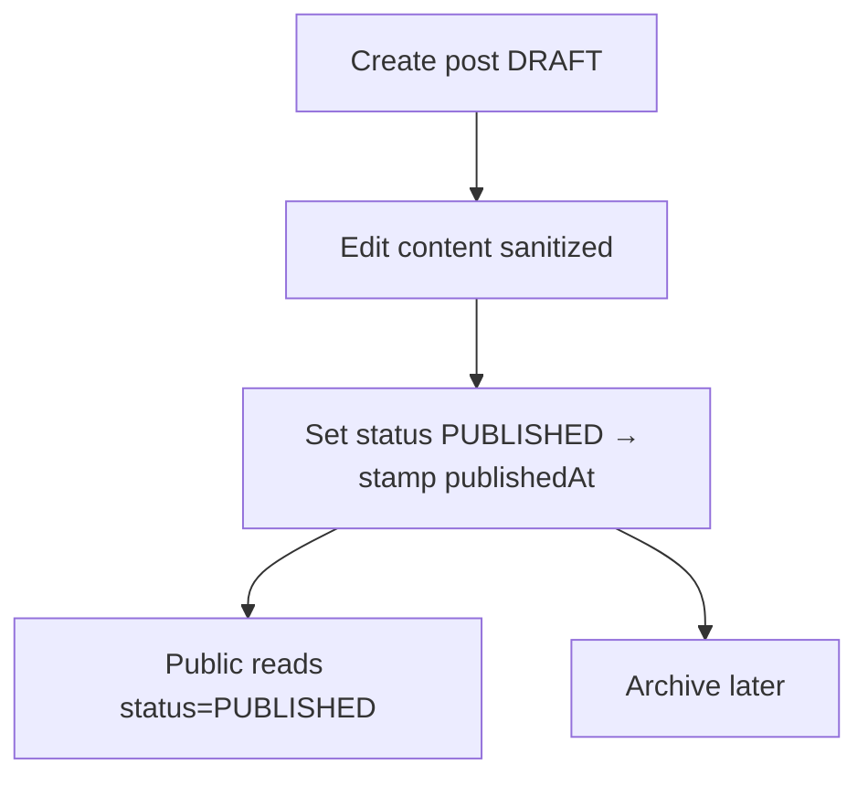
```mermaid
graph TD
    A[Create post DRAFT] --> B[Edit content sanitized]
    B --> C[Set status PUBLISHED → stamp publishedAt]
    C --> D[Public reads status=PUBLISHED]
    C --> E[Archive later]
```

### 8. Input
*   **Post:** `type` (BLOG/NEWS, required), `title`, `slug`, `excerpt`, `coverImageUrl`, `contentHtml`, `status`, `authorName/Role/Avatar`, `featured`, `categoryIds[]`.
*   **Category:** `name`, `slug`, `description`.

### 9. Output
*   Post/category records (with categories/author), public post lists/detail, slug availability + suggestion.

### 10. Validation
*   Joi: `createPost`/`updatePost` (type/title required, enums), `createCategory`/`updateCategory`. `validateUuid` on IDs.

### 11. Business Rules
*   Lifecycle DRAFT → PUBLISHED → ARCHIVED; `publishedAt` stamped on first publish; public endpoints return only PUBLISHED.
*   `contentHtml` sanitized via `sanitize-html` (allowlist; `<a>` forced `rel="noopener noreferrer"`; script/style stripped); `readingMinutes = ceil(words/200)`.
*   Slugs normalized + made unique across soft-deleted rows (auto `-2`, `-3`…); updates re-slug only when slug is explicitly provided.

### 12. Access Rights
| Capability | Access |
| --- | --- |
| Public post/category read | none (public) |
| Post/category CRUD | `dynamicAccess("content", read/create/update/delete)` (no tenant check — global) |

### 13. Database
*   **`posts`** ([post.model.js](backend/src/models/post.model.js)) — `type`, unique `slug`, `status`, `publishedAt`, `readingMinutes`, `featured`, `createdBy`; paranoid.
*   **`categories`** ([category.model.js](backend/src/models/category.model.js)) — `name`, unique `slug`; paranoid.
*   **`post_categories`** ([postCategory.model.js](backend/src/models/postCategory.model.js)) — join, unique `(post_id, category_id)`; hard delete.

### 14. API
Base: `/api/v1/content` — see [content.route.js](backend/src/routes/api/content.route.js).

| Method | Endpoint | Function |
| --- | --- | --- |
| GET | `/content/posts/public[/:slug]` · `/categories/public` | Public reads |
| GET/POST | `/content/posts` | List (any status) / create |
| GET | `/content/slug-check` | Slug availability |
| GET/PATCH/DELETE | `/content/posts/:id` | Detail / update / delete |
| GET/POST/PATCH/DELETE | `/content/categories[/:id]` | Category CRUD |

### 15. Integration
*   **sanitize-html** for content safety; cover/inline images uploaded via Module 21 and referenced by URL; Sequelize M2M.

### 16. Error Handling
*   `404` Post/Category not found; create/update run in a transaction with rollback.

### 17. Log and Audit
*   No in-module logging; `createdBy` stamped from the authenticated user.

### 18. Configuration
*   No module-specific env vars; pagination via `DEFAULT_LIMIT`/`MAX_LIMIT`.

### 19. Dependency
`sanitize-html`, `sequelize`, `joi`.

### 20. UI/Screen
*   Admin → Posts list/editor (WYSIWYG), Categories; public blog/news pages.

### 21. Diagrams
*   Publish flow in §7.

### 22. Non-Functional Requirements
*   **Security:** server-side HTML sanitization prevents stored XSS.
*   **SEO:** stable, unique slugs; reading-time metadata.

### 23. Known Limitations
*   Content is platform-global (not multi-tenant); no scheduled/future publishing; no revision history; join rows are hard-deleted.

### 24. Change Log
| Version | Date | Description |
| --- | --- | --- |
| 1.0.0 | 2026-07-15 | Initial documentation (posts, categories, publishing). |

---
# MODULE 21: Attachment & Document Management

### 1. General Information
*   **Module Name:** Attachment & Document Management Module
*   **Module Code:** HDC-ATT
*   **Version:** 1.0.0
*   **Status:** Production (virus scan is a fail-open stub — see §23)
*   **Owner / Person in Charge:** Platform / Storage Team

### 2. Module Description
Tenant-scoped file storage for documents and images attached to platform resources. Handles secure multipart upload (type allowlist + magic-byte verification), optional virus scanning, SHA-256 checksums, authenticated and HMAC-signed expiring download URLs, and storage-quota enforcement.

### 3. Objectives
*   Provide safe, tenant-isolated file storage linked to domain records.
*   Prevent malicious uploads (type spoofing, dangerous extensions, oversized files).

### 4. Scope
*   **In Scope:** Upload, list, metadata, authenticated + signed download, delete, quota enforcement.
*   **Out of Scope:** File replace/versioning, de-duplication, active ClamAV scanning (dead code).

### 5. Actors/Users
*   **All authenticated users:** upload/list/download/delete their tenant's attachments.
*   **Signed-link holders:** download via token without a session.

### 6. Features
*   Multipart upload (≤25 MB) with MIME allowlist + magic-byte validation.
*   HMAC-signed expiring download URLs (default 300 s) and authenticated streaming.
*   Storage-quota enforcement; SHA-256 checksum; soft delete.

### 7. Workflow
```mermaid
graph TD
    A[POST /attachments file] --> B[enforceStorageQuota]
    B --> C[multer write + magic-byte check]
    C --> D[virusScan.scanFile]
    D --> E{clean?}
    E -- no --> F[unlink + 422]
    E -- yes --> G[sha256 checksum + create row]
```

### 8. Input
*   Multipart `file` (jpeg/png/gif/webp/pdf/doc/docx/xls/xlsx/csv/txt); optional `resourceType`/`resourceId`; signed-URL TTL.

### 9. Output
*   Attachment metadata (fileName, originalName, mimeType, size, checksum), file streams, signed URLs.

### 10. Validation
*   Upload allowlist (`ATTACH_MIMES`/`ATTACH_EXTS`, SVG excluded); magic-byte verification; filename sanitization; empty-file rejection. `validateUuid` on `:id`.

### 11. Business Rules
*   `enforceStorageQuota` runs before multer (super-admin bypass; 413 if over).
*   Magic-byte mismatch → 400 (file deleted); virus-flagged → 422 (file deleted); SHA-256 checksum stored.
*   Tenant isolation via `loadOwned(tenantId, id)`; signed download is token-only (bypasses session/tenant); delete is soft (frees quota).

### 12. Access Rights
| Capability | Access |
| --- | --- |
| Upload | `auth` + `enforceStorageQuota` |
| List / metadata / authenticated download / signed-url / delete | `auth` |
| Signed download | none (HMAC token) |

### 13. Database
*   **`attachments`** ([attachment.model.js](backend/src/models/attachment.model.js)) — PK `id`; `tenantId` (CASCADE); polymorphic `resourceType`/`resourceId`; `fileName` (opaque), `originalName`, `folder`, `mimeType`, `size`, `checksum` (SHA-256), `uploadedBy` (SET NULL); soft-delete; indexes on tenant/resource.

### 14. API
Base: `/api/v1/attachments` — see [attachments.route.js](backend/src/routes/api/attachments.route.js).

| Method | Endpoint | Function |
| --- | --- | --- |
| GET | `/attachments/:id/signed?token=` | Signed download (public) |
| POST | `/attachments` | Upload file |
| GET | `/attachments[/:id]` | List / metadata |
| GET | `/attachments/:id/download` | Authenticated download |
| POST | `/attachments/:id/signed-url` | Mint signed URL |
| DELETE | `/attachments/:id` | Soft-delete |

### 15. Integration
*   **multer** disk storage; **virusScan.service** (pluggable stub) / **clamAv.service** (inactive); Node `crypto` HMAC/SHA-256; **quota.service** for storage limits; served statically from `/uploads`.

### 16. Error Handling
*   `400` no file / invalid type / empty / magic mismatch; `413` quota exceeded; `422` virus-flagged; `403` invalid/expired signed link; `404` not found/owned; `410` file missing on disk.

### 17. Log and Audit
*   `logger.info("Attachment created", …)`; ClamAV service logs (not exercised).

### 18. Configuration
| Variable | Default | Purpose |
| --- | --- | --- |
| `ATTACHMENT_URL_SECRET` (→ `CERT_SIGNING_SECRET`) | dev default | Signed-URL HMAC |
| `ATTACHMENT_URL_TTL_SEC` | 300 | Signed-URL lifetime |
| `MAX_FILE_SIZE` | 5 MB (25 MB attachments) | Upload limit |
| `VIRUS_SCAN_PROVIDER` | `none` | Virus scan provider |
| `CLAMAV_*` | off | ClamAV (inactive) |

### 19. Dependency
`multer`, `uuid`, `axios` (ClamAV HTTP), Node `crypto`/`fs`/`net`; internal `virusScan.service`, `quota.service`, `upload.util`, `fileValidation.util`.

### 20. UI/Screen
*   File attach widget on records; document list; download/share (signed link).

### 21. Diagrams
*   Upload/scan flow in §7.

### 22. Non-Functional Requirements
*   **Security:** magic-byte validation, dangerous-extension blocklist, SVG excluded, signed expiring links.
*   **Isolation:** per-tenant ownership checks.

### 23. Known Limitations
*   **Virus scanning is fail-open** (default provider `none`); the full ClamAV service exists but is **not wired** into the upload flow (dead code).
*   `enforceStorageQuota` uses approximate `Content-Length` and is effectively a no-op until quota accounting is measurable; no de-dup (despite checksum); no replace/version endpoint; signed downloads lack per-tenant authorization beyond the token.

### 24. Change Log
| Version | Date | Description |
| --- | --- | --- |
| 1.0.0 | 2026-07-15 | Initial documentation (secure attachments, signed URLs). |

---
# MODULE 22: Batch Jobs & Background Processing

### 1. General Information
*   **Module Name:** Batch Jobs & Background Processing Module
*   **Module Code:** HDC-JOB
*   **Version:** 0.1.0
*   **Status:** Development / Demonstration (in-process simulation — see §23)
*   **Owner / Person in Charge:** Platform Team

### 2. Module Description
Tracks the status and progress of long-running background jobs (e.g. exports) per tenant. The current implementation is an in-process simulation that advances a job's progress over time; there is no durable message queue behind it yet.

### 3. Objectives
*   Provide a job-status surface for long-running operations.
*   Establish the model/API contract for future queue-backed processing.

### 4. Scope
*   **In Scope:** Job listing, status/progress query, test-job creation.
*   **Out of Scope:** Real queue/worker (RabbitMQ), durable/crash-safe processing, result download.

### 5. Actors/Users
*   **Any authenticated user:** create test jobs and view their tenant's jobs.

### 6. Features
*   Job records with status (PENDING/PROCESSING/COMPLETED/FAILED) and progress %.
*   Simulated progress advancement; per-tenant listing.

### 7. Workflow
```mermaid
graph TD
    A[POST /jobs/test] --> B[create job PENDING]
    B --> C[simulateProcessing: PROCESSING]
    C --> D[increment processedItems/progress every 1s]
    D --> E[COMPLETED + mock resultUrl]
```

### 8. Input
*   `type` (default `EXPORT_CSV`), `totalItems` (default 10).

### 9. Output
*   Job records (status, progress, processedItems, resultUrl, errorDetails), paginated list.

### 10. Validation
*   None (controller reads body with defaults). `auth` required.

### 11. Business Rules
*   `createJob` inserts PENDING then runs `simulateProcessing` (setTimeout/setInterval); progress = processed/total × 100; completion sets COMPLETED + mock `resultUrl`.
*   Jobs are tenant-scoped; status query filters `{id, tenantId}`.

### 12. Access Rights
| Capability | Access |
| --- | --- |
| List / status / create test | `auth` (tenant-scoped) |

### 13. Database
*   **`batch_jobs`** ([batchJob.model.js](backend/src/models/batchJob.model.js)) — PK `id`; `tenantId`, `userId`; `type`; `status` (ENUM); `progress`, `totalItems`, `processedItems`; `resultUrl`, `errorDetails`; no soft-delete, no FK constraints/indexes.

### 14. API
Base: `/api/v1/jobs` — see [batchJobs.route.js](backend/src/routes/api/batchJobs.route.js).

| Method | Endpoint | Function |
| --- | --- | --- |
| GET | `/jobs` | List tenant jobs |
| GET | `/jobs/:id` | Job status/progress |
| POST | `/jobs/test` | Create test job |

### 15. Integration
*   None active — RabbitMQ publisher is a commented placeholder; progress driven by `setTimeout`/`setInterval`.

### 16. Error Handling
*   `getJobStatus` maps "Job not found" → 404 (⚠️ broken by an AppError import bug — §23); simulation errors set FAILED / `console.error`.

### 17. Log and Audit
*   None (only `console.error` on simulation errors).

### 18. Configuration
*   No env vars.

### 19. Dependency
`sequelize`.

### 20. UI/Screen
*   Job list with progress bars; job status polling.

### 21. Diagrams
*   Simulated job flow in §7.

### 22. Non-Functional Requirements
*   (Target) durable, crash-safe background processing — not yet met.

### 23. Known Limitations
*   Explicitly a **demonstration/simulation** — no real message queue (RabbitMQ commented out), not durable/crash-safe, single-process.
*   `/jobs/test` is the only creator; `resultUrl` download route is unimplemented; **AppError import bug** breaks the 404 mapping; no validation, soft-delete, FKs, or indexes.

### 24. Change Log
| Version | Date | Description |
| --- | --- | --- |
| 0.1.0 | 2026-07-15 | Initial documentation (job simulation). |

---
# MODULE 23: Reporting & Dashboard Analytics

### 1. General Information
*   **Module Name:** Reporting & Dashboard Analytics Module
*   **Module Code:** HDC-RPT
*   **Version:** 1.0.0
*   **Status:** Production
*   **Owner / Person in Charge:** Analytics / Engineering Management

### 2. Module Description
Provides on-demand, tenant-scoped operational reports (compliance, calibration workload, overdue devices, inventory) with CSV export, and an aggregated dashboard-metrics endpoint (KPIs, status breakdowns, 6-month trends) with a global view for super-admins.

### 3. Objectives
*   Give managers real-time visibility into calibration compliance, workload, and inventory.
*   Support exportable compliance evidence.

### 4. Scope
*   **In Scope:** Summary, compliance, workload, overdue-devices, inventory reports; dashboard KPIs/trends; CSV export.
*   **Out of Scope:** PDF/XLSX export, monetary/cost reporting, materialized/cached analytics.

### 5. Actors/Users
*   **Managers / admins:** view reports and dashboards for their tenant.
*   **SUPERADMIN:** global dashboard + per-tenant breakdown.

### 6. Features
*   Read-only aggregate reports over existing domain tables.
*   CSV export for compliance/overdue/inventory.
*   Dashboard KPIs (users/devices/calibrations/certificates/inventory/maintenance) + 6-month trends.

### 7. Workflow
```mermaid
graph TD
    A[GET /reports/compliance?format=csv] --> B[aggregate CalibrationRecord]
    B --> C{format=csv?}
    C -- yes --> D[stream text/csv attachment]
    C -- no --> E[JSON]
```

### 8. Input
*   Report queries: `from`, `to`, `format=csv`; dashboard: optional `tenantId` (super-admin).

### 9. Output
*   Report JSON or CSV (compliance rate, overdue list, inventory summary); dashboard KPI object with trends and (global) tenant breakdown.

### 10. Validation
*   None (query params parsed directly; `format` handled in controller).

### 11. Business Rules
*   CSV emitted only when `?format=csv` and the report exposes a CSV shape (compliance/overdue/inventory); summary and workload are JSON-only.
*   `complianceRate = compliant/total × 100`; overdue = active devices with `nextCalibrationDate < now`; low-stock = `quantity ≤ minQuantity`.
*   Dashboard: non-super-admin pinned to own tenant (query ignored); super-admin gets global + `tenantBreakdown`; trends bucketed in JS (dialect-safe).

### 12. Access Rights
| Capability | Access |
| --- | --- |
| Reports & dashboard | `auth` (tenant-scoped via `req.user.tenantId`); global view = SUPERADMIN |

### 13. Database
*   No owned models. Reads `CalibrationDevice`, `CalibrationRecord`, `Certificate`, `MaintenanceWorkOrder`, `Stock` (reports) plus `User`, `Tenant`, `Warehouse`, `StockTransfer`, `StockOpname` (dashboard).

### 14. API
Base: `/api/v1/reports`, `/api/v1/dashboard`.

| Method | Endpoint | Function |
| --- | --- | --- |
| GET | `/reports/summary` | Dashboard rollup (JSON) |
| GET | `/reports/compliance` | Compliance rate (CSV) |
| GET | `/reports/calibration-workload` | Workload by status/type/priority |
| GET | `/reports/overdue-devices` | Overdue devices (CSV) |
| GET | `/reports/inventory` | Inventory summary + low-stock (CSV) |
| GET | `/dashboard/metrics` | Aggregated KPIs + trends |

### 15. Integration
*   Sequelize aggregate functions; hand-rolled CSV writer (no library).

### 16. Error Handling
*   Wrapped by `asyncHandler`; `401` via `auth`. No custom not-found paths.

### 17. Log and Audit
*   None.

### 18. Configuration
*   No module-specific env vars.

### 19. Dependency
`sequelize`.

### 20. UI/Screen
*   Dashboard (KPI tiles, trend charts), Reports pages with CSV download.

### 21. Diagrams
*   Report/export flow in §7.

### 22. Non-Functional Requirements
*   **Performance:** on-demand aggregates (no caching); trend bucketing done in memory.

### 23. Known Limitations
*   Only CSV export (no PDF/XLSX — `exceljs`/`pdfkit` not installed); no monetary/cost reporting (schema lacks price/cost columns); reports are recomputed on demand (no caching/materialization); dashboard `monthlyTrend` loads date columns into memory for bucketing (cost at scale).

### 24. Change Log
| Version | Date | Description |
| --- | --- | --- |
| 1.0.0 | 2026-07-15 | Initial documentation (reports + dashboard). |

---
# MODULE 24: GDPR & Data Retention

### 1. General Information
*   **Module Name:** GDPR & Data Retention Module
*   **Module Code:** HDC-GDPR
*   **Version:** 1.0.0
*   **Status:** Development (controller wiring bugs — see §23)
*   **Owner / Person in Charge:** Compliance & Data Protection Team

### 2. Module Description
Implements GDPR data-subject rights (export/portability, erasure, consent, rectification, restriction, processing activities) and tenant data-retention governance (retention policies, legal hold, expired-record purge, PII masking, dataset anonymization).

### 3. Objectives
*   Support GDPR Articles 15–20 data-subject requests.
*   Enforce retention policies and legal holds; enable PII minimization.

### 4. Scope
*   **In Scope:** Data export (ZIP), erasure/anonymization, consent, rectification, restriction; retention policy, legal hold, purge, mask, anonymize.
*   **Out of Scope:** Automated retention cron (purge is a stub), cross-region residency.

### 5. Actors/Users
*   **Data subjects (users):** export/erase/consent/rectify their own data.
*   **SUPERADMIN:** retention policy, legal hold, purge, mask, anonymize (write ops).

### 6. Features
*   User data export as a ZIP (profile, tenant data, audit logs, calibration data) with expiring link.
*   Erasure via anonymize/soft/hard delete; consent history; retention purge; PII masking; anonymization.
*   Legal hold that blocks purge/mask/anonymize.

### 7. Workflow
```mermaid
graph TD
    A[POST /gdpr/export] --> B[collect user + tenant data]
    B --> C[write JSON files + ZIP]
    C --> D[return downloadUrl + expiresAt]
    E[POST /tenants/:id/purge] --> F{legal hold?}
    F -- yes --> G[skip]
    F -- no --> H[delete records older than retentionDays]
```

### 8. Input
*   **GDPR:** erasure `{reason, confirm}`, consent `{categories, consent}`, rectify `{field, value}`, restrict `{reason}`.
*   **Retention:** `{policyKey, days}`, `{entityType, recordIds}` (mask), `{entityType, options}` (anonymize), legal-hold reason.

### 9. Output
*   Export ZIP + download URL, erasure/consent results, retention policy, purge/mask/anonymize counts.

### 10. Validation
*   Joi (gdpr): `requestErasure`, `updateConsent`, `rectifyData`, `restrictProcessing`. Joi (dataRetention): `retentionPolicySchema`, `piiMaskSchema`, `anonymizeSchema`, `tenantIdSchema`.

### 11. Business Rules
*   **Export:** builds `exports/<id>/` JSON files, ZIPs (archiver), returns expiring URL; scheduled cleanup after `EXPORT_RETENTION_HOURS`.
*   **Erasure:** logs `GDPR_ERASURE` audit; anonymize (default) sets email `erased_<id>@erased.local`, names `[REDACTED]`, status `erased`.
*   **Retention purge:** skipped under legal hold; per-entity cutoff `now − retentionDays`; deletes only if `retentionDays > 0`.
*   **maskPII / anonymizeDataset:** blocked under legal hold; mask fixed field maps; anonymize sets STRING attrs to `[ANONYMIZED]` (optional date/id handling).

### 12. Access Rights
| Capability | Access |
| --- | --- |
| GDPR data-subject requests | `auth` (self) |
| Retention read | `auth` |
| Retention set / legal-hold / purge / mask / anonymize | `auth` + `superAdminOnly` |

### 13. Database
*   Reads across `User`, `Stock*`, `CalibrationDevice`, `CalibrationRecord`, `Certificate`, `MaintenanceWorkOrder`, `Notification`, `AuditLog`.
*   Config in **`tenant_settings`** (`retention_policy_*`, `legal_hold_*`). Erasure/consent reference `ConsentRecord`, `DsarRequest`, `DataRetentionPolicy`.

### 14. API
Base: `/api/v1/gdpr`, `/api/v1/tenants/:tenantId` (data retention).

| Method | Endpoint | Function |
| --- | --- | --- |
| POST | `/gdpr/export` · `/erasure` · `/restrict` | Export / erase / restrict |
| GET | `/gdpr/erasure/:requestId` · `/consent/history` · `/processing` | Status / consent / activities |
| PUT | `/gdpr/consent` · `/rectify` | Consent / rectification |
| GET/PUT | `/tenants/:id/policy` | Get / set retention policy |
| GET/POST/DELETE | `/tenants/:id/legal-hold` | Legal-hold management |
| POST | `/tenants/:id/{purge,mask-pii,anonymize}` | Purge / mask / anonymize |

### 15. Integration
*   **archiver** (ZIP), filesystem + DB; no external services.

### 16. Error Handling
*   `400` GDPR disabled / unknown policy / negative days / mask under legal hold / validation; `404` user not found; `500` export failure.

### 17. Log and Audit
*   `logger` on export/erasure/consent/legal-hold/purge/mask/anonymize; `AuditLog` row `GDPR_ERASURE`.

### 18. Configuration
| Variable | Default | Purpose |
| --- | --- | --- |
| `GDPR_ENABLED` | on | Feature flag |
| `EXPORT_RETENTION_HOURS` | 168 | Export link lifetime |
| `AUDIT_LOG_RETENTION_DAYS` / `NOTIFICATION_RETENTION_DAYS` / `SESSION_RETENTION_DAYS` | 365 / 90 / 30 | Retention defaults |

### 19. Dependency
`archiver`, `joi`, `sequelize`, Node `fs`/`path`/`crypto`.

### 20. UI/Screen
*   Privacy → Data export/erasure, Consent center; Admin → Retention policy, Legal hold, Purge/Mask/Anonymize.

### 21. Diagrams
*   Export & purge flows in §7. See [context.md §23](context.md).

### 22. Non-Functional Requirements
*   **Compliance:** GDPR Art. 15–20 support; legal-hold overrides deletion.

### 23. Known Limitations
*   **`gdpr.controller` destructures a `gdprService` the service doesn't export** and calls several methods that don't exist (`requestErasure`, `updateConsent`, `rectifyData`, `restrictProcessing`, …) → those endpoints fail at runtime; `exportUserData` passes args in swapped order.
*   Swagger body fields don't match validators; retention purge (`purgeExpiredData`) is a stub with no scheduled job.

### 24. Change Log
| Version | Date | Description |
| --- | --- | --- |
| 1.0.0 | 2026-07-15 | Initial documentation (GDPR rights + data retention). |

---
# MODULE 25: IoT Telemetry

### 1. General Information
*   **Module Name:** IoT Telemetry Module
*   **Module Code:** HDC-IOT
*   **Version:** 1.0.0
*   **Status:** Production
*   **Owner / Person in Charge:** IoT / Platform Team

### 2. Module Description
Ingests device telemetry over MQTT and HTTP, stores immutable readings, flags anomalies against per-device tolerance bounds, and raises notifications on anomalies. Feeds the predictive-maintenance engine.

### 3. Objectives
*   Capture real-time device readings and detect out-of-tolerance values.
*   Provide the anomaly signal used for predictive calibration-interval tuning.

### 4. Scope
*   **In Scope:** MQTT subscription, HTTP ingest, reading storage, anomaly flagging, anomaly notifications.
*   **Out of Scope:** Device provisioning UI, time-series downsampling/retention.

### 5. Actors/Users
*   **IoT devices/gateways:** publish telemetry (token-authenticated).
*   **System:** consumes anomalies for predictive maintenance and alerts.

### 6. Features
*   MQTT (`device/#`) and HTTP ingestion with device-token auth.
*   Per-metric anomaly detection against `readingTolerance` bounds.
*   Immutable reading store; anomaly notifications.

### 7. Workflow
```mermaid
graph TD
    A[MQTT device/#  or  POST /iot/ingest] --> B[authenticate device token]
    B --> C[for each metric vs tolerance min/max]
    C --> D{out of bounds?}
    D -- yes --> E[isAnomaly=true + Notification]
    D -- no --> F[store reading]
```

### 8. Input
*   Device token (`x-iot-token` header or body `token`); `metrics` payload (object); MQTT topic `device/<deviceId>/<tenantId>`.

### 9. Output
*   `IotReading` rows; `{success, isAnomaly}`; anomaly notifications.

### 10. Validation
*   Manual checks only (token present, payload is an object). No Joi validator.

### 11. Business Rules
*   Device resolved by `{iotDeviceToken, iotEnabled:true}` (unscoped); missing token/device → 401.
*   Anomaly when a metric value falls outside its `readingTolerance {min, max}`; anomaly creates a `system` Notification.
*   MQTT connects only when `MQTT_HOST` + `MQTT_PORT` are set (reconnect 5 s, clean session).

### 12. Access Rights
| Capability | Access |
| --- | --- |
| HTTP ingest | device-token (no user auth) |
| MQTT ingest | broker subscription |

### 13. Database
*   **`iot_readings`** ([iotReading.model.js](backend/src/models/iotReading.model.js)) — PK `id`; `tenantId` (CASCADE), `deviceId`→`calibration_devices.id` (CASCADE); `timestamp` (default NOW); `metrics` (JSONB); `isAnomaly`; **immutable** (`updatedAt:false`); indexes on tenant/device/timestamp/(device,timestamp).

### 14. API
Base: `/api/v1/iot` — see [iot.route.js](backend/src/routes/api/iot.route.js).

| Method | Endpoint | Function |
| --- | --- | --- |
| POST | `/iot/ingest` | HTTP telemetry ingestion (device token) |
| — | MQTT `device/#` | Broker telemetry ingestion |

### 15. Integration
*   **MQTT broker** (`mqtt://<host>:<port>`, sub `device/#`, pub qos 1); writes `Notification` on anomaly; feeds Module 12 predictive maintenance.

### 16. Error Handling
*   `401` missing token / invalid-or-IoT-disabled device; `400` payload missing; MQTT parse errors logged (not thrown).

### 17. Log and Audit
*   `logger` info on connect/subscribe/publish; warn on anomaly/reconnect; error on failures.

### 18. Configuration
| Variable | Default | Purpose |
| --- | --- | --- |
| `MQTT_HOST` / `MQTT_PORT` | — (both required to enable) | MQTT broker |

### 19. Dependency
`mqtt`, `sequelize`.

### 20. UI/Screen
*   Device telemetry/readings view, anomaly alerts (via notifications).

### 21. Diagrams
*   Ingest/anomaly flow in §7.

### 22. Non-Functional Requirements
*   **Immutability:** readings are append-only.
*   **Realtime:** MQTT ingestion with qos 1 publish.

### 23. Known Limitations
*   No rate limiting or payload validation on ingest; single shared MQTT singleton; `ingestHttp` uses a non-standard `success()` call convention; no reading retention/downsampling.

### 24. Change Log
| Version | Date | Description |
| --- | --- | --- |
| 1.0.0 | 2026-07-15 | Initial documentation (MQTT/HTTP telemetry + anomaly detection). |

---
# MODULE 26: AI Assistant Services

### 1. General Information
*   **Module Name:** AI Assistant Services Module
*   **Module Code:** HDC-AI
*   **Version:** 1.0.0
*   **Status:** Development (RAG retrieval stubbed — see §23)
*   **Owner / Person in Charge:** AI / Platform Team

### 2. Module Description
Provides AI-assisted features via an OpenAI-compatible API: certificate OCR extraction (vision) and a retrieval-augmented-generation (RAG) question-answering endpoint over tenant documents. Provider configuration is per-tenant with environment fallback.

### 3. Objectives
*   Automate certificate data extraction from scanned images.
*   Answer questions grounded in tenant documentation.

### 4. Scope
*   **In Scope:** Certificate OCR, RAG query, per-tenant provider config.
*   **Out of Scope:** Active vector retrieval (currently simulated), model fine-tuning.

### 5. Actors/Users
*   **Authenticated users:** submit certificates for OCR and ask document questions.

### 6. Features
*   OCR extraction (GPT-4o vision) → structured certificate fields JSON.
*   RAG Q&A (GPT-4o-mini) with embeddings (text-embedding-3-small).
*   Per-tenant provider key/base-url override with env fallback.

### 7. Workflow
```mermaid
graph TD
    A[POST /ai/ocr file] --> B[resolve tenant AI config]
    B --> C[POST chat/completions gpt-4o vision]
    C --> D[return extracted JSON]
    E[POST /ai/query] --> F[embed question]
    F --> G[(vector search — simulated)]
    G --> H[chat/completions gpt-4o-mini → answer]
```

### 8. Input
*   **OCR:** multipart `file` (≤5 MB, memory). **Query:** `question`.

### 9. Output
*   OCR: `{certificateNumber, calibrationDate, dueDate, vendorName, deviceSerialNumber, status}`; RAG: answer text (or null if AI not configured).

### 10. Validation
*   Manual checks (file/question present). No Joi validator.

### 11. Business Rules
*   Provider resolved from `TenantSettings` (`ai_api_key`/`ai_base_url`/`ai_vendor`) falling back to `OPENAI_*` env; no key → feature no-op (null).
*   OCR uses model `gpt-4o` with `response_format: json_object`; RAG uses `gpt-4o-mini` + `text-embedding-3-small`.

### 12. Access Rights
| Capability | Access |
| --- | --- |
| OCR / RAG query | `auth` |

### 13. Database
*   No AI-specific table; config in **`tenant_settings`** (`ai_*`). RAG references a document embedding column (pgvector), but retrieval is currently simulated.

### 14. API
Base: `/api/v1/ai` — see [ai.route.js](backend/src/routes/api/ai.route.js).

| Method | Endpoint | Function |
| --- | --- | --- |
| POST | `/ai/ocr` | Certificate OCR extraction |
| POST | `/ai/query` | RAG document Q&A |

### 15. Integration
*   **OpenAI-compatible REST API** via `axios` (chat/completions, embeddings); pgvector referenced but inactive.

### 16. Error Handling
*   `400` no file / no question; `500` when service returns null (OCR failed / AI not configured). Service swallows axios errors (returns null, logs error).

### 17. Log and Audit
*   `logger.warn` when API key not configured; `logger.error` on OCR/embedding/RAG failure.

### 18. Configuration
| Variable | Default | Purpose |
| --- | --- | --- |
| `OPENAI_API_KEY` | — | AI provider key (env fallback) |
| `OPENAI_BASE_URL` | `https://api.openai.com/v1` | Provider base URL |
| (per-tenant) `ai_api_key`/`ai_base_url`/`ai_vendor` | — | Tenant overrides |

### 19. Dependency
`axios`, `multer`.

### 20. UI/Screen
*   Certificate scan/OCR upload; document Q&A assistant.

### 21. Diagrams
*   OCR & RAG flows in §7.

### 22. Non-Functional Requirements
*   **Configurability:** per-tenant provider selection; graceful no-op when unconfigured.

### 23. Known Limitations
*   **RAG retrieval is stubbed/simulated** — document context is hardcoded, so answers are not actually grounded in tenant documents (assumes a `SopDocuments.embedding` vector column + index).

### 24. Change Log
| Version | Date | Description |
| --- | --- | --- |
| 1.0.0 | 2026-07-15 | Initial documentation (OCR + RAG). |

---
# MODULE 27: Feature Flags

### 1. General Information
*   **Module Name:** Feature Flags Module
*   **Module Code:** HDC-FLAG
*   **Version:** 1.0.0
*   **Status:** Production
*   **Owner / Person in Charge:** Platform Team

### 2. Module Description
Per-tenant boolean feature toggles resolved against a catalog of default flags. Overrides are stored in tenant settings; super-admins set/reset flags and initialize tenant defaults.

### 3. Objectives
*   Enable/disable platform capabilities per tenant without deployments.
*   Provide a documented catalog of togglable features.

### 4. Scope
*   **In Scope:** Flag read/evaluate, definitions catalog, per-tenant override set/reset, initialization.
*   **Out of Scope:** Percentage rollout, user targeting, A/B experimentation.

### 5. Actors/Users
*   **All authenticated users:** read effective flags.
*   **SUPERADMIN:** set/reset/initialize tenant flags.

### 6. Features
*   14 default flags across platform/calibration/billing/compliance/ai/field-service/integration categories.
*   Resolution order: tenant override → plan default → global false.
*   Initialize seeds only true-by-default flags.

### 7. Workflow
```mermaid
graph TD
    A[isEnabled tenant,flag] --> B{tenant override?}
    B -- yes --> C[use override]
    B -- no --> D[use DEFAULT_FLAGS default]
    D --> E{unknown flag?}
    E -- yes --> F[false]
```

### 8. Input
*   `tenantId`, `flagKey`, `enabled` (boolean, for set).

### 9. Output
*   Effective flag map, flag definitions catalog, per-flag boolean.

### 10. Validation
*   Joi: `flagKeySchema`, `flagValueSchema` (enabled boolean), `tenantFlagQuerySchema`.

### 11. Business Rules
*   Overrides stored as `feature_flag_<key>` in `tenant_settings` (`'true'`/`'false'`, with `updatedBy`).
*   `initializeTenantFlags` bulk-creates only flags whose default is true; unknown flag → error / false.
*   Booleans only — no rollout percentage or targeting.

### 12. Access Rights
| Capability | Access |
| --- | --- |
| Read flags / definitions / check one | `auth` |
| Set / reset / initialize | `auth` + `superAdminOnly` |

### 13. Database
*   Config in **`tenant_settings`** (`feature_flag_*`). No dedicated flag table.

### 14. API
Base: `/api/v1/feature-flags` — see [featureFlags.route.js](backend/src/routes/api/featureFlags.route.js).

| Method | Endpoint | Function |
| --- | --- | --- |
| GET | `/feature-flags` · `/definitions` | Effective flags / catalog |
| GET | `/feature-flags/:tenantId/:flagKey` | Check one flag |
| POST/DELETE | `/feature-flags/:tenantId/:flagKey` | Set / reset override |
| POST | `/feature-flags/:tenantId/initialize` | Seed tenant defaults |

### 15. Integration
*   Consumed across modules (e.g. hierarchy, tenant lifecycle) to gate features.

### 16. Error Handling
*   `400` unknown flag / validation.

### 17. Log and Audit
*   None (no logging in service/controller).

### 18. Configuration
*   No env vars (catalog is code-defined `DEFAULT_FLAGS`).

### 19. Dependency
`joi`, `sequelize`.

### 20. UI/Screen
*   Admin → Feature Flags (per-tenant toggles, definitions).

### 21. Diagrams
*   Resolution flow in §7.

### 22. Non-Functional Requirements
*   **Flexibility:** runtime capability toggling per tenant.

### 23. Known Limitations
*   No percentage/gradual rollout or user targeting (booleans only); no audit logging; `tenantId` is trusted from client input (query/params/body) rather than `req.user.tenantId`.

### 24. Change Log
| Version | Date | Description |
| --- | --- | --- |
| 1.0.0 | 2026-07-15 | Initial documentation (feature flags). |

---
# MODULE 28: Network Security

### 1. General Information
*   **Module Name:** Network Security Module
*   **Module Code:** HDC-NETSEC
*   **Version:** 1.0.0
*   **Status:** Production
*   **Owner / Person in Charge:** Security Team

### 2. Module Description
Per-tenant network access controls: an IPv4 CIDR allowlist and a geofence (lat/long + radius), plus a login-time evaluation endpoint that returns whether an IP/location is allowed and whether MFA step-up is required.

### 3. Objectives
*   Restrict tenant access to approved networks and geographies.
*   Signal step-up authentication for out-of-policy logins.

### 4. Scope
*   **In Scope:** IP allowlist (CIDR), geofence, login evaluation.
*   **Out of Scope:** IPv6, IP blocklists, geo-IP database lookup (client supplies coordinates).

### 5. Actors/Users
*   **SUPERADMIN:** configure allowlist/geofence.
*   **Auth flow:** evaluate login IP/location.

### 6. Features
*   IPv4 CIDR allowlist (bitmask matching).
*   Geofence via Haversine distance vs radius.
*   Combined login evaluation → `requiresStepUp`.

### 7. Workflow
```mermaid
graph TD
    A[POST /network-security/evaluate-login {ip,lat,lng}] --> B[IP in allowlist?]
    B --> C[within geofence radius?]
    C --> D{both allowed?}
    D -- no --> E[requiresStepUp = true]
    D -- yes --> F[allowed]
```

### 8. Input
*   Allowlist: `cidrs[]`; geofence: `latitude`, `longitude`, `radiusKm`; evaluate: `ip`, optional `latitude`/`longitude`.

### 9. Output
*   Allowlist/geofence config; evaluation `{allowed, ip, geofence, requiresStepUp}`.

### 10. Validation
*   Joi: `ipAllowlistSchema` (CIDR regex), `geofenceSchema` (lat/long/radius), `evaluateLoginSchema` (`Joi.ip`).

### 11. Business Rules
*   Empty allowlist → allowed (`no_restrictions`); otherwise IP must match a CIDR.
*   No geofence → allowed; otherwise Haversine distance ≤ radius (default 50 km).
*   `evaluateLoginSecurity = ipCheck.allowed && geoCheck.allowed`; failure sets `requiresStepUp`.

### 12. Access Rights
| Capability | Access |
| --- | --- |
| Read allowlist/geofence, evaluate | `auth` |
| Set allowlist/geofence | `auth` + `superAdminOnly` |

### 13. Database
*   Config in **`tenant_settings`** (`ip_allowlist`, `geofence`). No dedicated table.

### 14. API
Base: `/api/v1/network-security` — see [networkSecurity.route.js](backend/src/routes/api/networkSecurity.route.js).

| Method | Endpoint | Function |
| --- | --- | --- |
| GET/PUT | `/network-security/ip-allowlist` | Get / set CIDR allowlist |
| GET/PUT | `/network-security/geofence` | Get / set geofence |
| POST | `/network-security/evaluate-login` | Evaluate IP + location |

### 15. Integration
*   Intended to feed the login flow (step-up MFA signal).

### 16. Error Handling
*   `400` validation; parse failures caught → safe defaults.

### 17. Log and Audit
*   `logger.warn` on IP-not-allowed / geofence-failed.

### 18. Configuration
*   No env vars (constant `DEFAULT_GEOFENCE_RADIUS_KM = 50`).

### 19. Dependency
`joi`.

### 20. UI/Screen
*   Admin → Network Security (IP allowlist, geofence).

### 21. Diagrams
*   Evaluation flow in §7.

### 22. Non-Functional Requirements
*   **Security:** defense-in-depth network gating; step-up signal for anomalies.

### 23. Known Limitations
*   IPv4-only CIDR (no IPv6); no blocklist; no geo-IP database (client must supply coordinates); controller imports `auth`/`superAdminOnly` unused (dead import).

### 24. Change Log
| Version | Date | Description |
| --- | --- | --- |
| 1.0.0 | 2026-07-15 | Initial documentation (IP allowlist + geofence). |

---
# MODULE 29: Global Search

### 1. General Information
*   **Module Name:** Global Search Module
*   **Module Code:** HDC-SEARCH
*   **Version:** 1.0.0
*   **Status:** Production
*   **Owner / Person in Charge:** Platform Team

### 2. Module Description
A unified, tenant-scoped full-text search across calibration devices, stock items, and certificates using PostgreSQL `tsvector`/`tsquery` ranking, with an ILIKE fallback when the full-text index is unavailable.

### 3. Objectives
*   Provide a single search box across the most-referenced entities.
*   Degrade gracefully if full-text search columns are missing.

### 4. Scope
*   **In Scope:** Full-text search over devices, stock, certificates; type filtering; ranked results.
*   **Out of Scope:** Searching other entities; fuzzy/typo tolerance; external search engine.

### 5. Actors/Users
*   **All authenticated users:** search within their tenant.

### 6. Features
*   Ranked `tsvector` search with per-type filtering (`device`/`stock`/`certificate`).
*   ILIKE fallback; merged, rank-sorted results; result limit clamp (1–50).

### 7. Workflow
```mermaid
graph TD
    A[GET /search?q&types&limit] --> B[ts_rank + plainto_tsquery per type]
    B --> C{FTS available?}
    C -- no --> D[ILIKE fallback rank 0]
    C -- yes --> E[merge + sort by rank desc]
```

### 8. Input
*   `q` (query), `types` (CSV of device/stock/certificate), `limit` (1–50, default 10).

### 9. Output
*   `{query, total, results[], byType}` — merged, rank-sorted matches.

### 10. Validation
*   None (controller parses `types` CSV; service clamps limit).

### 11. Business Rules
*   FTS via `ts_rank(search_vector, plainto_tsquery('english', q))` filtered by `search_vector @@ plainto_tsquery`, ordered by rank; on FTS failure → ILIKE fallback (rank 0); second failure → empty.
*   Tenant-scoped via `tenant_id`; soft-deleted rows excluded; empty query → empty result.

### 12. Access Rights
| Capability | Access |
| --- | --- |
| Search | `auth` (tenant-scoped) |

### 13. Database
*   Raw SQL over `calibration_devices`, `stocks`, `certificates`; uses a `search_vector` column + GIN index (migration `0003-add-search-vectors`).

### 14. API
Base: `/api/v1/search` — see [search.route.js](backend/src/routes/api/search.route.js).

| Method | Endpoint | Function |
| --- | --- | --- |
| GET | `/search?q=&types=&limit=` | Unified tenant-scoped search |

### 15. Integration
*   PostgreSQL full-text search (`db.query`, `QueryTypes.SELECT`).

### 16. Error Handling
*   FTS failure logged (warn) → ILIKE; both fail (error) → empty array (never throws).

### 17. Log and Audit
*   `logger.warn`/`error` on FTS/search failure.

### 18. Configuration
*   No env vars.

### 19. Dependency
`sequelize` (QueryTypes).

### 20. UI/Screen
*   Global search bar with grouped results.

### 21. Diagrams
*   Search flow in §7.

### 22. Non-Functional Requirements
*   **Resilience:** ILIKE fallback if the FTS column is absent.
*   **Performance:** GIN-indexed ranked search.

### 23. Known Limitations
*   Only 3 entity types indexed; ILIKE fallback loses ranking; English text-search config is hardcoded.

### 24. Change Log
| Version | Date | Description |
| --- | --- | --- |
| 1.0.0 | 2026-07-15 | Initial documentation (full-text search). |

---
# MODULE 30: Platform Administration & Database Migration

### 1. General Information
*   **Module Name:** Platform Administration & Database Migration Module
*   **Module Code:** HDC-ADMIN
*   **Version:** 1.0.0
*   **Status:** Production (admin has a runtime bug — see §23)
*   **Owner / Person in Charge:** Platform / SRE Team

### 2. Module Description
Super-admin, cross-tenant platform operations (tenant listing, status changes, feature-flag/settings merge) and internal database migration/seeding endpoints for provisioning and lifecycle of the schema and default data.

### 3. Objectives
*   Give platform operators cross-tenant control and safe migration/seeding tooling.
*   Guard destructive operations behind environment and role checks.

### 4. Scope
*   **In Scope:** Cross-tenant tenant admin ops; migration up/down, seeding/unseeding.
*   **Out of Scope:** Impersonation (in Module 1), per-tenant business operations.

### 5. Actors/Users
*   **SUPERADMIN:** all admin endpoints.
*   **Operators / bootstrap:** migration & seeding (env-gated).

### 6. Features
*   List/paginate all tenants; set tenant status; merge feature flags into tenant settings.
*   Migration up/down; idempotent seeding (roles, menus, default tenant, system user) and unseeding.

### 7. Workflow
```mermaid
graph TD
    A[GET /migration/seeding] --> B{ALLOW_SEEDING or super-admin?}
    B -- no --> X[403]
    B -- yes --> C[seed roles → menus → default tenant → users]
    D[PATCH /admin/tenants/:id/status] --> E[update tenant status]
```

### 8. Input
*   **Admin:** tenant `status` (active/suspended/deleted), `flags` object; list `page`/`limit`/`search`.
*   **Migration:** none (GET triggers).

### 9. Output
*   Tenant lists/status results, flag-merge confirmation, migration/seed step results.

### 10. Validation
*   Admin uses inline checks (status enum validated in service). Migration has no payload.

### 11. Business Rules
*   Admin: list/paginate tenants (name/code search), update status, merge flags into `tenant.settings` JSONB.
*   Migration guards: `allowDestructive` blocks drop/unseed unless non-production AND `ALLOW_DESTRUCTIVE_MIGRATION=true`; `superAdminOrBootstrap` allows if `ALLOW_SEEDING=true` else requires super-admin (fail-closed).
*   Seeding is idempotent (roles, menu groups/permissions, default tenant, system user `sys@mail.com`).

### 12. Access Rights
| Capability | Access |
| --- | --- |
| `/admin/*` | `auth` + `rbac(["SUPER_ADMIN","SUPERADMIN"])` |
| `/migration/up`, `/seeding` | `superAdminOrBootstrap` |
| `/migration/down`, `/unseeding` | `auth` + `superAdminOnly` + `allowDestructive` |

### 13. Database
*   Admin operates on `tenants` (status, `settings` JSONB). Migration seeds `roles`, `menu_groups`, `role_menu_permissions`, default `tenants`, `users` (+ warehouse/stock models in scope).

### 14. API
Base: `/api/v1/admin`, `/api/v1/migration`.

| Method | Endpoint | Function |
| --- | --- | --- |
| GET | `/admin/tenants` | List all tenants |
| PATCH | `/admin/tenants/:id/status` · `/flags` | Set status / merge flags |
| GET | `/migration/up` · `/down` | Run / drop migration |
| GET | `/migration/seeding` · `/unseeding` | Seed / unseed default data |

### 15. Integration
*   PostgreSQL via Sequelize; `config/migrate`, `seedMenuGroups.util`, `password.util` (system-user hashing).

### 16. Error Handling
*   `404` Tenant not found; `400` Invalid status; `403` on destructive/seed guards (⚠️ admin 404/400 broken by AppError import bug — §23).

### 17. Log and Audit
*   Migration logs each drop/sync/seed/unseed step; admin has no logging. ⚠️ No audit trail for admin actions.

### 18. Configuration
| Variable | Default | Purpose |
| --- | --- | --- |
| `NODE_ENV` | — | Destructive guard |
| `ALLOW_DESTRUCTIVE_MIGRATION` | off | Enable drop/unseed (non-prod) |
| `ALLOW_SEEDING` | off | Allow bootstrap seeding |

### 19. Dependency
`sequelize`; internal `config/migrate`, `password.util`, `seedMenuGroups.util`.

### 20. UI/Screen
*   Platform Admin → Tenants management (status, flags). Migration is API/ops-only.

### 21. Diagrams
*   Seeding/admin flow in §7. See [context.md §24](context.md) for the roadmap.

### 22. Non-Functional Requirements
*   **Safety:** destructive operations env- and role-gated, fail-closed.
*   **Idempotency:** seeding safe to re-run.

### 23. Known Limitations
*   **`admin.service` AppError import bug** → `new AppError(404/400, …)` throws `TypeError: AppError is not a constructor` on the not-found / invalid-status paths.
*   Admin flag/settings merge assumes a JSONB `settings` column (controller comment flags uncertainty); no impersonation and no audit trail for admin actions.

### 24. Change Log
| Version | Date | Description |
| --- | --- | --- |
| 1.0.0 | 2026-07-15 | Initial documentation (platform admin + migration/seeding). |

---
# MODULE 31: Kanban Project Tracker & Analytics

### 1. General Information
*   **Module Name:** Kanban Project Tracker & Analytics Module
*   **Module Code:** HDC-KANBAN
*   **Version:** 1.0.0
*   **Status:** Production
*   **Owner / Person in Charge:** Platform Team

### 2. Module Description
A tenant-scoped project tracker where one project equals one Kanban board with its own configurable columns, cards, labels, sprints, and per-project membership. Boards are real-time collaborative via Socket.IO, notify assignees and tagged users on changes, and feed a KPI analytics dashboard.

### 3. Objectives
*   Give each tenant self-service Kanban boards with configurable column flows and sprints.
*   Provide real-time collaboration, assignee/tag notifications, and point-in-time delivery KPIs.

### 4. Scope
*   **In Scope:** Boards/projects, configurable columns with a permanent Done column, cards with incremental keys, sprints and card migration, card relations, assignees/labels/attachments, real-time updates, notifications, KPI dashboard.
*   **Out of Scope:** Card comments/activity history, cross-project boards, sprint velocity/burndown, a dedicated kanban notification type.

### 5. Actors/Users
*   **Owner:** manage board, members, columns, sprints. Super-admins and the project creator are always owners.
*   **Editor:** create/edit cards, labels, relations; move cards; migrate.
*   **Viewer:** read-only board access.

### 6. Features
*   Dynamic per-tenant column flow with a permanent terminal **Done** column (undeletable, always kept last).
*   Incremental **card keys** (project `code` prefix + monotonic `card_seq`, e.g. MGT-1, MGT-2).
*   **Sprints** (planned/active/completed); the board fetches one sprint's cards at a time.
*   **Card migration**: move selected cards, or all cards not in a Done column, to a target sprint/backlog.
*   **Card relations** (parent_of/child_of, blocks/blocked_by, relates_to, duplicates) written in both directions.
*   Assign & tag users (assignees), labels, and image **attachments** via the shared attachment service (resourceType `KanbanCard`).
*   **Real-time** board updates, notifications on assign/tag/update, and an **analytics/KPI dashboard**.

### 7. Workflow
```mermaid
graph TD
    A[Create project] --> B[Seed To Do / In Progress / Done columns + active Sprint 1]
    B --> C[Create card: auto card-key, lands in active sprint]
    C --> D[Assign / tag / label]
    D --> E[Drag between columns = move]
    E --> F[Migrate to next sprint]
    F --> G[Card reaches Done]
    E --> H[Emit Socket.IO event to board_projectId + notify assignees]
```

### 8. Input
*   **Project:** `{name, code, description, color, members[]}`.
*   **Card:** `{columnId, sprintId, title, description, priority(low|medium|high|urgent), dueDate, assigneeIds[], labelIds[]}`.
*   **Sprint:** `{name, goal, status}`.
*   **Migrate:** `{cardIds[] | allNotDone, fromSprintId, targetSprintId}`.
*   **Relation:** `{targetCardId, type}`.

### 9. Output
*   **Board:** `{id, name, code, myAccess, activeSprintId, columns[], cards[], labels[], sprints[], members[]}`.
*   **Card:** `{id, cardKey, number, columnId, sprintId, title, assignees[], labels[], relations[], …}`.
*   **Metrics:** `{summary{total, done, inProgress, completionRate, overdue, unassigned, columns, sprints}, byColumn, byPriority, byAssignee, byLabel, bySprint}`.

### 10. Validation
*   Joi via `validate(schema)` ([kanban.validator.js](backend/src/validators/kanban.validator.js)).
*   Code pattern `^[A-Za-z0-9]+$`; member schema `.xor("userId","roleId")`.
*   Card `sprintId` accepts a uuid, `"backlog"`, or null; migrate `.or("cardIds","allNotDone")`.
*   Sprint `status` and relation `type` enums.

### 11. Business Rules
*   The Done column is undeletable (400) and always forced last; a project keeps ≥1 owner and ≥1 column.
*   Card keys are monotonic (`card_seq` never decremented; deleting a card does not recycle its key).
*   Relations are stored in both directions with self/duplicate rejection.
*   Deleting a sprint sends its cards to the backlog (FK `ON DELETE SET NULL`); `allNotDone` migration excludes cards in Done columns.
*   A viewer-level access miss returns 404 (does not reveal the board exists).
*   Notifications persist with type `SYSTEM` (the notifications enum has no kanban type).

### 12. Access Rights
| Capability | Access |
| --- | --- |
| List / view board | `viewer` |
| Create / edit / move / delete cards, labels, relations; migrate | `editor` |
| Manage project, members, columns, sprints | `owner` |

### 13. Database
*   9 tables (all `underscored`; tenant-scoped tables carry `tenant_id` + RLS), created by `db.sync()`.
*   `kanban_projects` (code, card_seq); `kanban_project_members` (user_id xor role_id, access_level); `kanban_columns` (is_done); `kanban_cards` (sprint_id nullable, number, card_key, priority, due_date, position — paranoid); `kanban_labels`; `kanban_card_assignees` (join); `kanban_card_labels` (join); `kanban_sprints` (status); `kanban_card_relations` (source_card_id, target_card_id, type).

### 14. API
Base: `/api/v1/kanban` — see [kanban.route.js](backend/src/routes/api/kanban.route.js). All routes require `auth`.

| Method | Endpoint | Function |
| --- | --- | --- |
| GET | `/projects` | List projects |
| POST | `/projects` | Create project/board |
| GET | `/projects/:projectId` | Get board |
| PATCH | `/projects/:projectId` | Update project |
| DELETE | `/projects/:projectId` | Delete project |
| GET | `/projects/:projectId/metrics` | KPI metrics |
| POST | `/projects/:projectId/members` | Add member |
| PATCH | `/projects/:projectId/members/:memberId` | Update member |
| DELETE | `/projects/:projectId/members/:memberId` | Remove member |
| GET | `/projects/:projectId/sprints` | List sprints |
| POST | `/projects/:projectId/sprints` | Create sprint |
| POST | `/projects/:projectId/sprints/migrate` | Migrate cards |
| PATCH | `/projects/:projectId/sprints/:sprintId` | Update sprint |
| DELETE | `/projects/:projectId/sprints/:sprintId` | Delete sprint |
| POST | `/projects/:projectId/columns` | Create column |
| POST | `/projects/:projectId/columns/reorder` | Reorder columns |
| PATCH | `/projects/:projectId/columns/:columnId` | Update column |
| DELETE | `/projects/:projectId/columns/:columnId` | Delete column |
| GET | `/projects/:projectId/cards/:cardId` | Get card |
| POST | `/projects/:projectId/cards` | Create card |
| PATCH | `/projects/:projectId/cards/:cardId` | Update card |
| PATCH | `/projects/:projectId/cards/:cardId/move` | Move card |
| DELETE | `/projects/:projectId/cards/:cardId` | Delete card |
| POST | `/projects/:projectId/cards/:cardId/relations` | Add relation |
| DELETE | `/projects/:projectId/cards/:cardId/relations/:relationId` | Remove relation |
| POST | `/projects/:projectId/labels` | Create label |
| PATCH | `/projects/:projectId/labels/:labelId` | Update label |
| DELETE | `/projects/:projectId/labels/:labelId` | Delete label |

### 15. Integration
*   **Socket.IO:** `emitToBoard(projectId, event, payload)` → room `board_<projectId>`; clients join via `kanban:join`.
*   **Notification service:** `emitNotification` (type `SYSTEM`) on assign/tag/update.
*   **Shared attachment service:** card images (resourceType `KanbanCard`).
*   **Sidebar menu:** seeded slug `kanban`, icon `KanbanSquare`.

### 16. Error Handling
*   `AppError(status, message)` via `asyncHandler`.
*   404 project/card/sprint/column not found; 403/404 access; 400 validation, Done-deletion, last-owner/last-column, self/duplicate relation, migrate-without-target.

### 17. Log and Audit
*   Standard request logging; notifications persisted as `Notification` rows.

### 18. Configuration
*   No new env vars.

### 19. Dependency
`sequelize`, `socket.io`, `Joi`; internal — `notification.service`, `attachment.service`, `config/socket`.

### 20. UI/Screen
*   `/dashboard/kanban` — board list + create-board modal.
*   `/dashboard/kanban/[projectId]` — board (drag-and-drop columns/cards, sprint bar, card modal with relations/attachments/assignees/labels).
*   `/dashboard/kanban/[projectId]/dashboard` — KPI analytics.

### 21. Diagrams
*   `illustrations/32-kanban-architecture.svg` (board/entities/services/realtime).
*   `illustrations/33-kanban-card-lifecycle.svg` (card flow).
*   Board workflow in §7.

### 22. Non-Functional Requirements
*   **Real-time:** <100ms board fan-out with idempotent socket upserts.
*   **Isolation:** tenant isolation + RLS on tenant-scoped tables.
*   **Quality:** 100% unit-test coverage on the 4 backend source files (186 tests).

### 23. Known Limitations
*   No card comments/activity history yet; no cross-project boards.
*   Sprint velocity/burndown not computed (point-in-time KPIs only).
*   Notifications reuse the generic `SYSTEM` type.

### 24. Change Log
| Version | Date | Description |
| --- | --- | --- |
| 1.0.0 | 2026-07-18 | Initial release — boards, configurable columns, persistent Done, sprints, card migration, card relations, incremental card keys, assignees/labels/attachments, realtime + notifications, KPI analytics dashboard. |

---
# Appendix A: Cross-Cutting Findings

During the code-grounded analysis, several **systemic patterns and defects** were observed that span multiple modules. They are consolidated here for the platform/engineering team.

### A.1 Recurring Defects
| Pattern | Affected modules | Impact |
| --- | --- | --- |
| `require("../utils/appError.util")` imported as the whole object instead of `{ AppError }` → `new AppError()` throws `TypeError` | QMS (13), Batch Jobs (22), Platform Admin (30) | "Not found" / validation paths return **500 instead of 404/400** |
| Controller destructures a service wrapper object (`xService`) the service never exports → methods are `undefined` at runtime | Tenant hierarchy & custom domains (5), GDPR (24), Metered billing (16) | Endpoints fail at runtime |
| Joi schema object used directly as Express middleware (`schema.validate` as `(req,res,next)`) | Metered billing (16), standalone e-signature (11) | Validation middleware non-functional / never calls `next()` |
| Duplicate function/route definitions where the later one silently wins | Auth MFA (1), OIDC provider (2) | Working handler overridden by a stub/`501` |
| Dual soft-delete (`paranoid` + manual `isDeleted`) on the same model | Users (4), Roles (3), Tenant (5), API keys/Webhooks (15) | Delete/restore can drift by code path |
| Swagger/OpenAPI annotations drift from the actual validators/models | Warehouse (8), Calibration (9,10), Users (4), Vendor (14) | Docs describe fields/enums that don't exist |

### A.2 Security / Compliance Gaps
*   **Access-token revocation:** the `auth` middleware performs no session-revocation lookup, so a revoked session remains valid until the ~15-minute access token expires (Module 1).
*   **Audit trail not wired:** `auditService.logAction` has no production callers — no business operation writes to `audit_logs`; no before/after capture and no hash chaining (Module 19). A significant FDA 21 CFR Part 11 gap.
*   **Virus scanning fail-open:** attachment uploads default to `VIRUS_SCAN_PROVIDER=none`; the full ClamAV service is dead code (Module 21).
*   **Insecure OIDC callback:** the live path decodes the IdP `id_token` without signature verification; the secure JWKS implementation is never imported (Module 2).
*   **Missing RBAC:** several routers rely on `auth` only with no permission gate — QMS (13), Supplier Scorecard (14), standalone e-signature (11).
*   **Weak default secrets:** dev-default HMAC/encryption keys silently used if env unset (Modules 11, 21).
*   **SSRF:** webhook target URLs are only regex-validated (Module 15).

### A.3 Positive Cross-Cutting Design
*   **Three-layer tenant isolation:** AsyncLocalStorage context + Sequelize `beforeFind/Create/…` hooks + native PostgreSQL FORCE Row-Level Security (`app.current_tenant`).
*   **Consistent response envelope** (`{success, status, message, data, meta}`) and central `errorHandler`.
*   **Immutability by design** for `iot_readings`, `e_signature_records`, and `audit_logs` (`updatedAt:false`).
*   **Redis-cached RBAC matrix** with graceful degradation; **fail-soft** internal hooks (`emitNotification`, `startWorkflow`) that never block business operations.
*   **Defense-in-depth uploads:** MIME allowlist + magic-byte verification + dangerous-extension blocklist + SVG exclusion.

### A.4 Scope Notes
*   `MODULES.old.md` (in the repository root) preserves the previous version of this document for reference.
*   The 30 modules above map 1:1 to the API base paths mounted in [index.js](backend/index.js#L395-L446). Internal-only surfaces (health/live/ready, migration) and cross-cutting middleware are documented within their owning module.

---
# Appendix B: Multi-Tenant Improvement Roadmap (Benchmarked Against Reference Platforms)

> This appendix researches how established multi-tenant platforms and cloud SaaS frameworks
> implement tenancy, then benchmarks the HDC backend against them and proposes prioritized,
> code-grounded improvements. Each recommendation cites the current HDC state (from the module
> analysis above) and the reference pattern that motivates it. Numbered sources `[R#]` are listed
> in §B.7 — every source was directly retrieved during research.

## B.1 Reference Platforms & Frameworks Surveyed

| Reference | What it contributes | Sources |
| --- | --- | --- |
| **AWS SaaS Factory / Well-Architected SaaS Lens** | Silo/Pool/Bridge isolation models; "isolation ≠ RBAC"; tenant context as a JWT claim; per-tier onboarding & throttling | `[R1][R2][R3][R4][R5][R6]` |
| **Microsoft Azure Architecture Center (Multitenancy)** | Tenancy models; Deployment Stamps; Noisy-Neighbor antipattern; per-tenant rate limiting; sharding; lifecycle automation | `[R8]–[R16]` |
| **Google Cloud (GKE enterprise multi-tenancy)** | Namespace-per-tenant, ResourceQuota/LimitRange, default-deny NetworkPolicy, per-namespace cost metering | `[R17]` |
| **PostgreSQL (official) + Supabase, Crunchy Data, Citus, PlanetScale** | RLS mechanics, `FORCE RLS`, owner/superuser bypass, `SET` vs `SET LOCAL` + PgBouncer hazard, RLS indexing/perf | `[R18]–[R22][R25]` |
| **AWS KMS · HashiCorp Vault Transit · Google Cloud KMS** | Envelope encryption, per-tenant KEK/DEK, BYOK, key rotation & rewrap, crypto-shredding | `[R7][R23][R24]` |
| **Auth0 · WorkOS · Okta · Microsoft Entra ID** | "Organizations" B2B identity, per-org SSO connections, id_token JWKS verification, refresh rotation + reuse detection, JIT+SCIM | `[R12][R26][R27][R28][R29][R30]` |
| **Stripe · OpenMeter / Orb / Metronome** | Webhook idempotency & signature verification, usage-event idempotency keys, durable metering ledger, dunning | `[R31][R32][R33]` |
| **OpenTelemetry (per-tenant) · FDA 21 CFR Part 11 · tamper-evident logging** | Tenant-stamped telemetry, per-tenant SLOs/cost, audit-trail immutability & hash-chaining | `[R34][R35][R36]` |

## B.2 Where HDC Sits Today

Using AWS's taxonomy `[R1]`, HDC is a **Pool** model (shared database, shared schema, one row-set
partitioned by `tenant_id`) — equivalently Azure's "fully multitenant / shared-everything" tier `[R8]`.
Isolation is enforced in three layers: an `AsyncLocalStorage` tenant context, Sequelize query hooks,
and native PostgreSQL Row-Level Security keyed on the `app.current_tenant` session variable.

This is the **correct, canonical architecture** for a Pool model — AWS `[R3]` and Azure `[R9]` both
prescribe exactly RLS-on-a-session-variable for shared-schema Postgres. The improvements below are
therefore about **hardening, correctness, and operational maturity**, not a redesign.

Two guiding principles from the research frame the roadmap:

1. **Tenant isolation is a separate control from authentication/RBAC** `[R2]`. "A user could be
   authenticated and authorized and still access another tenant's resources." HDC's RLS/hooks
   (isolation) and role→menu permissions (RBAC) must be reviewed and *tested* as independent layers.
2. **DB-native RLS must be the non-bypassable backstop; the ORM hook is defense-in-depth** `[R3][R5]`.
   A hook that a future query path forgets to apply must not be able to leak data, because the
   database still enforces the policy.

---

## B.3 Priority Legend

| Priority | Meaning |
| --- | --- |
| 🔴 **P0** | Correctness/security/compliance risk — address first |
| 🟠 **P1** | High-value hardening or revenue/operational integrity |
| 🟡 **P2** | Scale & maturity — plan ahead of growth |

---

## B.4 Recommendations by Theme

### Theme 1 — Data Isolation & RLS Hardening

**B1-1 · Eliminate the session-level `SET app.current_tenant` path. 🔴 P0**
*Current (HDC):* Two RLS context mechanisms coexist — `tenantContext.middleware` uses `SET LOCAL app.current_tenant` inside a per-request transaction (safe), while `rlsEnforcement.middleware` uses a **session-level `SET`** (see Module 5, cross-cutting notes).
*Reference:* Under PgBouncer/RDS-Proxy **transaction pooling**, a session-scoped `SET` "persists on that pooled connection" and the next request "inherit[s] the previous client's session state" — a cross-tenant data-disclosure bug; `SET LOCAL` inside `BEGIN/COMMIT` auto-resets at commit `[R19][R5]`. AWS explicitly warns RLS session variables "may be incompatible with server-side connection pooling such as pgBouncer" `[R5][R3]`.
*Do:* Standardize on the transaction-scoped `SET LOCAL` / `set_config(...,true)` path, delete the session-level path, and add a pooling test proving a recycled backend never carries another tenant's context.

**B1-2 · Guarantee the app's DB role cannot bypass RLS. 🔴 P0**
*Current (HDC):* `setupPostgresRLS()` runs `ENABLE ROW LEVEL SECURITY` per tenant table; the connection role is not documented as a non-owner/non-superuser role.
*Reference:* Superusers, `BYPASSRLS` roles, **and table owners** silently bypass RLS; if the app owns its tables the policies are inert unless `FORCE ROW LEVEL SECURITY` is set `[R18][R5][R22]`. This is the #1 silent fail-open.
*Do:* Connect the app as a dedicated non-owner, non-superuser role without `BYPASSRLS`; apply `FORCE ROW LEVEL SECURITY` on every tenant table; add a startup assertion/test that a normal tenant query cannot see another tenant's rows.

**B1-3 · Replace the SUPER_ADMIN magic-string bypass and make policies fail-closed. 🔴 P0**
*Current (HDC):* The policy allows `current_setting('app.current_tenant') = ''` **or** `= 'SUPER_ADMIN'` — so an *unset/empty* variable disables isolation for the whole table (fail-open), and the bypass depends on every policy repeating the sentinel (Module 5).
*Reference:* Prefer a real mechanism (a scoped `BYPASSRLS` admin role, or a uniformly-applied permissive policy) and default to deny; use `NULLIF(current_setting('app.current_tenant', TRUE),'')` so a missing tenant returns **zero rows, never all rows** `[R18][R20]`.
*Do:* Remove the empty-string allow; route super-admin cross-tenant reads through a narrowly-scoped bypass role used *only* for admin endpoints (never for normal tenant traffic).

**B1-4 · Set tenant context for background workers. 🟠 P1**
*Current (HDC):* The calibration cron, email-queue worker, and tenant-lifecycle `setInterval` run outside the request pipeline; they rely on Sequelize hooks that read the (possibly empty) `AsyncLocalStorage` context.
*Reference:* Isolation must be established on every data-access path, not just HTTP requests `[R6]`.
*Do:* Wrap each background job in an explicit tenant (or system) context so RLS + hooks apply; treat "no tenant set" as deny, not "see everything."

**B1-5 · Build a cross-tenant isolation test suite + index every policy column. 🟠 P1**
*Current (HDC):* No documented negative test proving tenant A cannot read tenant B; RLS predicates add an implicit per-row `WHERE`.
*Reference:* RLS "fails closed but silent" (returns 0 rows, not errors), so it needs deliberate negative testing through joins/views/functions `[R5]`; index `tenant_id` and every policy column (>100× on large tables), scope policies `TO app_role`, and wrap `current_setting()` in a scalar subquery `[R21][R18]`. Also scope **unique constraints per tenant** — FK/unique checks bypass RLS and can leak row existence `[R18]`.
*Do:* Add automated cross-tenant leakage tests (incl. joins, aggregates, the search FTS raw SQL in Module 29); confirm `tenant_id` composite uniqueness; verify indexes on policy columns.

### Theme 2 — Identity & Token Security

**B2-1 · Verify the OIDC `id_token` signature (JWKS). 🔴 P0**
*Current (HDC):* The live SSO OIDC callback decodes the `id_token` with `jwt.decode()` — **no signature check**; the secure JWKS-verifying module exists but is never imported (Module 2).
*Reference:* Fetch keys from the issuer `jwks_uri`, match the token header `kid`, verify the signature, pin `RS256`, reject `alg:none`, then validate `iss`/`aud`/`exp`/`iat`/`nonce` `[R29]`. Validate every SAML signature (response + each assertion) too `[R28]`.
*Do:* Wire in the existing JWKS verifier for the OIDC callback; add SAML signature+schema validation as a hard requirement (currently signatures are only checked when a cert is configured — Module 2).

**B2-2 · Enforce server-side token revocation. 🔴 P0**
*Current (HDC):* The `auth` middleware does no session lookup, so a revoked session stays usable until the ~15-minute access token expires (Module 1).
*Reference:* Access tokens can't be un-issued, so use short TTLs + refresh rotation **with reuse/replay detection** (a re-seen refresh token invalidates the whole token family), and add **introspection or OIDC Back-Channel Logout** for true immediate revocation `[R27][R29]`.
*Do:* Add a lightweight session/JTI check (Redis allow/deny list) on protected routes, or shorten access-token TTL and add refresh reuse-detection; expose logout/back-channel invalidation.

**B2-3 · Adopt an "Organizations" B2B identity model. 🟠 P1**
*Current (HDC):* SSO/OIDC config is per-tenant key-value in `tenant_settings`; there are no first-class per-connection IdP objects; SCIM `createUser` dedupes globally (not per tenant) and `DELETE` hard-destroys (Module 2).
*Reference:* Model each customer as an **Organization** with its own SSO connections, RBAC, and delegated admin; route login by **verified email domain** (Home Realm Discovery); pair **JIT for onboarding with SCIM for the full lifecycle incl. deprovisioning** `[R26][R28][R30][R12]`.
*Do:* Introduce a per-tenant `IdentityConnection` model; scope SCIM operations by tenant; make SCIM `DELETE` a deactivation (`active=false`) not a hard delete; verify domains before trusting them.

**B2-4 · Add per-route RBAC where only `auth` exists today. 🟠 P1**
*Current (HDC):* QMS (13), Supplier Scorecard (14), and standalone e-signature (11) routers gate on `auth` only — any authenticated tenant user (including scoped API keys) can act.
*Reference:* RBAC and isolation are distinct; both must be enforced per operation `[R2]`.
*Do:* Apply `dynamicAccess(resource, action)` to those routers consistent with the rest of the platform.

### Theme 3 — Secrets & Per-Tenant Encryption

**B3-1 · Replace the mock KMS with a real KEK provider; remove weak default secrets. 🟠 P1**
*Current (HDC):* `tenant_settings` sensitive keys use an AES-256-GCM **mock** "KMS" with a dev-default master key; `CERT_SIGNING_SECRET`/`ENCRYPT_KEY` fall back to hardcoded dev values if env is unset (Modules 2, 11, 21).
*Reference:* Keep envelope encryption but move the KEK into **AWS KMS / Vault Transit / GCP KMS**; per-tenant KEK with an `encryption context`/tenant binding, a **fresh DEK per write**, never persist plaintext DEKs, and automate KEK rotation with `rewrap` `[R23][R24][R7]`.
*Do:* Integrate a managed KEK provider; fail closed (refuse to boot) if signing/encryption secrets are unset in production; enable per-tenant keys to unlock **BYOK and crypto-shredding** for regulated hospital tenants.

### Theme 4 — Tenant Lifecycle & Provisioning Automation

**B4-1 · Fix and automate the tenant lifecycle. 🟠 P1**
*Current (HDC):* Lifecycle columns (`suspendedAt`, `gracePeriodExpiresAt`, …) are not defined on the Tenant model, and the service writes UPPERCASE/`OFFBOARDED` statuses not in the enum → would fail on Postgres (Module 6). Provisioning is manual CRUD; `customDomains`/`tenantHierarchy` controllers reference unexported service objects (Module 5).
*Reference:* Automate onboarding→provisioning→config→offboarding via a single orchestrated flow, with a **shared control plane** and tenant **tiering** driving isolation/quotas `[R6][R16]`.
*Do:* Add the missing lifecycle columns + align the status enum; build one provisioning workflow (create tenant → seed roles/menus/default data → wire Stripe → set tier → seed feature flags); fix the controller/service export mismatches.

### Theme 5 — Billing & Durable Metering

**B5-1 · Move usage metering to a durable, idempotent event ledger. 🟠 P1**
*Current (HDC):* Usage counters are an **in-memory `Map`** (lost on restart, not multi-instance); the metered-billing controller calls a service object the service doesn't export → endpoints throw (Module 16).
*Reference:* Persist raw usage events to an immutable ledger with **deterministic idempotency keys** (e.g. `customerId+timeBucket+metric`) and aggregate downstream (OpenMeter/Stripe meter-events pattern); run **daily reconciliation** of internal totals vs. Stripe-billed `[R32][R33]`.
*Do:* Back metering with Postgres (or Redis + a durable sink); fix the controller/service export bug; add reconciliation.

**B5-2 · Harden Stripe webhook handling. 🟠 P1**
*Current (HDC):* The webhook verifies the signature and reconciles events, but there is no explicit `event.id` idempotency store; local `updateSubscription` doesn't call Stripe; no proration/Checkout (Module 16).
*Reference:* Make handlers **idempotent on `event.id`**, verify only the `v1` signature scheme with constant-time compare, **return 2xx immediately then process async**, and tolerate out-of-order delivery; treat `invoice.payment_failed` as a dunning trigger `[R31]`.
*Do:* Add an `event.id` processed-events table; move heavy reconciliation off the request thread; keep the existing dunning suspension but formalize the escalation.

### Theme 6 — Reliability, Noisy-Neighbor & Tenant Tiering

**B6-1 · Add per-tenant / per-plan rate limiting and resource governance. 🟠 P1**
*Current (HDC):* One global `express-rate-limit` (500/15 min) for all tenants; webhook delivery and batch jobs run in-process; no per-tenant DB/queue caps.
*Reference:* Noisy Neighbor is *the* central risk of pooled multitenancy; mitigate with per-tenant **Rate Limiting/Throttling**, statement/connection caps, restrict resource-intensive operations (max record count / query timeouts), and a **QoS priority** scheme; on Kubernetes add **ResourceQuota/LimitRange per tenant tier** `[R14][R15][R6][R17]`.
*Do:* Key rate limits by tenant+plan; add per-tenant statement timeouts and RabbitMQ prefetch/queue caps; cap export/report row counts; prioritize interactive over bulk work.

**B6-2 · Durable async delivery (webhooks, jobs, email). 🟠 P1**
*Current (HDC):* Webhook delivery is in-process fire-and-forget with no DLQ (Module 15); batch jobs are an in-process simulation (Module 22); SMS channel is broken (Module 17).
*Reference:* Offload heavy work to durable queues with controlled-rate processors and back-pressure (429 + `Retry-After`, bounded jittered retries); use per-tenant throttling on shared messaging `[R11][R15]`.
*Do:* Move webhook/job/email delivery onto the existing RabbitMQ with a DLQ and retry policy; make delivery survive restarts.

### Theme 7 — Scale-Out Roadmap (plan ahead of growth)

**B7-1 · Introduce Deployment Stamps / cells and a tenant→stamp map. 🟡 P2**
*Reference:* Model the whole stack (K8s namespace-set + Postgres + Redis + RabbitMQ) as a **stamp** serving a bounded tenant count, with a routing/map layer; deploy ≥2 stamps via IaC. This caps blast radius, enables deployment rings, and lets high-compliance tenants get a dedicated stamp `[R13][R8]`.
*Do:* Add a tenant→deployment mapping now (even with one stamp) so the routing seam exists before it's needed.

**B7-2 · Plan the Postgres partitioning escape hatch (Bridge model). 🟡 P2**
*Reference:* A single pooled Postgres eventually hits throughput/size limits; the sanctioned moves are **sharding with a shard map** and/or **dedicated DB-per-tenant with pooling** for premium/regulated tenants — a **Bridge** model tied to your Stripe tiers `[R1][R4][R9]`. Avoid table-per-tenant/manual-schema antipatterns; keep migrations automated and backward-compatible `[R9]`.
*Do:* Define the criteria (size/compliance/tier) that promote a tenant from pool → dedicated schema/DB; keep the schema migration pipeline tenant-agnostic.

### Theme 8 — Observability & Per-Tenant Operations

**B8-1 · Stamp `tenant.id` across all telemetry. 🟡 P2**
*Current (HDC):* winston file logs with a request ID; no tenant-scoped metrics/tracing, no per-tenant cost attribution.
*Reference:* Extract tenant identity early and attach `tenant.id`/`tenant.plan` as an **OpenTelemetry** resource/span attribute on every trace, metric, and log; build per-tenant **SLO dashboards** and do plan-based sampling + cost attribution `[R34]`.
*Do:* Add OTel with a tenant-enriching span processor; expose per-tenant latency/error SLOs and usage-cost views.

### Theme 9 — Audit & Compliance (21 CFR Part 11)

**B9-1 · Make the audit trail real, append-only, and tamper-evident. 🔴 P0 (for regulated data)**
*Current (HDC):* `auditService.logAction` has **zero production callers** → nothing is written to `audit_logs`; no before/after capture; no hash chaining (Module 19). e-signature verify can never match (hash includes `Date.now()`) (Module 11).
*Reference:* 21 CFR **11.10(e)** requires secure, computer-generated, time-stamped audit trails for create/modify/delete, retained ≥ as long as the records, that **record authors cannot alter**; implement tamper-evidence via **hash-chaining/signing to an append-only, write-once store**, forwarded off-host, with deletes behind break-glass `[R36][R35]`.
*Do:* Call `logAction` from create/update/delete/approve/sign/export paths with before/after snapshots; add a `prevHash`/`hash` chain (or sign each row); index the filter columns; gate any deletion. Fix the e-signature hash so verification is possible.

### Theme 10 — Engineering-Hygiene Blockers (quick, high-leverage)

**B10-1 · Fix runtime-breaking defects that undermine tenant features. 🔴 P0**
*Current (HDC):* `AppError` import bug turns 404→500 (QMS 13, Batch Jobs 22, Admin 30); controllers destructure service objects the services don't export → runtime-undefined endpoints (GDPR 24, metered billing 16, tenant hierarchy & custom domains 5); Joi schemas used directly as Express middleware never call `next()` (metered billing 16, e-signature 11).
*Reference:* These are prerequisites — several tenant-lifecycle, billing, and compliance endpoints above cannot function until they are fixed.
*Do:* Batch-fix as a "correctness" PR before building on those modules (see Appendix A).

---

## B.5 Prioritized Roadmap

| # | Recommendation | Priority | Rough effort | Primary modules |
| --- | --- | --- | --- | --- |
| B1-1 | Remove session-level `SET`; use `SET LOCAL` only | 🔴 P0 | S | 5 (RLS middleware) |
| B1-2 | App connects as non-owner role + `FORCE RLS` | 🔴 P0 | S | 5, all data models |
| B1-3 | Remove empty-string bypass; fail-closed RLS | 🔴 P0 | S | 5 |
| B2-1 | Verify OIDC id_token (JWKS) + SAML signatures | 🔴 P0 | S–M | 2 |
| B2-2 | Server-side token revocation | 🔴 P0 | M | 1 |
| B9-1 | Real append-only, hash-chained audit trail | 🔴 P0¹ | M–L | 19, 11 |
| B10-1 | Fix AppError/export/validator defects | 🔴 P0 | S | 5,13,16,22,24,30 |
| B1-4/5 | Worker tenant context + isolation test suite | 🟠 P1 | M | 5,10,17 |
| B2-3/4 | Organizations model + per-route RBAC | 🟠 P1 | M–L | 2,11,13,14 |
| B3-1 | Real KMS/BYOK + no weak default secrets | 🟠 P1 | M | 2,11,21 |
| B4-1 | Fix + automate tenant lifecycle/provisioning | 🟠 P1 | M | 5,6 |
| B5-1/2 | Durable metering ledger + Stripe idempotency | 🟠 P1 | M | 16 |
| B6-1/2 | Per-tenant rate limits + durable async delivery | 🟠 P1 | M | 15,17,22, platform |
| B7-1/2 | Deployment stamps + partitioning escape hatch | 🟡 P2 | L | Infra / all |
| B8-1 | Per-tenant OpenTelemetry & SLOs | 🟡 P2 | M | 19, platform |

¹ P0 specifically because the platform targets FDA 21 CFR Part 11 / ISO 17025 regulated records.

## B.6 Summary

HDC's core tenancy design — Pool model with `app.current_tenant` RLS plus ORM hooks — is exactly
what AWS `[R3]` and Azure `[R9]` prescribe for shared-schema Postgres SaaS. The highest-value work is
**not** re-architecting; it is (1) closing three RLS fail-open vectors (session-`SET` leakage, owner/superuser
bypass, empty-string bypass), (2) verifying OIDC/SAML signatures and enforcing token revocation, (3) making
the Part 11 audit trail real and tamper-evident, and (4) fixing the handful of runtime-breaking defects that
block billing, lifecycle, and compliance features. After those, invest in per-tenant governance
(rate limits, durable metering, real KMS) and a tiering/stamp roadmap to scale the Pool model into a
Bridge model as regulated hospital tenants grow.

## B.7 References (all retrieved during research)

1. AWS Well-Architected SaaS Lens — Silo, pool, and bridge models — https://docs.aws.amazon.com/wellarchitected/latest/saas-lens/silo-pool-and-bridge-models.html
2. AWS SaaS Architecture Fundamentals — Tenant isolation — https://docs.aws.amazon.com/whitepapers/latest/saas-architecture-fundamentals/tenant-isolation.html
3. AWS Prescriptive Guidance — RLS (multi-tenant managed PostgreSQL) — https://docs.aws.amazon.com/prescriptive-guidance/latest/saas-multitenant-managed-postgresql/rls.html
4. AWS Prescriptive Guidance — Partitioning models — https://docs.aws.amazon.com/prescriptive-guidance/latest/saas-multitenant-managed-postgresql/partitioning-models.html
5. AWS Database Blog — Multi-tenant data isolation with PostgreSQL RLS — https://aws.amazon.com/blogs/database/multi-tenant-data-isolation-with-postgresql-row-level-security/
6. AWS APN Blog — Building a multi-tenant SaaS solution using AWS serverless services — https://aws.amazon.com/blogs/apn/building-a-multi-tenant-saas-solution-using-aws-serverless-services/
7. AWS Architecture Blog — Cost-conscious AWS KMS multi-tenant key strategy — https://aws.amazon.com/blogs/architecture/simplify-multi-tenant-encryption-with-a-cost-conscious-aws-kms-key-strategy/
8. Azure Architecture Center — Tenancy models — https://learn.microsoft.com/en-us/azure/architecture/guide/multitenant/considerations/tenancy-models
9. Azure — Architectural approaches for storage and data — https://learn.microsoft.com/en-us/azure/architecture/guide/multitenant/approaches/storage-data
10. Azure — Architectural approaches for compute — https://learn.microsoft.com/en-us/azure/architecture/guide/multitenant/approaches/compute
11. Azure — Architectural approaches for messaging — https://learn.microsoft.com/en-us/azure/architecture/guide/multitenant/approaches/messaging
12. Azure — Architectural approaches for identity — https://learn.microsoft.com/en-us/azure/architecture/guide/multitenant/approaches/identity
13. Azure — Deployment Stamps pattern — https://learn.microsoft.com/en-us/azure/architecture/patterns/deployment-stamp
14. Azure — Noisy Neighbor antipattern — https://learn.microsoft.com/en-us/azure/architecture/antipatterns/noisy-neighbor/noisy-neighbor
15. Azure — Rate Limiting pattern — https://learn.microsoft.com/en-us/azure/architecture/patterns/rate-limiting-pattern
16. Azure — Multitenant solution checklist — https://learn.microsoft.com/en-us/azure/architecture/guide/multitenant/checklist
17. Google Cloud — GKE enterprise multi-tenancy best practices — https://cloud.google.com/kubernetes-engine/docs/best-practices/enterprise-multitenancy
18. PostgreSQL Documentation — Row Security Policies — https://www.postgresql.org/docs/current/ddl-rowsecurity.html
19. Citus Data — PgBouncer and session variables — https://www.citusdata.com/blog/2024/04/04/pgbouncer-supports-more-session-vars/
20. Crunchy Data — Row-level security for tenants in Postgres — https://www.crunchydata.com/blog/row-level-security-for-tenants-in-postgres
21. Supabase — RLS performance and best practices — https://supabase.com/docs/guides/troubleshooting/rls-performance-and-best-practices-Z5Jjwv
22. PlanetScale — RLS sounds great until it isn't — https://planetscale.com/blog/rls-sounds-great-until-it-isnt
23. Google Cloud KMS — Envelope encryption — https://cloud.google.com/kms/docs/envelope-encryption
24. HashiCorp Vault — Transit secrets engine — https://developer.hashicorp.com/vault/docs/secrets/transit
25. Azure Cosmos DB for PostgreSQL — Row-level security — https://learn.microsoft.com/en-us/azure/cosmos-db/postgresql/concepts-row-level-security
26. Auth0 — Multi-tenant apps best practices (Organizations) — https://auth0.com/docs/get-started/auth0-overview/create-tenants/multi-tenant-apps-best-practices
27. Auth0 — Refresh token rotation — https://auth0.com/docs/secure/tokens/refresh-tokens/refresh-token-rotation
28. WorkOS — SSO best practices — https://workos.com/guide/sso-best-practices
29. Okta — Validate ID tokens — https://developer.okta.com/docs/guides/validate-id-tokens/main/
30. WorkOS — JIT provisioning vs SCIM — https://workos.com/blog/jit-provisioning-sso-automated-user-provisioning
31. Stripe — Webhooks (idempotency, signature verification) — https://docs.stripe.com/webhooks
32. Stripe — Usage-based billing — https://docs.stripe.com/billing/subscriptions/usage-based
33. OpenMeter — Open-source usage metering — https://github.com/openmeterio/openmeter
34. OneUptime — Per-tenant observability with OpenTelemetry — https://oneuptime.com/blog/post/2026-02-06-per-tenant-observability-isolation-opentelemetry/view
35. Mattermost — Tamper-proof audit logs — https://mattermost.com/blog/compliance-by-design-18-tips-to-implement-tamper-proof-audit-logs/
36. FDA — 21 CFR Part 11: Electronic Records; Electronic Signatures — Scope and Application — https://www.fda.gov/regulatory-information/search-fda-guidance-documents/part-11-electronic-records-electronic-signatures-scope-and-application

---
# MODULE 32: Support Desk (Tickets)

### 1. General Information
*   **Module Name:** Support Desk / Ticketing Module
*   **Module Code:** HDC-TICKET
*   **Version:** 1.0.0
*   **Status:** Production
*   **Owner / Person in Charge:** Customer Success Team

### 2. Module Description
A tenant-scoped support desk with two audiences: any tenant user can **raise** a ticket, and a designated **responder** role triages, assigns, discusses, and resolves it. Super admin is a cross-tenant responder that can view/answer every tenant's tickets but cannot raise one. Tickets carry a per-tenant sequential key (`TKT-N`); comments can be public (visible to the requester) or **internal** (responders only).

### 3. Objectives
*   Give tenants an in-app channel to report issues and track resolution.
*   Let the platform team respond across tenants without breaking tenant isolation of the ticket data.

### 4. Scope
*   **In Scope:** Raise/list/get/update tickets, assign to a responder, status transitions, public + internal comments, per-tenant numbering, metrics.
*   **Out of Scope:** Email/notification delivery (Module 17), SLA automation.

### 5. Actors/Users
*   **Any tenant user:** raise a ticket, comment publicly, view own tenant's tickets.
*   **Responder roles** (`RESPONDER_ROLES`: admin/support + **SUPER_ADMIN** cross-tenant): triage, assign, change status, post internal comments.
*   **SUPERADMIN:** cross-tenant responder; cannot raise a ticket.

### 6. Features
*   Per-tenant sequential ticket key `TKT-N` (counter table / transactional max+1).
*   Status workflow (open → in_progress → resolved → closed) stamping `resolvedAt`/`closedAt`.
*   Priority, category, assignment; public vs. internal comments; support metrics.

### 7. Workflow
```mermaid
graph TD
    A[POST /tickets raise] --> B[auth + tenantScope]
    B --> C[assign next TKT-N in txn]
    C --> D[status=open]
    D --> E[responder PATCH status / assign]
    E --> F[comments public or internal]
    F --> G{status=resolved/closed?}
    G -- yes --> H[stamp resolvedAt/closedAt]
```

### 8. Input
| Field | Type | Required | Notes |
| --- | --- | --- | --- |
| `subject` | String | Yes (raise) | |
| `description` | String | No | |
| `priority` | low/medium/high | No | default medium |
| `category` | String | No | |
| `status` | open/in_progress/resolved/closed | No (update) | responder only |
| `assignedTo` | UUID | No | responder only |
| comment `body` | String | Yes | |
| comment `isInternal` | Boolean | No | responder only |

### 9. Output
*   Ticket objects (`number`, `ticketKey`, subject, status, priority, timestamps); ticket + visible comments on detail; support metrics.

### 10. Validation
*   Joi: `createTicket`, `updateTicket`, `assignTicket`, comment schemas; `validateUuid("ticketId")` on path IDs.

### 11. Business Rules
*   **Numbering** is per-tenant, allocated in a transaction (counter row / `MAX(number)+1`) so concurrent raises don't collide.
*   **Internal comments** are visible only to responder roles; a requester's detail view never returns them, and a non-responder posting `isInternal:true` is rejected (403).
*   **Super admin** is a responder across tenants but is blocked from raising a ticket.
*   Status transition to resolved/closed stamps the matching timestamp.

### 12. Access Rights
| Capability | Requester | Responder | SUPERADMIN |
| --- | --- | --- | --- |
| Raise ticket, public comment | ✓ | ✓ | ✗ (raise) |
| List/get own tenant's tickets | ✓ | ✓ | ✓ (all tenants) |
| Assign / change status / internal comment | ✗ | ✓ | ✓ |

### 13. Database
*   **`tickets`** — `tenantId`, `number`, `ticketKey`, `subject`, `description`, `status`, `priority`, `category`, `createdBy`, `assignedTo`, `dueDate`, `resolvedAt`, `closedAt`; soft-delete.
*   **`ticket_comments`** — `ticketId`, `userId`, `body`, `isInternal`.
*   **`ticket_counters`** — `tenantId`, `seq` (per-tenant number allocator).

### 14. API
Base: `/api/v1/tickets` — see [tickets.route.js](backend/src/routes/api/tickets.route.js).

| Method | Endpoint | Function |
| --- | --- | --- |
| GET | `/tickets` | List (tenant-scoped; responders see all in tenant) |
| POST | `/tickets` | Raise a ticket |
| GET | `/tickets/metrics` | Support metrics |
| GET | `/tickets/:ticketId` | Ticket + visible comments |
| PATCH | `/tickets/:ticketId` | Update (responder) |
| POST | `/tickets/:ticketId/assign` | Assign to responder |
| POST | `/tickets/:ticketId/comments` | Add comment (public/internal) |
| DELETE | `/tickets/:ticketId` | Delete (soft) |

### 15. Integration
*   Tenant scoping (deny-by-default) hides other tenants' tickets from non-super-admins; notifications (Module 17) can be emitted on updates.

### 16. Error Handling
*   `400` missing subject / empty comment; `403` non-responder internal comment / super-admin raise; `404` ticket not found (incl. cross-tenant).

### 17. Log and Audit
*   Ticket create/assign/status changes logged; audit-trail entries for compliance.

### 18. Configuration
| Variable | Default | Purpose |
| --- | --- | --- |
| `RESPONDER_ROLES` | admin/support/super-admin | Roles allowed to respond |

### 19. Dependency
`sequelize`, `joi`; internal `tenantScope`, `response.util`.

### 20. UI/Screen
*   Two pages: **Raise** (default, all roles except super admin) and **Response** (responder-assigned, tenant-scoped).

### 21. Diagrams
*   Ticket lifecycle in §7.

### 22. Non-Functional Requirements
*   **Security:** tenant-isolated data with a controlled cross-tenant super-admin responder path; internal-comment confidentiality.

### 23. Known Limitations
*   No email/SLA automation yet; metrics are basic counts.

### 24. Change Log
| Version | Date | Description |
| --- | --- | --- |
| 1.0.0 | 2026-07-24 | Documented (was missing from the index). |

---
# MODULE 33: Pluggable Object Storage

### 1. General Information
*   **Module Name:** Pluggable Object Storage Module
*   **Module Code:** HDC-STORAGE
*   **Version:** 1.0.0
*   **Status:** Production (request-path cutover staged) — added in Phase 0
*   **Owner / Person in Charge:** Platform / Infrastructure Team

### 2. Module Description
Abstracts file storage behind a driver interface so a tenant's objects can live on the platform's default store **or** on the tenant's own bucket/mount, reducing subscription storage cost and letting tenants expand capacity. Drivers: `local` (app disk, default), `s3` (any S3-compatible: AWS S3, MinIO, Cloudflare R2, Wasabi), and `nfs` (mounted POSIX path). Per-tenant credentials are KMS envelope-encrypted; every object key is tenant-prefixed (`t/<tenantId>/<domain>/<name>`) so one tenant can never address another's key.

### 3. Objectives
*   Move files off the app server (cut per-tenant storage cost, offload download egress via S3 presigned URLs).
*   Let tenants bring/pay for their own storage while preserving hard tenant isolation.

### 4. Scope
*   **In Scope:** Driver interface (put/get/stat/list/delete/signedUrl), resolver (tenant → provider, default fallback), per-tenant config (KMS-encrypted), usage metering, signed downloads, a migration tool, the attachment registry.
*   **Out of Scope:** CDN configuration, lifecycle/retention policies (Module 24).

### 5. Actors/Users
*   **Tenant admin:** configure the tenant's own S3/NFS storage, test connection, view usage.
*   **Any tenant user:** upload/list/download attachments (subject to quota).
*   **System:** the migration tool moves legacy on-disk files into the configured backend.

### 6. Features
*   `StorageResolver.forTenant()` — tenant-configured provider first, platform default second.
*   S3 **presigned** download URLs (direct from bucket); HMAC-signed app route for local/NFS.
*   Tenant-prefixed keys with a deny-by-default guard; SSRF-checked custom endpoints; magic-byte upload validation.
*   Idempotent, checksum-verified migration tool (`uploads/** → target`), with dry-run.

### 7. Workflow
```mermaid
graph TD
    A[Upload] --> B[multer temp write + magic-byte check]
    B --> C[StorageResolver.forTenant]
    C --> D{tenant bucket configured?}
    D -- yes --> E[tenant S3/NFS driver]
    D -- no --> F[platform default driver]
    E & F --> G[put under t/tenantId/domain/uuid]
    G --> H[Attachment row + checksum]
```

### 8. Input
*   **Settings:** `provider` (s3|nfs), `bucket`, `region`, `endpoint`, `forcePathStyle`, `prefix`, `accessKeyId`, `secretAccessKey` (write-only), `root`, `fsync`.
*   **Upload:** multipart `file` + `resourceType`/`resourceId`.

### 9. Output
*   Storage settings (secrets redacted → `hasCredentials`), usage (`bytes`/`objects`/`megabytes`), connection health, signed download URLs, attachment metadata.

### 10. Validation
*   Joi `updateStorageSettingsSchema` (provider-conditional fields; `local` rejected per-tenant); backend health-checks the config before saving (422 on failure).

### 11. Business Rules
*   **Key isolation:** every driver call is prefix-scoped by tenant; a null/absent tenant may touch only `global/` (deny-by-default).
*   **Credentials** are KMS envelope-encrypted in `TenantSettings` and never returned.
*   **`local` provider is platform-only** — a tenant cannot point the local driver at a server path (arbitrary FS access).
*   **S3-compatible compatibility:** client uses `WHEN_REQUIRED` checksums and per-object delete (batch `DeleteObjects` rejected by MinIO/R2 was fixed) — verified live against MinIO.

### 12. Access Rights
| Capability | Tenant admin | Tenant user | Public |
| --- | --- | --- | --- |
| Configure storage / test / usage | ✓ | ✗ | ✗ |
| Upload / list / delete attachments | ✓ | ✓ (quota) | ✗ |
| Signed object download | — | — | ✓ (HMAC/presigned token) |

### 13. Database
*   **`tenant_settings`** — `storage_config` (non-secret) + `storage_credentials` (KMS-encrypted).
*   **`attachments`** — `tenantId`, `resourceType`/`resourceId`, `fileName`, `originalName`, `folder`, `storageKey` (nullable; backfilled by migration), `mimeType`, `size`, `checksum`, `uploadedBy`; soft-delete.

### 14. API
Base: `/api/v1/storage`, `/api/v1/attachments` — see [storage.route.js](backend/src/routes/api/storage.route.js), [attachments.route.js](backend/src/routes/api/attachments.route.js).

| Method | Endpoint | Function |
| --- | --- | --- |
| GET/PUT/DELETE | `/storage/settings` | Get / configure / reset tenant storage |
| POST | `/storage/settings/test` | Health-check active storage |
| GET | `/storage/usage` | Bytes/objects/MB stored |
| GET | `/storage/object?key=&token=` | Public HMAC-signed object stream (local/NFS) |
| POST/GET/DELETE | `/attachments` · `/attachments/:id` | Upload / list / metadata / delete |
| GET | `/attachments/:id/download` · `/:id/signed` | Auth download / public signed download |
| POST | `/attachments/:id/signed-url` | Mint a signed download URL |

### 15. Integration
*   **AWS SDK v3** (S3-compatible), **KMS** (`kms.service`) for credential encryption, **ssrf.util** for custom endpoints, **multer** + `fileValidation.util` for uploads; migration tool `npm run migrate:storage`.

### 16. Error Handling
*   `400` invalid config / local-per-tenant; `403` cross-tenant key / forbidden download link; `410` object gone; `422` connection test failed.

### 17. Log and Audit
*   Storage setting changes and migration runs logged; attachment create/delete audited.

### 18. Configuration
| Variable | Default | Purpose |
| --- | --- | --- |
| `STORAGE_DRIVER` | `local` | Platform default provider (local\|s3\|nfs) |
| `STORAGE_S3_*` | — | Global S3 bucket/region/endpoint/creds |
| `STORAGE_NFS_ROOT` / `STORAGE_NFS_FSYNC` | — / true | Global NFS mount |
| `ATTACHMENT_URL_SECRET` | — (required) | HMAC signing for local/NFS download URLs |

### 19. Dependency
`@aws-sdk/client-s3`, `@aws-sdk/s3-request-presigner`, `multer`; internal `kms.service`, `ssrf.util`, `fileValidation.util`, `storage/*`.

### 20. UI/Screen
*   Dashboard → **Storage** (bring-your-own bucket config, connection test, usage) — `frontend/src/app/dashboard/storage`; Attachments manager (upload/list/download/delete).

### 21. Diagrams
*   Upload/resolution flow in §7.

### 22. Non-Functional Requirements
*   **Security:** tenant-prefixed keys (deny-by-default), KMS-encrypted creds, SSRF-guarded endpoints, presigned URLs keep egress off the app.
*   **Cost:** tenant-owned buckets remove platform storage + egress cost for that tenant.

### 23. Known Limitations
*   Request-path cutover (attachment/certificate/avatar/backup reads+writes through the interface) is **staged** pending live verification; live NFS driver run deferred (driver == LocalDriver+fsync, already verified on a real FS + via MinIO).

### 24. Change Log
| Version | Date | Description |
| --- | --- | --- |
| 1.0.0 | 2026-07-24 | Added in Phase 0 (pluggable storage). MinIO live-verified; frontend settings page done. |

---

*End of document. Module analysis + improvement roadmap generated from static analysis of `backend/src` and multi-platform research on 2026-07-15; Support Desk + Pluggable Storage modules and the current-state deltas added 2026-07-24.*
