# 01 — Entity Relationship Diagram

72 tables is too many for one readable diagram. This document gives the core relationships plus one diagram per domain cluster.

---

## The Spine

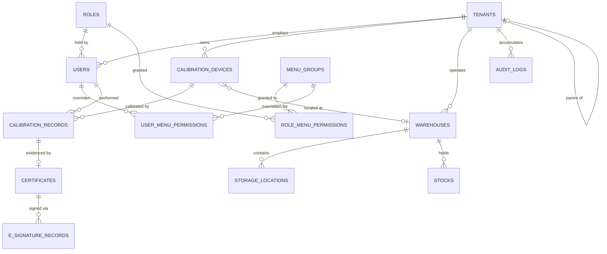

`CALIBRATION_DEVICES }o--o| WAREHOUSES` is optional on purpose, with `ON DELETE SET NULL`: deleting a warehouse nulls the device location and never destroys the device.

## Tenancy

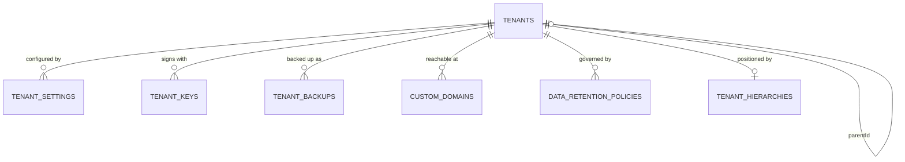

Two extension mechanisms coexist: `tenants.settings` (JSONB, read as a unit) and `tenant_settings` (one row per key, written and read independently — including granular `lifecycle_status`).

## Identity and Authorization

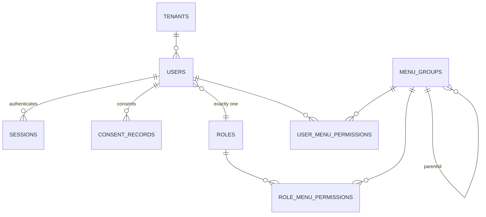

`ROLES` and `MENU_GROUPS` are **global**. A user has exactly one tenant and exactly one role (BR-2); permission breadth comes from menu grants and per-user overrides, never from stacking roles.

## Device and Calibration

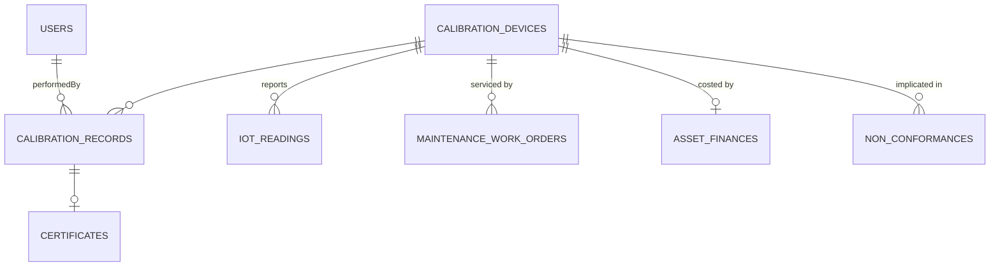

`iot_readings` is the only high-volume child and the only one purged by retention rather than soft-deleted. Telemetry is operational data; calibration history is evidence.

## Certificates and Signatures

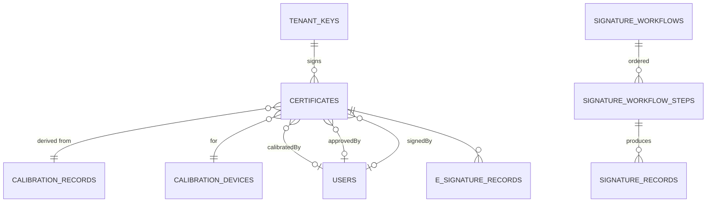

**Three separate actor FKs on `CERTIFICATES`, all nullable.** That nullability is what made the certificate list return zero rows until the four includes were given `required: false` — every draft has null `approvedBy` and `signedBy`.

Keeping them separate rather than collapsing to one "who touched this" column is what preserves separation-of-duties evidence.

## Warehouse

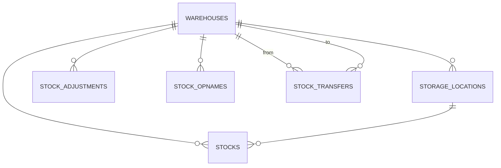

`STOCK_TRANSFERS` references two warehouses. Movement is three tables rather than one generic ledger because adjustment, transfer and opname have genuinely different lifecycles.

## Quality

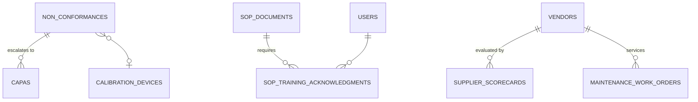

## Workflow

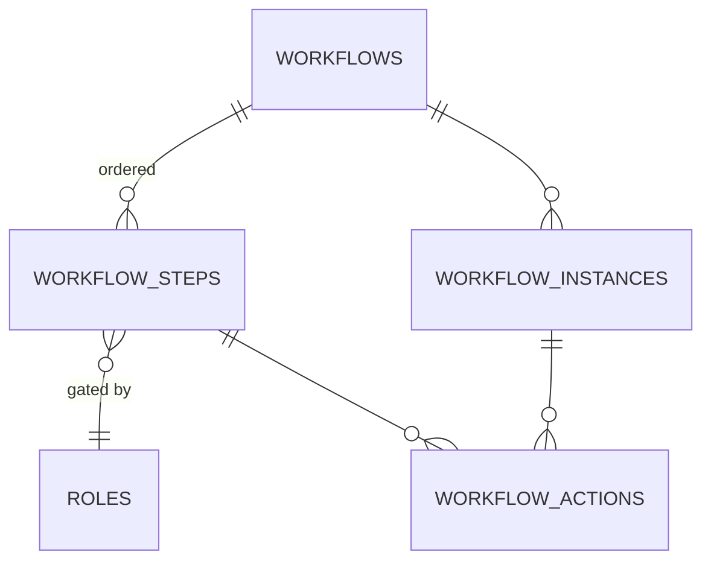

`workflows.resourceType` is a closed ENUM of three: `Certificate`, `StockTransfer`, `MaintenanceWorkOrder`. `workflow_instances.resourceId` is therefore a **polymorphic reference with no foreign key** — the type discriminator lives on the parent workflow, not on the instance.

## Commercial

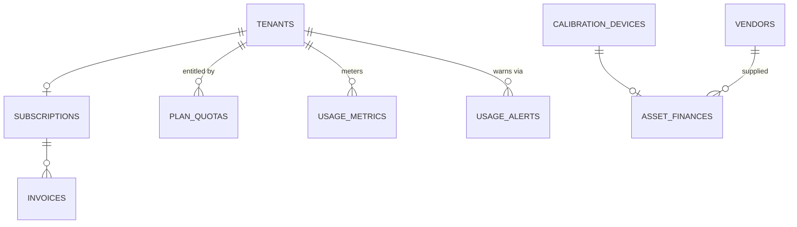

`ASSET_FINANCES` belongs to the customer device estate, not to platform billing. Two different meanings of "finance" in one schema.

## Platform

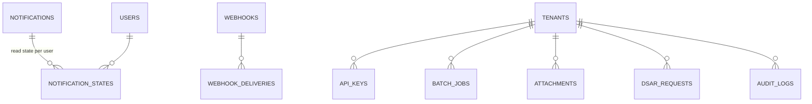

`ATTACHMENTS` is **polymorphic** by `(resourceType, resourceId)`, indexed as a pair. No foreign key, by necessity — it attaches to anything.

The `NOTIFICATIONS` / `NOTIFICATION_STATES` split is what lets one event fan out to many users without duplicating its body, and lets one user dismiss it without affecting anyone else.

## Kanban

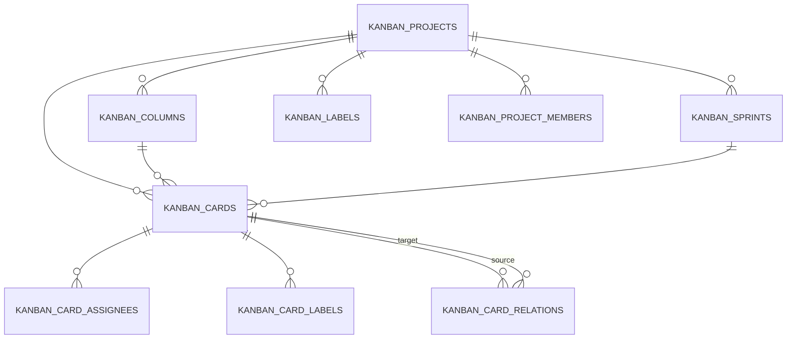

## Support

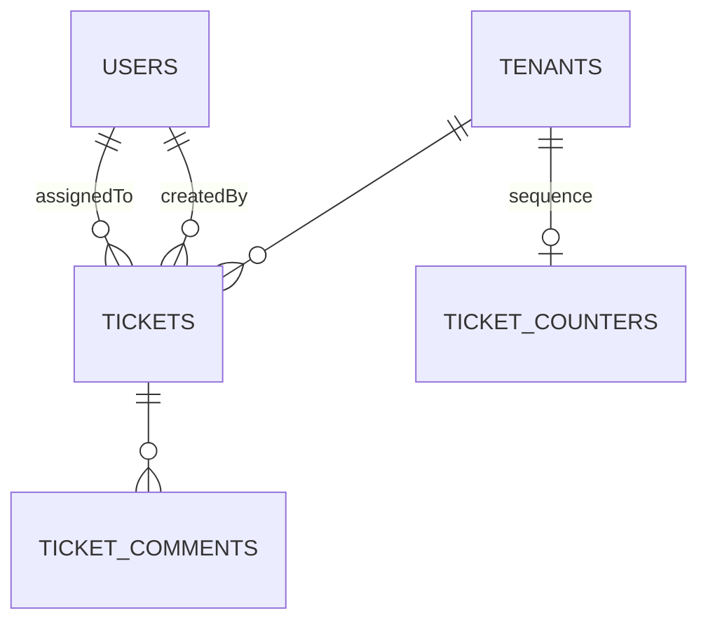

`ticket_counters` gives each tenant its own sequence, so ticket keys are per-tenant and predictable.

## Polymorphic References — the ones without foreign keys

| Table | Discriminator | Note |
|---|---|---|
| `attachments` | `(resourceType, resourceId)` | attaches to anything |
| `e_signature_records` | `(entityType, entityId)` | signs anything |
| `document_chunks` | `(sourceType, sourceId)` | embeds anything |
| `audit_logs` | `(resourceType, resourceId)` | `resourceId` is `STRING`, not `UUID` |
| `workflow_instances` | `resourceId` | type lives on the parent workflow |

None of these can carry a foreign key, so none of them gets referential integrity from the database. A dangling reference here is possible and will not error — it will simply return nothing, which is why the cleanup paths for these tables matter more than usual.
