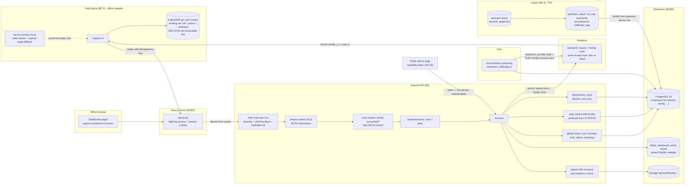

# 15 — Threat Model: the Facility (Faskes) Scope and the Offline Field PWA

> **TARGET — nothing in this document is built.** It threat-models the decided design of
> **ADR-124** (the tenant is the calibration company; a health facility, *faskes*, is a
> `client_facilities` row inside it; facility-bound users are confined by a second,
> deny-by-default scope applied by the same hooks) and **ADR-127** (field capture is a PWA with an
> encrypted offline queue replaying the normal API idempotently), with the parts of ADR-125
> (global catalogue) and ADR-126 (IPM sessions, frontend-rendered exports) they touch. Every
> statement about *today's* code names its file and was read on 2026-10-07; every control is the
> **specified** control, not a built one; every test or guard named below either **exists** (its
> path is given) or is **proposed** (marked *proposed*) and must be built by the card named.
>
> **Card:** P17-06 (DONE 2026-10-07). **Feeds:** P17-07 (the penetration test, § 12), P18-03 / P18-04
> (the facility-accessible route list, `FACILITY_READABLE`, the two-facility test plan), P19-04 (the
> client-facility spec), P19-08 (the offline capture spec), P20-07, P21-03, P21-09, P22-09, P22-10,
> P24-01/02, P25. **Gate it defines:** § 11 — the list that must be green **before any
> facility-bound user is invited** (DPIA R-04 (5), [`../UPSTREAM/06-DPIA.md`](../UPSTREAM/06-DPIA.md) § 5).
> **Record:** [`../../MEMORY/records/2026-10-07-faskes-scope-threat-model.md`](../../MEMORY/records/2026-10-07-faskes-scope-threat-model.md).

**Method.** STRIDE per **enforcement point** (§ 6) rather than per component, because the failure
this design must not repeat is "one place forgot the facility" — upstream's S-05/S-11
([`../UPSTREAM/00-OVERVIEW.md`](../UPSTREAM/00-OVERVIEW.md) § 9) and our own A-87 (includes were not
scoped, ADR-048) and W-34 (statics no hook reached, ADR-073). LINDDUN for privacy (§ 8). Ratings use
the DPIA's scale so the two documents compose: **likelihood L** and **impact I** on 1–5, score
L × I; **≥ 15 blocks** the step it gates. Impact is impact on the facility (the controller of its
records) and on the people named in them.

**Out of scope here** (unchanged and modelled elsewhere): cross-**tenant** isolation (DPIA R-04b;
[`05-MULTI-TENANCY-SECURITY.md`](./05-MULTI-TENANCY-SECURITY.md), [`01-THREAT-MODEL.md`](./01-THREAT-MODEL.md));
the upstream's live holes (R-01/R-03, owner actions OA-1 … OA-3); file content safety (P17-05,
[`../UPSTREAM/08-FILE-POLICY.md`](../UPSTREAM/08-FILE-POLICY.md)). The public capability page is
modelled only at its facility edge (§ 6, EP-23): its design waits on UD-15 / P12-06.

---

## Contents

1. [What Exists Today, and What This Model Assumes](#1-what-exists-today-and-what-this-model-assumes)
2. [Assets](#2-assets)
3. [Principals](#3-principals)
4. [Trust Boundaries and Data Flow](#4-trust-boundaries-and-data-flow)
5. [Adversaries and Their Goals](#5-adversaries-and-their-goals)
6. [Enforcement Points: Threats, Controls, Residual Risk, Proof](#6-enforcement-points-threats-controls-residual-risk-proof)
7. [The Named Scenarios](#7-the-named-scenarios)
8. [Privacy (LINDDUN)](#8-privacy-linddun)
9. [Findings in Today's Code That the Target Must Not Inherit](#9-findings-in-todays-code-that-the-target-must-not-inherit)
10. [Additions This Model Requires of ADR-124 / ADR-127 (and ADR-125)](#10-additions-this-model-requires-of-adr-124--adr-127-and-adr-125)
11. [The Test and Guard Matrix — the Pre-Invitation Gate](#11-the-test-and-guard-matrix--the-pre-invitation-gate)
12. [Penetration Test Scope for P17-07](#12-penetration-test-scope-for-p17-07)
13. [Open Questions](#13-open-questions)
14. [Residual Risk Summary](#14-residual-risk-summary)

---

## 1. What Exists Today, and What This Model Assumes

**Today (read 2026-10-07):** a user has one `tenantId`; isolation is the deny-by-default tenant
dimension of `backend/src/utils/tenantScope.util.ts` (`resolveScope`: `skipTenantScope` → no
context → `isSystemTask` → `isSuperAdmin` → `tenantId` filter → **deny** with `NO_TENANT_UUID`),
fed by `backend/src/middlewares/tenantContext.middleware.ts` (`TenantContextStore { tenantId,
isSuperAdmin, isSystemTask, systemReason? }`), registered as eleven global hooks plus
`afterDefine` (root `where`, the include walk of ADR-048, the hookless-statics wrappers of ADR-073,
create/update stamping, `bulkCreate`/`upsert`/`destroy`/`restore` refusal, scoped `TRUNCATE`
refusal). There is **no facility dimension anywhere** — no `client_facilities` table, no
`client_facility_id` column, no marker, no service worker, no IndexedDB, no `idempotency_keys`.

**Assumed (ADR-124/127 as written):** the facility dimension is a second branch of the same
resolution (`skipFacilityScope` → no context → system/super admin → unbound → filter
`client_facility_id = $f` → no facility → `NO_FACILITY_UUID` → tenant model not facility-scoped
and not on `FACILITY_READABLE` → `NO_TENANT_UUID`), set by `auth` from the **loaded user row**
only; routes deny bound users unless marked facility-accessible; the PWA stores data only in a
per-user, per-tenant IndexedDB with a non-extractable AES-GCM key, purges the working set after
72 h, and replays the normal API with `Idempotency-Key`.

Where this model finds that the ADR text is not enough on its own, it says so as an **addition**
(§ 10, AM-n) — proposed, to be recorded as an ADR amendment by the card that builds it
(deviation protocol), not taken here.

## 2. Assets

| # | Asset | Why it matters | Owner (controller) |
|---|---|---|---|
| A1 | **A facility's evidence chain** — devices, calibration records, certificates, IPM sessions and results, work orders, non-conformances, IoT readings, and their attachments (device photos) | the maintenance evidence of a hospital; one facility seeing another's is the R-04 event (score 16) | the facility |
| A2 | **Facility identity data** — the `client_facilities` row: name, code, kind, contacts, status; the facility segment of storage keys | which client a provider serves is commercially sensitive; contacts are personal data | the tenant (provider) and the facility |
| A3 | **People in the records** — technician and facility-staff names on sessions, performer snapshots, certificate signatories, audit actors; incidental persons in photos | UU PDP / GDPR personal data; technicians do not expect their names shown to *other* clients, nor provider staff to every facility user beyond what a report prints | each facility (its staff), the tenant (its technicians) |
| A4 | **The binding** — `users.client_facility_id`, the role of a bound user, the facility's `status` | the single value that decides what a bound user sees; changing it is the escalation | the tenant administrator |
| A5 | **Provider-internal data** — vendors, stock, kanban, tickets, billing, settings, SSO, API keys, other users, audit, QMS, other facilities' names | invisible to bound users by the deny branch; a leak exposes the provider's business to its clients | the tenant |
| A6 | **Field data at rest on phones** — IndexedDB working set (≤ 2,000 devices per facility), the outbox (drafts, results, photos), the catalogue copy, the cached capture page | leaves our infrastructure; lost and shared phones | the facility (data), the tenant (device policy) |
| A7 | **Capabilities that outlive the request** — signed download URLs, socket rooms, cache entries, idempotency records, invitation tokens, sessions | each is an authorisation decision taken once and honoured later; a later scope change does not reach it unless designed to | — |
| A8 | **The import's mapping** — `upstream_import.id_map`, `quarantine`, staging; the per-tenant import API key | decides which facility every one of ~330 k imported rows belongs to; a wrong mapping is a silent, permanent cross-facility exposure | the tenant, per facility |
| A9 | **`audit_logs` with `client_facility_id`** | the record of everything, and the basis for per-facility breach notification (UU PDP Art. 46, 3 × 24 h) | the tenant |

## 3. Principals

Every principal's **tenant** dimension is unchanged from today. The facility columns are the target.

| # | Principal | Identified by (today's code) | Tenant scope | Facility scope (target) | Route reach (target) | Notes / specific risk |
|---|---|---|---|---|---|---|
| P1 | **Provider administrator** (`CALIBRATOR ADMIN`, unbound) | JWT + live session; `authService.getAuthUserWithTenant` (`auth.service.ts:1104`) | own tenant | **none** — unbound sees every facility of the tenant | every route its gates allow | binds/unbinds users, creates facilities; the only actor allowed to change A4 |
| P2 | **Provider technician** (`TECHNICIAN`, unbound) | as P1 | own tenant | none | as gated | field capture across all facilities; the main PWA user; shared phones are most likely here |
| P3 | **Facility administrator** (`HEALTHCARE ADMIN`, **bound**) | as P1 | own tenant | **filter** to its facility; deny on provider-internal models | **only routes marked facility-accessible**; 403 elsewhere | `ROLE_LEVELS` 8 = the `TENANT_ADMIN` tier (`constants/roleConstants.ts`), so it passes `rbac([TENANT_ADMIN])` (`rbac.middleware.ts`, `allowHigher`) — **the marker is the only thing between it and tenant administration** (§ 7, S3) |
| P4 | **Facility room user** (`ROOM USER`, bound) | as P1 | own tenant | filter | marked routes | upstream `client` accounts (UD-4 open) |
| P5 | **Facility technician** (`HEALTHCARE TECHNICIAN`, bound) | as P1 | own tenant | filter; **writes** stamped to its facility | marked routes | upstream `teknisi_client`, which **wrote** into other facilities upstream (S-05) |
| P6 | **Facility IPSRS** (`FACILITY MAINTENANCE`, bound) | as P1 | own tenant | filter | marked routes | countersigning (UD-17 open) |
| P7 | **Self-served hospital staff** (any role, **unbound**, tenant with one `is_self` facility) | as P1 | own tenant | none (one facility anyway) | as today | behaviour must not change (ADR-124 § 11) — the regression risk is here |
| P8 | **Super admin** | JWT; `isSuperAdminPrincipal`; `x-tenant-id` / `x-tenant-code` honoured only for it (`auth.middleware.ts:449`) | **skip** | **skip** | everything | unchanged; highest-value credential (01 T36) |
| P9 | **Support impersonation** of any user | access token with `impersonatorId` (`auth.middleware.ts:239`, F-8); session named in `sessions` (migration 0040) | the target user's | **the target user's** (ADR-124 § 9) | the target user's | the operator sees what the bound user sees; audit rows name the impersonator |
| P10 | **API key** (service account) | `Authorization: ApiKey …` → synthetic principal `role: API_KEY`, `tenantId` from the key (`auth.middleware.ts:260`) | key's tenant | **none** — keys are tenant-wide (ADR-124 § 9) | `dynamicAccess` scope path only; refused by `denyApiKey` on key management | a key given to one facility's integration reads **every** facility (§ 7, S2) |
| P11 | **SSO user** (OIDC / SAML) | tenant's IdP; **JIT provisioning creates `ROLE_IDS.USER`, unbound** (`sso.service.ts:294`) | tenant of the IdP config | **unbound by default** — fail-open for a facility employee (§ 9, F-5) | as gated | one IdP per tenant (ADR-124 § 9) |
| P12 | **SCIM-provisioned user** | API key with `scim` scope; any role but SUPERADMIN (`scim.service.ts`, `assertAssignableRole`) | key's tenant | **unbound by default** (F-5) | as gated | — |
| P13 | **Background job** | `runForTenant(tenantId, fn)` / `runAsSystem(reason, fn)` (`utils/jobContext.util.ts`, closed `SYSTEM_TASKS` list) | the job's tenant / skip | **none** (unbound) | — | reminders and notifications about a facility's devices are composed here, unbound, and must pick recipients correctly (EP-15) |
| P14 | **Offline PWA device** (a phone in field mode) | not a principal on its own: the signed-in user's httpOnly cookies through the Next proxy (ADR-059); offline, **nobody** — the app cannot tell who holds the phone (ADR-127 § 9) | the user's, when online | the user's, when online; **whatever is cached**, offline | the capture endpoints, on replay | the cached scope is a snapshot that a binding change, a deactivation or a facility `ended` does not reach until the next online contact (§ 7, S8) |
| P15 | **The ETL** (`backend/src/scripts/upstream-import/`, P24-01) | a script; no request context → the hooks **skip**; the per-tenant import API key for calibration records (P24-04) | the provider tenant (by its own code) | **whatever the ETL writes** — no hook checks it | — | the most privileged writer of facility ids (§ 7, S10) |
| P16 | **Anonymous visitor** of the public device page | capability token (UD-15, open) | the token's tenant | the token's device | one exempted route | not a facility principal; modelled at its edge (EP-23) |

## 4. Trust Boundaries and Data Flow

The boundaries B1 … B9 of [`02-TRUST-BOUNDARIES.md`](./02-TRUST-BOUNDARIES.md) stand. This design adds:

| Id | Boundary | Crossed by | Control |
|---|---|---|---|
| **BF-1** | **Facility boundary inside one tenant** (inside B9) | every read and write of a bound principal; every emit, cache entry, signed URL and notification about facility data | the facility dimension of the hooks, the route marker, the socket facility room, facility-keyed caches, the signed-URL check (EP-02 … EP-17) |
| **BF-2** | **Bound ↔ unbound** (facility staff vs provider staff of the same tenant) | the binding value A4; tenant-administration routes; provider-internal models | binding written only by an unbound tenant admin (EP-10); the route marker guard (EP-09); the deny branch (EP-06) |
| **BF-3** | **Phone ↔ application** (the field device holds tenant data outside our infrastructure) | the working set download; the outbox replay; the cached capture page | per-user IndexedDB, non-extractable key, 72 h purge, purge on revocation, idempotent replay through the normal gates (EP-19, EP-20) |
| **BF-4** | **Then ↔ now** (a decision taken earlier honoured later) | signed URLs, socket rooms, caches, idempotency records, the offline working set, open sessions | each must re-check, expire, or be revoked when the binding changes (§ 7, S8; AM-1) |
| **BF-5** | **Upstream ↔ import ↔ application** | `mst_faskes`, `trx_mapping_user_client`, every row's `id_client` | facility derived from the upstream device row only; composite keys; per-facility reconciliation; `upstream_import` not granted to `callibrator_app` (EP-22) |

## 5. Adversaries and Their Goals

| Adversary | Starting position | Goal against the facility scope |
|---|---|---|
| **Curious or malicious facility user** (P3–P6) | a valid account bound to facility F1 | read F2's devices, photos, reports, staff names; learn which facilities the provider serves; write into F2 (upstream S-05); become a tenant administrator |
| **Departed or moved facility user** | account deactivated, or re-bound from F1 to F2; a phone, a signed URL, an open socket, an idempotency record from before | keep reading F1 |
| **Holder of a lost or shared phone** | an unlocked phone in field mode, or devtools on a shared browser profile | read the cached working set and outbox; capture under someone else's name |
| **Malicious provider insider** (P1/P2) | unbound, legitimately sees all facilities | repudiate work; bind a user to the wrong facility; mis-map the import; nothing in this design limits an unbound provider user — that is the owner's model (ADR-124 alternatives: per-technician assignment rejected for now) |
| **Integration holder** (P10) | an API key | if the provider hands one to a facility's system: every facility |
| **Developer error** (the likeliest "adversary") | a new model, route, include, raw statement, cache key, emitter or job | forgets the facility; the design must make forgetting **fail closed** and a guard must fail the build |
| **ETL error** (P15) | writes with no hook | assigns rows to the wrong facility, or users to no facility |

## 6. Enforcement Points: Threats, Controls, Residual Risk, Proof

Each enforcement point (EP) lists its threats (**FT-n**, STRIDE letter), L × I, the control
**specified** (ADR section) or **added** by this model (AM-n, § 10), the residual risk after the
control, and the test or guard that must prove it. *Existing* tests are named by path under
`backend/src/tests/`; *proposed* names follow the existing conventions (`*.twoFacility.test.ts`
over `fixtures/memoryDb.ts`; `*.live.test.ts` on PostgreSQL 18 as `callibrator_app`; guards under
`tests/guards/`). A memoryDb test **cannot** prove raw SQL (it refuses `sequelize.query` unless the
test answers it — `tests/fixtures/memoryDb.ts` header), composite foreign keys or triggers; those
need the live twin.

### EP-01 — Principal derivation: where `clientFacilityId` comes from

Extends `middlewares/auth.middleware.ts` (`auth`, `optionalAuth`, `tryApiKeyAuth`),
`middlewares/tenantContext.middleware.ts`, `config/socket.ts#authenticateHandshake`,
`utils/jobContext.util.ts`.

| Id | Threat | L×I | Control | Residual | Proof |
|---|---|---|---|---|---|
| FT-01 (S/E) | Facility id taken from a header, body, query, path, cookie or token claim (upstream S-05/S-11 shape) | 4×4=16 | ADR-124 § 5: set by `auth` from the **loaded user row** only; never from a request. **AM-2:** the JWT/socket token never carries the facility; the context builder takes `req.user.clientFacilityId` from the row loaded by `getAuthUserWithTenant` and nothing else | 1×4=4 | *proposed* `facilityContext.auth.test.ts`: `x-facility-id`, `clientFacilityId` in body/query/path, a forged claim — all ignored, context equals the row's; *proposed* `facilityContextSource.guard.test.ts`: the context's `clientFacilityId` is assigned in exactly one place (the `tenantContext` middleware from `req.user`) and in the socket handshake from the loaded user, like `apiKeyAuthorizedWriters.v05.guard` enumerates writers |
| FT-02 (S/E) | `optionalAuth` routes build a context without the facility (a bound user on an `optionalAuth` route treated as unbound) | 3×4=12 | **AM-2:** the facility fields are derived inside `tenantContextMiddleware` from `req.user`, so `auth` and `optionalAuth` share one derivation; a route with `optionalAuth` is not facility-accessible unless marked | 1×4=4 | *proposed* `facilityContext.optionalAuth.test.ts` |
| FT-03 (E) | A bound user with **no resolvable facility** (deleted facility row, NULL after a bad migration) treated as unbound | 2×5=10 | ADR-124 § 5: `facilityBound` without a facility → `NO_FACILITY_UUID` (deny) on facility models and `NO_TENANT_UUID` on the rest; **AM-3:** `facilityBound` is a property of the row (`client_facility_id IS NOT NULL` *or* a pending-binding flag), never inferred from "has a facility id" alone after a join | 1×5=5 | ADR-124 § 10 deny test — *proposed* `tenantScope.facilityDeny.test.ts` (every facility-scoped model zero rows, every provider-internal model zero rows) |
| FT-04 (S) | API key acts unbound across all facilities | 3×3=9 | by design (ADR-124 § 9); management is `auth, denyApiKey, rbac([TENANT_ADMIN])` (`routes/api/apiKeys.route.ts`) and never facility-accessible (EP-09) | 3×3=9 — **accepted**, owner-visible: the key-creation screen must say "this key reads every facility" (OQ-11) | existing `routes/apiKeys.twoTenant.test.js`, `guards/apiKeyAuthorizedWriters.v05.guard.test.ts`; *proposed* `facilityAccessibleRoutes.guard` lists `/api-keys` as refused |
| FT-05 (S/R) | Impersonation of a bound user yields a broader view (operator context leaks in) | 2×3=6 | ADR-124 § 9: impersonation gets the **target's** bound context; `isSuperAdmin` is false for the impersonated principal (the token is the user's) | 1×3=3 | existing `middlewares/auth.impersonator.f8.test.js`; *proposed* `impersonation.twoFacility.test.ts` (impersonating an F1 user: F2 row 404, audit row names the impersonator and carries F1) |
| FT-06 (E) | Super-admin `x-tenant-id` used by a non-super-admin to pick a tenant (today) — and a future `x-facility-id` added "for the operator" | 1×5=5 | today: honoured only for the super admin, ignored otherwise (`auth.middleware.ts:449`, 05 § Super-Admin); **AM-2:** no facility header is added; the operator already skips both dimensions | 1×5=5 | existing `tenantContext.test.js`; *proposed* in `facilityContext.auth.test.ts` |
| FT-07 (E) | A background job runs a bound user's request work unbound (a queued action started by a bound user executes with `runForTenant` only) | 2×4=8 | ADR-124 § 9: any batch job carries the facility into `jobContext`; none planned in this phase (exports are browser-rendered). **AM-4:** `runForTenant` gains an optional facility argument; a job **started by** a bound principal must pass it (lint/guard) | 1×4=4 | existing `utils/jobContext.w12.test.js`; *proposed* `jobContext.facility.test.ts` |

### EP-02 — Root-query hooks (find, count, bulk update, bulk destroy, restore)

Extends `tenantScope.util.ts#applyTenantWhere` and the `beforeFind` / `beforeCount` /
`beforeBulkUpdate` / `beforeBulkDestroy` / `beforeBulkRestore` registrations.

| Id | Threat | L×I | Control | Residual | Proof |
|---|---|---|---|---|---|
| FT-08 (I) | Bound user reads another facility's row by id or in a list | 4×4=16 | ADR-124 § 5/§ 6: predicate forced over any caller value (the tenant spread pattern), 404 identical to missing | 1×4=4 | *proposed* `tenantScope.facility.test.ts` (unit, every branch of the resolution); `fixtures/twoFacilitySuite.ts` (ADR-124 § 10) on every facility-accessible `:id` route; *proposed* `tenantScope.facility.sequelize.test.ts` (twin of existing `utils/tenantScope.sequelize.test.js`) |
| FT-09 (T) | Bulk update / destroy / restore from a bound context reaches another facility's rows | 3×4=12 | ADR-124 § 5: same places as the tenant predicate; the column name, not the attribute, for `destroy`/`restore` (the W-33 lesson, `byField`) | 1×4=4 | *proposed* `tenantScope.facilityBulkDestroy.test.ts` (twin of existing `utils/tenantScope.bulkDestroy.w33.test.js`, an underscored model) |
| FT-10 (T/I) | The predicate is **replaced** instead of AND-ed when a caller passes its own `client_facility_id` (a service filtering "by facility" for provider staff with a value from the query) | 3×4=12 | the forced spread / `Op.and` of `withTenantPredicate` (`tenantScope.util.ts:188`) reused for the facility key: a bound caller asking for F2 gets nothing; for **unbound** callers a facility filter is a convenience (ADR-124 / P22-09 "a filter, not a boundary") | 1×4=4 | in `tenantScope.facility.test.ts`: `where: { clientFacilityId: F2 }` from F1 → zero rows; `[Op.or]` containing the key → still forced |
| FT-11 (I) | `count` + `aggregate` double-scoping or no scoping (`scopedByCount` WeakSet) | 2×3=6 | the facility predicate rides the same `applyTenantWhere` path, so `count` → `aggregate` keeps the single-application guarantee | 1×3=3 | in `tenantScope.facilityHookless.test.ts` (EP-04) |

### EP-03 — Includes (ADR-048 twin) and the A-90 trap

Extends `applyTenantToIncludes` / `scopeIncludes`.

| Id | Threat | L×I | Control | Residual | Proof |
|---|---|---|---|---|---|
| FT-12 (I) | An include of a facility-scoped model joins another facility's row (A-87 again, one dimension down): e.g. a session including its device, a work order including a non-conformance | 4×4=16 | ADR-124 § 5: the facility predicate on every facility-scoped include's ON clause, join type pinned (ADR-048 § 3); `through` models too; `separate` includes scoped as their own root | 1×4=4 | *proposed* `tenantScope.facilityIncludes.test.ts` (twin of existing `utils/tenantScope.includes.a87.test.js`: every association under a bound context, both join types, `through`, `separate`, `{ all: true }`) |
| FT-13 (I) | An include of a **provider-internal** model (vendor, warehouse of the provider, stock, user of the provider) from a facility row leaks provider data to a bound user | 3×3=9 | ADR-124 § 5 deny branch applies **inside includes too** — a provider-internal include gets `NO_TENANT_UUID` in its ON clause for a bound principal (LEFT → NULL; INNER → row drops). **AM-5:** state explicitly that the deny branch is applied per include, not only at the root | 1×3=3 | in `tenantScope.facilityIncludes.test.ts`: device → calibration vendor (provider-internal) is NULL for a bound user |
| FT-14 (D/I) | **A-90 widened:** provider technicians, approvers and signatories are users with `client_facility_id` NULL → invisible to bound users; an INNER include of `User` (explicit, or implicit through `User`'s `defaultScope`, A-75) **drops the facility's own records from its own staff's lists** — silently, an availability failure that looks like "no data" | 4×3=12 | ADR-124 § 10: every include of `User` from a facility-scoped model is `required: false`, and the author is shown from a **snapshot** (`performer_snapshot`, ADR-126 § 1; ADR-107 for certificates). P19-04 sweeps every existing list a bound user can reach (certificates' approver/signer, calibration records' technician, work orders' assignee, attachments' uploader, non-conformances) | 2×3=6 (a missed include in an *existing* service shows as an empty list, caught by the two-facility positive control) | existing `services/includes.a90.test.js`, `models/includeRequired.d12.test.js`, `models/includeDeletedScope.a274.test.ts`; *proposed* `includes.a90.facility.test.ts` (each facility-accessible list as a bound user, provider-authored rows present) and `facilityUserIncludes.guard.test.ts` (every `include` of `Users` reachable from a facility-scoped model declares `required: false`) |
| FT-15 (I) | The **snapshot** itself carries more than the report prints (provider technician's e-mail, phone, internal role) to every facility user | 2×3=6 | ADR-126 § 1: `{ name, role, organisation }` only; organisation = the tenant's name | 1×3=3 | *proposed* `performerSnapshot.p2103.test.ts`: exact key set; no e-mail/phone/id |
| FT-16 (I) | A bound user resolves a provider user through **another path** than an include (e.g. `GET /users/:id` from an id in a snapshot or audit payload) | 2×3=6 | `users` is nullable-facility-scoped (ADR-124 § 3): provider staff rows (NULL) never match a bound predicate → 404; the users route is not facility-accessible except the caller's own profile (FACILITY_READABLE, P18-03) | 1×3=3 | *proposed* `user.twoFacility.test.ts` |

### EP-04 — Hookless statics (ADR-073 twin): `aggregate` (`sum`/`min`/`max`), static `increment`/`decrement`, `TRUNCATE`

Extends `scopeHooklessStatics`, `refuseScopedTruncate`.

| Id | Threat | L×I | Control | Residual | Proof |
|---|---|---|---|---|---|
| FT-17 (I) | `sum`/`max`/`min` over a facility-scoped model from a bound context returns the **tenant's** figure (a dashboard tile, a "last calibration date" across facilities) | 3×3=9 | ADR-124 § 5: "the wrapped hookless statics of ADR-073" gain the facility branch | 1×3=3 | *proposed* `tenantScope.facilityHookless.test.ts` (twin of `utils/tenantScope.hookless.w34.test.js`) and `tenantHookless.facility.live.test.ts` (twin of `services/tenantHookless.w34.live.test.js`, real SQL) |
| FT-18 (T) | `increment` with a `where` reaches another facility's row (a counter on a device) | 2×3=6 | same wrapper; an `increment` without `where` stays refused by Sequelize | 1×3=3 | as FT-17 |
| FT-19 (T) | `destroy({ truncate: true })` from a bound context | 1×5=5 | `refuseScopedTruncate` already refuses inside any non-skip scope; a bound scope is non-skip | 1×5=5 | existing `utils/tenantScope.hookless.w34.test.js`; one bound case added to it |

### EP-05 — Writes: create stamping, update, `bulkCreate`, `upsert`, the facility column itself

Extends `applyTenantAssignment`, `applyTenantAssignmentBulk`, `assertUpsertTenant`,
`assertSameTenant`.

| Id | Threat | L×I | Control | Residual | Proof |
|---|---|---|---|---|---|
| FT-20 (T) | A bound technician creates a session/record/photo **in another facility** (upstream S-05: `teknisi_client` wrote into other facilities) by naming F2's device | 4×4=16 | ADR-124 § 5: on create a bound principal's facility is **stamped and forced**; the device lookup in the service is itself scoped (F2's device → 404); composite FK `(tenant_id, client_facility_id, device_id)` → device (ADR-124 § 3) refuses a child whose facility differs from its device's | 1×4=4 | `twoFacilitySuite` write cases (404, nothing written); *proposed* `facilityCompositeFk.live.test.ts` (as `callibrator_app`: a session row with F1 and F2's device is refused by the database) |
| FT-21 (T) | A **bound** principal changes the facility of an existing row (`PATCH` with `clientFacilityId`, or `Model.update({ clientFacilityId: F2 }, { where })` — the predicate keeps the row set in F1 but the **values** move it to F2): data injection into another facility | 3×4=12 | **AM-6:** `beforeUpdate` and `beforeBulkUpdate` **refuse** a change of `client_facility_id` from any non-skip context unless the operation is the audited "move device" service (P19-03) running unbound with `skipFacilityScope` on that one statement; Zod contracts never accept the field from a bound actor. Today `beforeBulkUpdate` only adds the `where` and does not inspect the values for the tenant column either (§ 9, F-4) | 1×4=4 | *proposed* `tenantScope.facilityImmutable.test.ts`; *proposed* `userBinding.massAssignment.test.ts` |
| FT-22 (T) | Unbound provider staff creating a facility row "supply" a facility id from another tenant | 1×5=5 | composite FK `(tenant_id, client_facility_id)` → `client_facilities (tenant_id, id)` (ADR-124 § 3) | 1×5=5 | in `facilityCompositeFk.live.test.ts` |
| FT-23 (T) | `bulkCreate` / `upsert` with a mismatched facility re-owned silently | 2×4=8 | ADR-124 § 5: refusal of a mismatched row, as `applyTenantAssignmentBulk` / `assertUpsertTenant` refuse a mismatched tenant (they cannot stamp an upsert, `tenantScope.util.ts:382`) | 1×4=4 | in `tenantScope.facility.test.ts` |
| FT-24 (T) | A row that must carry a facility is written with NULL (provider-internal by accident), so its facility's users never see their own record — or the reverse: a facility row stored NULL looks provider-internal and is hidden from the facility but **visible to all provider staff** (benign) | 3×2=6 | ADR-124 § 3: NOT NULL on the evidence chain; on nullable tables a CHECK ties it to the row's kind (an attachment of a facility-scoped resource, a room) | 1×2=2 | *proposed* `facilityNotNull.p2007.live.test.ts` (each CHECK, as `callibrator_app`) |
| FT-25 (T/I) | **Polymorphic attachments**: `attachments.resource_type/resource_id` cannot carry a composite FK; an attachment stamped F1 hangs off an F2 device (written by an unbound provider user or the ETL) → F1 users see F2's photo | 2×4=8 | **AM-7:** a trigger (or a deferred constraint function) checks that an attachment's `client_facility_id` equals its resource's, for every facility-scoped `resource_type`; the service stamps from the resource, never from the request | 1×4=4 | *proposed* `attachmentFacilityTrigger.live.test.ts` |

### EP-06 — The deny branch for tenant models that are not facility-scoped, and `FACILITY_READABLE`

| Id | Threat | L×I | Control | Residual | Proof |
|---|---|---|---|---|---|
| FT-26 (I) | Bound user reads provider-internal tables (vendors, stock, kanban, tickets, billing, settings, SSO config, API keys, other users, audit, QMS, webhooks, document chunks, other facilities' rows in `client_facilities`) | 4×4=16 | ADR-124 § 5 last line: `NO_TENANT_UUID` for every tenant model neither facility-scoped nor on `FACILITY_READABLE` | 1×4=4 | *proposed* `tenantScope.facilityDeny.test.ts` iterating the **real** model registry (`models/index.ts`) — not a list maintained beside it (11 § 2: a test generated from the code it tests verifies consistency only; the iteration is over models, the expectation is fixed: zero rows) |
| FT-27 (I) | `client_facilities` itself: a bound user lists the tenant's other clients (the provider's customer list) | 3×3=9 | **AM-8:** `client_facilities` is neither facility-scoped by column (it *is* the facility) nor readable wholesale: on `FACILITY_READABLE` with the rule `id = context.clientFacilityId` (a bound user reads its own facility row only) | 1×3=3 | *proposed* `clientFacility.twoFacility.test.ts` (list = exactly one row; F2's id → 404) |
| FT-28 (E/I) | `FACILITY_READABLE` grows by convenience ("the facility admin needs tickets") without a rule, re-opening provider data | 3×3=9 | ADR-124 § 5: a reviewed list with a reason and a rule per entry; **AM-8:** every entry's rule is a context-derived predicate (own user id, own facility id), never "readable" without one | 2×3=6 | *proposed* `facilityReadable.guard.test.ts`: each entry has a reason, a rule kind, and a test file that exercises it |
| FT-29 (D) | Fail-closed surprises: a bound user's own notifications, sessions, MFA, profile, password change, preferences fail because their tables are tenant models | 4×1=4 | accepted price (ADR-124 implications); P18-03 puts the per-user tables on `FACILITY_READABLE` keyed by user id | 2×1=2 | `twoFacilitySuite` positive controls + live E2E of the bound user's own pages (P21-10) |

### EP-07 — Opt-outs and context-free paths

| Id | Threat | L×I | Control | Residual | Proof |
|---|---|---|---|---|---|
| FT-30 (E) | **`skipTenantScope` implies "skip facility too"** in the implementation → each of today's **29** `skipTenantScope: true` opt-outs in `services`/`controllers`/`middlewares`/`utils` (46 lines name the option; grep, 2026-10-07) becomes a facility leak for bound callers | 3×4=12 | ADR-124 § 5: `skipFacilityScope` is a **separate** opt-out; `skipTenantScope` does **not** skip the facility branch | 1×4=4 | *proposed* `tenantScope.facility.test.ts` case "`skipTenantScope: true` under a bound context still filters the facility"; *proposed* `skipFacilityScope.guard.test.ts`: every use has a comment reason and is on a reviewed list (like `routeGateExemptions`) |
| FT-31 (I) | No-context paths (pre-auth, public routes, schedulers, migrations) skip both dimensions: a **public** route that loads facility data (the signed download, the public device page) reads across facilities by design | 2×4=8 | each such route holds its own capability check (signed token, public token) and is on `routeGateExemptions` with a reason (P6-04) | 2×4=8 → EP-17, EP-23 | existing `routes/routePermissionGuard.p604.test.js` |
| FT-32 (E) | `runAsSystem` grows a reason that is used inside a bound request | 1×4=4 | closed `SYSTEM_TASKS` list (`jobContext.util.ts`, W-12/ADR-069); `isSystemTask: true` appears nowhere else | 1×4=4 | existing `utils/jobContext.w12.test.js` |

### EP-08 — Raw SQL (`sql()`), and SQL fragments the hooks never see

Extends `utils/sql.util.ts` and `tests/utils/rawSqlTenantPredicate.d05.test.js`.

| Id | Threat | L×I | Control | Residual | Proof |
|---|---|---|---|---|---|
| FT-33 (I) | A raw statement naming a facility-scoped table omits the facility predicate | 3×4=12 | ADR-124 § 8: a helper produces the fragment **from the context** (unbound → none; bound → `client_facility_id = $n`; no facility → `NO_FACILITY_UUID`); `d05` gains the twin rule (statement names a facility-scoped table ⇒ mentions `client_facility_id` or is listed unreachable-by-bound with a reason). Raw statements on facility-scoped tables **today**: `attachment.service.ts` (orphans; `rbac([TENANT_ADMIN])` route), `search.service.ts` (`calibration_devices`, `certificates`), `ai.service.ts` (`document_chunks`), `calibrationDeviceReinstate.service.ts` — none is to be facility-accessible (search and RAG excluded by ADR-124 § 9) | 1×4=4 | existing `utils/rawSqlTenantPredicate.d05.test.js` (+ twin rule); *proposed* `facilityPredicate.util.test.ts`; *proposed* `rawSqlFacility.live.test.ts` per facility-accessible raw statement (memoryDb cannot prove these) |
| FT-34 (E) | The helper is given the facility **as a parameter** by a caller, re-creating "remember the WHERE" (today the tenant value in `sql()` is caller-supplied: `sql(runner, text, [q, tenantId, limit])`) | 3×4=12 | ADR-124 § 8: "from the **context**, never from a parameter"; **AM-9:** the helper takes no facility argument at all (type-level), and `d05`'s twin rule requires the fragment to come from it | 1×4=4 | *proposed* `facilityPredicate.util.test.ts` (the helper's signature has no facility parameter; a bound context with a caller-supplied F2 value is impossible to express) |
| FT-35 (I) | `($n IS NULL OR client_facility_id = $n)` written "for provider staff" — NULL means everything (ADR-029's fail-open) | 2×4=8 | ADR-124 § 8 forbids the form | 1×4=4 | `d05` twin rule rejects `IS NULL OR` against `client_facility_id` |
| FT-36 (I) | `sequelize.literal` / `sequelize.where` subqueries inside a hooked query reach tables the hooks do not rewrite | 2×3=6 | none built: no `literal(` with `SELECT` exists in `services/` today (grep, 2026-10-07). **AM-10:** a lint or guard refuses a `literal` containing `SELECT`/`FROM` in `src/`, like the direct-`query` lint | 1×3=3 | *proposed* `literalSubquery.guard.test.ts` |

### EP-09 — The route layer: the facility-accessible marker

| Id | Threat | L×I | Control | Residual | Proof |
|---|---|---|---|---|---|
| FT-37 (E) | **A bound `HEALTHCARE ADMIN` escalates to tenant administration.** Its level is 8, the `TENANT_ADMIN` tier; `rbac([TENANT_ADMIN])` passes it (`rbac.middleware.ts`, `allowHigher` default). Routes reachable this way today include `/api-keys` (mint a tenant-wide key — then every facility through EP-01 FT-04), users and roles, settings, SSO, backups (`abac([tenant:*], { checkTenant: true })`, `tenantBackup.route.ts`), billing, storage, webhooks | 3×5=**15** | ADR-124 § 7: routes deny bound users unless **marked**; the marker guard refuses the marker on `superAdminOnly` and `rbac()` tenant-admin routes. **AM-11:** the refusal criteria must also cover `abac(TENANT_PERMISSIONS.*)` and a **slug deny-list** (refined by ADR-124 Amendment 1 § 4: `denyPlatformAuthoring` is **not** a criterion — it marks who may author a record, not administration, and the bound technician's own IPM capture carries it) for `dynamicAccess` on administrative menus (users, roles, user permissions, menu groups, settings/tenant, SSO/OIDC, SCIM, API keys, webhooks, storage, backups, billing/quota/metered billing, audit, data retention, GDPR administration, feature flags, custom domains, network security, tenant hierarchy/lifecycle) — the ADR's two criteria alone miss abac- and slug-gated admin routes. **AM-12:** the 403 for an unmarked route is decided **before** any parameter is read, so it is id-independent (no oracle) | 1×5=5 | ADR-124 § 10 `facilityAccessibleRoutes.guard` (*proposed*), with the AM-11 criteria; *proposed* `facilityRouteDefault.test.ts`: as a bound `HEALTHCARE ADMIN`, every mounted route not marked answers 403 — iterating the **mounted route table** the way `routePermissionGuard.p604` and `twoTenantRoutes.guard` do |
| FT-38 (E) | A provider-only route is marked "for convenience"; or a route is marked and its handler calls a provider-internal service whose side effects are not row reads (an export job, a webhook test, a search across models, an e-mail to another facility) | 3×4=12 | ADR-124 § 7: marked routes are **reviewed** like `routeGateExemptions`; the hooks still deny the provider-internal reads | 2×4=8 | `facilityAccessibleRoutes.guard`: the marked list is a constant with a reason per entry; diff reviewed |
| FT-39 (E) | A **facility-only** route (if any are created, e.g. "my facility" views) reached by provider staff, receiving a context that assumes a facility (`clientFacilityId` null → handler uses `null` as "all") | 2×3=6 | **AM-13:** a handler never branches on "bound or not" to widen; a route that needs a facility for unbound callers takes it as an explicit, validated parameter and the hooks still apply the tenant | 1×3=3 | *proposed* in `facilityRouteDefault.test.ts`: every marked route also run as unbound P2 |
| FT-40 (E) | A new route forgets the marker → bound users locked out (availability, fail-closed) — the pressure to "just mark it" is the escalation risk of FT-38 | 3×1=3 | accepted (ADR-124 implications) | 3×1=3 | — |
| FT-41 (I) | A marked `:id` route has no two-facility test | 3×4=12 | ADR-124 § 10 `twoFacilityRoutes.guard` (twin of existing `guards/twoTenantRoutes.guard.test.ts`) | 1×4=4 | `twoFacilityRoutes.guard` (*proposed*) |

### EP-10 — Binding lifecycle: bind, unbind, move, invite, JIT, SCIM, self-profile

| Id | Threat | L×I | Control | Residual | Proof |
|---|---|---|---|---|---|
| FT-42 (E) | A bound user changes its own binding or role through `PATCH /users/me` (mass assignment), or a bound `HEALTHCARE ADMIN` changes a colleague's | 3×5=**15** | ADR-124 § 4: binding set by the tenant's administrator; **AM-14:** only an **unbound** tenant administrator may write `client_facility_id` or a bound user's role; the self-profile contract is a strict Zod object without `clientFacilityId`, `roleId`, `tenantId`, `status`; the hooks refuse the column change (FT-21) | 1×5=5 | *proposed* `userBinding.massAssignment.test.ts`; *proposed* `userBinding.twoFacility.test.ts` |
| FT-43 (E) | Bound users given a provider role (`CALIBRATOR ADMIN`, `TECHNICIAN`) | 2×4=8 | ADR-124 § 4: bound users hold only `HEALTHCARE ADMIN`, `HEALTHCARE TECHNICIAN`, `FACILITY MAINTENANCE`, `ROOM USER` (400 otherwise, service and contract) | 1×4=4 | *proposed* `userBinding.roles.test.ts` |
| FT-44 (E/I) | **SSO JIT** creates a facility employee as an **unbound `USER`** (`sso.service.ts:294`, `roleId: ROLE_IDS.USER`) → it sees every facility; **SCIM** likewise creates unbound users with any role but SUPERADMIN (`scim.service.ts#assertAssignableRole`) | 3×5=**15** | not covered by ADR-124 (§ 9 says only "bound users authenticate through the tenant's configuration"). **AM-15:** in a tenant with more than one facility, JIT- and SCIM-created users are created **`INACTIVE`** (refused at `auth`, `auth.middleware.ts:374`) until an unbound tenant administrator binds or confirms them unbound; the activation is audited | 1×5=5 | *proposed* `ssoJit.facility.test.ts`, `scim.facility.test.ts` |
| FT-45 (E) | An **invitation** token carries or accepts a facility from the client at acceptance | 2×4=8 | **AM-14:** the facility is a column of the invitation row written by the inviting unbound admin; `acceptInvitation` copies it; the token is an opaque reference | 1×4=4 | *proposed* `invitation.facility.test.ts` |
| FT-46 (E/I) | **Stale grant after a move or deactivation**: the HTTP path re-reads the row per request (so it is immediate), but open sockets, the PWA working set, idempotency records, signed URLs and cached dashboards keep the old scope (BF-4) | 4×4=16 | ADR-124 § 9 (socket re-check re-reads the facility), ADR-127 § 9 (purge on 401). **AM-1:** **changing a user's binding (bind, unbind, move) or ending its facility revokes all of the user's sessions** in the same transaction as the change (like a password change); the socket re-check disconnects when `(tenantId, clientFacilityId, facility status, role)` differs from the handshake snapshot; the PWA purges on 401 **and** on the 403 account/facility refusals (§ 7, S8) | 1×4=4 | *proposed* `facilityBinding.revokesSessions.test.ts`, `socket.facilityRecheck.test.ts`, frontend *proposed* `fieldStore.purge.test.ts` |
| FT-47 (R) | Binding changes are not attributable | 2×3=6 | group DoD: binding or unbinding writes its audit row inside the transaction (Phase 12 § 2) | 1×3=3 | existing `guards/auditInTransaction.p611.test.js` pattern; *proposed* `facilityBinding.audit.test.ts` |
| FT-48 (E) | A person who works for two facilities gets a "switch facility" | 2×4=8 | ADR-124 § 10 / DPIA R-04 (6): never; two accounts, or provider staff | 1×4=4 | *proposed* `facilityAccessibleRoutes.guard` asserts no route writes the context's facility |

### EP-11 — Uniqueness, 409s and other existence oracles

| Id | Threat | L×I | Control | Residual | Proof |
|---|---|---|---|---|---|
| FT-49 (I) | **Serial number 409** reveals that another facility holds a serial | 3×2=6 | **decided** (UD-9): `UNIQUE (tenant_id, client_facility_id, serial_number)` — a bound user's 409 can only name its own facility's rows | 1×2=2 | *proposed* `serialUnique.twoFacility.test.ts` + live index check in P20-02 |
| FT-50 (I) | **QR code 409** (unique per tenant, 04/P19-03): if a bound facility technician may register devices or set a QR, a 409 reveals "this sticker number is used in some other facility" | 2×2=4 | ADR-124 security analysis assumes bound users never write the QR. ~~Open (OQ-2)~~ **Decided 2026-10-08 (ADR-132 § 1, P19-03):** bound technicians create devices but the bound contracts carry **no QR field** — only provider staff assign stickers, so no QR 409 reaches a bound user | 1×2=2 | *proposed* `calibrationDevices.bound.contract.test.ts` (QR refused 400) and `calibrationDevices.qr.p2102.test.ts` (P19-03 spec § 13) |
| FT-51 (I) | **Facility `code`** (unique per tenant) — only provider staff write it | 1×2=2 | ADR-124 § 2 | 1×2=2 | — |
| FT-52 (I) | **`client_ref`** (`UNIQUE (tenant_id, client_ref)`, ADR-126 § 1): a create whose `client_ref` collides with another facility's session answers 409, or — worse — returns the existing row as an idempotent success | 1×4=4 | client refs are random UUID v4 (unguessable). **AM-16:** a duplicate `client_ref` is resolved **in the caller's context**: same user and visible → the idempotent answer; otherwise a 409 that names nothing; or scope the key `(tenant_id, created_by, client_ref)` (OQ-6) | 1×2=2 | *proposed* `clientRef.twoFacility.test.ts` |
| FT-53 (I) | **`Idempotency-Key`** collision across users | 1×3=3 | ADR-127 § 7: keyed `(tenant_id, user_id, key)` | 1×3=3 | *proposed* `idempotencyKeys.p2103.test.ts` |
| FT-54 (I) | **E-mail** is globally unique (ADR-124 § 4): creating a user with an e-mail held by another facility's user tells the (unbound) admin it exists | 2×2=4 | only unbound admins create users; the existing account-existence behaviour (01 T4) applies | 2×2=4 — accepted (pre-existing, tenant admins only) | — |
| FT-55 (I) | **Status-code or timing oracle**: a service loads a row unscoped and then compares its facility (404 vs 403, or a measurable extra query) | 2×3=6 | ADR-124 § 6: 404 identical to missing; **AM-17:** never "load then compare" — rows are loaded in the caller's context; the only post-load comparison allowed is the signed-URL key check (EP-17), which runs *after* the in-context load | 1×3=3 | `twoFacilitySuite` (equal bodies, ids masked, as `probeCrossTenant` does); *proposed* `probeCrossFacility` in `fixtures/routeClient` |

### EP-12 — Counts, aggregates, dashboards, reports, search, RAG

| Id | Threat | L×I | Control | Residual | Proof |
|---|---|---|---|---|---|
| FT-56 (I) | `meta.total`, dashboard tiles, "due" counts (ADR-126 § 6) computed over the tenant reveal how many devices other facilities hold, how many are broken | 3×3=9 | counts run through hooked `count`/`aggregate` (EP-02/EP-04); dashboard is facility-accessible only after P18-03 reviews each of its statements (`dashboard.service` runs 21 aggregate statements, `dashboardCache.service.ts`) | 1×3=3 | *proposed* `dashboard.twoFacility.test.ts` (F1's figures equal a count of F1's rows only) |
| FT-57 (I) | **Search** across models (`search.service.ts`, raw SQL over `calibration_devices`, `certificates`, `stocks`, …) leaks other facilities' names | 3×4=12 | ADR-124 § 9: search is **not** facility-accessible until its own review | 1×4=4 | `facilityRouteDefault.test.ts` (search → 403 for bound); existing `controllers/search.twoTenants.a56.test.js` is the template for its later twin |
| FT-58 (I) | **RAG** (`ai.service.ts`, `document_chunks`) paraphrases another facility's documents | 2×4=8 | ADR-124 § 9: not facility-accessible; and the DPIA turns AI off for the imported tenant (R-08) | 1×4=4 | as FT-57 |
| FT-59 (I) | **Reports** (`reports.route.ts`: summary, compliance, workload, overdue, inventory) aggregate the tenant | 3×3=9 | not facility-accessible until reviewed; the facility's own reports are ADR-126 § 8 reads (EP-16) | 1×3=3 | `facilityRouteDefault.test.ts` |
| FT-60 (I) | **Technician activity** lists (F-72/F-73, P21-07) show provider staff's work across facilities | 2×3=6 | facility-accessible only in its facility-scoped form (sessions of F1) and with the performer snapshot | 1×3=3 | *proposed* in P21-07's two-facility cases |

### EP-13 — Caches

| Id | Threat | L×I | Control | Residual | Proof |
|---|---|---|---|---|---|
| FT-61 (I) | **Dashboard cache poisoning across facilities.** Today's key is `dashboard:metrics:v1:tenant:<callerTenantId>:<target>` and its comment states "the result does not vary by role inside a tenant" (`services/dashboardCache.service.ts:17`, ADR-120). A provider technician fills the key with the tenant-wide figures; a bound user of the same tenant reads them for 30 s — or a bound user fills it with F1's figures and the provider reads F1's as the tenant's | 4×3=12 | ADR-124 § 9: a key in facility-scoped territory includes the facility for bound principals (`…:<tenant>:f:<facility>`), never shared with the unbound scope. **AM-18:** the key derives from the **context**, not from controller arguments; unbound callers use a distinct `:all` segment so the two spaces cannot coincide | 1×3=3 | existing `services/dashboardCache.u06b.test.ts`; *proposed* `dashboardCache.twoFacility.test.ts`; *proposed* `cacheKeyFacility.guard.test.ts` (every Redis key builder in `services/` that reads tenant data takes the scope object) |
| FT-62 (I) | Permission caches (`permissions:role:<roleId>`, `permissions:user:<userId>`, `services/redis.service.ts:444`) served across the boundary | 1×3=3 | roles are global; bound-ness is not a permission and is not cached in them; the route marker reads the context | 1×3=3 | existing `controllers/search.permissionLoads.u06b.test.ts` pattern |
| FT-63 (E) | The session-liveness cache delays a revocation (AM-1) | 2×3=6 | bounded by `SESSION_LIVENESS_TTL_SECONDS` (`session.service`), as today for any revocation | 2×3=6 — accepted, same window as today | existing `services/session.revokeAll.a161.test.js` |

### EP-14 — Socket.IO rooms and emitters

Extends `config/socket.ts` (rooms `tenant_<id>`, `user_<id>`, `super_admins`, `board_<projectId>`;
60-s `recheckSocket`) and `services/notification.service.ts:116` (emits to `user_<id>`, else
`tenant_<id>`).

| Id | Threat | L×I | Control | Residual | Proof |
|---|---|---|---|---|---|
| FT-64 (I) | A bound socket joins `tenant_<id>` and receives every facility's events — **today every socket joins it unconditionally** (`socket.ts:396`) | 4×4=16 | ADR-124 § 9: a bound socket joins `facility_<tenantId>_<facilityId>` and its user room, **never** `tenant_<id>`; a guard checks it | 1×4=4 | *proposed* `socket.facilityRooms.test.ts`; *proposed* `socketFacilityRooms.guard.test.ts` (no `join(` of a `tenant_` room outside the unbound branch) |
| FT-65 (I) | An emitter of a facility event emits only to `tenant_<id>` (bound users miss it — fail closed) or emits facility data to `tenant_<id>` **as a tenant-wide notification** that a later change lets bound sockets receive | 3×3=9 | ADR-124 § 9: every emitter of a facility-scoped event emits to the tenant room **and** that facility's room; **AM-19:** emitters name the facility from the **row**, never from the actor; tenant-wide notifications (no `userId`) never carry facility data | 1×3=3 | *proposed* `socketEmitters.facility.guard.test.ts` (each `io.to(` in `services/` goes through one helper that takes the row's scope) |
| FT-66 (I) | Socket room join by name from the client (`kanban:join` pattern) for a facility room | 2×4=8 | facility rooms are joined only by the server at connection, from the context; there is no client-driven join event for them; `kanban:join` runs `assertAccess` inside the bound context, where kanban is provider-internal (deny) | 1×4=4 | in `socket.facilityRooms.test.ts`: emitting `facility:join` with F2 does nothing; `kanban:join` as bound → refused |
| FT-67 (E) | **Stale socket context after a move**: `recheckSocket` re-runs `checkPrincipal` (session, user, status, tenant) but does **not** rebuild `socket.tenantContext` or the rooms (`socket.ts:228`); a user moved F1 → F2 keeps F1's room until it disconnects | 3×4=12 | ADR-124 § 9 ("the 60-second re-check also re-reads the user's facility and its status"); **AM-1/AM-20:** the re-check **disconnects** on any difference between the snapshot and the reloaded `(tenantId, clientFacilityId, facility status, role)` — never re-joins in place; plus AM-1's session revocation | 1×4=4 (≤ 60 s + liveness TTL) | *proposed* `socket.facilityRecheck.test.ts` |

### EP-15 — Notifications, reminders, e-mail

| Id | Threat | L×I | Control | Residual | Proof |
|---|---|---|---|---|---|
| FT-68 (I) | A reminder job (`runForTenant`, unbound) selects recipients by role or menu across the tenant and sends F1's overdue-device list to F2's `HEALTHCARE ADMIN` | 3×4=12 | ADR-124 § 9: notifications about a facility's devices go to that facility's bound users holding the menu and to provider staff, never to another facility's users. **AM-21:** recipient selection is one function `recipientsFor(row)` that reads the row's facility; jobs never build a per-tenant recipient list for facility data | 1×4=4 | *proposed* `notificationRecipients.twoFacility.test.ts` |
| FT-69 (I) | E-mail body aggregates several facilities (a daily digest) and is sent to a bound user | 2×4=8 | digests for bound users are built per facility | 1×4=4 | same test |

### EP-16 — Export reads and frontend-rendered reports (ADR-126 § 8)

| Id | Threat | L×I | Control | Residual | Proof |
|---|---|---|---|---|---|
| FT-70 (I) | An export page read returns another facility's rows (the upstream S-04 `inventory_download_admin_xls?id_client=` class) | 4×4=16 | ADR-124 § 9: exports are paginated API reads under the hooks, the marker and the two-facility tests; there is no export file and no export worker | 1×4=4 | ADR-124 § 10 / DPIA R-04 (2): *proposed* `exportReads.twoFacility.test.ts` — every read behind the inventory, recap and IPM-list exports, every page, "an export containing only A" |
| FT-71 (I) | The report's data document (session, version items, device and facility snapshots, performer snapshot) includes provider-internal fields | 2×3=6 | a fixed contract for the document (P19-06); snapshots limited (FT-15) | 1×3=3 | contract test in P19-06 — **specified 2026-10-08:** *proposed* `packages/contracts/test/ipmReport.contract.test.ts` (strict key sets of `IpmReportDocument` and the public `ipmVerification`: no user id, person's e-mail/phone, `tenant_id`, `client_ref`, `legacy_key`, work-order id, void reason) — P19-06 spec § 10.2, ADR-126 Am. 2 |
| FT-72 (I) | Photos embedded in a browser-rendered PDF via permanent URLs | 2×3=6 | photos fetched one by one through signed, expiring URLs (ADR-126 implications; 08 § 8); no permanent URL in an export | 1×3=3 → EP-17 | — |
| FT-73 (D) | A bound user pages through a huge export and starves the provider (≈ 23 k devices) | 2×2=4 | each read capped by the API page size; the user's own facility only | 1×2=2 | — |

### EP-17 — Storage keys and signed URLs

Extends `services/attachment.service.ts#generateSignedUrl` / `#getSignedDownload`,
`routes/api/attachments.route.ts:80` (`GET /:id/signed`, public, token-gated),
`services/storage/keys.ts` (`buildKey`, `assertKeyForTenant`), `services/storage/signing.ts`,
`services/storedFile.service.ts`.

| Id | Threat | L×I | Control | Residual | Proof |
|---|---|---|---|---|---|
| FT-74 (I) | Bound user gets a signed URL for F2's attachment | 3×4=12 | ADR-124 § 9: before any URL is issued the row is loaded **in the caller's context** (F2 → 404), then the key's facility segment is compared with the row's `client_facility_id`; a mismatch is refused and logged | 1×4=4 | *proposed* `attachmentSigned.twoFacility.test.ts`; *proposed* `storageKeyFacility.test.ts` (`buildKey` with the `f/<facility>` segment, UUID-shaped, P8-01 layout) |
| FT-75 (I) | **Signed-URL replay across facilities.** The attachment token is `exp.HMAC(id.exp)` (`attachment.service.ts:970`) — a **bearer** capability bound to neither the principal, the session, the tenant nor the facility; `getSignedDownload` loads the row with no context (`findByPk`, public route). A URL minted by an F1 user is valid for anyone it is forwarded to, and **keeps working after the user is moved or deactivated** | 3×3=9 | ADR-124 § 9 controls issuance only. **AM-22:** (a) cap the TTL (today `expiresInSec` from the request body has **no upper bound**, § 9 F-1) to the default 300 s for facility-scoped resources; (b) bind the token to `(attachment id, tenant id, facility id, exp)` and, at redemption, re-check that the row's facility still equals the bound one (a moved attachment invalidates old URLs); (c) never put a signed URL in a stored, shared or exported artefact | 2×3=6 (a forwarded link works for ≤ 300 s — accepted: the owner of the link chose to share the file) | *proposed* `attachmentSigned.replay.test.ts` (expiry cap; token for F1 row fails after the row's facility changes). **Tenant-level part BUILT 2026-10-07 (A-365, OQ-7):** lifetime an integer in [30 s, `ATTACHMENT_URL_MAX_TTL_SEC`] (default 900 s, hard ceiling 3600 s, default lifetime 300 s), 400 above it; token `<exp>.<tenant>.<issuer>.<hmac>` bound to the attachment, tenant, minting principal and expiry; redemption re-checks row live and in the token's tenant, tenant not suspended/deleted, issuer still active (404 otherwise); `ScopedStorage#signedUrl` clamps the same way (FT-78) — `routes/attachmentSigned.a365.test.ts`. The **facility** binding (AM-22 (b)) remains P21-09's |
| FT-76 (I) | A guessed or enumerated **storage key** reaches another facility's object | 1×4=4 | keys are random UUIDs; the key is never the authorisation (08 § 7); S3 bucket private; local driver serves only through gated routes (`utils/fileResponse.util.ts`) | 1×4=4 | existing `utils/fileResponse.util.test.js`; *proposed* `storageKeyFacility.test.ts` |
| FT-77 (T) | Key facility segment and row facility diverge (ETL bug, a device move) → the integrity check refuses legitimate downloads, or (if the check is skipped) serves the wrong facility | 2×3=6 | ADR-124 § 9: mismatch refused and logged as an integrity error; the reconciliation compares them per facility (P25) | 1×3=3 | *proposed* reconciliation check RC-F3 (§ 11) |
| FT-78 (I) | S3 **presigned** URLs (the s3 driver) carry the same bearer property and their own TTL | 2×3=6 | same AM-22 cap; presign only after the in-context load | 1×3=3 | *proposed* in `attachmentSigned.replay.test.ts` against the s3 driver double |

### EP-18 — Audit, repudiation and breach scoping

| Id | Threat | L×I | Control | Residual | Proof |
|---|---|---|---|---|---|
| FT-79 (R) | An action in a facility is not attributable to a facility (breach scoping per facility impossible) | 2×3=6 | ADR-124 § 9: `audit_logs.client_facility_id` stamped from the **row** (or the context when no row) | 1×3=3 | *proposed* `auditFacilityStamp.test.ts` |
| FT-80 (I) | Breach notified to the wrong facility (telling F2 about F1's records discloses F1) | 2×4=8 | breach scope is computed from `audit_logs.client_facility_id` (DPIA § 8, `12-INCIDENT-RESPONSE.md` UU PDP 3 × 24 h) | 1×4=4 | incident drill in P26/P30 |
| FT-81 (R) | A **move** between facilities is recorded under one facility only, so neither facility's trail shows it completely | 2×2=4 | **OQ-12:** a move writes two audit rows (leaving F1, arriving F2), each stamped with its facility | 1×2=2 | P19-03 |
| FT-82 (I) | Bound users read the audit trail (which names other facilities in `changes`) | 1×4=4 | ADR-124 § 9: the audit route is not facility-accessible | 1×4=4 | `facilityRouteDefault.test.ts` |
| FT-83 (R) | Offline capture on a shared phone attributed to the wrong person | 3×3=9 | ADR-127 § 9: accepted residual — device lock screen, 72 h purge, `captured_offline` in the trail | 3×3=9 — **accepted** by ADR-127 | — |

### EP-19 — The PWA at rest: service worker, IndexedDB, phones

| Id | Threat | L×I | Control | Residual | Proof |
|---|---|---|---|---|---|
| FT-84 (I) | The service worker caches API responses (tenant data in the Cache API, outside the purge rules) | 2×4=8 | ADR-127 § 3: only `/_next/static/*` and the capture page's HTML; no API response in the Cache API | 1×4=4 | *proposed* frontend `serviceWorker.cachePolicy.test.ts` (the worker's fetch handler: `/api/**` never `cache.put`) |
| FT-85 (I) | **Lost or stolen phone**, unlocked or with a weak lock | 3×4=12 | ADR-127 § 4/§ 9: working set ≤ the stated device count, purged 72 h after the last sync; outbox encrypted; administrator revokes sessions → purge on next contact; field guide requires a lock screen (P29-01) | 2×4=8 — **the working set is readable by whoever holds the unlocked phone, up to 72 h** | *proposed* `fieldStore.purge.test.ts` (72 h, logout, revocation); P26-02 field UAT with the network cut |
| FT-86 (I) | **Shared phone / shared browser profile.** The per-user database name is not a boundary between users of one profile: same-origin script — the app itself, or devtools on an unlocked phone — can open user A's database and **use** A's non-extractable key (non-extractable prevents export, not use). If A is provider staff (all facilities) and B is bound to F2, B can read A's working set | 3×4=12 | not covered by ADR-127 beyond the per-user name. **AM-23:** "one field user per browser profile": enabling field mode when another user's field database exists on the profile is refused until that database's outbox is synced and its working set purged (by its own user, or by an explicit administrator wipe); every sign-in of a different user purges all other users' working sets and catalogue copies (outboxes stay encrypted and are not opened) | 2×4=8 (devtools on an unlocked phone within the window) | *proposed* `fieldStore.sharedProfile.test.ts` |
| FT-87 (I) | **Clock rollback** defeats the 72 h purge (the device decides "72 h") | 2×3=6 | **AM-24:** the purge also triggers on the server's time at every online contact (the last-sync server timestamp is stored; any online response older than the window purges), and on monotonic elapsed time where the platform offers it | 2×3=6 — offline-only phones with a rolled-back clock keep the set: accepted | *proposed* in `fieldStore.purge.test.ts` |
| FT-88 (T/I) | XSS in the PWA reads IndexedDB and the key | 1×5=5 | nonce CSP (ADR-071/090) with `worker-src 'self'`, `manifest-src 'self'`; React escaping; no WASM (`'wasm-unsafe-eval'` refused); data rendered client-side from IndexedDB | 1×5=5 | existing `frontend/src/lib/securityHeaders.test.ts` and the browser CSP smoke, updated for the new directives |
| FT-89 (S) | The **cached capture page replays its nonce** while offline | 1×3=3 | ADR-127 § 3: a recorded exception, one document, no user content in the HTML | 1×3=3 — accepted by ADR-127 | — |
| FT-90 (I) | The working set downloaded for a bound user includes devices of other facilities (the download endpoint is a list read) | 3×4=12 | it is an ordinary facility-accessible list read under the hooks | 1×4=4 | `exportReads.twoFacility.test.ts` covers the working-set read |

### EP-20 — The PWA sync: idempotency, replay, attribution, scope change

| Id | Threat | L×I | Control | Residual | Proof |
|---|---|---|---|---|---|
| FT-91 (S/T) | The replay attributes work or facility from the payload (upstream S-11) | 3×4=12 | ADR-127 § 7: tenant and facility from the authenticated user; performer from the session; `client_captured_at` stored as the device's claim only | 1×4=4 | `twoFacilitySuite` replay cases; *proposed* `sync.attribution.p2103.test.ts` |
| FT-92 (I) | **Idempotent replay returns a stored response across a scope change.** ADR-127 § 7: same key and same request hash → the **stored response** is replayed. If the user was moved F1 → F2 (or lost a menu) after the first success, a replay returns F1's session body to a principal now scoped to F2 | 2×3=6 | **AM-25:** the idempotency row stores the scope at the time (`client_facility_id`, role/permission fingerprint); a replay under a different scope is not served from the store (answer 409 "this request was made under a different access; review it") — or the stored response is minimal (ids and status only) and the body is re-read in the current context | 1×3=3 | *proposed* `idempotencyKeys.scopeChange.test.ts` |
| FT-93 (T) | An outbox item captured for F1's device replays after a move to F2 | 2×3=6 | ADR-127 § 8: the normal API answers 404 in the new context; the item stays "needs attention" | 1×3=3 | *proposed* `sync.scopeChange.p2210.test.ts` |
| FT-94 (D) | Outbox floods (many photos, many replays) | 2×2=4 | per-session ordered queue; storage quota estimate refuses new photos; API rate limits | 2×2=4 | — |
| FT-95 (I) | Replay after **deactivation** gets 403 (not 401) and the client keeps the working set | 3×3=9 | **AM-1:** the client purges the working set on 401 **and** on the 403 codes for an inactive/suspended account, a suspended tenant and an inactive/ended facility; the server returns a machine-readable code for each (as `PASSWORD_CHANGE_REQUIRED_CODE` does) | 1×3=3 | *proposed* `fieldStore.purge.test.ts` |
| FT-96 (I) | **The client never learns of a move**: a moved user's online requests succeed (200) in the new scope, so nothing triggers a purge of the F1 working set, which stays readable offline | 3×4=12 | **AM-1** (sessions revoked on a binding change → 401 → purge). Defence in depth: **AM-26:** `/auth/verify` (and the field screens' sync response) returns a scope fingerprint (tenant, facility, role); a change purges the working set | 1×4=4 | *proposed* `fieldStore.scopeChange.test.ts` |

### EP-21 — The migration that introduces the dimension (P20-07)

| Id | Threat | L×I | Control | Residual | Proof |
|---|---|---|---|---|---|
| FT-97 (T/I) | Backfill misses rows or a table (a row left NULL becomes provider-internal; a NOT NULL step then fails — or worse, a blanket `try/catch` records the migration as applied while doing nothing, CLAUDE.md trap) | 2×4=8 | ADR-124 § 11: one transaction per table, then NOT NULL; no blanket catch; `make migrate-verify` reads the columns | 1×4=4 | *proposed* `facilityBackfill.p2007.live.test.ts`; existing `migrations/upgradeBoot.am3.live.test.ts`, `guards/modelIndexColumns.am3.guard.test.ts` (indexes on the new column belong to the migration) |
| FT-98 (I) | A tenant's behaviour changes after the migration (P7 regression: existing users unexpectedly bound, or the self facility not created) | 2×3=6 | every existing user unbound; one `is_self` per tenant (partial unique) | 1×3=3 | *proposed* `selfFacility.p2007.live.test.ts`; the existing two-tenant suites and the live E2E stay green unchanged |

### EP-22 — The import (Phase 24): wrong facility, user mapping, `id_map`

The ETL writes with no request context: **no hook checks anything it writes** (P15).

| Id | Threat | L×I | Control | Residual | Proof |
|---|---|---|---|---|---|
| FT-99 (I) | **A row lands in the wrong facility** (a device attached to the wrong client — DPIA R-13; a session joined to a device by `(qr, date)` key across facilities; an attachment given the uploader's facility) | 3×4=12 | DPIA R-13: `faskes_id` taken from the **upstream device row** (`trx_inventory.id_client` → `client_facilities` via `id_map`), never inferred; children inherit the device's; composite FKs `(tenant_id, client_facility_id, device_id)` refuse a mismatch (FT-20); the attachment trigger (AM-7) | 1×4=4 | *proposed* reconciliation checks RC-F1 … RC-F4 (§ 11) run per facility in P25, plus the live FK/trigger tests |
| FT-100 (E/I) | **User mapping fails open.** `users ← users × auth_groups_users × trx_mapping_user_client` (05 § 3.1): a client account mapped to **two or more** facilities, or to **none**, imported as **unbound** sees all ~118 facilities | 3×5=**15** | DPIA R-04 (6): one facility per bound user. **AM-27:** the transform never produces an unbound user from a `client`/`teknisi_client` account: zero or several mappings → `quarantine` reason `facility_mapping_ambiguous`, resolved by the operator (two accounts, or provider staff) before invitation; every imported facility user is invited bound, with the binding audited | 1×5=5 | *proposed* RC-F5; *proposed* ETL unit test `transformUsers.facility.p2402.test.ts` (synthetic fixtures only) |
| FT-101 (T) | The import API key (P24-04, unbound, tenant-wide) is used outside the import or kept after it | 2×4=8 | revoked after cutover (P24-04); scoped to the import's routes | 1×4=4 | P30 runbook check |
| FT-102 (I) | **`id_map` schema.** `upstream_import.id_map (source_table, legacy_id) PK → target_table, target_id, tenant_id, batch_id, source_row_hash, source_values jsonb, imported_at` (05 § 4) has **no facility column**: reconciliation per facility must re-derive it through the target rows, and a target written with the wrong facility looks "reconciled" from `id_map` alone | 2×3=6 | **AM-28:** `id_map` gains `client_facility_id` (the facility the transform **decided**, from the upstream device row), so RC-F1 compares the decision with what landed; `source_values` stays personal-data-free and is never populated for `users` (05 § 4) | 1×3=3 | RC-F1 |
| FT-103 (I) | `upstream_import` readable by the application | 1×4=4 | not granted to `callibrator_app` (05 § 4, 04 § 10) | 1×4=4 | *proposed* `upstreamImportGrants.p2401.live.test.ts` **as `callibrator_app`** (11 § 1: a grant test as the owner proves nothing) |
| FT-104 (I) | Legacy ids (sequential) exposed to bound users let them correlate with the upstream's guessable URLs | 1×2=2 | `legacy_id` fields are not in facility-accessible contracts; UUIDs generated, never derived from legacy ids (05 § 4) | 1×2=2 | contract review in P21-09 |
| FT-105 (I) | **Doc drift:** 05 § 3.1 step 1 read `tenants ← mst_faskes (+ the provider tenant)` — the superseded facility = tenant model — while ADR-124, 05 § 6.1/§ 10 and P24-02 say `client_facilities ← mst_faskes` | 2×4=8 if built from the stale line | **corrected 2026-10-07** (minimal edit, ADR-124 cited there) | — | — |

### EP-23 — The public device page (edge only; UD-15 / P12-06 open)

| Id | Threat | L×I | Control | Residual | Proof |
|---|---|---|---|---|---|
| FT-106 (I) | The capability page loads with no context (both dimensions skip) and shows another facility's device by a guessed token | 1×3=3 | ≥ 128-bit revocable token, per-tenant setting, rate limit, minimal fields, exemption-list entry (UD-15 recommendation) | 1×3=3 | P21-08 tests |
| FT-107 (I) | The legacy QR resolver for **signed-in** technicians resolves a sequential number across facilities (UD-16) | 2×3=6 | the in-app lookup by QR runs in the caller's context: a bound user's lookup of F2's QR → 404 | 1×3=3 | *proposed* `qrLookup.twoFacility.test.ts` |

### EP-24 — The global catalogue and proposals (ADR-125)

| Id | Threat | L×I | Control | Residual | Proof |
|---|---|---|---|---|---|
| FT-108 (I) | **Identifying text in global content.** A catalogue item label, an item-definition note, a template `change_note` or a device-type name carries a person's name, a facility name, a room or a serial (from a tenant proposal, or from the upstream `mst_*` free text at seeding) and becomes readable by **every tenant and every facility-bound user** — global tables have neither dimension (ADR-125 § 7), and published versions are immutable, so it cannot be edited out, only superseded | 2×3=6 | ADR-125 § 5 and the P19-01 spec ([`../../MEMORY/specs/P19-01-inspection-catalogue.md`](../../MEMORY/specs/P19-01-inspection-catalogue.md), ADR-125 Am. 1): proposals are tenant-scoped and drafts operator-only; **acceptance copies nothing** from `proposed_items` — the operator re-enters each item explicitly, each edit audited (spec § 7.4); item-definition `notes` are **operator-only** (never copied into a version, never returned to tenants); the ETL's catalogue import is reviewed once by the operator before seeding (`../UPSTREAM/07-DATA-MINIMISATION.md`). **AM-29:** an advisory lint on publish (names of the tenant's users and facilities, e-mail/phone/serial patterns in labels and the change note) that warns the operator, and the operator guide's rule "no person, facility, room or serial in catalogue text" | 1×3=3 (labels and change notes stay a human review; a slip is visible platform-wide until the next version supersedes it — the old version stays readable by the sessions pinned to it) | P19-01 spec's live tests (immutability as `callibrator_app`); *proposed* `catalogueText.lint.p2101.test.ts` (AM-29) |
| FT-109 (I) | A catalogue model gains an association to a facility-scoped model and a usage count crosses facilities/tenants | 1×3=3 | ADR-125 § 7: no association from a catalogue model to a tenant model | 1×3=3 | existing `models/unscopedModels.d17.test.js` (+ ADR-125 entries) |

## 7. The Named Scenarios

The scenarios P17-06 was asked to analyse, with the verdict and where the detail is.

| # | Scenario | Verdict | Threats |
|---|---|---|---|
| S1 | **Faskes id taken from anywhere but the user row** | Closed by construction if AM-2 holds: one writer of the context's facility, fed by the row loaded in `auth`; no header, body, query, token claim or socket payload is read. The two residual shapes are a second writer added later (guard) and a service that takes a facility parameter for **unbound** callers and forgets to ignore it for bound ones (the forced predicate makes it harmless) | FT-01, FT-02, FT-10, FT-34, FT-91 |
| S2 | **Provider user reaching a facility-only route, and vice versa** | Bound → unmarked route: 403 before parameters are read (AM-12). Unbound → a marked route: allowed (provider staff see every facility); a route that "needs" a facility takes it as an explicit parameter and never treats `null` as "all" (AM-13). API keys are unbound: a key handed to a facility's system is a full-tenant credential (accepted, warned) | FT-37 … FT-41, FT-04 |
| S3 | **Bound `HEALTHCARE ADMIN` escalating to tenant admin** | The highest-impact path (I = 5): its role level passes every `rbac([TENANT_ADMIN])` gate today. Held by the route marker's default deny plus AM-11's wider refusal criteria (abac and slug-gated admin routes, not only `rbac`/`superAdminOnly`), and by AM-14 (only unbound admins write bindings and roles). Escalation through a minted API key, a backup download, a webhook or an SSO change all sit behind routes the guard must refuse | FT-37, FT-42, FT-43, FT-44 |
| S4 | **Enumeration via 409, counts, aggregates, dashboards, search** | 409: serial unique per facility (decided) closes the realistic oracle; QR per tenant is a 1-bit residual only if bound users may set QRs (OQ-2); `client_ref` collisions resolved in context (AM-16). Counts and aggregates ride hooked paths; dashboards need the facility in the cache key; search, RAG and tenant reports are not facility-accessible | FT-49 … FT-60 |
| S5 | **Cache poisoning across faskes** | Real today in shape: the dashboard key is per tenant and says the figures do not vary inside a tenant. Under ADR-124 that sentence becomes false; the key must carry the facility segment from the context (AM-18), and a guard must cover new cache builders | FT-61, FT-62 |
| S6 | **Socket room join** | Today every socket joins `tenant_<id>`. Target: bound sockets join only their facility and user rooms, server-side; no client-driven facility join exists; the re-check disconnects on a scope change (AM-20) | FT-64 … FT-67 |
| S7 | **Signed-URL replay across faskes** | Issuance is in context (ADR-124). The token was a bearer capability without principal or facility binding and with a caller-chosen, **unbounded** TTL — so a URL survived a move or deactivation. **Since 2026-10-07 (A-365)** the TTL is capped and the token is bound to the tenant and the issuer and re-checked at redemption; AM-22 still adds the facility binding | FT-74 … FT-78 |
| S8 | **Offline loss/theft, shared phones, stale grants after a move or deactivation** | Loss: the 72 h working set is the exposure (accepted). Shared profile: the per-user database is **not** a boundary (AM-23). Stale grants: HTTP is immediate; sockets, PWA data, idempotency records and signed URLs are not — AM-1 (binding change revokes sessions; purge on 401 **and** on the account/facility 403s), AM-25, AM-26 | FT-46, FT-85 … FT-96 |
| S9 | **The A-90 trap with performer snapshots** | Widened by design: provider staff are invisible users to bound principals, so every `User` include on the evidence chain must be `required: false` (and `User` has a `defaultScope`, so an include without `where` is INNER — A-75); authorship is shown from the snapshot, limited to name/role/organisation | FT-14, FT-15, FT-16 |
| S10 | **Migration/ETL writing rows with the wrong faskes** | No hook protects the ETL. The database must: composite FKs from every child to its device's `(tenant, facility, id)`, a trigger for polymorphic attachments (AM-7), NOT NULL + CHECKs; the transform derives the facility only from the upstream device row; users with zero or several facility mappings are quarantined, never imported unbound (AM-27); reconciliation per facility | FT-97 … FT-105 |
| S11 | **The import's `id_map` schema** | Sound on secrecy (not granted to the app, UUIDs not derived, no personal data in `source_values`) but blind to the facility decision: add `client_facility_id` (AM-28) so reconciliation can compare the decision with the result | FT-102, FT-103 |

## 8. Privacy (LINDDUN)

| Category | Threat in this design | Control | Residual |
|---|---|---|---|
| **L**inkability | Performer snapshots and audit rows link a provider technician's activity across all facilities; the technician-activity list (P21-07) assembles it | provider-side only (facility users see only their facility's sessions); purpose: work evidence and payroll-neutral; no cross-tenant link exists | Low — legitimate employer processing (DPIA § 3) |
| **I**dentifiability | Device photos with incidental persons; EXIF GPS/device serials in originals | client re-encode drops EXIF (ADR-127 § 5); server strips and derives (08 § 4); originals only by signed download | Medium (photos of wards) — DPIA R-12 |
| **N**on-repudiation (as a privacy harm) | A technician cannot deny a capture made under their name on a shared phone | the trail records `captured_offline`; lock screen; one user per profile (AM-23) | Medium — FT-83 accepted |
| **D**etectability | 404 vs 403 or a 409 tells a facility user that another client exists or holds a device | 404 everywhere, route 403 id-independent, uniqueness per facility | Low (QR 1-bit, OQ-2) |
| **D**isclosure | The R-04 event: any enforcement point of § 6 failing | the whole of § 6; the gate of § 11 | DPIA R-04 residual 6 once § 11 is green |
| **U**nawareness | Facility staff do not know provider staff (and support impersonation) see their facility's data; technicians do not know their names print on reports the facility keeps | the facility notification text (P17-03, ID) states who sees what; the privacy notice names impersonation | Medium until P17-03 (blocked) |
| **N**on-compliance | Data kept on phones beyond purpose; working sets after a person leaves; retention of `upstream_import` | 72 h purge, purge on revocation (AM-1), `upstream_import` until sign-off + 90 days (DPIA § 6) | Low once AM-1 is built |

## 9. Findings in Today's Code That the Target Must Not Inherit

Read 2026-10-07. None is a cross-tenant defect today; each becomes a cross-facility defect if the
facility dimension is added around it unchanged. They are **findings for the design**, not fixes made
here (no code was changed by P17-06). **Update 2026-10-07 (A-365, [record](../../MEMORY/records/2026-10-07-f1-signed-url-ttl.md)):**
the parts of F-1, F-2 and F-4 that are real for **today's** single-scope tenants are fixed, and F-10
is corrected; the facility parts stay with the cards named.

| # | Where | What | Severity under ADR-124 | Goes to |
|---|---|---|---|---|
| F-1 | `services/attachment.service.ts:962` (`generateSignedUrl`), `routes/api/attachments.route.ts` (`POST /:id/signed-url`, no `validate`) | `expiresInSec` from the request body is accepted with **no upper bound** (`Number(expiresInSec) > 0 ? …`); the token binds only `(attachment id, exp)`. Today: a tenant user can mint a link valid for years to its own tenant's file, which outlives its account. Under ADR-124: survives a move between facilities | Medium (FT-75) | P21-09 (AM-22); **tenant-level part FIXED 2026-10-07 (A-365):** TTL capped, token bound to tenant + issuer, redemption re-checks row, tenant and issuer (EP-17 FT-75) |
| F-2 | `config/socket.ts:228` (`recheckSocket`) | the 60-s re-check refuses on status changes but never rebuilds `socket.tenantContext` or its rooms; a scope change is invisible to an open socket | Medium (FT-67) | P21-09 (AM-20); **today's part FIXED 2026-10-07 (A-365):** the re-check disconnects a socket whose principal's tenant, super-admin status or role changed (`config/socket.ts#scopeDrift`, `config/socket.scopeDrift.a365.test.ts`) — a demoted super admin no longer keeps `super_admins`; AM-20 adds the facility to the comparison |
| F-3 | `services/dashboardCache.service.ts:17`, `:75` | the key is per tenant and documents that the figures "do not vary by role inside a tenant" — true today, false for bound principals | Medium (FT-61) | P21-07/P21-09 (AM-18) |
| F-4 | `utils/tenantScope.util.ts:560` (`beforeBulkUpdate` → `applyTenantWhere` only) | a bulk update's **values** are not inspected: `Model.update({ tenantId: X }, { where })` inside a tenant context re-owns the matched rows (reachable only by a service passing such a field; contracts strip unknown fields). The facility twin must refuse the column (AM-6) | Low today; Medium as the facility twin (FT-21) | P21-09; **tenant case FIXED 2026-10-07 (A-365):** `beforeBulkUpdate` refuses a tenant-column value other than the context's tenant (`tenantScope.util.ts#refuseBulkTenantReassign`, `utils/tenantScope.bulkUpdateValues.a365.test.ts`); AM-6 is its facility twin |
| F-5 | `services/sso.service.ts:294`, `services/scim.service.ts` | JIT creates an **unbound** `USER`; SCIM creates unbound users with any non-SUPERADMIN role — a facility employee provisioned this way sees every facility | High (FT-44) | P21-09 (AM-15) |
| F-6 | `config/socket.ts:396`, `services/notification.service.ts:116` | every socket joins `tenant_<id>`; tenant-wide notifications are emitted there | High once bound users exist (FT-64) | P21-09 |
| F-7 | `middlewares/rbac.middleware.ts` (`allowHigher`), `constants/roleConstants.ts` (`HEALTHCARE ADMIN` = 8 = `TENANT_ADMIN`) | a bound facility admin passes every tenant-admin `rbac` gate; ADR-124 § 7's guard names `rbac`/`superAdminOnly` only, while `tenantBackup.route.ts` uses `abac(..., { checkTenant: true })` and many admin routes are `dynamicAccess`-slug gated | Critical if the marker is ever mis-applied (FT-37) | P18-03 / P21-09 (AM-11) |
| F-8 | `utils/sql.util.ts` | the tenant bind value is supplied by each caller; the facility helper must not copy that shape | Medium (FT-34) | P21-09 (AM-9) |
| F-9 | `tests/fixtures/memoryDb.ts` | memoryDb refuses raw SQL and has no FKs or triggers: `twoFacilitySuite` over it cannot prove EP-08, EP-05's composite keys or AM-7 | Test-design (gate § 11 needs live twins) | P21-09 / P20-07 |
| F-10 | `docs/UPSTREAM/05-DATA-MIGRATION.md` § 3.1 step 1 | stale `tenants ← mst_faskes` (FT-105) | Medium if built from | **CORRECTED 2026-10-07** to `client_facilities ← mst_faskes` (ADR-124; A-365 record) |

## 10. Additions This Model Requires of ADR-124 / ADR-127 (and ADR-125)

Proposed, **not decided here**. Each is to be written as an amendment to its ADR (deviation
protocol) by the card named, or answered under § 13. They tighten the specified design; none
changes the owner's decisions.

| # | Addition | Why (threats) | Card |
|---|---|---|---|
| AM-1 | **A binding change (bind, unbind, move) or a facility leaving `active` revokes all of the user's sessions**, in the same transaction; the PWA purges its working set on 401 **and** on the account/tenant/facility 403 codes | stale grants: FT-46, FT-95, FT-96 | P19-04, P19-08 — client part **adopted by ADR-127 Am. 1 § 4 (2026-10-08):** the PWA purges on a **failed refresh** and on `data.code` ∈ `SCOPE_LOSS_CODES` (never on a raw 401/403 — a wrong signing password is a 401); the server attaches the codes (P21-03 tenant/account, P21-09 facility) |
| AM-2 | The context's facility has **one writer** (`tenantContextMiddleware` from `req.user`, and the socket handshake from the loaded user); no token claim carries it | FT-01, FT-02, FT-06 | P21-09 |
| AM-3 | `facilityBound` is a row property (bound, or pending), not inferred after a join | FT-03 | P19-04 |
| AM-4 | `runForTenant` takes the facility for jobs started by bound principals | FT-07 | P21-09 |
| AM-5 | The deny branch applies **per include**, not only at the root | FT-13 | P21-09 |
| AM-6 | Hooks refuse a change of `client_facility_id` on update / bulk update from any non-skip context, except the audited move service | FT-21 | P21-09, P19-03 |
| AM-7 | A trigger ties `attachments.client_facility_id` to its resource's facility | FT-25, FT-99 | P20-07 |
| AM-8 | `client_facilities` on `FACILITY_READABLE` with the rule `id = own facility`; every `FACILITY_READABLE` entry has a context-derived rule | FT-27, FT-28 | P18-03 — **answered by ADR-124 Amendment 1 § 5** (2026-10-07) |
| AM-9 | The raw-SQL facility helper has **no facility parameter** | FT-34 | P21-09 |
| AM-10 | Lint/guard refusing `literal` subqueries | FT-36 | P21-09 |
| AM-11 | The marker guard refuses `abac(TENANT_PERMISSIONS.*)` and a deny-list of administrative `dynamicAccess` slugs, not only `rbac` tenant-admin and `superAdminOnly`. **Refined by ADR-124 Amendment 1 § 4 (2026-10-07):** `denyPlatformAuthoring` is **not** a refusal criterion (it marks who may author a record, not administration; the bound technician's own IPM capture carries it); the certificate-action and ceiling rules of Am. 1 § 4 cover the laboratory-issuance routes it aimed at | FT-37 | P18-03 — **answered by ADR-124 Am. 1 § 4** |
| AM-12 | The unmarked-route 403 is decided before any parameter is read | FT-37, FT-55 | P21-09 |
| AM-13 | No handler widens on `clientFacilityId == null` | FT-39 | P21-09 |
| AM-14 | Only **unbound** tenant admins write bindings and bound users' roles; self-profile and invitation contracts never accept the facility | FT-42, FT-45 | P18-03, P21-09 |
| AM-15 | JIT/SCIM users in a multi-facility tenant are created `INACTIVE` pending an administrator's binding decision — **as specified:** a `users.facility_binding_pending` flag, not `INACTIVE` (ADR-124 Am. 2 § 6) | FT-44 | P21-09 — **working decision 2026-10-08** (OQ-3, § 13.1); no longer awaiting the owner |
| AM-16 | `client_ref` duplicates resolved in the caller's context (or the key scoped per user) | FT-52 | P19-02, P19-08 — **adopted by ADR-126 Am. 1 § 1 (2026-10-08):** `UNIQUE (tenant_id, created_by, client_ref)`, resolved in context |
| AM-17 | No "load unscoped, then compare" in services | FT-55 | P21-09 |
| AM-18 | Cache keys from the context, with distinct bound (`f:<id>`) and unbound (`all`) segments | FT-61 | P21-07, P21-09 |
| AM-19 | Emitters name the facility from the row; tenant-wide notifications carry no facility data | FT-65 | P21-09 |
| AM-20 | Socket re-check disconnects on any scope difference | FT-67 | P21-09 |
| AM-21 | One recipient function per row's facility for notifications and digests | FT-68, FT-69 | P21-09 |
| AM-22 | Signed URLs: TTL capped (300 s for facility resources), token bound to tenant + facility, re-checked at redemption, never stored in artefacts | FT-75, FT-78 | P21-09 — the cap, the tenant + issuer binding and the redemption re-check **built for all tenants 2026-10-07 (A-365)**; the facility binding remains |
| AM-23 | One field user per browser profile; a different user's sign-in purges others' working sets | FT-86 | P19-08, P22-10 — **adopted by ADR-127 Am. 1 § 7 (2026-10-08):** enabling refused while another user's data remains; another user's sign-in purges others' working sets without opening their outboxes; an audited administrator wipe (`POST /field/wipes`) |
| AM-24 | Purge also on server time at every online contact | FT-87 | P19-08 — **adopted by ADR-127 Am. 1 § 4 (2026-10-08):** every online response's `Date` compared with the last sync's server time |
| AM-25 | Idempotency records store the scope; no stored-response replay across a scope change | FT-92 | P19-08, P21-03 — **adopted by ADR-126 Am. 1 § 8 (2026-10-08):** a scope fingerprint, the resource reference instead of a body, a re-read in context, 409 on a changed scope |
| AM-26 | A scope fingerprint returned by `/auth/verify` and the sync response; a change purges | FT-96 | P19-08 — **adopted by ADR-127 Am. 1 § 4 (2026-10-08):** from `POST /auth/verify` only, called at the start of every sync cycle (there is no separate sync response); built by P21-09 |
| AM-27 | The ETL never imports a facility account unbound; ambiguous mappings are quarantined | FT-100 | P24-02 |
| AM-28 | `upstream_import.id_map` gains `client_facility_id` | FT-102 | P24-01 |
| AM-29 | An advisory identifying-text lint on catalogue publish (warns the operator) plus the operator-guide rule; complements the P19-01 spec's "acceptance copies nothing" | FT-108 | P21-01 |

## 11. The Test and Guard Matrix — the Pre-Invitation Gate

**Rule (DPIA R-04 (5), ADR-124 § 10–11, Phase 12 build order):** no facility-bound user is created
or invited in **any** tenant until **every row marked "gate" below is green, named in a
`MEMORY/records/` entry with the run that proved it**, P18-04's test plan is executed, and P17-07
has closed every Critical and High finding. "Green" means the named test ran and passed on a quiet
tree — an assertion that it passed is not evidence (CLAUDE.md § Evidence).

Kind: **U** unit · **M** memoryDb route test (`twoFacilitySuite`) · **L** live PostgreSQL 18 as
`callibrator_app` · **G** guard over the real route table / model registry / source · **F**
frontend jest · **B** browser / real phone · **R** reconciliation query (P25).

| # | Test or guard | Kind | Proves | Status | Built by | Gate |
|---|---|---|---|---|---|---|
| G-01 | `utils/tenantScope.facility.test.ts` | U | every branch of the facility resolution; forced predicate; `skipTenantScope` does not skip the facility | *proposed* | P21-09 | gate |
| G-02 | `utils/tenantScope.facilityDeny.test.ts` | U/M | bound + no facility → zero rows of every facility model; bound → zero rows of every provider-internal model, iterating the real registry | *proposed* | P21-09 | gate |
| G-03 | `utils/tenantScope.facilityIncludes.test.ts` (twin of `tenantScope.includes.a87.test.js`) | U/M | includes, both join types, `through`, `separate`, `all`; deny per include | *proposed* | P21-09 | gate |
| G-04 | `utils/tenantScope.facilityHookless.test.ts` + `services/tenantHookless.facility.live.test.ts` (twins of the W-34 pair) | U + L | `sum`/`min`/`max`/`increment`/`count` scoped; truncate refused | *proposed* | P21-09 | gate |
| G-05 | `utils/tenantScope.facilityBulkDestroy.test.ts` (twin of `bulkDestroy.w33`) | U | column name on destroy/restore | *proposed* | P21-09 | gate |
| G-06 | `utils/tenantScope.facilityImmutable.test.ts` | U/M | facility column change refused on update/bulk update (AM-6) | *proposed* | P21-09 | gate |
| G-07 | `fixtures/twoFacilitySuite.ts` applied to **every** facility-accessible `:id` route, marked `@two-facility` | M | 404 identical to missing; absent from lists; nothing written; positive control | *proposed* (ADR-124 § 10); **built for the IPM routes** (P21-03, 2026-10-09: `routes/ipmSessions.twoFacility.test.ts` — 6 `:id` routes + the list; [record](../../MEMORY/records/2026-10-09-p21-03-ipm-session-api.md)); **+ P21-04** (2026-10-09): the submit, the report document and the signature (C-03, C-06, C-09) in the same suite, 9 `:id` routes; [record](../../MEMORY/records/2026-10-09-p21-04-ipm-submit-report-signatures.md); **+ P21-02a** (2026-10-09): the QR lookup (C-11) and the now-marked warehouse reads (A-9, B-15) in `routes/deviceRegister.isolation.p2102.test.ts`; [record](../../MEMORY/records/2026-10-09-p21-02a-device-register-api.md) | P21-09 + each route's card | gate |
| G-08 | `guards/twoFacilityRoutes.guard.test.ts` | G | every marked `:id` route has G-07 | *proposed* (ADR-124 § 10) | P21-09 | gate |
| G-09 | `guards/facilityAccessibleRoutes.guard.test.ts` with AM-11 criteria | G | marker never on platform/tenant-admin routes (rbac, abac, superAdminOnly, admin slugs, any `certificate` action but read, an action outside the bound ceilings — ADR-124 Am. 1 § 4; `denyPlatformAuthoring` is **not** a criterion) | *proposed* (ADR-124 § 10, widened) | P18-03 / P21-09 | gate |
| G-10 | `routes/facilityRouteDefault.test.ts` | M/G | every unmarked mounted route → 403 for a bound `HEALTHCARE ADMIN`, id-independent; every marked route also works for unbound staff | *proposed* | P21-09 | gate |
| G-11 | `guards/facilityScopedModels.guard.test.ts` | G | evidence-chain models declare `clientFacilityId`; others provider-internal or `FACILITY_READABLE` with reason | *proposed* (ADR-124 § 10); **built for the IPM models** (P20-04, 2026-10-09: `InspectionSession`, `InspectionResult`, `InspectionSessionSignature` in the guard; [record](../../MEMORY/records/2026-10-09-p20-04-05-ipm-schema.md)) | P20-07 | gate |
| G-12 | `guards/facilityReadable.guard.test.ts` | G | each `FACILITY_READABLE` entry has a reason, a context rule and an exercising test | *proposed*; **built for `IdempotencyKey`** (P20-04, 2026-10-09: own-user `userId`, exercised by `models/idempotencyKeys.facility.test.ts`) | P18-03 | gate |
| G-13 | `guards/skipFacilityScope.guard.test.ts` | G | every `skipFacilityScope` reviewed, with reason | *proposed*; **P21-04 adds three reviewed reads** (2026-10-09: `ipmSettingsOf` — the tenant's IPM policy; `nextReportNumber` — the facility-day sequence; `verifyReport` — the public token lookup), the guard green; [record](../../MEMORY/records/2026-10-09-p21-04-ipm-submit-report-signatures.md) | P21-09 | gate |
| G-14 | `utils/rawSqlTenantPredicate.d05.test.js` + facility twin rule; `utils/facilityPredicate.util.test.ts`; `rawSqlFacility.live.test.ts` per facility-reachable statement | G + U + L | raw SQL binds the context's facility; no `IS NULL OR`; helper has no facility parameter | existing (`d05`) + *proposed*; **the first facility-reachable raw statement is built with its proof** (P21-04, 2026-10-09: `services/ipmDue.service#listDue` — `facilityClause` bound for a bound caller; `services/ipmDue.p2104.test.ts` (U: the bind reaching the database, a foreign filter cannot widen it) and `services/ipmSubmit.p2104.live.test.ts` (L, as `callibrator_app`: a bound F1 read returns F1's devices only); the d05 twin green); [record](../../MEMORY/records/2026-10-09-p21-04-ipm-submit-report-signatures.md) | P21-09 | gate |
| G-15 | `guards/literalSubquery.guard.test.ts` | G | no `literal` subqueries | *proposed* | P21-09 | — (hardening) |
| G-16 | `middlewares/facilityContext.auth.test.ts`, `facilityContext.optionalAuth.test.ts`, `guards/facilityContextSource.guard.test.ts` | U + G | facility only from the row; one writer | *proposed* | P21-09 | gate |
| G-17 | `services/facilityBinding.revokesSessions.test.ts`, `facilityBinding.audit.test.ts`, `userBinding.massAssignment.test.ts`, `userBinding.roles.test.ts`, `invitation.facility.test.ts` | U/M | AM-1, AM-14, FT-43, FT-47 | *proposed* | P21-09 | gate |
| G-18 | `services/ssoJit.facility.test.ts`, `services/scim.facility.test.ts` | U | AM-15 | *proposed* | P21-09 | gate |
| G-19 | `config/socket.facilityRooms.test.ts`, `socket.facilityRecheck.test.ts`, `guards/socketFacilityRooms.guard.test.ts`, `guards/socketEmitters.facility.guard.test.ts` (existing `config/socket.test.js` extended) | U + G | rooms, no client join, re-check disconnect, emitters | existing + *proposed*; **the IPM events built** (P21-04, 2026-10-09: `services/socket.ipmEvents.test.ts` — `ipm:submitted`, `ipm:signed`, `ipm:voided` reach the tenant room and the session's facility room only, from the row; the emitters guard green); [record](../../MEMORY/records/2026-10-09-p21-04-ipm-submit-report-signatures.md) | P21-09 | gate |
| G-20 | `services/dashboardCache.twoFacility.test.ts` (existing `dashboardCache.u06b.test.ts` extended), `guards/cacheKeyFacility.guard.test.ts` | U + G | no cross-facility cache sharing | existing + *proposed* | P21-07 / P21-09 | gate (if the dashboard is facility-accessible) |
| G-21 | `services/notificationRecipients.twoFacility.test.ts` | U/M | reminders and digests reach only the row's facility | *proposed* | P21-09 | gate |
| G-22 | `routes/exportReads.twoFacility.test.ts` | M | every export page read and the PWA working-set read contain only F1 | *proposed* (DPIA R-04 (2)); **the PWA working-set read built** (P21-02a, 2026-10-09: `?view=field` holds F1's devices only and exactly the summary's keys — `routes/calibrationDevices.reads.p2102.test.ts`; [record](../../MEMORY/records/2026-10-09-p21-02a-device-register-api.md)); the export reads remain P21-06's | P21-06 | gate |
| G-23 | `routes/attachmentSigned.twoFacility.test.ts`, `attachmentSigned.replay.test.ts`, `storage/storageKeyFacility.test.ts` | M + U | issuance in context; key/row match; TTL cap; replay after move refused | *proposed* | P21-09 | gate |
| G-24 | `includes.a90.facility.test.ts`, `guards/facilityUserIncludes.guard.test.ts`, `performerSnapshot.p2103.test.ts` (existing `includes.a90.test.js`, `includeRequired.d12.test.js` stay green) | M + G + U | own records visible to own staff; snapshot key set | existing + *proposed*; **`performerSnapshot.p2103.test.ts` built** (P21-04, 2026-10-09 — exactly `name`, `role`, `organisation`; the tenant's name for an unbound performer, the facility's for a bound one; the signer snapshot the same); [record](../../MEMORY/records/2026-10-09-p21-04-ipm-submit-report-signatures.md) | P19-04 sweep / P21-03 | gate |
| G-25 | `migrations/facilityBackfill.p2007.live.test.ts`, `selfFacility.p2007.live.test.ts`, `facilityCompositeFk.live.test.ts`, `facilityNotNull.p2007.live.test.ts`, `attachmentFacilityTrigger.live.test.ts`; existing `migrations/upgradeBoot.am3.live.test.ts`; `make migrate-verify` | L | backfill, one self facility, composite FKs, CHECKs, trigger — **as `callibrator_app`** | *proposed* + existing; **built for the IPM and device-extension tables** (2026-10-09, as `callibrator_app` and as the owner): `inspectionSessions.p2004.live` (composite keys, CHECKs, partial uniques, facility triggers), `inspectionImmutable.p2005.live` (append-only / draft-only triggers, the move exception), `deviceMove.p2007.live` (extended: sessions, results, signatures follow), `deviceExtensions.p2002.live` (rooms, QR, the IPM photo's facility and follow trigger), `upgradeBoot.am3.live` (0117 – 0129), **+ `deviceRegister.p2105.live`** (P21-02a/P21-05: the room insert, the QR shape, the explicit `manual`/`record` sources, the external-date CHECKs, G-11 on the real schema, as `callibrator_app`); [P20-04/05 record](../../MEMORY/records/2026-10-09-p20-04-05-ipm-schema.md), [P20-02/08 record](../../MEMORY/records/2026-10-09-p20-02-08-device-extensions.md) | P20-07 | gate |
| G-26 | `idempotencyKeys.p2103.test.ts`, `idempotencyKeys.scopeChange.test.ts`, `clientRef.twoFacility.test.ts`, `sync.attribution.p2103.test.ts` | U/M | AM-16, AM-25; attribution from the server | **built** (P21-03, 2026-10-09; ADR-126 Am. 4), as: `middlewares/idempotency.p2103.test.ts` (replay re-read in context, reused key, in flight, stale takeover, a refused request frees its key, **AM-25 scope change → 409**), `services/ipmSessions.p2103.live.test.ts` (L, as `callibrator_app`: the key race on the real unique index; **a `clientRef` used where the caller can no longer read → 409**), `services/ipmSession.p2103.test.ts` (the own-capture 200, AM-16; strict bodies refuse `tenantId`/`createdBy`/`status`, FT-91), `routes/ipmSessions.twoFacility.test.ts` (a bound create is stamped with its facility and the caller), `routes/attachmentsIpm.p2103.test.ts` (G-O8); [record](../../MEMORY/records/2026-10-09-p21-03-ipm-session-api.md) | P21-03 | gate (before any **bound** field user) |
| G-27 | frontend `fieldStore.purge.test.ts`, `fieldStore.sharedProfile.test.ts`, `fieldStore.scopeChange.test.ts`, `serviceWorker.cachePolicy.test.ts`; CSP tests for `worker-src`/`manifest-src`/`camera=(self)` | F | purge rules, one user per profile, no API data in the Cache API | *proposed* | P22-10 | gate (before any field user, bound or not, with offline mode) |
| G-28 | live E2E: a two-facility spec (bound F1 user, bound F2 user, provider technician; lists, details, exports, photos, sockets) and the PWA offline spec on real phones (network cut, move user, revoke) | B | the whole chain on a running stack — mocks do not count | *proposed* | P21-10, P22-10, P26-02 | gate |
| G-29 | `migrations/upstreamImportGrants.p2401.live.test.ts` | L | `upstream_import` not readable as `callibrator_app` | *proposed* | P24-01 | gate (before the dry run) |
| G-30 | Reconciliation per facility: **RC-F1** every imported row's facility = `id_map.client_facility_id` = the upstream device's `id_client` mapping; **RC-F2** every child's facility = its device's; **RC-F3** every attachment key's `f/<facility>` segment = its row's; **RC-F4** per-facility counts equal the source's; **RC-F5** no imported `client`/`teknisi_client` account is unbound, none has two facilities | R | the ETL put nothing in the wrong facility | *proposed* | P25-01/02 | gate (before invitations, P30-04) |
| G-31 | existing tenant suites unchanged: `guards/twoTenantRoutes.guard.test.ts`, `routes/routePermissionGuard.p604.test.js`, `models/unscopedModels.d17.test.js`, `utils/tenantScope.*`, `guards/apiKeyAuthorizedWriters.v05.guard.test.ts`, `guards/superAdminPredicate.n01.guard.test.ts` | U/G | the tenant dimension did not regress | existing | every card | gate |

## 12. Penetration Test Scope for P17-07

**Setup.** A disposable production-mode stack (as the live E2E runs) seeded with **synthetic** data
only: tenant T1 with facilities F1, F2 (and the self facility), tenant T2 with F3; principals: T1
provider admin and technician (unbound); in F1 a bound `HEALTHCARE ADMIN`, `ROOM USER`,
`HEALTHCARE TECHNICIAN`, `FACILITY MAINTENANCE`; in F2 a bound `HEALTHCARE ADMIN`; an API key of T1;
the super admin; a T1 SSO configuration with JIT on; two real phones (Android Chrome 120+, iOS 17.4+
home-screen). Each case: as the F1 principal unless stated; **expected** is the pass condition.
Findings rated with the severity scale of the Security Architect brief (Critical … Informational)
and closed before go/no-go (P30-03).

| # | Case | Steps | Expected |
|---|---|---|---|
| PT-01 | IDOR by id, every facility-accessible `:id` route | replay F2's ids (device, session, record, certificate, attachment, work order, NC) with GET/PUT/PATCH/DELETE/POST-sub-resources | 404, body identical to a random id; no write (DB diff) |
| PT-02 | Facility id injection | add `clientFacilityId`/`client_facility_id`/`faskes_id`/`x-facility-id` = F2 in path, query, body, headers, multipart fields, JSON arrays, `?filter[]` | ignored; results only F1; no 500 |
| PT-03 | Lists and paging | every list with every filter/sort/`include` parameter; page past the end; `limit` max | only F1 rows; `meta.total` = F1 count |
| PT-04 | Export reads | run every browser export (inventory, recaps, IPM list) and capture the API reads | only F1 rows; photos only via signed F1 URLs |
| PT-05 | Write into F2 | create a session / photo / record naming F2's device or QR; submit a correction of F2's session | 404; nothing written |
| PT-06 | Move a row to F2 | PATCH own F1 rows with a facility field; batch endpoints | refused (400/403) or ignored; row stays F1 |
| PT-07 | Admin escalation (bound `HEALTHCARE ADMIN`) | call every route of users, roles, user permissions, menu groups, tenant settings, SSO/OIDC, SCIM, API keys, webhooks, storage, backups, billing, quota, metered billing, audit, data retention, GDPR admin, feature flags, custom domains, network security, tenant hierarchy/lifecycle | 403 on all, before parameter parsing (same response for valid and invalid ids) |
| PT-08 | Self-escalation | `PATCH /users/me` (and every profile route) with `roleId`, `clientFacilityId: null`, `tenantId`, `status` | fields rejected or ignored; binding unchanged; audit row only for allowed fields |
| PT-09 | Provider-internal data | vendors, stock, warehouses of the provider, kanban (incl. `kanban:join` on a socket), tickets, QMS, other users, `client_facilities` list | 403 (unmarked) or empty / own facility row only |
| PT-10 | Search, RAG, reports | global search for F2 device names/serials; AI query; every `/reports/*` | 403 |
| PT-11 | Uniqueness oracles | register a device with F2's serial; with F2's QR (if bound users may); reuse a `client_ref` and an `Idempotency-Key` seen elsewhere | serial accepted (per-facility uniqueness); QR answer names nothing; `client_ref`/key: no other user's data returned |
| PT-12 | Timing | 200 requests each for F2's ids vs random ids, compare latency distributions | no statistically usable difference |
| PT-13 | Dashboard cache | provider technician loads the dashboard; within 30 s the F1 user loads it; and the reverse | each sees only its own scope's figures |
| PT-14 | Socket rooms | connect as F1; listen for 10 min while the provider and F2 work; try `join` events for `tenant_`, `facility_` of F2, `board_` | only F1 events and own user events; joins refused |
| PT-15 | Socket after a move | move the F1 user to F2 while its socket is open | disconnected within 60 s (+ liveness TTL); no F1 event after |
| PT-16 | Signed URLs | mint a URL for an F1 photo with `expiresInSec` = 10 years; forward it to an F2 user; move the F1 user; deactivate them | TTL capped; after the move/row change the URL fails; an F2 attachment id with an F1 token fails |
| PT-17 | Storage keys | enumerate key patterns via any response, log or URL; request objects by key on the local and s3 drivers | no key-addressed public read; keys contain no legacy id, name or serial |
| PT-18 | Notifications | create overdue devices in F1 and F2; run the reminder job | F1 users get F1 only; F2 users F2 only; e-mail bodies too |
| PT-19 | Impersonation | super admin impersonates the F1 user | sees F1 only; audit rows name the impersonator and F1 |
| PT-20 | API key | the T1 key reads facility data | sees all facilities (expected, documented); cannot reach key management; UI warning present |
| PT-21 | SSO JIT / SCIM | sign in a new identity through T1's IdP; provision one via SCIM | created `INACTIVE`, sees nothing until bound or confirmed (AM-15) |
| PT-22 | Facility ended | set F1 `ended` | F1's bound users refused (403 with code) at HTTP, socket, and on the phone's next contact (purge) |
| PT-23 | Phone: lost | field-mode phone with F1 working set; administrator revokes sessions; phone comes online | working set purged; outbox kept encrypted for the same user only |
| PT-24 | Phone: offline expiry and clock | phone offline 73 h; separately, roll the clock back 5 days | purged at 72 h; clock rollback: purge on next online contact |
| PT-25 | Phone: shared profile | provider technician uses field mode; then the F1 user signs in on the same browser profile; attempt to read the first user's database from devtools | the first user's working set purged at the second sign-in; field mode refused while the first user's outbox is non-empty |
| PT-26 | Phone: move with data | F1 technician with a working set and an outbox; move to F2; sync | sessions revoked → re-login; working set purged; F1 outbox items "needs attention" (404), never re-targeted to F2 |
| PT-27 | Idempotent replay after scope change | submit with key K as F1; move the user; replay K | not served from the stored response (409 or re-read in context) |
| PT-28 | Service worker | inspect Cache Storage after a working day | only static assets and the capture page; no `/api` response |
| PT-29 | CSP | try to register a worker from another origin, a `blob:` worker, WASM | refused by `worker-src 'self'` and `script-src` |
| PT-30 | Upstream S-findings re-tested on our build | S-04 (self-registered account reaching exports), S-05/S-11 (facility from request), S-06 (public by sequential number), S-07 (stored XSS in device fields, notes, file names on the report renderer), S-10 (token contents) | none reproducible |
| PT-31 | Public page and legacy QR | guess tokens; sequential legacy numbers on the resolver; signed-in F1 technician resolving F2's legacy QR | no hit without the token; rate-limited; F2's QR → 404 for F1 |
| PT-32 | Import residue | as `callibrator_app` and through the API, look for `upstream_import`, legacy ids, `source_values` | not reachable |
| PT-33 | Cross-tenant regression | repeat PT-01/PT-14/PT-16 with a T2/F3 principal against T1 | 404 / nothing — the tenant dimension unchanged |

## 13. Open Questions

Under the owner's delegation the agent decides design questions by best practice and records them;
these need either an amendment by the building card (AM-n) or the owner's view (marked **owner**).

| # | Question | Recommendation | Who / where |
|---|---|---|---|
| OQ-1 | Should a binding change revoke the user's sessions (AM-1)? | **Yes** — the only control that makes every "then ↔ now" capability (sockets, PWA, idempotency, signed-URL issuance) fail at once | P19-04 amendment to ADR-124 · **working decision, § 13.1** |
| OQ-2 | May **bound** users create devices or set a QR (facility technicians did upstream)? | Create devices yes (their own facility); the QR assigned by the provider or by the scanned sticker with a 409 that names nothing | P18-03 / P19-03 (UD-4 related) · **answered by ADR-124 Am. 1 § 9; § 13.1** |
| OQ-3 | JIT/SCIM in a multi-facility tenant (AM-15) | Create `INACTIVE` pending binding; later, an IdP-group → facility mapping if a provider asks | P21-09 · **working decision, § 13.1** (2026-10-07, re-taken 2026-10-08 as one that ships — no longer awaiting the owner) |
| OQ-4 | May a bound facility admin manage its own facility's users? | Not in this phase (ADR-124: not a tenant administrator). If asked later: a separate route that forces the actor's facility, roles ≤ its own and within the bound set, audited — and an ADR | **owner** (product), then ADR · **working decision, § 13.1** (UD-4 (c)) |
| OQ-5 | Device move between facilities vs composite FKs from children to `(tenant, facility, device)` — children keep their facility (ADR-124 § 3), so an `ON UPDATE` of the device's facility conflicts with the children's FK | Decide in P19-03: a move creates the device's new facility history by closing the old device record and opening a linked one, or the FK targets `(tenant, device)` plus a trigger comparing facilities at child insert only | P19-03 · **working decision, § 13.1** |
| OQ-6 | Scope of `client_ref` uniqueness (AM-16) | `(tenant_id, created_by, client_ref)`; a collision with another user's ref is a 409 that names nothing | P19-02 / P19-08 · **working decision, § 13.1** |
| OQ-7 | Signed-URL TTL cap (F-1) for **today's** tenants too | Cap to the configured default (300 s) everywhere; carried as a backlog item, independent of ADR-124 | **DONE 2026-10-07 (A-365)** — § 13.1 |
| OQ-8 | Is the dashboard facility-accessible at go-live? | Only with G-20 green; otherwise a facility home page built from facility-accessible reads | P18-03 · **answered by ADR-124 Am. 1 § 9; § 13.1** |
| OQ-9 | Which per-user tables go on `FACILITY_READABLE` (notifications, sessions, MFA, preferences, password change) and does a bound user get **tickets** to the provider? | the per-user set yes; tickets later, with a rule "own tickets only" | P18-03 · **answered by ADR-124 Am. 1 § 5, § 9; § 13.1** |
| OQ-10 | Shared-phone policy (AM-23) — enforce in the app or only in the field guide? | Enforce in the app; the guide explains it | P19-08 · **working decision, § 13.1** |
| OQ-11 | API keys for a facility's own integration (HIS) | Not offered (ADR-124); key creation shows "reads every facility"; a facility-bound key is a later ADR | owner if requested · **working decision, § 13.1** |
| OQ-12 | Audit of a cross-facility move | two rows, one per facility | P19-03 · **working decision, § 13.1** |

### 13.1 Working decisions (2026-10-07)

**WORKING DECISION 2026-10-07, coordinating session under the owner's delegation; the owner may
revise.** Recorded here and in [`../../TASKS/PHASE-12-UPSTREAM-DECISIONS-AND-ADRS.md`](../../TASKS/PHASE-12-UPSTREAM-DECISIONS-AND-ADRS.md) § 3.
Where ADR-124 Amendment 1 (P18-03, the same day) already answered a question, **the amendment
wins** and the difference is noted.

| # | Working decision | Carried by |
|---|---|---|
| OQ-1 | **Yes** — a binding change (bind, unbind, move) revokes all of the user's sessions, in the same transaction (AM-1) | P19-04 (amendment to ADR-124) |
| OQ-2 | Bound users **do not set QR codes** (provider staff assign them; a collision's 409 names nothing). **Finalised 2026-10-08 by ADR-132 § 1 (P19-03):** the bound device contracts have no QR field at all, so no QR 409 reaches a bound user (FT-50 closed). Device **creation** by a bound technician: the coordinating session proposed "not in this phase — provider staff do", but **ADR-124 Am. 1 § 9 wins**: bound technicians create and edit devices in their own facility, subject to UD-4 (b) (`calibration` write for the technical roles) and the bound menu ceiling | P18-03 (done), P19-03 |
| OQ-3 | JIT (SSO) and SCIM users in a tenant with **more than one** facility are refused until an administrator binds them (or confirms them unbound) — AM-15. **2026-10-08:** a working decision that ships, recorded in `TASKS/PHASE-12-UPSTREAM-DECISIONS-AND-ADRS.md` § 3 ("Working decisions of 2026-10-08") — it does **not** await the owner (the owner may revise it, as any working decision). As specified (ADR-124 Am. 2 § 6) the mechanism is a `facility_binding_pending` flag refused with `FACILITY_BINDING_PENDING`, not the `INACTIVE` status | P21-09 |
| OQ-4 | **No** facility-admin user management in this phase (= UD-4 (c)); a later route would force the actor's facility and roles within the bound set, audited, with an ADR | P21-09; owner if requested |
| OQ-5 | Moving a device between facilities is a **dedicated, audited operation** that re-parents its children in one transaction — never a plain update of `client_facility_id` (AM-6 refuses that). **Designed by ADR-124 Am. 2 § 2 (P19-04, 2026-10-07):** children follow the device; ADR-132 § 8 (P19-03) adds the room | P19-04 (done), P19-03 (room) |
| OQ-6 | `client_ref` is unique **per creating user**: `(tenant_id, created_by, client_ref)`; another user's collision is a 409 that names nothing — **adopted by ADR-126 Am. 1 § 1 (2026-10-08)** | P19-02 (done) / P19-08 |
| OQ-7 | **Cap the signed-URL TTL for all tenants now** — done (A-365): default 300 s, cap 900 s configurable, hard ceiling 3600 s, token bound to tenant + issuer, re-checked at redemption | done |
| OQ-8 | The dashboard is facility-accessible at go-live **only** with the facility-keyed cache (AM-18) and its two-facility test (G-20) green; otherwise **hidden** for bound users, whose home page is built from marked reads — consistent with ADR-124 Am. 1 § 9 | P18-03 (done), P21-07 |
| OQ-9 | `FACILITY_READABLE` per-user tables: notifications, the user's own sessions and own profile (Am. 1 § 5 adds consent records and DSAR requests, each `user_id` = self). **Tickets:** the coordinating session proposed "yes, scoped to their facility", but **ADR-124 Am. 1 § 9 wins: tickets to the provider come later** (with a rule "own tickets only", or facility-scoped, decided then) | P18-03 (done) |
| OQ-10 | **Enforce in the app** one field user per browser profile (AM-23); the field guide explains it | P19-08, P22-10 — **adopted by ADR-127 Am. 1 § 7 (2026-10-08)** |
| OQ-11 | **No** facility-scoped API keys in this phase; key creation warns that a key reads **every** facility | P21-09 |
| OQ-12 | A device move writes **two audit rows**, one stamped with each facility (leaving, arriving) — **adopted by ADR-124 Am. 2 § 2** | P19-04 (done) |

## 14. Residual Risk Summary

| Area | Before controls | After the specified controls + AM-n | Accepted residual |
|---|---|---|---|
| Cross-facility read through queries (EP-02 … EP-08) | 16 | 4 | developer adds a path the guards do not see (literal SQL in a new shape) — held by review and P17-07 |
| Escalation to tenant admin (EP-09, EP-10) | 15 | 5 | a reviewed marker mistake |
| Enumeration (EP-11, EP-12) | 9 | 2–4 | QR 1-bit oracle if bound users set QRs |
| Caches, sockets, notifications (EP-13 … EP-15) | 12–16 | 3–4 | ≤ 60 s + liveness TTL after a move |
| Files and signed URLs (EP-17) | 12 | 6 | a forwarded link works ≤ 300 s |
| PWA at rest (EP-19) | 12 | 8 | the 72 h working set on an unlocked phone; devtools on a shared profile inside the window; offline attribution on a shared phone |
| Import (EP-22) | 15 | 4–5 | an upstream device row itself attached to the wrong `id_client` (a source error — reported per facility in P25-02) |

**DPIA R-04** (16) reaches its stated residual of **6** only when § 11's gate rows are green and
P17-07 is closed; until then **no facility-bound user is invited** in any tenant. The two residuals
this model asks the owner to know about are the PWA's (a lost unlocked phone exposes up to 72 hours
of one user's working set) and the API key's (a key handed to a facility's system reads every
facility).

---

**Sources.** ADR-048, ADR-073, ADR-120, ADR-124 … ADR-127 in [`../../MEMORY/DECISIONS.md`](../../MEMORY/DECISIONS.md);
[`05-MULTI-TENANCY-SECURITY.md`](./05-MULTI-TENANCY-SECURITY.md) (target section);
[`../UPSTREAM/06-DPIA.md`](../UPSTREAM/06-DPIA.md) § 5 (R-04, R-12, R-13);
[`../UPSTREAM/00-OVERVIEW.md`](../UPSTREAM/00-OVERVIEW.md) § 9 (S-01 … S-18);
[`../UPSTREAM/05-DATA-MIGRATION.md`](../UPSTREAM/05-DATA-MIGRATION.md) § 3–4;
[`../UPSTREAM/08-FILE-POLICY.md`](../UPSTREAM/08-FILE-POLICY.md) § 7–8; code read 2026-10-07:
`backend/src/utils/tenantScope.util.ts`, `middlewares/tenantContext.middleware.ts`,
`middlewares/auth.middleware.ts`, `middlewares/rbac.middleware.ts`, `utils/sql.util.ts`,
`utils/jobContext.util.ts`, `config/socket.ts`, `services/notification.service.ts`,
`services/dashboardCache.service.ts`, `services/attachment.service.ts`,
`services/storage/{keys,signing}.ts`, `services/storedFile.service.ts`, `services/sso.service.ts`,
`services/scim.service.ts`, `services/search.service.ts`, `routes/api/{apiKeys,attachments,tenantBackup}.route.ts`,
`tests/fixtures/{memoryDb,twoTenantSuite}.ts`.
