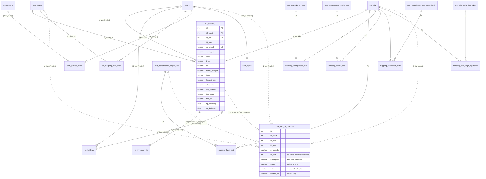

# 03 — Upstream Database (`skp_ipm`, MariaDB 10.5)

> **Ringkasan (Bahasa Indonesia).** Basis data upstream (`skp_ipm`, aplikasi CodeIgniter 4 di
> `mozivid/skpipm.id/apps-ipm/`) berisi **52 tabel** dan ±**384 ribu baris** (dump 2026-10-06).
> Tidak ada konsep *tenant*: satu penyedia jasa (SKP) melayani **118 faskes** (`mst_faskes`) dalam
> satu database; akun klien faskes dibatasi ke faskesnya lewat `trx_mapping_user_client` dan filter
> di controller, bukan oleh database. Inti datanya: **23.722 alat** (`trx_inventory`, identitas =
> nomor QR), **±8.170 sesi IPM** (inspeksi & pemeliharaan preventif) yang tersebar di **16 tabel
> `trx_*`** tanpa tabel header — satu sesi dikenali dari `(no_qrcode, tanggal created_at)` — serta
> **3.640 tanggal kalibrasi** dan **11.851 PDF sertifikat**. Hanya 18 FK yang dideklarasikan; tabel
> transaksi tidak punya FK sama sekali, dan sebagian tabel master **tidak punya PRIMARY KEY**.
> File unggahan berjumlah **62.021 file / ±116 GB** (foto depan, foto SN, PDF). Data berisi data
> pribadi (nama, email, hash kata sandi, IP login) — lihat klasifikasi privasi di bawah.

**Status:** research, 2026-10-07. Every number here was measured on a throwaway restore of the
dumps (record: [`../../MEMORY/records/2026-10-07-upstream-database-research.md`](../../MEMORY/records/2026-10-07-upstream-database-research.md)).
**No real data value appears in this document** — structure, counts and code values only.
Companion documents: [`04-SCHEMA-MAPPING.md`](./04-SCHEMA-MAPPING.md) (target schema in our
conventions) and [`05-DATA-MIGRATION.md`](./05-DATA-MIGRATION.md) (ETL plan). The upstream code,
modules and features are in `00-OVERVIEW.md`, `01-MODULES.md` and `02-FEATURES.md` (written in
parallel by the code-research agent).

---

## 1. Source and Method

| | |
|---|---|
| Application | CodeIgniter 4.3.8, `myth/auth`, `mozivid/skpipm.id/apps-ipm/` |
| Schema source of truth | the dump, not the migrations: the 11 CI4 migrations (`app/Database/Migrations`) plus `myth/auth`'s one are recorded in `migrations` (12 rows, batches 1–11, last `2025-01-21 TrxKalibrasi`); the dump's `CREATE TABLE`s were compared with them |
| Dumps | `mozivid/db_dump/`, 36 daily `mysqldump` files, `2026-09-01` … `2026-10-06`, 39.6 → 43.1 MB, MariaDB 10.5.29 |
| Restore | `2026-10-06` and `2026-09-01` into two databases of one throwaway `mariadb:10.5` container (port bound to 127.0.0.1, random root password), ~8 s each; the dump's first line (the 10.5.29 "sandbox mode" marker) has to be dropped for a 10.5 client |
| Engine / charset | every table InnoDB, `utf8` (3-byte) / `utf8_general_ci`; dump session `TIME_ZONE='+00:00'` |
| Objects other than tables | **none**: 0 triggers, 0 routines, 0 views |
| App timezone | `app/Config/App.php` `$appTimezone = 'Asia/Jakarta'`; timestamps are written with PHP `date()` as naive `DATETIME` (see § 8.4 for why that is not the whole story) |
| DB config | `app/Config/Database.php`: `MySQLi`, `utf8`, `utf8_general_ci`, no prefix |

## 2. Domains and Row Counts

52 tables. Counts are exact `COUNT(*)` on the 2026-10-06 dump; "Δ35d" is the change since
2026-09-01.

| Domain | Tables | Rows | Δ35d |
|---|---|---:|---:|
| Auth (`myth/auth` + `users`) | 10 | 12,406 | +632 |
| Master data — facilities, device types, photos | 4 | 1,422 | +42 |
| Master data — checklist item catalogues (`mst_*`) | 12 | 501 | 0 |
| Checklist mapping (device type → item) | 5 | 2,876 | 0 |
| Inventory (devices, files, calibration dates, user↔facility) | 4 | 39,273 | +2,916 |
| Inspection / maintenance results (`trx_*` IPM) | 16 | 328,008 | +25,320 |
| Framework (`migrations`) | 1 | 12 | 0 |
| **Total** | **52** | **≈384,500** | **+28,910** (+8.1 %) |

### Per table

| Table | Rows 10-06 | Rows 09-01 | Notes |
|---|---:|---:|---|
| `users` | 106 | 100 | `myth/auth` users |
| `auth_groups` | 4 | 4 | `admin`, `user`, `client`, `teknisi_client` |
| `auth_groups_users` | 105 | 99 | one group per user; 1 user has none |
| `auth_logins` | 12,191 | 11,571 | login attempts since 2023-06 |
| `auth_permissions`, `auth_groups_permissions`, `auth_users_permissions`, `auth_tokens`, `auth_reset_attempts`, `auth_activation_attempts` | 0 | 0 | unused (no permissions; "remember me" off) |
| `mst_faskes` | 118 | 106 | health facilities (clients) |
| `mst_alat` | 344 | 314 | device **types** (catalogue) |
| `mst_fotodepan_inventory`, `mst_fotosn_inventory` | 480 / 480 | 480 / 480 | upload log of the mobile API (2023-07 → 2024-02) |
| `mst_kelengkapan_alat` | 93 | 93 | completeness items |
| `mst_pemeriksaan_fungsi_alat` | 155 | 155 | function-check items |
| `mst_pemeriksaan_kinerja_alat` | 184 | 184 | performance-check items (setting, reference value) |
| `mst_alat_kerja_digunakan` | 42 | 42 | test tools used |
| `mst_pemeriksaan_keamanan_listrik` | 10 | 10 | electrical-safety items (all `flag=1`, i.e. default for every type) |
| `mst_kondisi_kelistrikan` 3, `mst_pemeliharaan_alat` 7, `mst_kondisi_lingkungan` 2, `mst_pemeriksaan_fisik` 2, `mst_pemeriksaan_keamanan_lain` 2, `mst_rekomendasi_hasil_pekerjaan` 1 | 17 | 17 | small fixed lists (hard-coded in the form for most) |
| `mst_stok_konsumable` | 0 | 0 | unused |
| `mapping_fugsi_alat` | 860 | 860 | type → function items |
| `mapping_alat_kerja_digunakan` | 758 | 758 | type → tools |
| `mapping_keamanan_listrik` | 638 | 638 | type → electrical-safety items |
| `mapping_kelengkapan_alat` | 338 | 338 | type → completeness items |
| `mapping_kinerja_alat` | 282 | 282 | type → performance items |
| `trx_inventory` | 23,722 | 21,394 | **the device register** |
| `trx_inventory_file` | 11,851 | 11,480 | calibration-certificate PDFs per device |
| `trx_kalibrasi` | 3,640 | 3,426 | calibration date per device (since 2025-04) |
| `trx_mapping_user_client` | 60 | 57 | client user → facility |
| `trx_pemeliharaan_alat` | 57,176 | 52,563 | maintenance tasks done / not done |
| `trx_fungsi_alat` | 51,162 | 47,218 | function-check results |
| `trx_alat_kerja_digunakan` | 44,986 | 41,204 | tools used |
| `trx_keamanan_listrik` | 32,439 | 30,660 | electrical-safety measurements |
| `trx_kelengkapan_alat` | 23,349 | 21,573 | completeness results |
| `trx_kondisi_kelistrikan` | 23,124 | 21,135 | electrical supply condition |
| `trx_kondisi_lingkungan` | 16,431 | 15,105 | temperature + humidity (2 rows/session) and `visit` |
| `trx_pemeriksaan_keamanan_lain` | 16,348 | 15,028 | other safety |
| `trx_pemeriksaan_fisik` | 16,339 | 15,020 | physical check + cleanliness |
| `trx_kinerja_alat` | 13,470 | 12,635 | performance measurements |
| `trx_hasil_pemeriksaan` | 8,182 | 7,522 | overall inspection result (1 row/session) |
| `trx_catatan` | 8,182 | 7,523 | free-text note (1 row/session; 92 % empty) |
| `trx_rekomendasi_hasil_pekerjaan` | 8,181 | 7,522 | recommendation (1 row/session) |
| `trx_hasil_maintenance` | 8,180 | 7,521 | overall maintenance result (1 row/session) |
| `trx_battery` | 448 | 448 | battery checks — only 2024-01-23 → 2024-03-01, then dropped from the form |
| `trx_konsumabel` | 11 | 11 | consumables — 2024 only |
| `migrations` | 12 | 12 | CI4 migration log |

Largest on disk: `trx_inventory` 12.6 MB (data+index), `trx_pemeliharaan_alat` 5.8 MB, then the
other `trx_*` tables. The whole database is 57.4 MB of InnoDB data+index pages.

## 3. ER Overview

Solid lines are **declared** foreign keys (18 in total); dotted lines are **implied** by naming and
by the joins in `app/Controllers/*` — the database does not enforce them.

`TRX_IPM_16_TABLES` stands for the 16 tables `trx_alat_kerja_digunakan`, `trx_battery`,
`trx_catatan`, `trx_fungsi_alat`, `trx_hasil_maintenance`, `trx_hasil_pemeriksaan`,
`trx_keamanan_listrik`, `trx_kelengkapan_alat`, `trx_kinerja_alat`, `trx_kondisi_kelistrikan`,
`trx_kondisi_lingkungan`, `trx_konsumabel`, `trx_pemeliharaan_alat`, `trx_pemeriksaan_fisik`,
`trx_pemeriksaan_keamanan_lain`, `trx_rekomendasi_hasil_pekerjaan`; they share the column block
shown and add one to four of their own (§ 4.5).

## 4. Table Reference by Domain

Types are as dumped. "PK" means a declared `PRIMARY KEY`; **"KEY id only"** means the
`AUTO_INCREMENT` column carries a plain non-unique index and **there is no primary key** —
uniqueness of `id` holds in the data (verified: `COUNT(DISTINCT id) = COUNT(*)` on every such table)
but is not enforced.

### 4.1 Auth (`myth/auth`)

| Table | Columns | Keys | Notes |
|---|---|---|---|
| `users` | `id` int unsigned AI; `email` varchar(255) NN; `username` varchar(30); `fullname` varchar(50); `user_image` varchar(255) NN default `default.svg`; `password_hash` varchar(255) NN; `reset_hash`, `reset_at`, `reset_expires`, `activate_hash`, `status`, `status_message`; `active` tinyint(1) NN 0; `force_pass_reset` tinyint(1) NN 0; `created_at`, `updated_at`, `deleted_at` datetime | PK id; UNIQUE email; UNIQUE username | `deleted_at` (soft delete) is never set — users are **hard-deleted** (see orphans, § 7) |
| `auth_groups` | `id`, `name` varchar(255), `description` varchar(255) | PK | 4 rows: `admin`, `user`, `client`, `teknisi_client` |
| `auth_groups_users` | `group_id`, `user_id` int unsigned NN default 0 | KEY (group_id,user_id); FK both, ON DELETE CASCADE | **no PK, no unique** — a duplicate membership is possible (none found) |
| `auth_logins` | `id`; `ip_address`, `email` varchar(255); `user_id` int unsigned NULL; `date` datetime NN; `success` tinyint(1) NN | PK; KEY email; KEY user_id | no FK |
| `auth_tokens` | `id`, `selector`, `hashedValidator`, `user_id` FK CASCADE, `expires` | PK; KEY selector | empty |
| `auth_permissions`, `auth_groups_permissions`, `auth_users_permissions` | `myth/auth` standard | FKs CASCADE | empty |
| `auth_reset_attempts`, `auth_activation_attempts` | email/ip/user_agent/token/created_at | PK | empty |

Password hashing (`vendor/myth/auth/src/Password.php`, config defaults — the app has no
`app/Config/Auth.php` override): `password_hash(base64_encode(hash('sha384', $password, true)),
PASSWORD_DEFAULT, ['cost' => 10])`. All 106 hashes are `$2y$10$` — **bcrypt cost 10 over a
SHA-384 pre-hash**, not over the password. `minimumPasswordLength = 6`, activation off, e-mail
resetter on, remembering off.

### 4.2 Master data — facilities, device types, photo log

| Table | Columns | Keys | Notes |
|---|---|---|---|
| `mst_faskes` | `id` int(11) unsigned AI; `name_faskes` varchar(255) NN; `phone` varchar(50); `address` varchar(255); `img_logo` varchar(255); `created_at`, `updated_at` | **KEY id only** | 118 rows; 49 without phone, 30 without address, 109 without logo; 4 names with leading/trailing spaces; 1 group of case/space duplicates |
| `mst_alat` | `id`; `nama_alat` varchar(255) NULL; timestamps | **KEY id only** | 344 device types; 5 case/space duplicate groups (339 distinct after `lower(trim())`); 39 types used by no device |
| `mst_fotodepan_inventory`, `mst_fotosn_inventory` | `id` PK; `nama_foto` varchar(255) NN; timestamps | PK | written by `Apiuser::upload_foto` (mobile app) — a log of uploads; 216 of 480 file names are still referenced by `trx_inventory` |

### 4.3 Master data — checklist item catalogues

All `mst_*` checklist tables share: `id` int(11) unsigned AI (**KEY id only**), `description`
varchar(255) NN (the item label), `status` varchar(50) (**the allowed answer set**, a
comma-separated code list), `notes` text, `flag` tinyint(1) default 0 (1 = applies to every device
type without a mapping row), `created_at`, `updated_at`. Extra columns:

| Table | Extra | `status` (allowed answers) | `flag` |
|---|---|---|---|
| `mst_kelengkapan_alat` | — | `0,1,-1` | 0 |
| `mst_pemeriksaan_fungsi_alat` | — | `0,1,-1` | 0 |
| `mst_pemeriksaan_kinerja_alat` | `symbol`, `setting`, `nilai_acuan` (reference value) varchar(50) | `0,1` | 0 |
| `mst_alat_kerja_digunakan` | — | `0,1` | 0 |
| `mst_pemeriksaan_keamanan_listrik` | `symbol` | `1,-1` | **1** (all 10) |
| `mst_kondisi_kelistrikan`, `mst_pemeliharaan_alat`, `mst_pemeriksaan_fisik` (+`kebersihan_pemeriksaan_fisik`), `mst_pemeriksaan_keamanan_lain`, `mst_kondisi_lingkungan`, `mst_rekomendasi_hasil_pekerjaan`, `mst_stok_konsumable` | `symbol` on most | small lists | — |

`mst_pemeriksaan_kinerja_alat.nilai_acuan` is text: 184 of 184 filled, only 30 purely numeric —
reference values carry units and ranges as free text.

### 4.4 Checklist mapping (device type → items)

Five identical shapes: `id` AI (**no PK**), `id_alat` → `mst_alat` (FK CASCADE), `id_<item>` → the
item catalogue (FK CASCADE), timestamps; indexes on each FK and a composite `(id, id_alat, …)`
that is useless for lookups by `id_alat`.

| Table | Rows | Types covered | Items | Duplicate (type,item) pairs | Unmapped items |
|---|---:|---:|---:|---:|---:|
| `mapping_fugsi_alat` (sic) | 860 | 130 | 155 | **5** | 0 |
| `mapping_alat_kerja_digunakan` | 758 | 127 | 42 | 0 | 0 |
| `mapping_keamanan_listrik` | 638 | 127 | 10 | 0 | 0 |
| `mapping_kelengkapan_alat` | 338 | 126 | 93 | 0 | 0 |
| `mapping_kinerja_alat` | 282 | 127 | 171 | 0 | 13 |

So ~127–130 of the 344 device types have a checklist; the rest are inventoried but have no
type-specific IPM form.

### 4.5 Inventory

| Table | Columns | Keys | Notes |
|---|---|---|---|
| `trx_inventory` | `id` AI; `id_client` → `mst_faskes` (FK CASCADE); `id_alat` → `mst_alat` (FK CASCADE); `id_user` int(10) (implied → `users`); `no_qrcode` varchar(255) NN; `nama_alat`, `merk`, `type`, `sn`, `nama_ruangan`, `lantai`, `kondisi_alat`, `lab_kalibrasi`, `foto_depan`, `foto_sn` varchar(255); `aksesoris` varchar(5); `tgl_inventory`, `tgl_kalibrasi` date; timestamps | **no PK**; UNIQUE `no_qrcode`; KEYs on FKs | the device register. `no_qrcode` (9–13 chars, `[A-Za-z0-9-]`, no whitespace) is the real identity — every IPM row points to a device by it |
| `trx_inventory_file` | `id` AI; `id_inventory` FK CASCADE; `nama_file` varchar(255) NN; timestamps | no PK | 11,851 PDFs on 10,951 devices (max 8 per device); bare file names under `public/uploads/inventory/` |
| `trx_kalibrasi` | `id` PK; `id_inventory` FK CASCADE; `id_user` int NULL; `nama_ruangan` varchar(255) NN; `tanggal_kalibrasi` date NN; timestamps | PK | added 2025-01; `IpmController::kalibrasiSave` **upserts one row per device** (the technician is overwritten on edit); 110 devices nevertheless have two rows (written before the upsert) |
| `trx_mapping_user_client` | `id`; `id_user` FK CASCADE; `id_client` FK CASCADE; timestamps | no PK | 60 rows, each user mapped to **exactly one** facility, no duplicates |

`trx_inventory` value sets (code-like): `kondisi_alat` ∈ {`Baik` 23,262, `Tidak Baik` 323, `Laik`
135, `Rusak` 1, empty 1}; `aksesoris` ∈ {`Ada` 23,321, `Tidak` 271, NULL 130}. `lab_kalibrasi` has
10 distinct values, one of which covers 23,411 rows. Free-text: `nama_ruangan` 1,733 distinct
(3,099 distinct `(facility, lower(trim(room)))`), `lantai` 111 distinct, `merk` 2,334 distinct.
Maximum lengths are far below the declared 255: name 45, brand 33, model 36, serial 34, room 48,
floor 31.

### 4.6 Inspection / maintenance results — the "mapping → trx" pattern

Every `trx_*` IPM table repeats `id_client`, `id_user`, `id_alat`, `no_qrcode` varchar(45),
`created_at`, `updated_at`, a `description` (the **label of the item, copied as text**) and a
`status` code; only `id` is a primary key. Per table:

| Table | Item reference | Result columns | `status` codes seen |
|---|---|---|---|
| `trx_kondisi_lingkungan` | `id_kondisi_lingkungan` = 1, 2 (form order) | `value` (temperature °C / humidity %), **`visit`** int | — |
| `trx_kondisi_kelistrikan` | none (label only, 3 labels) | `value` | `1` measured, `-1` not available (value NULL) |
| `trx_alat_kerja_digunakan` | `id_alat_kerja_digunakan` — **0 on 42,856 rows** (label only) | — | `1` used, `0` not used |
| `trx_pemeriksaan_keamanan_lain` | none | — | `1`, `0`, `-1` |
| `trx_pemeriksaan_fisik` | `id_pemeriksaan_fisik` | `status_kebersihan` | `1`,`0`,`-1`; cleanliness `1`,`0` |
| `trx_keamanan_listrik` | `id_keamanan_listrik` | `value`, `symbol` | always `1` |
| `trx_kelengkapan_alat` | `id_kelengkapan_alat` | — | `1`, `0`, `-1` |
| `trx_fungsi_alat` | `id_pemeriksaan_fungsi_alat` | — | `1`, `0`, `-1`, empty (41) |
| `trx_kinerja_alat` | `id_kinerja_alat` — **NULL on every row** | `setting`, `terukur_1`, `terukur_2`, `nilai_acuan` (text) | `1` good, `0` not good, NULL (1) |
| `trx_battery` | none | `setting`, `terukur_1`, `terukur_2` (NN) | `1`, `0` |
| `trx_pemeliharaan_alat` | none (7 labels) | — | `1` done, `0` not done |
| `trx_konsumabel` | none | — | `1`, `0`, `-1` |
| `trx_hasil_pemeriksaan` | — (1 row/session) | — | `1` pass, `0` fail |
| `trx_hasil_maintenance` | — (1 row/session) | — | `1` pass, `0` fail |
| `trx_rekomendasi_hasil_pekerjaan` | — (1 row/session) | `notes` (always empty) | `1` usable, `0` needs calibration, `-1` not usable, `-2` must be repaired (`app/Views/ipm/editIPM.php` radio labels) |
| `trx_catatan` | — (1 row/session) | `description` text (free note) | — |

**How it works** (`IpmController::getDataInventory`, `ipmSave`, `ipmEditSave`):

1. The technician scans a QR code → the controller loads the device (`trx_inventory` by
   `no_qrcode`) and, for its `id_alat`, the **mapping** rows joined to the item catalogues
   (`mapping_* ⨝ mst_*`) — that is the form template.
2. On save, one row per answered item is inserted into the matching `trx_*` table, with the item
   label copied into `description`, under **one `created_at` for the whole form**.
3. There is **no session/header row**. A session is identified by `(no_qrcode, DATE(created_at))`
   (edit) or by `(no_qrcode, MONTH, YEAR)` (re-save in the same month): an "update" **deletes**
   every `trx_*` row of that key and re-inserts. Upstream therefore keeps no history of edits, and
   an edit that moves the date rewrites `created_at` (`ipmEditSave` sets it to the new date + the
   current time).
4. `visit` (only on `trx_kondisi_lingkungan`) counts sessions per device: `MAX(visit)+1` on
   insert. Values seen: 1 (9,769 rows), 2 (6,612), 3 (50).
5. Transactions: `ipmSave`/`ipmEditSave` use `transStart()`; integrity across the 16 tables is
   otherwise not enforced.

Measured: 8,166 distinct `(qr, date)` sessions in `trx_hasil_pemeriksaan` for 8,182 rows (16 keys
with two header rows); 4,503 devices have at least one session (avg 1.8, max 7). The detail tables
cover fewer sessions (6,446 for electrical safety … 8,193 for environment) because a section can be
empty for a type without mapping rows.

## 5. Multi-Facility Model — Is There a Tenant?

**No tenant concept exists in the schema.** It is a **single service provider's** database:

- `mst_faskes` (118) are the provider's **clients** (hospitals, clinics, …). Every device row
  carries `id_client`; every IPM row repeats it (always equal to the device's — 0 mismatches over
  65,254 checked rows).
- Users split by group into **provider staff** — `admin` (10) and `user` (35, the field
  technicians who write the IPM rows) — and **client staff** — `client` (57) and `teknisi_client`
  (3). Only client staff appear in `trx_mapping_user_client` (60 rows, exactly one facility each;
  55 facilities have a client account, 63 have none).
- Isolation is **application-level**: routes filter by role (`app/Config/Routes.php` `role:`
  filters) and controllers add `where('id_client', …)` from the mapping
  (`IpmController::index`, `getQrcode`, the XLS exports). Nothing in the database prevents a
  query from returning another facility's rows.
- The provider's staff see all facilities. This is the shape that our model calls a
  **calibration-provider tenant serving hospital tenants** — see 04 § 3 for the mapping.

## 6. File and Photo References

| Reference | Stored as | Folder (under `public/`) | On disk |
|---|---|---|---|
| `trx_inventory.foto_depan` (front photo) | **absolute URL** (`base_url()` + path) on 23,710 rows, bare file name on 12; 2 distinct hosts and both `http`/`https` | `uploads/foto_depan/` | 25,092 files, 49.7 GB |
| `trx_inventory.foto_sn` (serial plate) | same | `uploads/foto_sn/` | 25,006 files, 47.2 GB |
| `trx_inventory_file.nama_file` (certificate PDF) | bare random file name | `uploads/inventory/` | 11,923 files, 19.2 GB |
| `users.user_image` | file name (1 custom, rest `default.svg`) | `img/profile/` | 2 files |
| `mst_faskes.img_logo` | file name (9 set) | (logo folder) | small |
| `mst_foto*_inventory.nama_foto` | bare file name | `uploads/foto_*` | (subset of the above) |

Reconciliation (file names from the DB vs a directory listing; nothing was opened):

| Folder | Distinct names in DB | Files on disk | Referenced but **missing** | On disk but **unreferenced** |
|---|---:|---:|---:|---:|
| `foto_depan` | 23,584 | 25,088 | 41 | 1,545 |
| `foto_sn` | 23,585 | 25,001 | 46 | 1,462 |
| `inventory` | 11,646 | 11,924 | 75 | 353 |

- 149 front-photo names are shared by more than one device row; 205 certificate rows share a file
  name with another row.
- Extensions: `jpg` 30,915 · `jpeg` 18,122 · `heic` 897 · `png` 160 · `svg` 4 · `avif` 1 ·
  `pdf` 11,920, and **one `.sh` and one `.txt` in the certificate folder** (a shell script inside a
  publicly served upload directory — no obviously malicious markers were found by a pattern count,
  but it must not be migrated; see 05 § 6). ~3,600 photo names keep the client's original file
  name (with spaces) instead of a random one — `InventoryController` moves with `getName()`, not
  `getRandomName()`.
- Sizes: median 1.9 MB, p95 3.4 MB, max 8.1 MB; 816 files under 50 KB, 53 over 5 MB.
- **Content duplicates:** 2,224 groups / 5,517 files are byte-identical (SHA-256 over every file
  that shares its size with another), i.e. **3,293 redundant copies, ≤ 6.2 GB**.

Total: **62,021 files, 116.1 GB (108 GiB)** in `public/uploads/`; the rest of the fork is small
(`vendor` 51 MB, `writable` 165 MB — of which `logs` 161 MB in 1,205 files and `session` 507 files,
both personal data).

## 7. Data-Quality Findings

Measured on 2026-10-06 unless noted. "Orphan" = the implied parent row does not exist.

| # | Finding | Count | Impact on migration |
|---|---|---:|---|
| Q-1 | **No PK** on 25 tables (14 `mst_*`, 5 `mapping_*`, `trx_inventory`, `trx_inventory_file`, `trx_mapping_user_client`, 3 `auth_*` link tables); every `id` column is unique in the data | 25 tables | none for the ETL; explains how duplicates crept in |
| Q-2 | IPM rows whose `id_user` no longer exists (users hard-deleted) | 13,169 rows across the 16 tables (e.g. 2,142 maintenance, 306 sessions) | performer unknown → keep legacy id, no FK (04 § 6) |
| Q-3 | `trx_inventory.id_user` orphans | 2,294 of 23,722 | same |
| Q-4 | IPM rows whose `no_qrcode` matches no device (device deleted or QR re-typed) | 13–91 per table; 13 sessions | cannot be attached to a device → quarantine |
| Q-5 | IPM rows whose `id_alat` differs from the device's current type | 41 sessions; 280 maintenance rows | device type changed after the session → keep the snapshot label |
| Q-6 | Item references to **deleted catalogue items** | `trx_fungsi_alat` 2,034; `trx_kelengkapan_alat` 1,414; `trx_keamanan_listrik` 625 | link by id when it exists, else keep the label only |
| Q-7 | Item references **absent by design** | `trx_kinerja_alat` id NULL on all 13,470; `trx_alat_kerja_digunakan` id 0 on 42,856 | link by `(type, label)` match or label only |
| Q-8 | Sessions with two header rows for one `(qr, date)` | 16 | dedupe: keep the latest `id` |
| Q-9 | Calibration: devices with 2 `trx_kalibrasi` rows | 110 | keep both as history, or latest only (05 § 3) |
| Q-10 | `trx_kalibrasi.id_user` NULL | 1,235 of 3,640 | performer unknown |
| Q-11 | `trx_inventory.tgl_kalibrasi` ≠ `trx_kalibrasi.tanggal_kalibrasi` for the same device | 2,173 of 3,640 | two meanings of "calibration date" — owner/SME decision (04 § 9) |
| Q-12 | Dates in the future (after the dump) | `tgl_inventory` 8; `tgl_kalibrasi` 63 | flag; do not derive "next due" from them blindly |
| Q-13 | Implausibly old dates | `tgl_inventory` < 2023: 65 (min year 2001); `tgl_kalibrasi` < 2023: 27 | flag; likely typing errors or real acquisition dates |
| Q-14 | Calibration date before inventory date | 1,445 | plausible (calibrated before registration) |
| Q-15 | `trx_inventory.created_at` NULL | 23,354 of 23,722 (only Jan–Feb 2024 rows have it) | use `tgl_inventory` as the registration date |
| Q-16 | `trx_inventory_file.created_at` NULL | 3,496 of 11,851 | upload time unknown |
| Q-17 | Serial number placeholders (`-`, `0`, empty, "none"-like words) | ~836 | → NULL |
| Q-18 | **Duplicate serial numbers inside one facility** (placeholders excluded) | 624 groups / 1,357 devices; only 148 groups are the same type+brand+model | conflicts with our `UNIQUE (tenant_id, serial_number)` (04 § 4.2) |
| Q-19 | Same serial across facilities | 168 values | harmless (we are unique per tenant) |
| Q-20 | Device name differs from its type's catalogue name | 888 | the device name is a free snapshot — keep it |
| Q-21 | Environment values out of a plausible range (temperature outside 10–45 °C, humidity outside 10–95 %) | 9 + 8; 415 non-numeric | NULL the value, keep the raw text |
| Q-22 | Measured values with a decimal comma | 4,148 of 13,470 performance rows | parse `,` as decimal separator |
| Q-23 | Non-numeric measured values | `terukur_*` ~1,550; electrical safety 6,941 of 32,439 | keep raw text beside the numeric column |
| Q-24 | Whitespace/case duplicates | device types 5 groups; facilities 1 group; 95 inventory rows untrimmed | normalise on load |
| Q-25 | Encoding | no mojibake found; non-ASCII only legitimate (e.g. `°`); charset is 3-byte `utf8`, so no 4-byte characters exist | none — UTF-8 → PostgreSQL `UTF8` is lossless |
| Q-26 | `auth_logins` with unknown/orphan user | 2,228 NULL + 546 orphan | not migrated |
| Q-27 | Photo URLs embed the host (2 hosts, http and https) | 23,710 | strip to the file name |
| Q-28 | Files missing on disk / unreferenced on disk | 162 missing; 3,360 unreferenced | see § 6 |

## 8. Growth and Activity

### 8.1 Between the first and last dump (35 days)

| | 2026-09-01 | 2026-10-06 | Δ | per day |
|---|---:|---:|---:|---:|
| Devices (`trx_inventory`) | 21,394 | 23,722 | +2,329 new, 1 deleted, 18 edited | ~67 |
| IPM detail rows (16 tables) | 302,688 | 328,008 | +25,320 | ~723 |
| IPM sessions (`trx_hasil_pemeriksaan`) | 7,522 | 8,182 | +660 | ~19 |
| Calibration dates | 3,426 | 3,640 | +214 | ~6 |
| Certificate PDFs | 11,480 | 11,851 | +372, 1 deleted | ~11 |
| Facilities / device types / users | 106 / 314 / 100 | 118 / 344 / 106 | +12 / +30 / +6 | |
| Login attempts | 11,571 | 12,191 | +620 | ~18 |

### 8.2 Long-run activity (from timestamps in the latest dump)

- IPM sessions per year: 2024 3,740 · 2025 3,623 · 2026 (to 10-05) 819; 28 active months, very
  bursty (campaigns: e.g. 437 sessions in 2026-09, 221 in the first five days of 2026-10).
- Device registrations (`tgl_inventory`): 2024 14,422 · 2025 4,509 · 2026 4,725.
- Calibration dates entered (`trx_kalibrasi.created_at`): 2025-04 → 2026-09, peak 925 in 2026-08.
- Logins since 2023-06, 4,220 distinct IP addresses.

### 8.3 Projection

At the measured rate the database grows ~0.8 k rows/day (~300 k rows/year, i.e. it roughly doubles
in 15 months); files grow ~11 PDFs + ~130 photos (≈ 0.25–0.3 GB) per day in an inventory campaign.
None of this is large for PostgreSQL; the file store dominates (05 § 9).

### 8.4 Timestamp timezone — a finding, not a fact

`appTimezone` is `Asia/Jakarta` and the code writes `date('Y-m-d H:i:s')`, so stored values
*should* be WIB (UTC+7). But the hour-of-day histogram of IPM sessions has almost nothing between
13:00 and 21:00 and a large block between 00:00 and 12:00 (3,835 of 8,182 sessions between 00:00
and 06:59, 943 exactly at 00:00:00 — the latter from date-only edits). That is the shape of WIB
working hours (07:00–19:00) **stored as UTC**. `auth_logins`, written by the same PHP process,
looks like WIB working hours. Since 2026-10, evening hours appear in IPM rows. Possible causes: a
different PHP timezone in the past (the server's `php.ini` overriding, or an older `App.php`), or
data entered via the API. There is no git history in the fork to check. **The ETL must not
silently assume either** — see 04 § 9 (decision D-6) and 05 § 3.4.

## 9. Privacy Classification

| Class | Meaning | Where |
|---|---|---|
| **PII** | identifies a natural person | `users.email`, `username`, `fullname`, `user_image`; `auth_logins.email`, `ip_address` (and `user_id`); `auth_reset_attempts`/`auth_activation_attempts` (email, IP, user agent); `writable/session/*`, `writable/logs/*`; photos may show people incidentally |
| **Secret / credential** | must never leave the source | `users.password_hash`, `reset_hash`, `activate_hash`; `auth_tokens.hashedValidator`, `selector` |
| **Sensitive operational** | identifies organisations and their assets; not personal, but confidential to each facility | `mst_faskes` (name, phone, address, logo); `trx_inventory` (serials, rooms, floors, photos); certificate PDFs; IPM results; `lab_kalibrasi` |
| **Free text (review)** | may contain anything, including names | `trx_catatan.description` (625 non-empty), `mst_*.notes`, `trx_kalibrasi.nama_ruangan`, `trx_inventory.nama_ruangan` |
| **Attribution (pseudonymous)** | links a result to a person through `users` | every `id_user` |
| **Reference** | non-confidential | `mst_alat`, the checklist catalogues, `mapping_*`, `auth_groups`, `migrations` |

No patient data was found in the schema: no patient, medical-record or diagnosis columns exist.
Free-text columns and photos were **not** read value-by-value and cannot be certified free of
incidental personal data — the ETL treats them as possibly personal (05 § 10).
